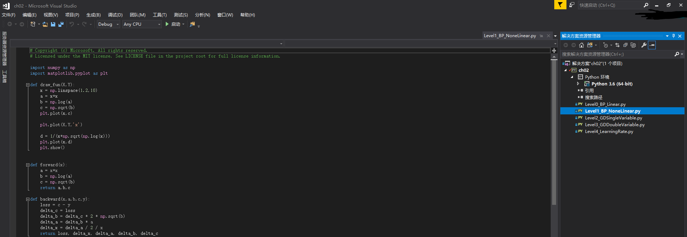
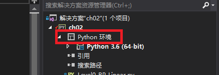
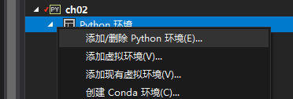
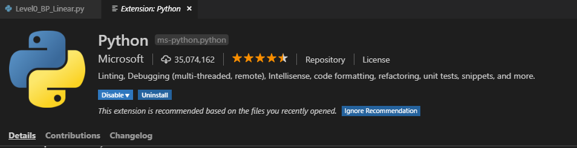
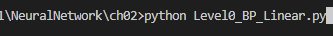
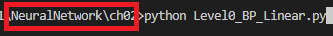

# An example about how to execute this solution

Notes: we will use ch02 as example. Other example code can be executed in the same way. The guide will have two parts, for users who prefer Visual Studio or Visual Studio Code.

## Visual Studio 2017 or above

1. Double click on the ch02 file(python Project)


2. you will enter the Visual Studio environment


3. (Optional) Choose an appropriate python environment, if you have several python environments in youe system
    1. right click on the python environment

    

    2. choose the first entry to change your python environment or create another virtual environment

    

4. Assume after the first two or three steps, we have an appropriate python environment, the we can run the program by right click on the program file:


then select the 14th entry "start without debugging", we can see the results on our screen!

## use VS code to execute the program

1. open VS code and enter the folder ch02, after you open the folder, the left part of VS code should look like:


2. Open the python file you want to execute by double click on the file

   if you have some extensions recommended by VS code, please simply install them.

   These extensions include Python, linter, etc.
  
   

3. look for the `Python` symbol in the left footer part of the VS code, and click on the `Python` symbol to choose an appropriate python environment


4. right click in the region of the python file, and choose the 13th entry to execute the python program


or, you can enter ```Ctrl + Shift + ` ``` to start the terminal, and use this to input the command, that is, input the command as follows:



Note: please make sure now your opened folder is ch02, a simple method to examine this is to check the path, as shown in the red box.


