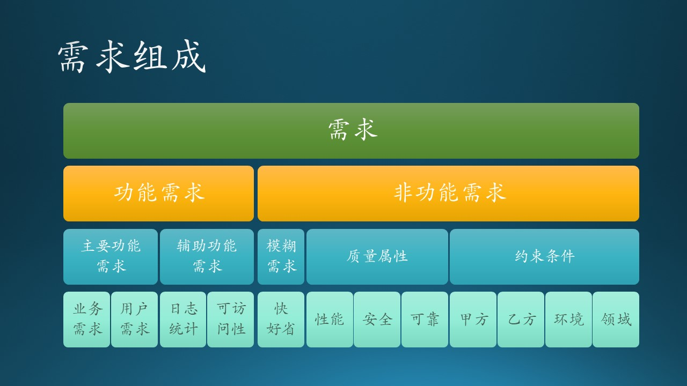

# 6.5 非功能性的需求分析

在6.3和6.4节中，我们分析了来自学校的教职员工的各个不同层次的需求，使我们清楚地认识到了业务、用户、功能三个层次的需求的区别和联系。在本节中，我们将会学习如何发现出一些隐形需求，以便能够更全面准确地把握需求。

## 6.5.1 需求组成

图 6.5.1 - 需求组成

我们先只看左侧分叉，可以得到四个公式：

$$
需求 = 功能需求 + 非功能需求 \tag{6.5.1}
$$

在工程实践中，功能需求占的比重很大，但是非功能需求也是非常重要的组成部分，而且这些非功能需求不能满足的话，更有可能造成整个项目的失败。所以我们有了公式 6.5.1。

$$
功能需求 = 主要功能需求 + 辅助功能需求 \tag{6.5.2}
$$

$$
主要功能需求 = f(业务需求)+g(用户需求) \tag{6.5.3}
$$

$$
辅助功能需求 = 日志统计 + 可访问性 \tag{6.5.4}
$$

公式 6.5.3 的含义是，我们用一种方法 $f()$ 来分析业务需求，用另一种方法 $g()$ 来分析用户需求，最后可以得到主要功能需求。

而公式 6.5.5 则说明了非功能需求的组成：

$$
非功能需求 = 模糊需求 + 质量属性 + 约束条件  \tag{6.5.5}
$$

接下来我们了解一下非功能需求的各个组成部分。

## 6.5.2 模糊需求（Overall Requirements）

模糊需求一般在业务需求层次提出，常见的就是三个字：快、好、省。

图 6.5.2 - 模糊需求

$$
模糊需求 = 快 + 好 + 省 \tag{6.5.6}
$$

对于业务级投资人、负责人等领导来说，预期的质量需求就是三个字：快、好、省。这和当年的“多快好省”经济发展总路线如出一辙，实践证明是不能兼顾的。

1. 快，可以理解为开发速度快，或者软件运行速度快。
2. 好，可以理解为开发质量好，或者软件功能好。
3. 省，可以理解为开发成本低，或者软件价格低。

这三者并存的话，会形成悖论：

1. 速度又快、功能又好的产品，价格肯定不低，做不到省。
   
   比如说我们训练一个深度学习模型，如果用 GPU 的话，训练速度快，效果好，但是 GPU 的价格非常的昂贵。

2. 功能又好、成本又省的产品，不是开发周期长，就是运行速度慢。
   
   同样是训练一个深度学习模型，用 CPU 当然也可以完成任务，但是使用 GPU 可以一小时搞定的东西，用 CPU 却需要两天。

3. 速度又快、成本又省的产品，用膝盖想一想都能知道好不到哪里去。

   还是训练深度学习模型，为了便宜就用 CPU 搞，为了速度快就少训练几轮，那么最后的模型效果肯定不好。

## 6.5.3 质量属性（Quality Attribute）

质量属性包含很多内容，我们将会在后面的章节中专门介绍，在本节中可以用公式 6.5.7 和图 6.5.3 来简单表述：

$$
质量属性=性能+安全性+可靠性+可维护性+其它 \tag{6.5.7}
$$

图 6.5.3 - 质量属性的组成

质量属性的项目非常多，但通常我们都用下面4个主要的属性来衡量软件的质量，而且是可以写在《需求规格说明书》中的。在公式 6.5.7 中用“其它”来代表不常用到的属性。

- 性能（Performance）
  
  比如，我们可以要求一个软件：

  - 用户登录响应时间不超过0.5秒；
  - 可以支持并发访问用户数至少10000个；
  - 系统至少可以存储100M的用户文件。

- 安全性（Security）
  
  其实就是正反两个方面：

  - 向合法用户提供服务；
  - 阻止非授权使用。

- 可靠性（Reliability）
  
  软件系统在一定的时间内无故障运行的能力，比如：

  - 72小时小负载下可稳定运行；
  - 30分钟内的超负荷运行；
  - 4小时内负载从10%增加到100%的运行情况。
  
- 可维护性（Maintainability）
  
  一般甲方会提出可维护性要求，但通常是比较虚的，比如：

  - 要求乙方给甲方人员培训，熟悉系统架构和模块；
  - 乙方在一年内保证软件顺利运行；
  - 软件提供 API 接口，可以二次开发。

## 6.5.4 约束条件（Constraint）

图 6.5.4 - 约束条件

$$
\begin{aligned}
约束条件=& 甲方约束（资源） \\
+& 乙方约束（开发） \\
+& 环境约束（技术） \\
+& 领域约束（业务） \tag{6.5.8}
\end{aligned}
$$

### 来自甲方 - 资源约束

客户总是会在下面几个问题上“斤斤计较”：

- 时间
  
  - 即软件开发完毕交付的时间，而且如果客户不懂得软件开发的规律，往往会要求在不可能的时间内一次性交付。
  - 而对于开发者来说，一定要争取宽裕的开发时间，通常是把预估的时间乘以2.比如预估3个月完成，那么就要和客户承诺6个月完成。
  - 在交付问题上，一次性地不可能搞定所有需求，至少需要3次以上的迭代，在没有新需求出现的前提下，才有可能完成。

- 金钱
  
  即开发软件、部署软件、后期宣传所需要的费用。

### 来自乙方 - 开发约束

主要是乙方要考虑自己的开发团队的具体情况，比如：

- 领域知识
  
  开发人员对于目标软件所在的领域知识是否足够了解。比如要做一个银行系统的应用软件，一般银行都会找一个长期合作的软件开发商合作，避免领域知识的培训等额外工作。

- 技术水平
  
  - 技术岗位繁多
  
    如前端、后端，完全是不一样的编程思路。后端：入门难，深入更难，枯燥乏味，没有太大成就感，看一堆业务逻辑代码。前端：入门简单，先易后难，能看到自己做出来的展示界面，有成就感。
  
  - 开发语言繁多
  
    PHP 并不是最好的编程语言（这是业界流行的一个笑话），但是它和Java、C、C++、Python、C#、JavaScript等成为最流行的编程语言，一个开发人员能够熟练使用（不是精通）三种以上的编程语言，就已经很不错了。
  
  - 框架平台繁多
    
    会用 React 的就不用 Vue（二者都是JS前端框架），会用 Struts 的就不用 GWT（二者都是 Java 框架），会用 .NetFramework的就不用 .NetFramework Core（二者都是 C# 框架），等等。

- 团队情况
    
  一个糟糕的经验是：三个臭皮匠，顶个诸葛亮。一个合理的做法是：一个诸葛亮带三个臭皮匠。

  - 成员磨合程度，主要是在工作习惯、沟通能力方面的考量。一个团队有新人加入的话，在初期，往往是拉低团队的生产力；如果新人很多，磨合期就要预计长一些。
  
  - 成员地理分布，主要是指像微软这种跨国公司，经常有跨区域合作的情况。比如做手机上的 Edge 浏览器时，PM 主要在美国，开发人员主要在中国，但是分在北京和苏州两个地方，还有一些依赖模块在欧洲开发。这需要制定好接口，并协调多方的进度保持一致。

### 来自环境 - 技术约束

- 批准的技术清单

  许多大型组织在开发之前，都会列出一个可以使用的技术清单。如果你需要使用清单上没有的技术，就需要申请。

- 现有系统的互操作性

  在整合已有系统的时候可以使用的协议和技术。

- 目标部署平台
  
  目标部署平台是影响技术决策的主要因素之一。比如 Windows 和 Linux 的不同，再比如桌面软件和移动软件的区别。
 
  另外一个例子是目前的深度学习框架，如TensorFlow, PyTorch，MXNet等，都有自己的模型结构，无法互操作。微软开发了 ONNX（Open Neural Network Exchange，开放神经网络交换）格式的模型标准，可使得模型在不同的框架下使用，并使用标准的方式来部署，而不需要按照框架。目前官方支持 ONNX 格式的框架有：Caffe2、PyTorch、MXNet、ML.NET、CNTK，而TensorFlow非官方（开源方式）支持。

- 使用开源软件
 
  GPL（General Public License）协议规定，如果使用了它人的开源软件，那么自己的软件必须也开源。

### 来自领域 - 业务约束

- 行业标准
  
  - 比如中国的财务软件就有自己的数据接口标准，否则会出现任意两个软件之间的数据交换困难。这就要求在需求中提及“输出必须符合接口标准”。

  - 在金融股票市场中，如果想提供换仓建议，那么软件必须根据历史数据（比如过去60天的），在周一上午 9:30 之前跑出结果来。

- 政策法规
  
  举两个例子：

  - 微软对用户的隐私问题非常的重视，所以在任何系统中，都不能保存能够反向映射到一个自然人的用户日志；
  
  - 中国对地图数据的安全性有要求，不能存放在中国境外的服务器上。所以当年笔者得到了一个进入微软做国内地图数据处理的工作机会，从心里感激这个政策法规。
