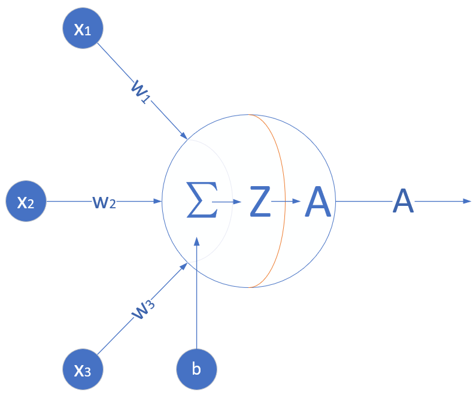
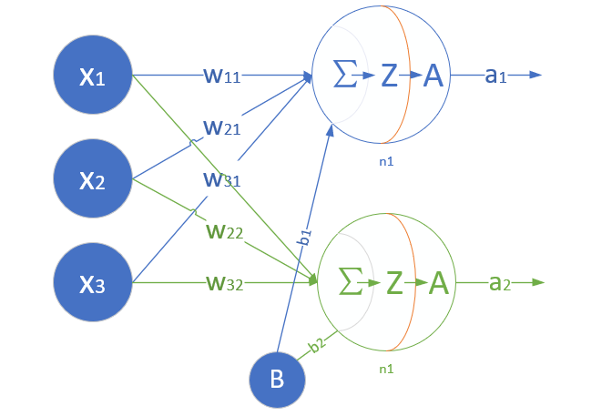

<!--Copyright © Microsoft Corporation. All rights reserved.
  适用于[License](https://github.com/Microsoft/ai-edu/blob/master/LICENSE.md)版权许可-->

## 1.3 神经网络的基本工作原理简介

### 1.3.1 神经元细胞的数学模型

神经网络由基本的神经元组成，图1-13就是一个神经元的数学/计算模型，便于我们用程序来实现。

图1-13 神经元计算模型

#### 输入 input

$(x_1,x_2,x_3)$ 是外界输入信号，一般是一个训练数据样本的多个属性，比如，我们要预测一套房子的价格，那么在房屋价格数据样本中，$x_1$ 可能代表了面积，$x_2$ 可能代表地理位置，$x_3$ 可能代表朝向。另外一个例子是，$(x_1,x_2,x_3)$ 分别代表了(红,绿,蓝)三种颜色，而此神经元用于识别输入的信号是暖色还是冷色。

#### 权重 weights

$(w_1,w_2,w_3)$ 是每个输入信号的权重值，以上面的 $(x_1,x_2,x_3)$ 的例子来说，$x_1$ 的权重可能是 $0.92$，$x_2$ 的权重可能是 $0.2$，$x_3$ 的权重可能是 $0.03$。当然权重值相加之后可以不是 $1$。

#### 偏移 bias

还有个 $b$ 是怎么来的？一般的书或者博客上会告诉你那是因为 $y=wx+b$，$b$ 是偏移值，使得直线能够沿 $Y$ 轴上下移动。这是用结果来解释原因，并非 $b$ 存在的真实原因。从生物学上解释，在脑神经细胞中，一定是输入信号的电平/电流大于某个临界值时，神经元细胞才会处于兴奋状态，这个 $b$ 实际就是那个临界值。亦即当：

$$w_1 \cdot x_1 + w_2 \cdot x_2 + w_3 \cdot x_3 \geq t$$

时，该神经元细胞才会兴奋。我们把t挪到等式左侧来，变成$(-t)$，然后把它写成 $b$，变成了：

$$w_1 \cdot x_1 + w_2 \cdot x_2 + w_3 \cdot x_3 + b \geq 0$$

于是 $b$ 诞生了！

#### 求和计算 sum

$$
\begin{aligned}
Z &= w_1 \cdot x_1 + w_2 \cdot x_2 + w_3 \cdot x_3 + b \\\\
&= \sum_{i=1}^m(w_i \cdot x_i) + b
\end{aligned}
$$

在上面的例子中 $m=3$。我们把$w_i \cdot x_i$变成矩阵运算的话，就变成了：

$$Z = W \cdot X + b$$

#### 激活函数 activation

求和之后，神经细胞已经处于兴奋状态了，已经决定要向下一个神经元传递信号了，但是要传递多强烈的信号，要由激活函数来确定：

$$A=\sigma{(Z)}$$

如果激活函数是一个阶跃信号的话，会像继电器开合一样咔咔的开启和闭合，在生物体中是不可能有这种装置的，而是一个渐渐变化的过程。所以一般激活函数都是有一个渐变的过程，也就是说是个曲线，如图1-14所示。

图1-14 激活函数图像

至此，一个神经元的工作过程就在电光火石般的一瞬间结束了。

#### 小结

- 一个神经元可以有多个输入。
- 一个神经元只能有一个输出，这个输出可以同时输入给多个神经元。
- 一个神经元的 $w$ 的数量和输入的数量一致。
- 一个神经元只有一个 $b$。
- $w$ 和 $b$ 有人为的初始值，在训练过程中被不断修改。
- $A$ 可以等于 $Z$，即激活函数不是必须有的。
- 一层神经网络中的所有神经元的激活函数必须一致。

### 1.3.2 神经网络的训练过程

#### 单层神经网络模型

这是一个单层的神经网络，有 $m$ 个输入 (这里 $m=3$)，有 $n$ 个输出 (这里 $n=2$)。在神经网络中，$b$ 到每个神经元的权值来表示实际的偏移值，亦即 $(b_1,b_2)$，这样便于矩阵运算。也有些人把 $b$ 写成 $x_0$，其实是同一个效果，即把偏移值看做是神经元的一个输入。

- $(x_1,x_2,x_3)$ 是一个样本数据的三个特征值
- $(w_{11},w_{21},w_{31})$ 是 $(x_1,x_2,x_3)$ 到 $n1$ 的权重
- $(w_{12},w_{22},w_{32})$ 是 $(x_1,x_2,x_3)$ 到 $n2$ 的权重
- $b_1$ 是 $n1$ 的偏移
- $b_2$ 是 $n2$ 的偏移

图1-15 单层神经网络模型

从图1-15大家可以看到，同一个特征 $x_1$，对于$n1,n2$来说，权重是不相同的，因为 $n1,n2$ 是两个神经元，它们完成不同的任务（特征识别）。我们假设 $x_1,x_2,x_3$ 分别代表红绿蓝三种颜色，而 $n1,n2$ 分别用于识别暖色和冷色，那么 $x_1$ 到 $n1$ 的权重，肯定要大于 $x_1$ 到 $n2$ 的权重，因为 $x_1$ 代表红色，是暖色。

而对于 $n1$ 来说，$x_1,x_2,x_3$ 输入的权重也是不相同的，因为它要对不同特征有选择地接纳。如同上面的例子，$n1$ 对于代表红色的 $x_1$，肯定是特别重视，权重值较高；而对于代表蓝色的 $x_3$，尽量把权重值降低，才能有正确的输出。

#### 训练流程

从真正的“零”开始学习神经网络时，我没有看到过任何一个流程图来讲述训练过程，大神们写书或者博客时都忽略了这一点，图1-16是一个简单的流程图。

图1-16 神经网络训练流程图

#### 前提条件

 1. 首先是我们已经有了训练数据；
 2. 我们已经根据数据的规模、领域，建立了神经网络的基本结构，比如有几层，每一层有几个神经元；
 3. 定义好损失函数来合理地计算误差。

#### 步骤

假设我们有表1-1所示的训练数据样本。

表1-1 训练样本示例

|Id|$x_1$|$x_2$|$x_3$|$Y$|
|---|---|---|---|---|
|1|0.5|1.4|2.7|3|
|2|0.4|1.3|2.5|5|
|3|0.1|1.5|2.3|9|
|4|0.5|1.7|2.9|1|

其中，$x_1,x_2,x_3$ 是每一个样本数据的三个特征值，$Y$ 是样本的真实结果值：

1. 随机初始化权重矩阵，可以根据正态分布等来初始化。这一步可以叫做“猜”，但不是瞎猜；
2. 拿一个或一批数据作为输入，带入权重矩阵中计算，再通过激活函数传入下一层，最终得到预测值。在本例中，我们先用Id-1的数据输入到矩阵中，得到一个 $A$ 值，假设 $A=5$；
3. 拿到Id-1样本的真实值 $Y=3$；
4. 计算损失，假设用均方差函数 $Loss = (A-Y)^2=(5-3)^2=4$；
5. 根据一些神奇的数学公式（反向微分），把 $Loss=4$ 这个值用大喇叭喊话，告诉在前面计算的步骤中，影响 $A=5$ 这个值的每一个权重矩阵，然后对这些权重矩阵中的值做一个微小的修改（当然是向着好的方向修改，这一点可以用数学家的名誉来保证）；
6. 用Id-2样本作为输入再次训练（Go to 2）；
7. 这样不断地迭代下去，直到以下一个或几个条件满足就停止训练：损失函数值非常小；准确度满足了要求；迭代到了指定的次数。

训练完成后，我们会把这个神经网络中的结构和权重矩阵的值导出来，形成一个计算图（就是矩阵运算加上激活函数）模型，然后嵌入到任何可以识别/调用这个模型的应用程序中，根据输入的值进行运算，输出预测值。

### 1.3.3 神经网络中的矩阵运算

图1-17是一个两层的神经网络，包含隐藏层和输出层，输入层不算做一层。

图1-17 神经网络中的各种符号约定

$$
z1_1 = x_1 \cdot w1_{1,1}+ x_2 \cdot w1_{2,1}+b1_1
$$
$$
z1_2 = x_1 \cdot w1_{1,2}+ x_2 \cdot w1_{2,2}+b1_2
$$
$$
z1_3 = x_1 \cdot w1_{1,3}+ x_2 \cdot w1_{2,3}+b1_3
$$

变成矩阵运算：

$$
z1_1=
\begin{pmatrix}
x_1 & x_2
\end{pmatrix}
\begin{pmatrix}
w1_{1,1} \\\\
w1_{2,1}
\end{pmatrix}
+b1_1
$$

$$
z1_2=
\begin{pmatrix}
x_1 & x_2
\end{pmatrix}
\begin{pmatrix}
w1_{1,2} \\\\
w1_{2,2}
\end{pmatrix}
+b1_2
$$

$$
z1_3=
\begin{pmatrix}
x_1 & x_2
\end{pmatrix}
\begin{pmatrix}
w1_{1,3} \\\\
w1_{2,3}
\end{pmatrix}
+b1_3
$$

再变成大矩阵：

$$
Z1 =
\begin{pmatrix}
x_1 & x_2 
\end{pmatrix}
\begin{pmatrix}
w1_{1,1}&w1_{1,2}&w1_{1,3} \\\\
w1_{2,1}&w1_{2,2}&w1_{2,3} \\\\
\end{pmatrix}
+\begin{pmatrix}
b1_1 & b1_2 & b1_3
\end{pmatrix}
$$

最后变成矩阵符号：

$$Z1 = X \cdot W1 + B1$$

然后是激活函数运算：

$$A1=a(Z1)$$

同理可得：

$$Z2 = A1 \cdot W2 + B2$$

注意：损失函数不是前向计算的一部分。

### 1.3.4 神经网络的主要功能

#### 回归（Regression）或者叫做拟合（Fitting）

单层的神经网络能够模拟一条二维平面上的直线，从而可以完成线性分割任务。而理论证明，两层神经网络可以无限逼近任意连续函数。图1-18所示就是一个两层神经网络拟合复杂曲线的实例。

图1-18 回归/拟合示意图

所谓回归或者拟合，其实就是给出x值输出y值的过程，并且让y值与样本数据形成的曲线的距离尽量小，可以理解为是对样本数据的一种骨架式的抽象。

以图1-18为例，蓝色的点是样本点，从中可以大致地看出一个轮廓或骨架，而红色的点所连成的线就是神经网络的学习结果，它可以“穿过”样本点群形成中心线，尽量让所有的样本点到中心线的距离的和最近。

#### 分类（Classification）

如图1-19，二维平面中有两类点，红色的和蓝色的，用一条直线肯定不能把两者分开了。

图1-19 分类示意图

我们使用一个两层的神经网络可以得到一个非常近似的结果，使得分类误差在满意的范围之内。图1-19中那条淡蓝色的曲线，本来并不存在，是通过神经网络训练出来的分界线，可以比较完美地把两类样本分开，所以分类可以理解为是对两类或多类样本数据的边界的抽象。

图1-18和图1-19的曲线形态实际上是一个真实的函数在 $[0,1]$ 区间内的形状，其原型是：

$$y=0.4x^2 + 0.3x\sin(15x) + 0.01\cos(50x)-0.3$$

这么复杂的函数，一个两层的神经网络是如何做到的呢？其实从输入层到隐藏层的矩阵计算，就是对输入数据进行了空间变换，使其可以被线性可分，然后在输出层画出一个分界线。而训练的过程，就是确定那个空间变换矩阵的过程。因此，多层神经网络的本质就是对复杂函数的拟合。我们可以在后面的试验中来学习如何拟合上述的复杂函数的。

神经网络的训练结果，是一大堆的权重组成的数组（近似解），并不能得到上面那种精确的数学表达式（数学解析解）。

### 1.3.5 为什么需要激活函数

#### 生理学上的例子

人体骨关节是动物界里最复杂的生理结构，一共有8个重要的大关节：肩关节、
肘关节、腕关节、髋关节、膝关节、踝关节、颈关节、腰关节。

人的臂骨，腿骨等，都是一根直线，人体直立时，也是一根直线。但是人在骨关节和肌肉组织的配合下，可以做很多复杂的动作，原因就是关节本身不是线性结构，而是一个在有限范围内可以任意活动的结构，有一定的柔韧性。

比如肘关节，可以完成小臂在一个二维平面上的活动。加上肩关节，就可以完成胳膊在三维空间的活动。再加上其它关节，就可以扩展胳膊活动的三维空间的范围。

用表1-2来对比人体运动组织和神经网络组织。

表1-2 人体运动组织和神经网络组织的对比

|人体运动组织|神经网络组织|
|---|---|
|支撑骨骼|网络层次|
|关节|激活函数|
|肌肉韧带|权重参数|
|学习各种运动的动作|前向+反向训练过程|

激活函数就相当于关节。

#### 激活函数的作用

看以下的例子：

$$Z1 = X \cdot W1 + B1$$

$$Z2 = Z1 \cdot W2 + B2$$

$$Z3 = Z2 \cdot W3 + B3$$

展开：

$$
\begin{aligned}
Z3&=Z2 \cdot W3 + B3 \\\\
&=(Z1 \cdot W2 + B2) \cdot W3 + B3 \\\\
&=((X \cdot W1 + B1) \cdot W2 + B2) \cdot W3 + B3 \\\\
&=X \cdot (W1\cdot W2 \cdot W3) + (B1 \cdot W2 \cdot W3+B2 \cdot W2+B3) \\\\
&=X \cdot W+B
\end{aligned}
$$

$Z1,Z2,Z3$ 分别代表三层神经网络的计算结果。最后可以看到，不管有多少层，总可以归结到 $XW+B$ 的形式，这和单层神经网络没有区别。

如果我们不运用激活函数的话，则输出信号将仅仅是一个简单的线性函数。线性函数一个一级多项式。线性方程是很容易解决的，但是它们的复杂性有限，并且从数据中学习复杂函数映射的能力更小。一个没有激活函数的神经网络将只不过是一个线性回归模型罢了，不能解决现实世界中的大多数非线性问题。

没有激活函数，我们的神经网络将无法学习和模拟其他复杂类型的数据，例如图像、视频、音频、语音等。这就是为什么我们要使用人工神经网络技术，诸如深度学习，来理解一些复杂的事情，一些相互之间具有很多隐藏层的非线性问题。

图1-20 从简单到复杂的拟合

图1-20展示了几种拟合方式，最左侧的是线性拟合，中间的是分段线性拟合，右侧的是曲线拟合，只有当使用激活函数时，才能做到完美的曲线拟合。

### 参考资料

\[1\]: 参见： David Deutsch, 2012: Creative blocks --- the very laws of physics imply that artificial intelligence must be possible. What's holding us up? Aeon (online magazine). Available from: https://aeon.co/essays/how-close-are-we-to-creating-artificial-intelligence.

\[2\]: 定义翻译自：Mitchell, Tom (1997). Machine Learning. McGraw Hill

\[3\]: 定义参考了周志华的《机器学习》清华大学出版社 2016 ISBN 978-7-302-42328-7

\[4\]: 智能基础建设，智能增强，模拟人类的智能的分析来自于 Michael I. Jordan 的论述，参见： 网页。

\[5\]: 参见：The Fourth Paradigm: Data-Intensive Scientific Discovery，作者：Tony Hey, Stewart Tansley, Kristin Tolle, Published by Microsoft Research, October 2009, ISBN: 978-0-9825442-0-4

\[6\]: 这个问题由经典的“羊车门”问题简化而来
