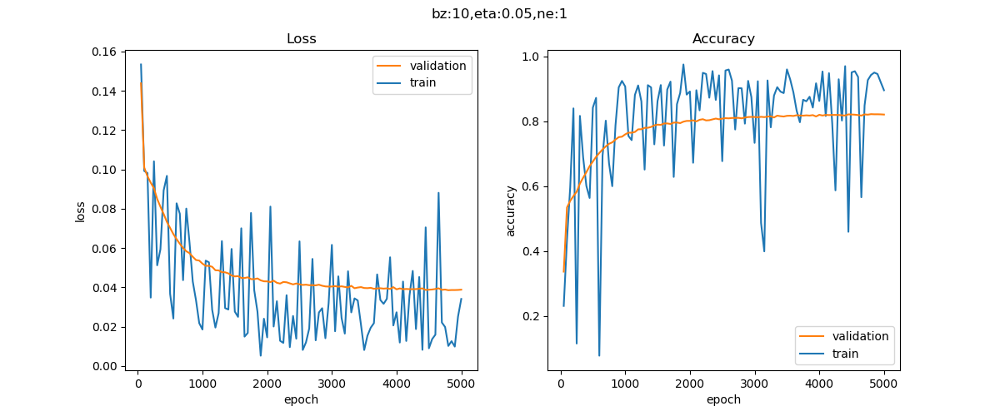

<!--Copyright © Microsoft Corporation. All rights reserved.
  适用于[License](https://github.com/Microsoft/ai-edu/blob/master/LICENSE.md)版权许可-->

## 9.5 曲线拟合

在上一节我们已经写好了神经网络的核心模块及其辅助功能，现在我们先来做一下正弦曲线的拟合，然后再试验复合函数的曲线拟合。

### 9.5.1 正弦曲线的拟合

#### 隐层只有一个神经元的情况

令`n_hidden=1`，并指定模型名称为`sin_111`，训练过程见图9-10。图9-11为拟合效果图。



图9-10 训练过程中损失函数值和准确率的变化


图9-11 一个神经元的拟合效果

从图9-10可以看到，损失值到0.04附近就很难下降了。图9-11中，可以看到只有中间线性部分拟合了，两端的曲线部分没有拟合。

```
......
epoch=4999, total_iteration=224999
loss_train=0.015787, accuracy_train=0.943360
loss_valid=0.038609, accuracy_valid=0.821760
testing...
0.8575700023301912
```

打印输出最后的测试集精度值为85.7%，不是很理想。所以隐层1个神经元是基本不能工作的，这只比单层神经网络的线性拟合强一些，距离目标还差很远。

#### 隐层有两个神经元的情况

```Python
if __name__ == '__main__':
    ......
    n_input, n_hidden, n_output = 1, 2, 1
    eta, batch_size, max_epoch = 0.05, 10, 5000
    eps = 0.001
    hp = HyperParameters2(n_input, n_hidden, n_output, eta, max_epoch, batch_size, eps, NetType.Fitting, InitialMethod.Xavier)
    net = NeuralNet2(hp, "sin_121")
    #net.LoadResult()
    net.train(dataReader, 50, True)
    ......
```

初始化神经网络类的参数有两个，第一个是超参组合`hp`，第二个是指定模型专有名称，以便把结果保存在名称对应的子目录中。保存训练结果的代码在训练结束后自动调用，但是如果想加载历史训练结果，需要在主过程中手动调用，比如上面代码中注释的那一行：`net.LoadResult()`。这样的话，如果下次再训练，就可以在以前的基础上继续训练，不必从头开始。

注意在主过程代码中，我们指定了n_hidden=2，意为隐层神经元数量为2。

#### 运行结果

图9-12为损失函数曲线和验证集精度曲线，都比较正常。而2个神经元的网络损失值可以达到0.004，少一个数量级。验证集精度到82%左右，而2个神经元的网络可以达到97%。图9-13为拟合效果图。


图9-12 两个神经元的训练过程中损失函数值和准确率的变化


图9-13 两个神经元的拟合效果

再看下面的打印输出结果，最后测试集的精度为98.8%。如果需要精度更高的话，可以增加迭代次数。

```
......
epoch=4999, total_iteration=224999
loss_train=0.007681, accuracy_train=0.971567
loss_valid=0.004366, accuracy_valid=0.979845
testing...
0.9881468747638157
```

### 9.5.2 复合函数的拟合

基本过程与正弦曲线相似，区别是这个例子要复杂不少，所以首先需要耐心，增大`max_epoch`的数值，多迭代几次。其次需要精心调参，找到最佳参数组合。

#### 隐层只有两个神经元的情况


图9-14 两个神经元的拟合效果

图9-14是两个神经元的拟合效果图，拟合情况很不理想，和正弦曲线只用一个神经元的情况类似。观察打印输出的损失值，有波动，久久徘徊在0.003附近不能下降，说明网络能力不够。

```
epoch=99999, total_iteration=8999999
loss_train=0.000751, accuracy_train=0.968484
loss_valid=0.003200, accuracy_valid=0.795622
testing...
0.8641114405898856
```

#### 隐层有三个神经元的情况

```Python
if __name__ == '__main__':
    ......
    n_input, n_hidden, n_output = 1, 3, 1
    eta, batch_size, max_epoch = 0.5, 10, 10000
    eps = 0.001
    hp = HyperParameters2(n_input, n_hidden, n_output, eta, max_epoch, batch_size, eps, NetType.Fitting, InitialMethod.Xavier)
    net = NeuralNet2(hp, "model_131")
    ......
```

#### 运行结果

图9-15为损失函数曲线和验证集精度曲线，都比较正常。图9-16是拟合效果。


图9-15 三个神经元的训练过程中损失函数值和准确率的变化


图9-16 三个神经元的拟合效果

再看下面的打印输出结果，最后测试集的精度为97.6%，已经令人比较满意了。如果需要精度更高的话，可以增加迭代次数。

```
......
epoch=4199, total_iteration=377999
loss_train=0.001152, accuracy_train=0.963756
loss_valid=0.000863, accuracy_valid=0.944908
testing...
0.9765910104463337
```

以下就是笔者找到的最佳组合：

- 隐层3个神经元
- 学习率=0.5
- 批量=10

### 9.5.3 广义的回归/拟合

至此我们用两个可视化的例子完成了曲线拟合，验证了万能近似定理。但是，神经网络不是设计专门用于曲线拟合的，这只是牛刀小试而已，我们用简单的例子讲解了神经网络的功能，但是此功能完全可以用于多变量的复杂非线性回归。

“曲线”在这里是一个广义的概念，它不仅可以代表二维平面上的数学曲线，也可以代表工程实践中的任何拟合问题，比如房价预测问题，影响房价的自变量可以达到20个左右，显然已经超出了线性回归的范畴，此时我们可以用多层神经网络来做预测。在后面我们会讲解这样的例子。

简言之，只要是数值拟合问题，确定不能用线性回归的话，都可以用非线性回归来尝试解决。

### 代码位置

ch09, Level3, Level4

### 思考和练习

1. 请尝试使用更多的隐层神经元来训练复合函数的曲线拟合网络。
