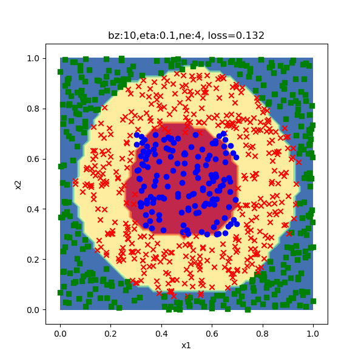
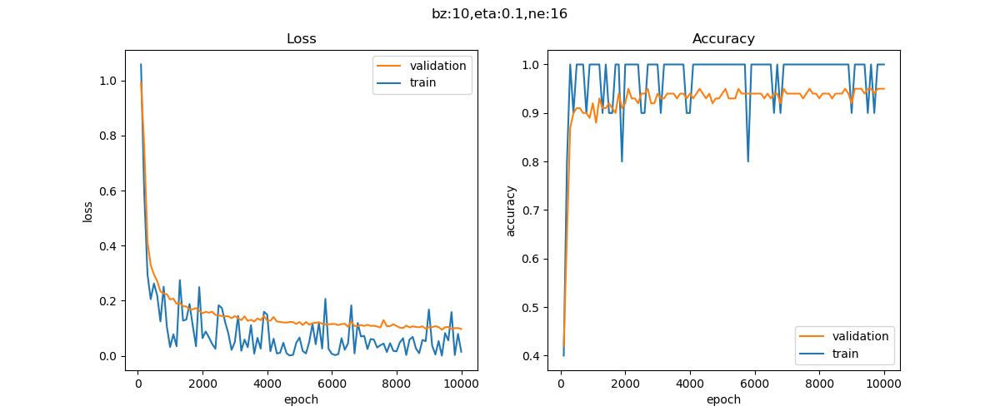

<!--Copyright © Microsoft Corporation. All rights reserved.
  适用于[License](https://github.com/Microsoft/ai-edu/blob/master/LICENSE.md)版权许可-->

## 11.2 非线性多分类的工作原理

### 11.2.1 隐层神经元数量的影响

下面列出了隐层神经元为2、4、8、16、32、64的情况，设定好最大epoch数为10000，以比较它们各自能达到的最大精度值的区别。每个配置只测试一轮，所以测出来的数据有一定的随机性。

表11-3展示了隐层神经元数与分类结果的关系。

表11-3 神经元数与网络能力及分类结果的关系

|神经元数|损失函数|分类结果|
|---|---|---|
|2|||
||测试集准确度0.618，耗时49秒，损失函数值0.795。类似这种曲线的情况，损失函数值降不下去，准确度值升不上去，主要原因是网络能力不够。|没有完成分类任务|
|4|||
||测试准确度0.954，耗时51秒，损失函数值0.132。虽然可以基本完成分类任务，网络能力仍然不够。|基本完成，但是边缘不够清晰|
|8|||
||测试准确度0.97，耗时52秒，损失函数值0.105。可以先试试在后期衰减学习率，如果再训练5000轮没有改善的话，可以考虑增加网络能力。|基本完成，但是边缘不够清晰|
|16|||
||测试准确度0.978，耗时53秒，损失函数值0.094。同上，可以同时试着使用优化算法，看看是否能收敛更快。|较好地完成了分类任务|
|32|||
||测试准确度0.974，耗时53秒，损失函数值0.085。网络能力够了，从损失值下降趋势和准确度值上升趋势来看，可能需要更多的迭代次数。|较好地完成了分类任务|
|64|||
||测试准确度0.972，耗时64秒，损失函数值0.075。网络能力足够。|较好地完成了分类任务|

### 11.2.2 三维空间内的变换过程

从以上的比较中可知，隐层必须用3个神经元以上。在这个例子中，使用3个神经元能完成基本的分类任务，但精度要差一些。但是如果必须使用更多的神经元才能达到基本要求的话，我们将无法进行下一步的试验，所以，这个例子的难度对我们来说恰到好处。

使用10.6节学习的知识，如果隐层是两个神经元，我们可以把两个神经元的输出数据看作横纵坐标，在二维平面上绘制中间结果；由于使用了3个神经元，使得隐层的输出结果为每个样本一行三列，我们必须在三维空间中绘制中间结果。

```Python
def Show3D(net, dr):
    ......
```

上述代码首先使用测试集（500个样本点）在已经训练好的网络上做一次推理，得到了隐层的计算结果，然后分别用`net.Z1`和`net.A1`的三列数据做为XYZ坐标值，绘制三维点图，列在表11-4中做比较。

表11-4 工作原理可视化

||正视角|侧视角|
|---|---|---|
|z1|||
||通过线性变换得到在三维空间中的线性平面|从侧面看的线性平面|
|a1|||
||通过激活函数的非线性变化，被空间挤压成三角形|从侧面看三种颜色分成了三层|

`net.Z1`的点图的含义是，输入数据经过线性变换后的结果，可以看到由于只是线性变换，所以从侧视角看还只是一个二维平面的样子。

`net.A1`的点图含义是，经过激活函数做非线性变换后的图。由于绿色点比较靠近边缘，所以三维坐标中的每个值在经过Sigmoid激活函数计算后，都有至少一维坐标会是向1靠近的值，所以分散的比较开，形成外围的三角区域；蓝色点正好相反，三维坐标值都趋近于0，所以最后都集中在三维坐标原点的三角区域内；红色点处于前两者之间，因为有很多中间值。

再观察net.A1的侧视图，似乎是已经分层了，蓝点沉积下去，绿点浮上来，红点在中间，像鸡尾酒一样分成了三层，这就给第二层神经网络创造了做一个线性三分类的条件，只需要两个平面，就可以把三者轻松分开了。

#### 3D分类结果图

更高维的空间无法展示，所以当隐层神经元数量为4或8或更多时，基本无法理解空间变换的样子了。但是有一个方法可以近似地解释高维情况：在三维空间时，蓝色点会被推挤到一个角落形成一个三角形，那么在N（N>3）维空间中，蓝色点也会被推挤到一个角落。由于N很大，所以一个多边形会近似成一个圆形，也就是我们下面要生成的这些立体图的样子。

我们延续9.2节的3D效果体验，但是，多分类的实际实现方式是1对多的，所以我们只能一次显示一个类别的分类效果图，列在表11-5中。

表11-5 分类效果图

|||
|---|---|
|||
|红色：类别1样本区域|红色：类别2样本区域|
|||
|红色：类别3样本区域|红色：类别1，青色：类别2，紫色：类别3|

上表中最后一行的图片显示类别1和2的累加效果。由于最后的结果都被Softmax归一为$[0,1]$之间，所以我们可以简单地把类别1的数据乘以2，再加上类别2的数据即可。

### 代码位置

ch11, Level2
