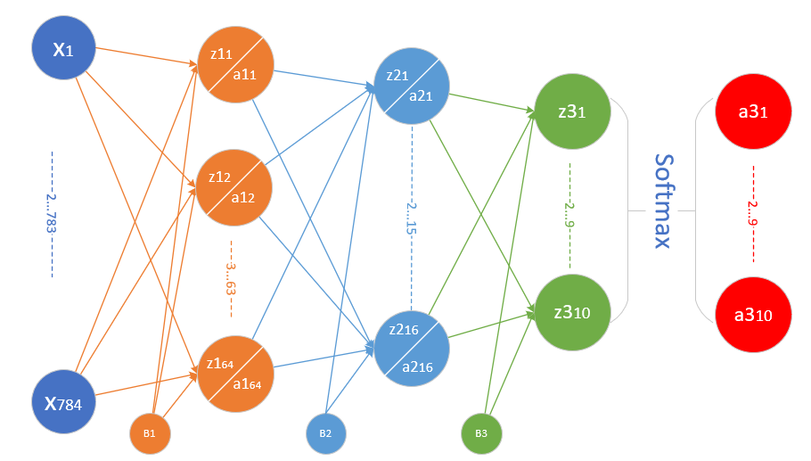

<!--Copyright © Microsoft Corporation. All rights reserved.
  适用于[License](https://github.com/Microsoft/ai-edu/blob/master/LICENSE.md)版权许可-->

## 12.1 三层神经网络的实现

### 12.1.1 定义神经网络

为了完成MNIST分类，我们需要设计一个三层神经网络结构，如图12-2所示。



图12-2 三层神经网络结构

#### 输入层

共计$28\times 28=784$个特征值：

$$
X=\begin{pmatrix}
    x_1 & x_2 & \cdots & x_{784}
  \end{pmatrix}
$$

#### 隐层1

- 权重矩阵$W1$形状为$784\times 64$

$$
W1=\begin{pmatrix}
    w1_{1,1} & w1_{1,2} & \cdots & w1_{1,64} \\\\
    \vdots & \vdots & \cdots & \vdots \\\\
    w1_{784,1} & w1_{784,2} & \cdots & w1_{784,64} 
  \end{pmatrix}
$$

- 偏移矩阵$B1$的形状为$1\times 64$

$$
B1=\begin{pmatrix}
    b1_{1} & b1_{2} & \cdots & b1_{64}
  \end{pmatrix}
$$

- 隐层1由64个神经元构成，其结果为$1\times 64$的矩阵

$$
Z1=\begin{pmatrix}
    z1_{1} & z1_{2} & \cdots & z1_{64}
  \end{pmatrix}
$$
$$
A1=\begin{pmatrix}
    a1_{1} & a1_{2} & \cdots & a1_{64}
  \end{pmatrix}
$$

#### 隐层2

- 权重矩阵$w2$形状为$64\times 16$

$$
W2=\begin{pmatrix}
    w2_{1,1} & w2_{1,2} & \cdots & w2_{1,16} \\\\
    \vdots & \vdots & \cdots & \vdots \\\\
    w2_{64,1} & w2_{64,2} & \cdots & w2_{64,16} 
  \end{pmatrix}
$$

- 偏移矩阵#B2#的形状是$1\times 16$

$$
B2=\begin{pmatrix}
    b2_{1} & b2_{2} & \cdots & b2_{16}
  \end{pmatrix}
$$

- 隐层2由16个神经元构成

$$
Z2=\begin{pmatrix}
    z2_{1} & z2_{2} & \cdots & z2_{16}
  \end{pmatrix}
$$
$$
A2=\begin{pmatrix}
    a2_{1} & a2_{2} & \cdots & a2_{16}
  \end{pmatrix}
$$

#### 输出层

- 权重矩阵$W3$的形状为$16\times 10$

$$
W3=\begin{pmatrix}
    w3_{1,1} & w3_{1,2} & \cdots & w3_{1,10} \\\\
    \vdots & \vdots & \cdots & \vdots \\\\
    w3_{16,1} & w3_{16,2} & \cdots & w3_{16,10} 
  \end{pmatrix}
$$

- 输出层的偏移矩阵$B3$的形状是$1\times 10$

$$
B3=\begin{pmatrix}
    b3_{1}& b3_{2} & \cdots & b3_{10}
  \end{pmatrix}
$$

- 输出层有10个神经元使用Softmax函数进行分类

$$
Z3=\begin{pmatrix}
    z3_{1} & z3_{2} & \cdots & z3_{10}
  \end{pmatrix}
$$
$$
A3=\begin{pmatrix}
    a3_{1} & a3_{2} & \cdots & a3_{10}
  \end{pmatrix}
$$

### 12.1.2 前向计算

我们都是用大写符号的矩阵形式的公式来描述，在每个矩阵符号的右上角是其形状。

#### 隐层1

$$Z1 = X \cdot W1 + B1 \tag{1}$$

$$A1 = Sigmoid(Z1) \tag{2}$$

#### 隐层2

$$Z2 = A1 \cdot W2 + B2 \tag{3}$$

$$A2 = Tanh(Z2) \tag{4}$$

#### 输出层

$$Z3 = A2 \cdot W3  + B3 \tag{5}$$

$$A3 = Softmax(Z3) \tag{6}$$

我们的约定是行为样本，列为一个样本的所有特征，这里是784个特征，因为图片高和宽均为28，总共784个点，把每一个点的值做为特征向量。

两个隐层，分别定义64个神经元和16个神经元。第一个隐层用Sigmoid激活函数，第二个隐层用Tanh激活函数。

输出层10个神经元，再加上一个Softmax计算，最后有$a1,a2,...a10$共十个输出，分别代表0-9的10个数字。

### 12.1.3 反向传播

和以前的两层网络没有多大区别，只不过多了一层，而且用了tanh激活函数，目的是想把更多的梯度值回传，因为tanh函数比sigmoid函数稍微好一些，比如原点对称，零点梯度值大。

#### 输出层

$$dZ3 = A3-Y \tag{7}$$
$$dW3 = A2^{\top} \cdot dZ3 \tag{8}$$
$$dB3=dZ3 \tag{9}$$

#### 隐层2

$$dA2 = dZ3 \cdot W3^{\top} \tag{10}$$
$$dZ2 = dA2 \odot (1-A2 \odot A2) \tag{11}$$
$$dW2 = A1^{\top} \cdot dZ2 \tag{12}$$
$$dB2 = dZ2 \tag{13}$$

#### 隐层1

$$dA1 = dZ2 \cdot W2^{\top} \tag{14}$$
$$dZ1 = dA1 \odot A1 \odot (1-A1) \tag{15}$$
$$dW1 = X^{\top} \cdot dZ1 \tag{16}$$
$$dB1 = dZ1 \tag{17}$$

### 12.1.4 代码实现

在`HelperClass3` / `NeuralNet3.py`中，下面主要列出与两层网络不同的代码。

#### 初始化

```Python
class NeuralNet3(object):
    def __init__(self, hp, model_name):
        ...
        self.wb1 = WeightsBias(self.hp.num_input, self.hp.num_hidden1, self.hp.init_method, self.hp.eta)
        self.wb1.InitializeWeights(self.subfolder, False)
        self.wb2 = WeightsBias(self.hp.num_hidden1, self.hp.num_hidden2, self.hp.init_method, self.hp.eta)
        self.wb2.InitializeWeights(self.subfolder, False)
        self.wb3 = WeightsBias(self.hp.num_hidden2, self.hp.num_output, self.hp.init_method, self.hp.eta)
        self.wb3.InitializeWeights(self.subfolder, False)
```
初始化部分需要构造三组`WeightsBias`对象，请注意各组的输入输出数量，决定了矩阵的形状。

#### 前向计算

```Python
    def forward(self, batch_x):
        # 公式1
        self.Z1 = np.dot(batch_x, self.wb1.W) + self.wb1.B
        # 公式2
        self.A1 = Sigmoid().forward(self.Z1)
        # 公式3
        self.Z2 = np.dot(self.A1, self.wb2.W) + self.wb2.B
        # 公式4
        self.A2 = Tanh().forward(self.Z2)
        # 公式5
        self.Z3 = np.dot(self.A2, self.wb3.W) + self.wb3.B
        # 公式6
        if self.hp.net_type == NetType.BinaryClassifier:
            self.A3 = Logistic().forward(self.Z3)
        elif self.hp.net_type == NetType.MultipleClassifier:
            self.A3 = Softmax().forward(self.Z3)
        else:   # NetType.Fitting
            self.A3 = self.Z3
        #end if
        self.output = self.A3
```
前向计算部分增加了一层，并且使用`Tanh()`作为激活函数。

- 反向传播
```Python
    def backward(self, batch_x, batch_y, batch_a):
        # 批量下降，需要除以样本数量，否则会造成梯度爆炸
        m = batch_x.shape[0]

        # 第三层的梯度输入 公式7
        dZ3 = self.A3 - batch_y
        # 公式8
        self.wb3.dW = np.dot(self.A2.T, dZ3)/m
        # 公式9
        self.wb3.dB = np.sum(dZ3, axis=0, keepdims=True)/m 

        # 第二层的梯度输入 公式10
        dA2 = np.dot(dZ3, self.wb3.W.T)
        # 公式11
        dZ2,_ = Tanh().backward(None, self.A2, dA2)
        # 公式12
        self.wb2.dW = np.dot(self.A1.T, dZ2)/m 
        # 公式13
        self.wb2.dB = np.sum(dZ2, axis=0, keepdims=True)/m 

        # 第一层的梯度输入 公式8
        dA1 = np.dot(dZ2, self.wb2.W.T) 
        # 第一层的dZ 公式10
        dZ1,_ = Sigmoid().backward(None, self.A1, dA1)
        # 第一层的权重和偏移 公式11
        self.wb1.dW = np.dot(batch_x.T, dZ1)/m
        self.wb1.dB = np.sum(dZ1, axis=0, keepdims=True)/m 

    def update(self):
        self.wb1.Update()
        self.wb2.Update()
        self.wb3.Update()
```
反向传播也相应地增加了一层，注意要用对应的`Tanh()`的反向公式。梯度更新时也是三组权重值同时更新。

- 主过程

```Python
if __name__ == '__main__':
    ......
    n_input = dataReader.num_feature
    n_hidden1 = 64
    n_hidden2 = 16
    n_output = dataReader.num_category
    eta = 0.2
    eps = 0.01
    batch_size = 128
    max_epoch = 40

    hp = HyperParameters3(n_input, n_hidden1, n_hidden2, n_output, eta, max_epoch, batch_size, eps, NetType.MultipleClassifier, InitialMethod.Xavier)
    net = NeuralNet3(hp, "MNIST_64_16")
    net.train(dataReader, 0.5, True)
    net.ShowTrainingTrace(xline="iteration")
```
超参配置：第一隐层64个神经元，第二隐层16个神经元，学习率0.2，批大小128，Xavier初始化，最大训练40个epoch。

### 12.1.5 运行结果

损失函数值和准确度值变化曲线如图12-3。


图12-3 训练过程中损失函数和准确度的变化

打印输出部分：

```
...
epoch=38, total_iteration=16769
loss_train=0.012860, accuracy_train=1.000000
loss_valid=0.100281, accuracy_valid=0.969400
epoch=39, total_iteration=17199
loss_train=0.006867, accuracy_train=1.000000
loss_valid=0.098164, accuracy_valid=0.971000
time used: 25.697904109954834
testing...
0.9749
```

在测试集上得到的准确度为97.49%，比较理想。

### 代码位置

ch12, Level1

### 思考与练习

1. 我们在前面说过，隐层的神经元数要大于输入的特征值数，才能很好地处理多个特征值的输入。但是在这个问题里，我们一共有784个特征值输入，但是隐层只使用了64个神经元，远远小于特征值数？这是为什么？
2. 在隐层1使用256个神经元会得到更好的效果吗？
