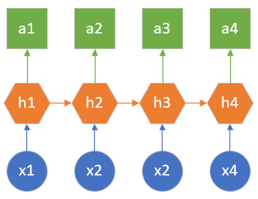

<!--Copyright © Microsoft Corporation. All rights reserved.
  适用于[License](https://github.com/Microsoft/ai-edu/blob/master/LICENSE.md)版权许可-->

# 第19章 普通循环神经网络

## 19.0 循环神经网络概述

### 19.0.1 前馈神经网络的不足

通过学习前面的章节，读者可以发现所有的神经网络的输入都是一个或者一批静态的数据，比如一个人的身高、体重、年龄、性别等组成的特征值用于表示一个人当前的属性，这些属性是采样时获得的，并且会保持相对稳定，可以用这些属性通过前馈神经网络来预测一个人的健康状况。再次输入的下一个数据会是另外一个人的特征值，与前一个人丝毫不相关。

或者输入的是一张青蛙的图片，通过卷积神经网络来判断图片中的物体的类别。而下一张图片可能会是另外一只青蛙的图片，或者干脆变成了一张汽车的图片。

而在自然界中，还有很多随着时间而变化的数据需要处理，比如，对一个人来说，在不同的年龄会有不同的身高、体重、健康状况，只有性别是固定的。如果需要根据年龄来预测此人的健康状况，则需要每年对此人的情况进行一次采样，按时间排序后记录到数据库中。

另外一个例子是如果想从一只青蛙的跳跃动作中分析出其跳跃的高度和距离，则需要获得一段视频，然后从视频的每一帧图片中获得青蛙的当前位置和动作。

从上面两个例子中可以看到，对于与时间相关的数据，到目前为止并没有一个很好的解决方案，这就是循环神经网络存在的意义。

### 19.0.2 循环神经网络的发展简史

循环神经网络（RNN，Recurrent Neural Network）的历史可以简单概括如下：

- 1933年，西班牙神经生物学家Rafael Lorente de Nó发现大脑皮层（cerebral cortex）的解剖结构允许刺激在神经回路中循环传递，并由此提出反响回路假设（reverberating circuit hypothesis）。
- 1982年，美国学者John Hopfield使用二元节点建立了具有结合存储（content-addressable memory）能力的神经网络，即Hopfield神经网络。
- 1986年，Michael I. Jordan基于Hopfield网络的结合存储概念，在分布式并行处理（parallel distributed processing）理论下建立了新的循环神经网络，即Jordan网络。
- 1990年，Jeffrey Elman提出了第一个全连接的循环神经网络，Elman网络。Jordan网络和Elman网络是最早出现的面向序列数据的循环神经网络，由于二者都从单层前馈神经网络出发构建递归连接，因此也被称为简单循环网络（Simple Recurrent Network, SRN）。
- 1990年，Paul Werbos提出了循环神经网络的随时间反向传播（BP Through Time，BPTT），BPTT被沿用至今，是循环神经网络进行学习的主要方法。
- 1991年，Sepp Hochreiter发现了循环神经网络的长期依赖问题（long-term dependencies problem），大量优化理论得到引入并衍生出许多改进算法，包括神经历史压缩器（Neural History Compressor, NHC）、长短期记忆网络（Long Short-Term Memory networks, LSTM）、门控循环单元网络（Gated Recurrent Unit networks, GRU）、回声状态网络（echo state network）、独立循环神经网络（Independent RNN）等。

图19-1简单描述了从前馈神经网络到循环神经网络的演化过程。

图19-1 从前馈神经网络到循环神经网络的演化

1. 最左侧的是前馈神经网络的概括图，即，根据一个静态的输入数据x，经过隐层h的计算，最终得到结果a。这里的h是全连接神经网络或者卷积神经网络，a是回归或分类的结果。
2. 当遇到序列数据的问题后（假设时间步数为3），可以建立三个前馈神经网络来分别处理t=1、t=2、t=3的数据，即x1、x2、x3
3. 但是两个时间步之间是有联系的，于是在隐层h1、h2、h3之间建立了一条连接线，实际上是一个矩阵W
4. 根据序列数据的特性，可以扩充时间步的数量，在每个相邻的时间步之间都会有联系

如果仅此而已的话，还不能称之为循环神经网络，只能说是多个前馈神经网络的堆叠而已。在循环神经网络中，以图19-1最右侧的图为例，只有三个参数：

- U：是x到隐层h的权重矩阵
- V：是隐层h到输出a的权重矩阵
- W：是相邻隐层h之间的权重矩阵

请注意这三个参数在不同的时间步是共享的，以图19-1最右侧的图为例，三个U其实是同一个矩阵，三个V是同一个矩阵，两个W是同一个矩阵。这样的话，无论有多少个时间步，都可以像折扇一样“折叠”起来，用一个“循环”来计算各个时间步的输出，这才是“循环神经网络”的真正含义。

### 19.0.3 循环神经网络的结构和典型用途

#### 一对多的结构

在国外，用户可以指定一个风格，或者一段旋律，让机器自动生成一段具有巴赫风格的乐曲。在中国，有藏头诗的娱乐形式，比如以“春”字开头的一句五言绝句可以是“春眠不觉晓”、“春草细还生”等等。这两个例子都是只给出一个输入，生成多个输出的情况，如图19-2所示。

图19-2 一对多的结构示意图

这种情况的特殊性在于，第一个时间步生成的结果要做为第二个时间步的输入，使得前后有连贯性。图中只画出了4个时间步，在实际的应用中，如果是五言绝句，则有5个时间步；如果是音乐，则要指定小节数，比如40个小节，则时间步为40。

#### 多对一的结构

在阅读一段影评后，会判断出该观众对所评价的电影的基本印象如何，比如是积极的评价还是消极的评价，反映在数值上就是给5颗星还是只给1颗星。在这个例子中，输入是一段话，可以拆成很多句或者很多词组，输出则是一个分类结果。这是一个多个输入单个输出的形式，如图19-3所示。

图19-3 多对一的示意图

图中x可以看作很多连续的词组，依次输入到网络中，只在最后一个时间步才有一个统一的输出。另外一种典型的应用就是视频动作识别，输入连续的视频帧（图片形式），输出是分类结果，比如“跑步”、“骑车”等等动作。

还有一个很吸引人的应用就是股票价格的预测，输入是前10天的股票基本数据，如每天的开盘价、收盘价、交易量等，而输出是明天的股票的收盘价，这也是典型的多对一的应用。但是由于很多其它因素的干扰，股票价格预测具有很大的不确定性。

#### 多对多（输入输出等量）

这种结构要求输入的数据时间步的数量和输出的数据的时间步的数量相同，如图19-4所示。

图19-4 多对多结构

比如想分析视频中每一帧的分类，则输入100帧输入，输出是对应的100个分类结果。另外一个典型应用就是基于字符的语言模型，比如对于英文单词“hello”来说，当第一个字母是h时，计算第二个字母是e的概率，以此类推，则输入是“hell”四个字母，输出是“ello”四个字母的概率。

在中文中，对联的生成问题也是使用了这种结构，如果上联是“风吹水面层层浪”七个字，则下联也一定是七个字，如“雨打沙滩点点坑”。

#### 多对多（输入输出不等量）

这是循环神经网络最重要的一个变种，又叫做编码解码（Encoder-Decoder）模型，或者序列到序列（seqence to seqence）模型，如图19-5所示。

图19-5 编码解码模型

以机器翻译任务举例，源语言和目标语言的句子通常不会是相同的长度，为此，此种结构会先把输入数据编码成一个上下文向量，在h2后生成，做为h3的输入。此时，h1和h2可以看做是一个编码网络，h3和h4看做是一个解码网络。解码网络拿到编码网络的输出后，进行解码，得到目标语言的句子。

由于这种结构不限制输入和输出的序列长度，所以应用范围广泛，类似的应用还有：

- 文本摘要：输入是一段文本，输出是摘要，摘要的字数要比正文少很多。
- 阅读理解：输入是文章和问题，输出是问题答案，答案一般都很简短。
- 语音识别，输入是语音信号序列，输出是文字序列，输入的语音信号按时间计算长度，而输出按字数计算长度，根本不是一个量纲。
