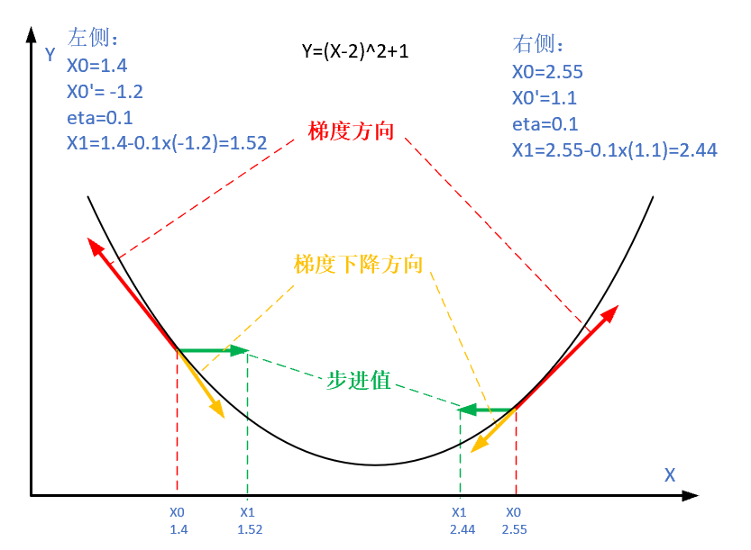
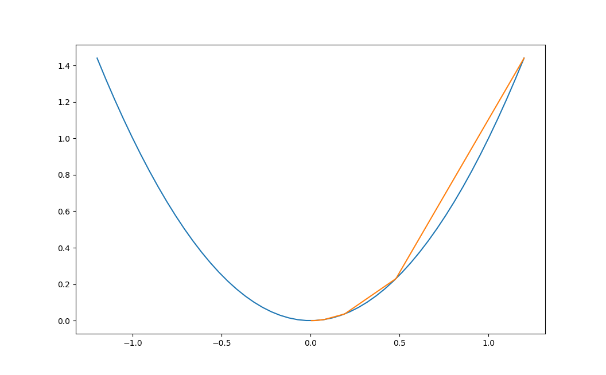
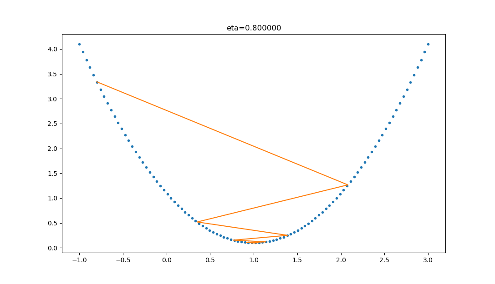
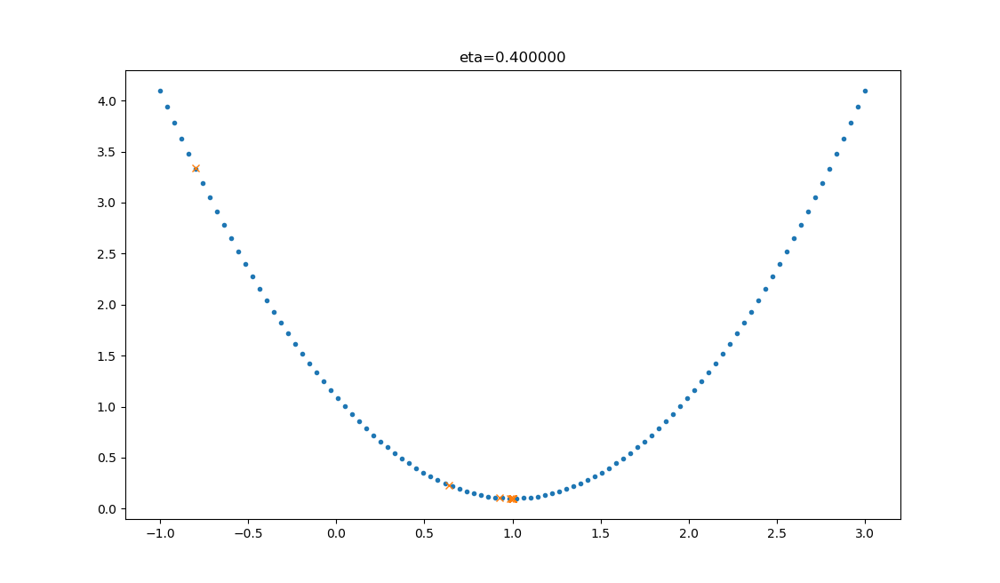
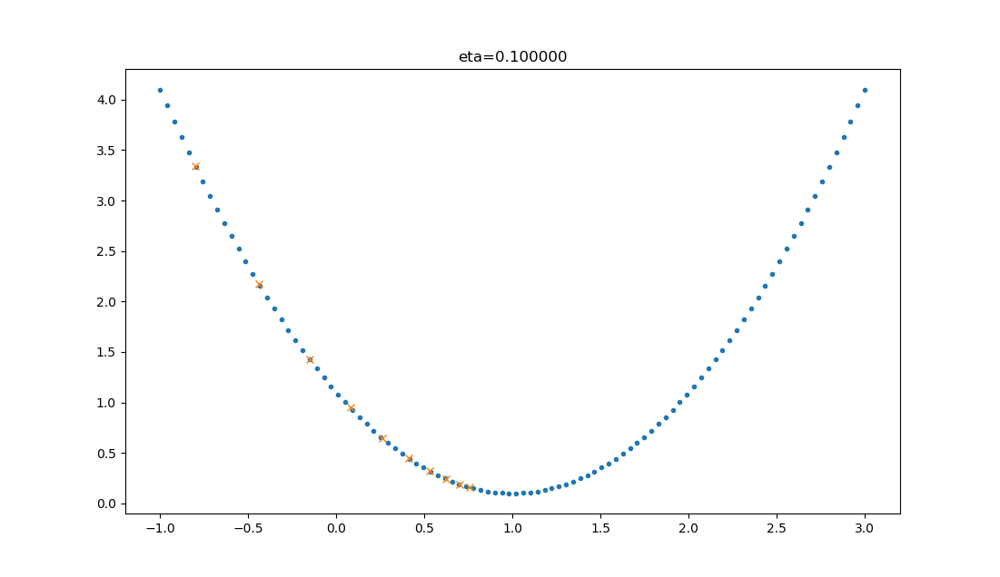

<!--Copyright © Microsoft Corporation. All rights reserved.
  适用于[License](https://github.com/Microsoft/ai-edu/blob/master/LICENSE.md)版权许可-->

## 2.3 梯度下降

### 2.3.1 从自然现象中理解梯度下降

在大多数文章中，都以“一个人被困在山上，需要迅速下到谷底”来举例，这个人会“寻找当前所处位置最陡峭的地方向下走”。这个例子中忽略了安全因素，这个人不可能沿着最陡峭的方向走，要考虑坡度。

在自然界中，梯度下降的最好例子，就是泉水下山的过程：

1. 水受重力影响，会在当前位置，沿着最陡峭的方向流动，有时会形成瀑布（梯度下降）；
2. 水流下山的路径不是唯一的，在同一个地点，有可能有多个位置具有同样的陡峭程度，而造成了分流（可以得到多个解）；
3. 遇到坑洼地区，有可能形成湖泊，而终止下山过程（不能得到全局最优解，而是局部最优解）。

### 2.3.2 梯度下降的数学理解

梯度下降的数学公式：

$$\theta_{n+1} = \theta_{n} - \eta \cdot \nabla J(\theta) \tag{1}$$

其中：

- $\theta_{n+1}$：下一个值；
- $\theta_n$：当前值；
- $-$：减号，梯度的反向；
- $\eta$：学习率或步长，控制每一步走的距离，不要太快以免错过了最佳景点，不要太慢以免时间太长；
- $\nabla$：梯度，函数当前位置的最快上升点；
- $J(\theta)$：函数。

#### 梯度下降的三要素

1. 当前点；
2. 方向；
3. 步长。

#### 为什么说是“梯度下降”？

“梯度下降”包含了两层含义：

1. 梯度：函数当前位置的最快上升点；
2. 下降：与导数相反的方向，用数学语言描述就是那个减号。

亦即与上升相反的方向运动，就是下降。



图2-9 梯度下降的步骤

图2-9解释了在函数极值点的两侧做梯度下降的计算过程，梯度下降的目的就是使得x值向极值点逼近。

### 2.3.3 单变量函数的梯度下降

假设一个单变量函数：

$$J(x) = x ^2$$

我们的目的是找到该函数的最小值，于是计算其微分：

$$J'(x) = 2x$$

假设初始位置为：

$$x_0=1.2$$

假设学习率：

$$\eta = 0.3$$

根据公式(1)，迭代公式：

$$x_{n+1} = x_{n} - \eta \cdot \nabla J(x)= x_{n} - \eta \cdot 2x$$

假设终止条件为 $J(x)<0.01$，迭代过程是：
```
x=0.480000, y=0.230400
x=0.192000, y=0.036864
x=0.076800, y=0.005898
x=0.030720, y=0.000944
```

上面的过程如图2-10所示。



图2-10 使用梯度下降法迭代的过程

### 2.3.4 双变量的梯度下降

假设一个双变量函数：

$$J(x,y) = x^2 + \sin^2(y)$$

我们的目的是找到该函数的最小值，于是计算其微分：

$${\partial{J(x,y)} \over \partial{x}} = 2x$$
$${\partial{J(x,y)} \over \partial{y}} = 2 \sin y \cos y$$

假设初始位置为：

$$(x_0,y_0)=(3,1)$$

假设学习率：

$$\eta = 0.1$$

根据公式(1)，迭代过程是的计算公式：
$$(x_{n+1},y_{n+1}) = (x_n,y_n) - \eta \cdot \nabla J(x,y)$$
$$ = (x_n,y_n) - \eta \cdot (2x,2 \cdot \sin y \cdot \cos y) \tag{1}$$

根据公式(1)，假设终止条件为 $J(x,y)<0.01$，迭代过程如表2-3所示。

表2-3 双变量梯度下降的迭代过程

|迭代次数|x|y|J(x,y)|
|---|---|---|---|
|1|3|1|9.708073|
|2|2.4|0.909070|6.382415|
|...|...|...|...|
|15|0.105553|0.063481|0.015166|
|16|0.084442|0.050819|0.009711|

迭代16次后，$J(x,y)$ 的值为 $0.009711$，满足小于 $0.01$ 的条件，停止迭代。

上面的过程如表2-4所示，由于是双变量，所以需要用三维图来解释。请注意看两张图中间那条隐隐的黑色线，表示梯度下降的过程，从红色的高地一直沿着坡度向下走，直到蓝色的洼地。

表2-4 在三维空间内的梯度下降过程

|观察角度1|观察角度2|
|--|--|
|||

### 2.3.5 学习率η的选择

在公式表达时，学习率被表示为$\eta$。在代码里，我们把学习率定义为`learning_rate`，或者`eta`。针对上面的例子，试验不同的学习率对迭代情况的影响，如表2-5所示。

表2-5 不同学习率对迭代情况的影响

|学习率|迭代路线图|说明|
|---|---|---|
|1.0||学习率太大，迭代的情况很糟糕，在一条水平线上跳来跳去，永远也不能下降。|
|0.8||学习率大，会有这种左右跳跃的情况发生，这不利于神经网络的训练。|
|0.4||学习率合适，损失值会从单侧下降，4步以后基本接近了理想值。|
|0.1||学习率较小，损失值会从单侧下降，但下降速度非常慢，10步了还没有到达理想状态。|


### 代码位置

ch02, Level3, Level4, Level5
