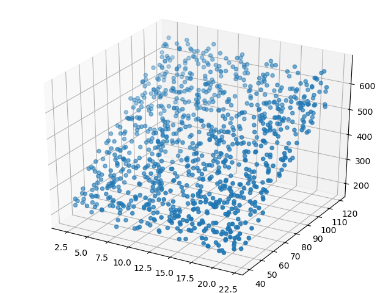
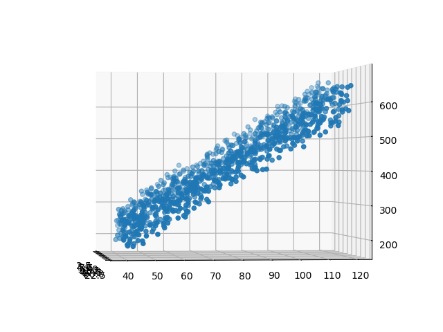

<!--Copyright © Microsoft Corporation. All rights reserved.
  适用于[License](https://github.com/Microsoft/ai-edu/blob/master/LICENSE.md)版权许可-->

# 第5章 多入单出的单层神经网络 - 多变量线性回归

## 5.0 多变量线性回归问题

### 5.0.1 提出问题

**问题：在北京通州，距离通州区中心15公里的一套93平米的房子，大概是多少钱？**

房价预测问题，成为了机器学习的一个入门话题，著名的波士顿的房价数据及相关的比赛已经很多了，但是美国的房子都是独栋的，前院后院停车库游泳池等等参数非常多，初学者可能理解起来有困难。我们不妨用简化版的北京通州的房价来举例，感受一下房价预测的过程。

影响北京通州房价的因素有很多，居住面积、地理位置、朝向、学区房、周边设施、建筑年份等等，其中，面积和地理位置是两个比较重要的因素。地理位置信息一般采用经纬度方式表示，但是经纬度是两个特征值，联合起来才有意义，因此，我们把它转换成了到通州区中心的距离。

我们有1000个样本，每个样本有两个特征值，一个标签值，示例如表5-1。

表5-1 样本数据

|样本序号|地理位置|居住面积|价格（万元）|
|---|---|---|---|
|1|10.06|60|302.86|
|2|15.47|74|393.04|
|3|18.66|46|270.67|
|4|5.20|77|450.59|
|...|...|...|...|

- 特征值1 - 地理位置，统计得到：
  - 最大值：21.96公里
  - 最小值：2.02公里
  - 平均值：12.13公里

- 特征值2 - 房屋面积，统计得到：
  - 最大值：119平米
  - 最小值：40平米
  - 平均值：78.9平米

- 标签值 - 房价，单位为百万元：
  - 最大值：674.37
  - 最小值：181.38
  - 平均值：420.64

这个数据是三维的，所以可以用两个特征值作为 $x$ 和 $y$，用标签值作为 $z$，在 $xyz$ 坐标空间中展示如表5-2。

表5-2 样本在三维空间的可视化

|正向|侧向|
|---|---|
|||

从正向看，很像一块草坪，似乎是一个平面。再从侧向看，和第4章中的直线拟合数据很像。所以，对于这种三维的线性拟合，我们可以把它想象成为拟合一个平面，这个平面会位于这块“草坪”的中位，把“草坪”分割成上下两块更薄的“草坪”，最终使得所有样本点到这个平面的距离的平方和最小。

### 5.0.2 多元线性回归模型

由于表中可能没有恰好符合15公里、93平米条件的数据，因此我们需要根据1000个样本值来建立一个模型，来解决预测问题。

通过图示，我们基本可以确定这个问题是个线性回归问题，而且是典型的多元线性回归，即包括两个或两个以上自变量的回归。多元线性回归的函数模型如下：

$$y=a_0+a_1x_1+a_2x_2+\dots+a_kx_k$$

具体化到房价预测问题，上面的公式可以简化成：

$$ 
z = x_1 \cdot w_1 + x_2 \cdot w_2 + b
$$

抛开本例的房价问题，对于一般的应用问题，建立多元线性回归模型时，为了保证回归模型具有优良的解释能力和预测效果，应首先注意自变量的选择，其准则是：

1. 自变量对因变量必须有显著的影响，并呈密切的线性相关；
2. 自变量与因变量之间的线性相关必须是真实的，而不是形式上的；
3. 自变量之间应具有一定的互斥性，即自变量之间的相关程度不应高于自变量与因变量之因的相关程度；
4. 自变量应具有完整的统计数据，其预测值容易确定。

### 5.0.3 解决方案

如果用传统的数学方法解决这个问题，我们可以使用正规方程，从而可以得到数学解析解，然后再使用神经网络方式来求得近似解，从而比较两者的精度，再进一步调试神经网络的参数，达到学习的目的。

我们不妨先把两种方式在这里做一个对比，读者阅读并运行代码，得到结果后，再回到这里来仔细体会表5-3中的比较项。

表5-3 两种方法的比较

|方法|正规方程|梯度下降|
|---|-----|-----|
|原理|几次矩阵运算|多次迭代|
|特殊要求|$X^{\top}X$ 的逆矩阵存在|需要确定学习率|
|复杂度|$O(n^3)$|$O(n^2)$|
|适用样本数|$m \lt 10000$|$m \ge 10000$|

