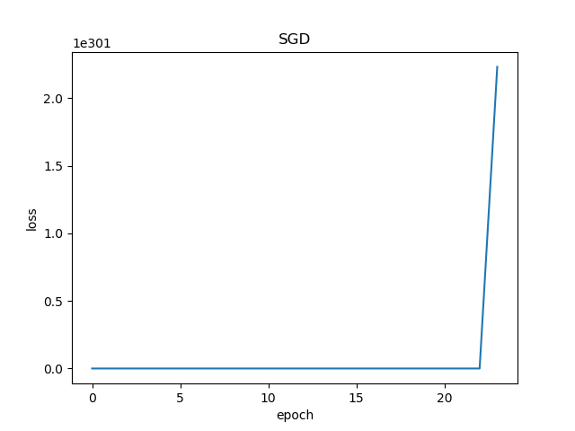

<!--Copyright © Microsoft Corporation. All rights reserved.
  适用于[License](https://github.com/Microsoft/ai-edu/blob/master/LICENSE.md)版权许可-->
  
## 5.2 神经网络解法

与单特征值的线性回归问题类似，多变量（多特征值）的线性回归可以被看做是一种高维空间的线性拟合。以具有两个特征的情况为例，这种线性拟合不再是用直线去拟合点，而是用平面去拟合点。

### 5.2.1 定义神经网络结构

我们定义一个如图5-1所示的一层的神经网络，输入层为2或者更多，反正大于2了就没区别。这个一层的神经网络的特点是：

1. 没有中间层，只有输入项和输出层（输入项不算做一层）；
2. 输出层只有一个神经元；
3. 神经元有一个线性输出，不经过激活函数处理，即在下图中，经过 $\Sigma$ 求和得到 $Z$ 值之后，直接把 $Z$ 值输出。


图5-1 多入单出的单层神经元结构

与上一章的神经元相比，这次仅仅是多了一个输入，但却是质的变化，即，一个神经元可以同时接收多个输入，这是神经网络能够处理复杂逻辑的根本。

#### 输入层

单独看第一个样本是这样的：

$$
x_1 =
\begin{pmatrix}
x_{11} & x_{12}
\end{pmatrix} = 
\begin{pmatrix}
10.06 & 60
\end{pmatrix} 
$$

$$
y_1 = \begin{pmatrix} 302.86 \end{pmatrix}
$$

一共有1000个样本，每个样本2个特征值，X就是一个$1000 \times 2$的矩阵：

$$
X = 
\begin{pmatrix} 
x_1 \\\\ x_2 \\\\ \vdots \\\\ x_{1000}
\end{pmatrix} =
\begin{pmatrix} 
x_{1,1} & x_{1,2} \\\\
x_{2,1} & x_{2,2} \\\\
\vdots & \vdots \\\\
x_{1000,1} & x_{1000,2}
\end{pmatrix}
$$

$$
Y =
\begin{pmatrix}
y_1 \\\\ y_2 \\\\ \vdots \\\\ y_{1000}
\end{pmatrix}=
\begin{pmatrix}
302.86 \\\\ 393.04 \\\\ \vdots \\\\ 450.59
\end{pmatrix}
$$


$x_1$ 表示第一个样本，$x_{1,1}$ 表示第一个样本的一个特征值，$y_1$ 是第一个样本的标签值。

#### 权重 $W$ 和 $B$

由于输入层是两个特征，输出层是一个变量，所以 $W$ 的形状是 $2\times 1$，而 $B$ 的形状是 $1\times 1$。

$$
W=
\begin{pmatrix}
w_1 \\\\ w_2
\end{pmatrix}
$$

$$B=(b)$$

$B$ 是个单值，因为输出层只有一个神经元，所以只有一个bias，每个神经元对应一个bias，如果有多个神经元，它们都会有各自的b值。

#### 输出层

由于我们只想完成一个回归（拟合）任务，所以输出层只有一个神经元。由于是线性的，所以没有用激活函数。
$$
\begin{aligned}
Z&=
\begin{pmatrix}
  x_{11} & x_{12}
\end{pmatrix}
\begin{pmatrix}
  w_1 \\\\ w_2
\end{pmatrix}
+(b) \\\\
&=x_{11}w_1+x_{12}w_2+b
\end{aligned}
$$

写成矩阵形式：

$$Z = X\cdot W + B$$

#### 损失函数

因为是线性回归问题，所以损失函数使用均方差函数。

$$loss_i(W,B) = \frac{1}{2} (z_i-y_i)^2 \tag{1}$$

其中，$z_i$ 是样本预测值，$y_i$ 是样本的标签值。

### 5.2.2 反向传播

#### 单样本多特征计算

与上一章不同，本章中的前向计算是多特征值的公式：

$$\begin{aligned}
z_i &= x_{i1} \cdot w_1 + x_{i2} \cdot w_2 + b \\\\
&=\begin{pmatrix}
  x_{i1} & x_{i2}
\end{pmatrix}
\begin{pmatrix}
  w_1 \\\\
  w_2
\end{pmatrix}+b
\end{aligned} \tag{2}
$$

因为 $x$ 有两个特征值，对应的 $W$ 也有两个权重值。$x_{i1}$ 表示第 $i$ 个样本的第 $1$ 个特征值，所以无论是 $x$ 还是 $W$ 都是一个向量或者矩阵了，那么我们在反向传播方法中的梯度计算公式还有效吗？答案是肯定的，我们来一起做个简单推导。

由于 $W$ 被分成了 $w_1$ 和 $w_2$ 两部分，根据公式1和公式2，我们单独对它们求导：

$$
\frac{\partial loss_i}{\partial w_1}=\frac{\partial loss_i}{\partial z_i}\frac{\partial z_i}{\partial w_1}=(z_i-y_i) \cdot x_{i1} \tag{3}
$$
$$
\frac{\partial loss_i}{\partial w_2}=\frac{\partial loss_i}{\partial z_i}\frac{\partial z_i}{\partial w_2}=(z_i-y_i) \cdot x_{i2} \tag{4}
$$

求损失函数对 $W$ 矩阵的偏导是无法直接求的，所以要变成求各个 $W$ 的分量的偏导。由于 $W$ 的形状是：

$$
W=
\begin{pmatrix}
w_1 \\\\ w_2
\end{pmatrix}
$$

所以求 $loss_i$ 对 $W$ 的偏导，应该这样写：

$$
\begin{aligned}  
\frac{\partial loss_i}{\partial W}&=
\begin{pmatrix}
  \frac{\partial loss_i}{\partial w_1} \\\\
  \frac{\partial loss_i}{\partial w_2}
\end{pmatrix} 
=\begin{pmatrix}
  (z_i-y_i) \cdot x_{i1} \\\\
  (z_i-y_i) \cdot x_{i2}
\end{pmatrix}  \\\\
&=\begin{pmatrix}
  x_{i1} \\\\
  x_{i2}
\end{pmatrix}
(z_i-y_i) 
=\begin{pmatrix}
  x_{i1} & x_{i2}
\end{pmatrix}^{\top}(z_i-y_i) \\\\
&=x_i^{\top}(z_i-y_i)
\end{aligned} \tag{5}
$$

$$
\frac{\partial loss_i}{\partial B}=z_i-y_i \tag{6}
$$

#### 多样本多特征计算

当进行多样本计算时，我们用 $m=3$ 个样本做一个实例化推导：

$$
z_1 = x_{11}w_1+x_{12}w_2+b
$$

$$
z_2= x_{21}w_1+x_{22}w_2+b
$$

$$
z_3 = x_{31}w_1+x_{32}w_2+b
$$

$$
J(W,B) = \frac{1}{2 \times 3}[(z_1-y_1)^2+(z_2-y_2)^2+(z_3-y_3)^2]
$$

$$
\begin{aligned}  
\frac{\partial J}{\partial W}&=
\begin{pmatrix}
  \frac{\partial J}{\partial w_1} \\\\
  \frac{\partial J}{\partial w_2}
\end{pmatrix}
=\begin{pmatrix}
  \frac{\partial J}{\partial z_1}\frac{\partial z_1}{\partial w_1}+\frac{\partial J}{\partial z_2}\frac{\partial z_2}{\partial w_1}+\frac{\partial J}{\partial z_3}\frac{\partial z_3}{\partial w_1} \\\\
  \frac{\partial J}{\partial z_1}\frac{\partial z_1}{\partial w_2}+\frac{\partial J}{\partial z_2}\frac{\partial z_2}{\partial w_2}+\frac{\partial J}{\partial z_3}\frac{\partial z_3}{\partial w_2}  
\end{pmatrix}
\\\\
&=\begin{pmatrix}
  \frac{1}{3}(z_1-y_1)x_{11}+\frac{1}{3}(z_2-y_2)x_{21}+\frac{1}{3}(z_3-y_3)x_{31} \\\\
  \frac{1}{3}(z_1-y_1)x_{12}+\frac{1}{3}(z_2-y_2)x_{22}+\frac{1}{3}(z_3-y_3)x_{32}
\end{pmatrix}
\\\\
&=\frac{1}{3}
\begin{pmatrix}
  x_{11} & x_{21} & x_{31} \\\\
  x_{12} & x_{22} & x_{32}
\end{pmatrix}
\begin{pmatrix}
  z_1-y_1 \\\\
  z_2-y_2 \\\\
  z_3-y_3
\end{pmatrix}
\\\\
&=\frac{1}{3}
\begin{pmatrix}
  x_{11} & x_{12} \\\\
  x_{21} & x_{22} \\\\
  x_{31} & x_{32} 
\end{pmatrix}^{\top}
\begin{pmatrix}
  z_1-y_1 \\\\
  z_2-y_2 \\\\
  z_3-y_3
\end{pmatrix}
\\\\
&=\frac{1}{m}X^{\top}(Z-Y) 
\end{aligned}
\tag{7}
$$
注：3泛化为m。
$$
\frac{\partial J}{\partial B}=\frac{1}{m}(Z-Y) \tag{8}
$$

### 5.2.3 代码实现

公式6和第4.4节中的公式5一样，所以我们依然采用第四章中已经写好的`HelperClass`目录中的那些类，来表示我们的神经网络。虽然此次神经元多了一个输入，但是不用改代码就可以适应这种变化，因为在前向计算代码中，使用的是矩阵乘的方式，可以自动适应`x`的多个列的输入，只要对应的`w`的矩阵形状是正确的即可。

但是在初始化时，我们必须手动指定`x`和`W`的形状，如下面的代码所示：

```Python
if __name__ == '__main__':
    # net
    params = HyperParameters(2, 1, eta=0.1, max_epoch=100, batch_size=1, eps = 1e-5)
    net = NeuralNet(params)
    net.train(reader)
    # inference
    x1 = 15
    x2 = 93
    x = np.array([x1,x2]).reshape(1,2)
    print(net.inference(x))
```

在参数中，指定了学习率`0.1`，最大循环次数`100`轮，批大小`1`个样本，以及停止条件损失函数值`1e-5`。

在神经网络初始化时，指定了`input_size=2`，且`output_size=1`，即一个神经元可以接收两个输入，最后是一个输出。

最后的`inference`部分，是把两个条件（15公里，93平方米）代入，查看输出结果。

在下面的神经网络的初始化代码中，`W`的初始化是根据`input_size`和`output_size`的值进行的。

```Python
class NeuralNet(object):
    def __init__(self, params):
        self.params = params
        self.W = np.zeros((self.params.input_size, self.params.output_size))
        self.B = np.zeros((1, self.params.output_size))
```

#### 正向计算的代码

```Python
class NeuralNet(object):
    def __forwardBatch(self, batch_x):
        Z = np.dot(batch_x, self.W) + self.B
        return Z
```

#### 误差反向传播的代码

```Python
class NeuralNet(object):
    def __backwardBatch(self, batch_x, batch_y, batch_z):
        m = batch_x.shape[0]
        dZ = batch_z - batch_y
        dB = dZ.sum(axis=0, keepdims=True)/m
        dW = np.dot(batch_x.T, dZ)/m
        return dW, dB
```

### 5.2.4 运行结果

在Visual Studio 2017中，可以使用Ctrl+F5运行Level2的代码，但是，会遇到一个令人沮丧的打印输出：

```
epoch=0
NeuralNet.py:32: RuntimeWarning: invalid value encountered in subtract
  self.W = self.W - self.params.eta * dW
0 500 nan
epoch=1
1 500 nan
epoch=2
2 500 nan
epoch=3
3 500 nan
......
```

减法怎么会出问题？什么是`nan`？

`nan`的意思是数值异常，导致计算溢出了，出现了没有意义的数值。现在是每500个迭代监控一次，我们把监控频率调小一些，再试试看：

```
epoch=0
0 10 6.838664338516814e+66
0 20 2.665505502247752e+123
0 30 1.4244204612680962e+179
0 40 1.393993758296751e+237
0 50 2.997958629609441e+290
NeuralNet.py:76: RuntimeWarning: overflow encountered in square
  LOSS = (Z - Y)**2
0 60 inf
...
0 110 inf
NeuralNet.py:32: RuntimeWarning: invalid value encountered in subtract
  self.W = self.W - self.params.eta * dW
0 120 nan
0 130 nan
```

前10次迭代，损失函数值已经达到了`6.83e+66`，而且越往后运行值越大，最后终于溢出了。下面的损失函数历史记录也表明了这一过程。



图5-2 训练过程中损失函数值的变化

### 5.2.5 寻找失败的原因

我们可以在`NeuralNet.py`文件中，在图5-3代码行上设置断点，跟踪一下训练过程，以便找到问题所在。


图5-3 在VisualStudio中Debug

在VS2017中用F5运行debug模式，看第50行的结果：

```
batch_x
array([[ 4.96071728, 41.        ]])
batch_y
array([[244.07856544]])
```

返回的样本数据是正常的。再看下一行：

```
batch_z
array([[0.]])
```

第一次运行前向计算，由于`W`和`B`初始值都是`0`，所以`z`也是`0`，这是正常的。再看下一行：

```
dW
array([[ -1210.80475712],
       [-10007.22118309]])
dB
array([[-244.07856544]])
```

`dW`和`dB`的值都非常大，这是因为图5-4所示这行代码。


图5-4 有问题的代码行

`batch_z`是`0`，`batch_y`是`244.078`，二者相减，是`-244.078`，因此`dB`就是`-244.078`，`dW`因为矩阵乘了`batch_x`，值就更大了。

再看`W`和`B`的更新值，一样很大：

```
self.W
array([[ 121.08047571],
       [1000.72211831]])
self.B
array([[24.40785654]])
```

如果`W`和`B`的值很大，那么再下一轮进行前向计算时，会得到更糟糕的结果：

```
batch_z
array([[82459.53752331]])
```

果不其然，这次的`z`值飙升到了8万多，如此下去，几轮以后数值溢出是显而易见的事情了。

那么我们到底遇到了什么情况？

### 代码位置

ch05, Level2
