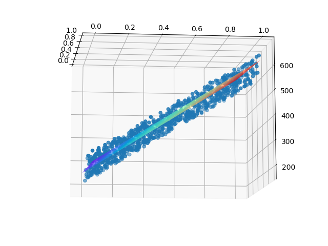

<!--Copyright © Microsoft Corporation. All rights reserved.
  适用于[License](https://github.com/Microsoft/ai-edu/blob/master/LICENSE.md)版权许可-->

## 5.3 样本特征数据标准化

数据标准化（Normalization），又可以叫做数据归一化。

### 5.3.1 发现问题的根源

仔细分析一下屏幕打印信息，前两次迭代的损失值已经是天文数字了，后面的W和B的值也在不断变大，说明网络发散了。难道我们遇到了传说中的梯度爆炸！数值太大，导致计算溢出了。第一次遇到这个情况，但相信不会是最后一次，因为这种情况在神经网络中太常见了。

回想一个问题：为什么在第4章中，我们没有遇到这种情况？把第4章的数据样本拿来看一看，如表5-4所示。

表5-4 第4章中的样本数据

|样本序号|服务器数量(千台)X|空调功率(千瓦)Y|
|---|---|---|
|1|0.928|4.824|
|2|0.469|2.950|
|3|0.855|4.643|
|...|...|...|

所有的X值（服务器数量除以1000后的值）都是在[0,1]之间的，而本章中的房价数据有两个特征值，一个是公里数，一个是平米数，全都是不是在[0,1]之间的，并且取值范围还不相同。我们不妨把本次样本数据也做一下这样的处理，亦即“标准化”。

其实，数据标准化是深度学习的必要步骤之一，已经是大师们的必杀技能，也因此它很少被各种博客/文章所提及，以至于初学者们经常被坑。

根据5.0.1中对数据的初步统计，我们是不是也可以把公里数都除以100，而平米数都除以1000呢，这样也会得到[0,1]之间的数字？公里数的取值范围是[2,22]，除以100后变成了[0.02,0.22]。平米数的取值范围是[40,120]，除以1000后变成了[0.04,0.12]。

对本例来说这样做肯定是可以正常工作的，但是下面我们要介绍一种更科学合理的做法。

### 5.3.2 为什么要做标准化

理论层面上，神经网络是以样本在事件中的统计分布概率为基础进行训练和预测的，所以它对样本数据的要求比较苛刻。具体说明如下：

1. 样本的各个特征的取值要符合概率分布，即[0,1]
2. 样本的度量单位要相同。我们并没有办法去比较1米和1公斤的区别，但是，如果我们知道了1米在整个样本中的大小比例，以及1公斤在整个样本中的大小比例，比如一个处于0.2的比例位置，另一个处于0.3的比例位置，就可以说这个样本的1米比1公斤要小！
3. 神经网络假设所有的输入输出数据都是标准差为1，均值为0，包括权重值的初始化，激活函数的选择，以及优化算法的设计。

4. 数值问题

    标准化可以避免一些不必要的数值问题。因为激活函数sigmoid/tanh的非线性区间大约在[-1.7，1.7]。意味着要使神经元有效，线性计算输出的值的数量级应该在1（1.7所在的数量级）左右。这时如果输入较大，就意味着权值必须较小，一个较大，一个较小，两者相乘，就引起数值问题了。
    
5. 梯度更新
    
    若果输出层的数量级很大，会引起损失函数的数量级很大，这样做反向传播时的梯度也就很大，这时会给梯度的更新带来数值问题。
    
6. 学习率
   
    如果梯度非常大，学习率就必须非常小，因此，学习率（学习率初始值）的选择需要参考输入的范围，不如直接将数据标准化，这样学习率就不必再根据数据范围作调整。 对w1适合的学习率，可能相对于w2来说会太小，若果使用适合w1的学习率，会导致在w2方向上步进非常慢，会消耗非常多的时间，而使用适合w2的学习率，对w1来说又太大，搜索不到适合w1的解。
    
### 5.3.3 从损失函数等高线图分析标准化的必要性

在房价数据中，地理位置的取值范围是[2,20]，而房屋面积的取值范围为[40,120]，二者相差太远，根本不可以放在一起计算了？

根据公式$z = x_1 w_1+x_2 w_2 + b$，神经网络想学习w1和w2，但是数值范围问题导致神经网络来说很难“理解”。图5-5展示了标准化前后的情况损失函数值的等高图，意思是地理位置和房屋面积取不同的值时，作为组合来计算损失函数值时，形成的类似地图的等高图，见图5-5，左侧为标准化前，右侧为标准化后。


图5-5 标准化前后的损失函数等高线图的对比

房屋面积的取值范围是[40,120]，而地理位置的取值范围是[2,20]，二者会形成一个很扁的椭圆，如左侧。这样在寻找最优解的时候，过程会非常曲折。运气不好的话，根本就没法训练。

### 5.3.4 标准化的常用方法

- Min-Max标准化（离差标准化），将数据映射到[0,1]区间

$$x_{new}={x-x_{min} \over x_{max} - x_{min}} \tag{1}$$

- 平均值标准化，将数据映射到[-1,1]区间
   
$$x_{new} = {x - \bar{x} \over x_{max} - x_{min}} \tag{2}$$

- 对数转换
$$x_{new}=log(x_i) \tag{3}$$

- 反余切转换
$$x_{new}=atan(x_i) \cdot 2/π  \tag{4}$$

- Z-Score法

把每个特征值中的所有数据，变成平均值为0，标准差为1的数据，最后为正态分布。Z-Score规范化（标准差标准化 / 零均值标准化，其中std是标准差）：

$$x_{new} = (x_i - \bar{x})／std \tag{5}$$

- 中心化，平均值为0，无标准差要求
  
$$x_{new} = x_i - \bar{x} \tag{6}$$

- 比例法，要求数据全是正值

$$
x_{new} = x_i / \sum_{i=1}^n{x_i} \tag{7}
$$


### 5.3.5 如何做数据标准化

我们再看看样本的数据，表5-5。

表5-5 房价原始样本数据抽样

|样本序号|地理位置|居住面积|价格（万元）|
|---|---|---|---|
|1|10.06|60|302.86|
|2|15.47|74|393.04|
|3|18.66|46|270.67|
|4|5.20|77|450.59|
|...|...|...|...|

按照标准化的定义，我们只要把地理位置列和居住面积列分别做标准化就达到要求了，结果如表5-6。

表5-6 标准化后的样本数据

|样本序号|地理位置|居住面积|价格（万元）|
|---|---|---|---|
|1|0.4033|0.2531|302.86|
|2|0.6744|0.4303|393.04|
|3|0.8341|0.0759|270.67|
|4|0.1592|0.4683|450.59|
|...|...|...|...|

注意：

1. 我们并没有标准化样本的标签Y数据，所以最后一行的价格还是保持不变
2. 我们是对两列特征值分别做标准化处理的

### 5.3.6 代码实现

在HelperClass目录的SimpleDataReader.py文件中，给该类增加一个方法：

```Python
    def NormalizeX(self):
        ......
```

返回值X_new是标准化后的样本，和原始数据的形状一样。

再把主程序修改一下，在ReadData()方法后，紧接着调用NormalizeX()方法：

```Python
if __name__ == '__main__':
    # data
    reader = SimpleDataReader()
    reader.ReadData()
    reader.NormalizeX()
    ......
```

### 5.3.7 运行结果

运行上述代码，看打印结果：

```
epoch=9
9 0 391.75978721600353
9 100 387.79811202735783
......
9 800 380.78054509441193
9 900 575.5617634691969
W= [[-41.71417524]
 [395.84701164]]
B= [[242.15205099]]
z= [[37366.53336103]]
```

虽然损失函数值没有像我们想象的那样趋近于0，但是却稳定在了400左右震荡，这也算是收敛！看一下损失函数图像。


图5-6 训练过程中损失函数值的变化

再看看W和B的输出值和z的预测值：

```
w1 = -41.71417524
w2 = 395.84701164
b = 242.15205099
z = 37366.53336103
```

回忆一下正规方程的输出值：

```
w1= -2.0184092853092226
w2= 5.055333475112755
b= 46.235258613837644
z= 486.1051325196855
```

正规方程预测房价结果：

$$
\begin{aligned}
Z&= -2.018 \times 15 + 5.055 \times 93 + 46.235 \\
&= 486.105(万元)
\end{aligned}
$$

神经网络预测房价结果：

$$
\begin{aligned}
Z&= -14.714 \times 15 + 395.847 \times 93 + 242.152 \\
&= 37366(万元)
\end{aligned}
$$

好吧，我们遇到了天价房！这是怎么回事儿？难道和我们做数据标准化有关系？

### 5.3.8 工作原理

在5.0.1中，我们想象神经网络会寻找一个平面，来拟合这些空间中的样本点，是不是这样呢？我们通过下面的函数来实现这个可视化：

```Python
def ShowResult(net, reader):
    ......
``` 

前半部分代码先是把所有的点显示在三维空间中，我们曾经描述它们像一块厚厚的草坪。后半部分的代码在[0,1]空间内形成了一个50x50的网格，亦即有2500个点，这些点都是有横纵坐标的。然后把这些点送入神经网络中做预测，得到了2500个Z值，相当于第三维的坐标值。最后把这2500个三维空间的点，以网格状显示在空间中，就形成了表5-7的可视化的结果。

细心的读者可能会问两个问题：

1. 为什么要在[0,1]空间中形成50x50的网格呢？
2. 50这个数字从哪里来的？

NumPy库的np.linspace(0,1)的含义，就是在[0,1]空间中生成50个等距的点，第三个参数不指定时，缺省是50。因为我们前面对样本数据做过标准化，统一到了[0,1]空间中，这就方便了我们对问题的分析，不用考虑每个特征值的实际范围是多大了。

表5-7 三维空间线性拟合的可视化

|正向|侧向|
|---|---|
|||

从表5-7中的正向图可以看到，真的形成了一个平面；从侧向图可以看到，这个平面也确实穿过了那些样本点，并且把它们分成了上下两个部分。只不过由于训练精度的问题，没有做到平分，而是斜着穿过了点的区域，就好像第4.3节中的那个精度不够的线性回归的结果。

所以，这就印证了我们在4.3.5中的关于高维空间拟合的说法：在二维平面上是一条拟合直线，在三维空间上是一个拟合平面。每个样本点到这个平面上都有一个无形的作用力（不妨想象为引力），当作用力达到平衡时，也就是平面拟合的最佳位置。

这下子我们可以大致放心了，神经网络的训练结果并没有错，一定是别的地方出了什么问题。在下一节中我们来一起看看问题出在哪里！

### 代码位置

ch05, Level3
