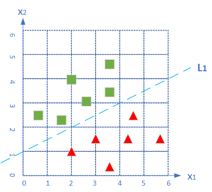

<!--Copyright © Microsoft Corporation. All rights reserved.
  适用于[License](https://github.com/Microsoft/ai-edu/blob/master/LICENSE.md)版权许可-->

## 6.3 线性二分类原理

### 6.3.1 线性分类和线性回归的异同

此原理对线性和非线性二分类都适用。

回忆一下前面学习过的线性回归，通过均方差函数误差反向传播的方法，不断矫正拟合直线的角度（Weights）和偏移（Bias），因为均方差函数能够准确地反映出当前的拟合程度。那么在线性分类中，我们能不能采取类似的方法呢？

线性分类，试图在含有两种样本的空间中划出一条分界线，让双方截然分开，就好像是中国象棋的棋盘中的楚河汉界一样。与线性回归相似的地方是，两者都需要划出那条“直线”来，但是不同的地方也很明显，见表6-4。

表6-4 线性回归和线性分类的比较

||线性回归|线性分类|
|---|---|---|
|相同点|需要在样本群中找到一条直线|需要在样本群中找到一条直线|
|不同点|用直线来拟合所有样本，使得各个样本到这条直线的距离尽可能最短|用直线来分割所有样本，使得正例样本和负例样本尽可能分布在直线两侧|

可以看到线性回归中的目标--“距离最短”，还是很容易理解的，但是线性分类的目标--“分布在两侧”，用数学方式如何描述呢？我们可以有代数和几何两种方式来描述。

### 6.3.2 二分类的代数原理

代数方式：通过一个分类函数计算所有样本点在经过线性变换后的概率值，使得正例样本的概率大于0.5，而负例样本的概率小于0.5。

#### 基本公式回顾

下面我们以单样本双特征值为例来说明神经网络的二分类过程，这是用代数方式来解释其工作原理。

1. 正向计算

$$
z = x_1 w_1+ x_2 w_2 + b  \tag{1}
$$

2. 分类计算

$$
a={1 \over 1 + e^{-z}} \tag{2}
$$

3. 损失函数计算

$$
loss = -[y \ln (a)+(1-y) \ln (1-a)] \tag{3}
$$

用图6-5举例来说明计算过程。

图6-5 不正确的分类线试图分类红绿两色样本点

平面上有三个点，分成两类，绿色方块为正类，红色三角为负类。各个点的坐标为：$A(2,4)，B(2,1)，C(3,3)$。

#### 分类线为 $L_1$ 时

假设神经网络第一次使用 $L_1$ 做为分类线，此时：$w_1=-1,w_2=2,b=-2$，我们来计算一下三个点的情况。

$A$点：

$$
z_A = (-1)\times 2 + 2 \times 4 -2 = 4 > 0 \tag{正确}
$$

$B$点：

$$
z_B = (-1)\times 2 + 2 \times 1 -2 = -2 < 0 \tag{正确}
$$

$C$点：

$$
z_C = (-1)\times 3 + 2 \times 3 -2 = 1 > 0 \tag{错误}
$$

从6.1节中我们知道当 $z>0$ 时，$Logistic(z) > 0.5$ 为正例，反之为负例，所以我们只需要看三个点的 $z$ 值是大于0还是小于0就可以了，不用再计算 $Logistic$ 函数值。

其中，$A,B$点处于正确的分类区，而 $C$ 点处于错误的分类区。此时 $C$ 点的损失函数值为（注意 $C$ 的标签值 $y=0$）：

$$
a_C = Logistic(z_C) = 0.731
$$

$$
loss_Z = -(0 \cdot \ln(0.731) + 1 \cdot \ln(1-0.731))=1.313
$$

读者可能对 $1.313$ 这个值没有什么概念，是大还是小呢？我们不妨计算一下分类正确的 $A,B$ 点的坐标：

$$
loss_A = 0.018, \quad loss_B = 0.112
$$

可见，对于分类正确的 $A,B$ 点来说，其损失函数值比 $C$ 点要小很多，所以 $C$ 点的反向传播的力度就大。对比总结如表6-5。

表6-5 对比三个点在各个环节的计算值

|点|坐标值|$z$ 值|$a$ 值|$y$ 值|$loss$ 值|分类情况|
|---|---|---|---|---|---|---|
|A|(2,4)|4|0.982|1|0.018|正确|
|B|(2,1)|-2|0.119|0|0.112|正确|
|C|(3,3)|1|0.731|0|1.313|错误|

- 在正例情况 $y=1$ 时，$a$ 如果越靠近 $1$，表明分类越正确，此时损失值会越小。点 $A$ 就是这种情况：$a=0.982$，距离 $1$ 不远；$loss$ 值 $0.018$，很小；
- 在负例情况 $y=0$ 时，$a$ 如果越靠近 $0$，表明分类越正确，此时损失值会越小。点 $B$ 就是这种情况：$a=0.119$，距离 $0$ 不远；$loss$ 值 $0.112$，不算很大；
- 点 $C$ 是分类错误的情况，$a=0.731$，本应小于 $0.5$，实际上距离 $0$ 远，距离 $1$ 反而近，它的 $loss=1.313$，与其它两个点的相对值来看非常大，这样误差就大，反向传播的力度也大。

#### 分类线为 $L_2$ 时

我们假设经过反向传播后，神经网络把直线的位置调整到 $L_2$，以 $L_2$ 做为分类线，即 $w_1=-1,w_2=1,b=-1$，则三个点的 $z$ 值都会是符合其分类的：

$$
z_A = (-1)\times 2 + 1 \times 4 -1 = 1 > 0 \tag{正确}
$$

$$
z_B = (-1)\times 2 + 1 \times 1 -1 = -2 < 0 \tag{正确}
$$

$$
z_C = (-1)\times 3 + 1 \times 3 -1 = -1 < 0 \tag{正确}
$$

这里可能会产生一个疑问：既然用 $z$ 值是否大于0这个条件就可以判断出分类是否正确，那么二分类理论中为什么还要用 $Logistic$ 函数做一次分类呢？

原因是这样的：只有 $z$ 值的话，我们只能知道是大于0还是小于0，并不能有效地进行反向传播，也就是说我们无法告诉神经网络反向传播的误差的力度有多大。比如 $z=5$ 和 $z=-1$ 相比，难度意味着前者的力度是后者的5倍吗？

而有了 $Logistic$ 分类计算后，得到的值是一个 $(0,1)$ 之间的概率，比如：当 $z=5$ 时，$Logistic(5) = 0.993$；当 $z=-1$ 时，$Logistic(-1)=0.269$。这两个数值的含义是这两个样本在分类区内的概率，前者概率为 $99.3%$，偏向正例，后者概率为 $26.9%$，偏向负例。然后再计算损失函数，就可以得到神经网络可以理解的反向传播误差，比如上面曾经计算过的 $loss_A,loss_B,loss_C$。

### 6.3.3 二分类的几何原理

几何方式：让所有正例样本处于直线的一侧，所有负例样本处于直线的另一侧，直线尽可能处于两类样本的中间。

#### 二分类函数的几何作用

二分类函数的最终结果是把正例都映射到图6-6中的上半部分的曲线上，而把负类都映射到下半部分的曲线上。

图6-6 $Logistic$ 函数把输入的点映射到 $(0,1)$ 区间内实现分类

我们用正例来举例：

$$a = Logistic(z) = \frac{1}{1 + e^{-z}} > 0.5$$

做公式变形，两边取自然对数，可以得到：

$$z > 0$$

即：
$$
z = x_1 \cdot w_1 + x_2 \cdot w_2 + b > 0
$$

对上式做一下变形，把$x_2$放在左侧，其他项放在右侧（假设$w_2>0$，则不等号方向不变）：
$$
x_2 > - \frac{w_1}{w_2}x_1 - \frac{b}{w_2} \tag{5}
$$

简化一下两个系数，令$w'=-w1/w2,b'=-b/w2$：

$$
x_2 > w' \cdot x_1 + b' \tag{6}
$$

公式6用几何方式解释，就是：有一条直线，方程为 $z = w' \cdot x_1+b'$，所有的正例样本都处于这条直线的上方；同理可得所有的负例样本都处于这条直线的下方。

图6-7 用直线分开的两类样本

我们再观察一下分类正确的图，如图6-7所示。假设绿色方块为正类：标签值 $y=1$，红色三角形为负类：标签值 $y=0$。从几何关系上理解，如果我们有一条直线，其公式为：$z = w' \cdot x_1+b'$，如图中的虚线 $L_1$ 所示，则所有正类的样本的 $x_2$ 都大于 $z$，而所有的负类样本的 $x_2$ 都小于 $z$，那么这条直线就是我们需要的分割线。

这就说明神经网络的工作原理和我们在二维平面上的直观感觉是相同的，即神经网络的工作就是找到这么一条合适的直线，尽量让所有正例样本都处于直线上方时，负例样本处于直线的下方。其实这与线性回归中找到一条直线穿过所有样本点的过程有异曲同工之处。

我们还有一个额外的收获，即：

$$w' = - w1 / w2 \tag{7}$$

$$b' = -b/w2 \tag{8}$$

我们可以使用神经网络计算出 $w_1,w_2,b$ 三个值以后，转换成 $w',b'$，以便在二维平面上画出分割线，来直观地判断神经网络训练结果的正确性。

### 思考与练习

1. 在推导公式5时，假设 $w_2 > 0$，这样做有什么问题吗？如果假设 $w_2<0$ 会是什么情况？
