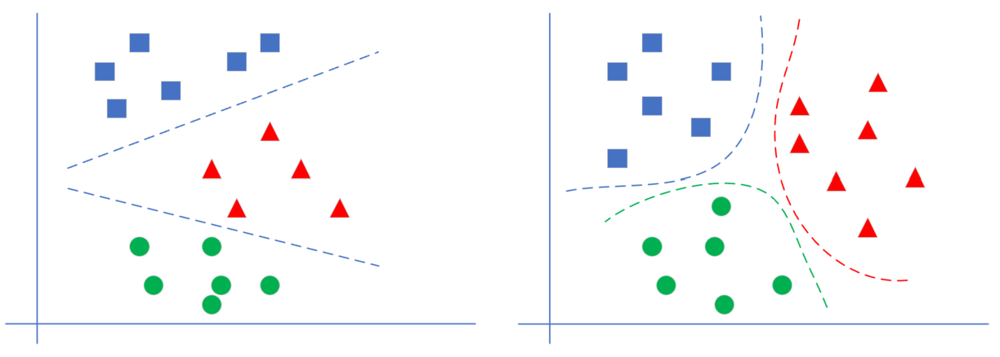

<!--Copyright © Microsoft Corporation. All rights reserved.
  适用于[License](https://github.com/Microsoft/ai-edu/blob/master/LICENSE.md)版权许可-->
  
# 第7章 多入多出的单层神经网路 - 线性多分类

## 7.0 线性多分类问题

### 7.0.1 提出问题

我们解决了公元前的楚汉相争的问题，现在看一下公元220年前后的三国问题。

在数据集中一共有140个样本数据，如表7-1所示。

表7-1 样本数据抽样

|样本序号|$x_1=$经度相对值|$x_2=$纬度相对值|$y=$分类|
|---|---|---|---|
|1|7.033|3.075|3|
|2|4.489|4.869|2|
|3|8.228|9.735|1|
|...|...|...|...|
|140|4.632|9.014|1|

分类标签值的含义：

1. 魏国城池：标签为1，图7-1中蓝色点
2. 蜀国城池：标签为2，图7-1中红色点
3. 吴国城池：标签为3，图7-1中绿色点

图7-1 样本数据可视化

问题：

1. 经纬度相对值为 $(5,1)$ 时，属于哪个国？
2. 经纬度相对值为 $(7,6)$ 时，属于哪个国？
3. 经纬度相对值为 $(5,6)$ 时，属于哪个国？
4. 经纬度相对值为 $(2,7)$ 时，属于哪个国？

### 7.0.2 多分类学习策略

#### 线性多分类和非线性多分类的区别

图7-2显示了线性多分类和非线性多分类的区别。

图7-2 直观理解线性多分类与分线性多分类的区别

左侧为线性多分类，右侧为非线性多分类。它们的区别在于不同类别的样本点之间是否可以用一条直线来互相分割。对神经网络来说，线性多分类可以使用单层结构来解决，而分线性多分类需要使用双层结构。

#### 二分类与多分类的关系

我们已经学习过了使用神经网络做二分类的方法，它并不能用于多分类。在传统的机器学习中，有些二分类算法可以直接推广到多分类，但是在更多的时候，我们会基于一些基本策略，利用二分类学习器来解决多分类问题。

多分类问题一共有三种解法：

1. 一对一方式
   
每次先只保留两个类别的数据，训练一个分类器。如果一共有 $N$ 个类别，则需要训练 $C^2_N$ 个分类器。以 $N=3$ 时举例，需要训练 $A|B，B|C，A|C$ 三个分类器。

图7-3 一对一方式

如图7-3最左侧所示，这个二分类器只关心蓝色和绿色样本的分类，而不管红色样本的情况，也就是说在训练时，只把蓝色和绿色样本输入网络。
   
推理时，$(A|B)$ 分类器告诉你是A类时，需要到 $(A|C)$ 分类器再试一下，如果也是A类，则就是A类。如果 $(A|C)$ 告诉你是C类，则基本是C类了，不可能是B类，不信的话可以到 $(B|C)$ 分类器再去测试一下。

2. 一对多方式
   
如图7-4，处理一个类别时，暂时把其它所有类别看作是一类，这样对于三分类问题，可以得到三个分类器。

图7-4 一对多方式

如最左图，这种情况是在训练时，把红色样本当作一类，把蓝色和绿色样本混在一起当作另外一类。

推理时，同时调用三个分类器，再把三种结果组合起来，就是真实的结果。比如，第一个分类器告诉你是“红类”，那么它确实就是红类；如果告诉你是非红类，则需要看第二个分类器的结果，绿类或者非绿类；依此类推。

3. 多对多方式

假设有4个类别ABCD，我们可以把AB算作一类，CD算作一类，训练一个分类器1；再把AC算作一类，BD算作一类，训练一个分类器2。
    
推理时，第1个分类器告诉你是AB类，第二个分类器告诉你是BD类，则做“与”操作，就是B类。

#### 多分类与多标签

多分类学习中，虽然有多个类别，但是每个样本只属于一个类别。

有一种情况也很常见，比如一幅图中，既有蓝天白云，又有花草树木，那么这张图片可以有两种标注方法：

- 标注为“风景”，而不是“人物”，属于风景图片，这叫做分类
- 被同时标注为“蓝天”、“白云”、“花草”、“树木”等多个标签，这样的任务不叫作多分类学习，而是“多标签”学习，multi-label learning。我们此处不涉及这类问题。
