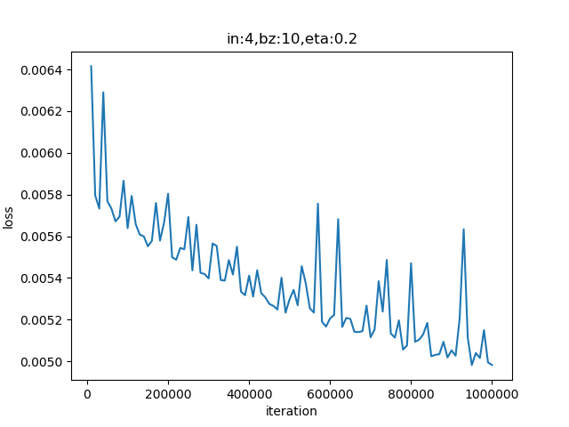
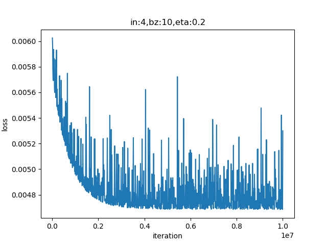
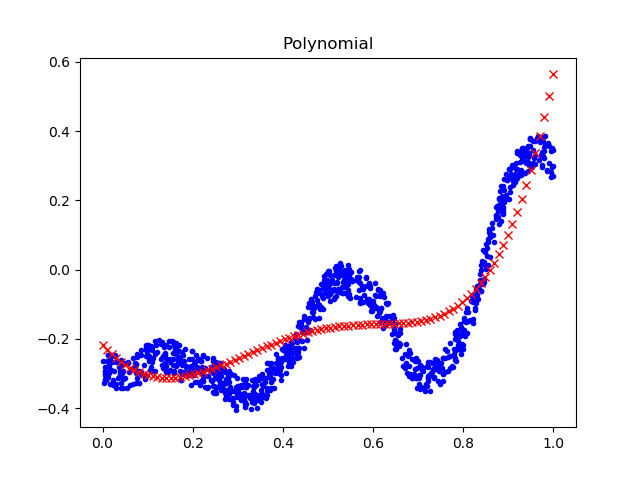
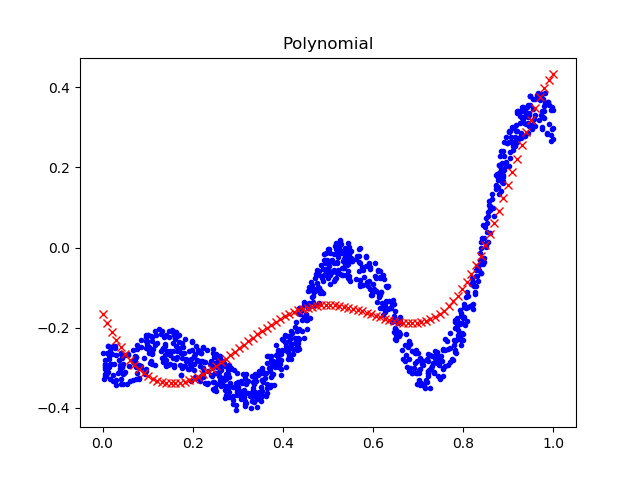

<!--Copyright © Microsoft Corporation. All rights reserved.
  适用于[License](https://github.com/Microsoft/ai-edu/blob/master/LICENSE.md)版权许可-->

## 9.2 用多项式回归法拟合复合函数曲线

还记得我们在本章最开始提出的两个问题吗？在上一节中我们解决了问题一，学习了用多项式拟合正弦曲线，在本节中，我们尝试着用多项式解决问题二，拟合复杂的函数曲线。


图9-4 样本数据可视化

再把图9-4所示的这条“眼镜蛇形”曲线拿出来观察一下，不但有正弦式的波浪，还有线性的爬升，转折处也不是很平滑，所以难度很大。从正弦曲线的拟合经验来看，三次多项式以下肯定无法解决，所以我们可以从四次多项式开始试验。

### 9.2.1 用四次多项式拟合

代码与正弦函数拟合方法区别不大，不再赘述，我们本次主要说明解决问题的思路。

超参的设置情况：

```Python
    num_input = 4
    num_output = 1    
    params = HyperParameters(num_input, num_output, eta=0.2, max_epoch=10000, batch_size=10, eps=1e-3, net_type=NetType.Fitting)
```
最开始设置max_epoch=10,000，运行结果如表9-8所示。

表9-8 四次多项式1万次迭代的训练结果

|损失函数历史|曲线拟合结果|
|---|---|
|||

可以看到损失函数值还有下降的空间，拟合情况很糟糕。以下是打印输出结果：

```
......
9899 99 0.004994434937236122
9999 99 0.0049819495247358375
W= [[-0.70780292]
 [ 5.01194857]
 [-9.6191971 ]
 [ 6.07517269]]
B= [[-0.27837814]]
```

所以我们增加max_epoch到100000再试一次。

表9-9 四次多项式10万次迭代的训练结果

|损失函数历史|曲线拟合结果|
|---|---|
|||

从表9-9中的左图看，损失函数值到了一定程度后就不再下降了，说明网络能力有限。再看下面打印输出的具体数值，在0.005左右是一个极限。

```
......
99899 99 0.004685711600240152
99999 99 0.005299305272730845
W= [[ -2.18904889]
 [ 11.42075916]
 [-19.41933987]
 [ 10.88980241]]
B= [[-0.21280055]]
```

### 9.2.2 用六次多项式拟合

接下来跳过5次多项式，直接用6次多项式来拟合。这次不需要把max_epoch设置得很大，可以先试试50000个epoch。

表9-10 六次多项式5万次迭代的训练结果

|损失函数历史|曲线拟合结果|
|---|---|
|||

打印输出：

```
999 99 0.005154576065966749
1999 99 0.004889156300531125
......
48999 99 0.0047460241904710935
49999 99 0.004669517756696059
W= [[-1.46506264]
 [ 6.60491296]
 [-6.53643709]
 [-4.29857685]
 [ 7.32734744]
 [-0.85129652]]
B= [[-0.21745171]]
```

从表9-10的损失函数历史图看，损失值下降得比较理想，但是实际看打印输出时，损失值最开始几轮就已经是0.0047了，到了最后一轮，是0.0046，并不理想，说明网络能力还是不够。因此在这个级别上，不用再花时间继续试验了，应该还需要提高多项式次数。

### 9.2.3 用八次多项式拟合

再跳过7次多项式，直接使用8次多项式。先把max_epoch设置为50000试验一下。

表9-11 八项式5万次迭代的训练结果

|损失函数历史|曲线拟合结果|
|---|---|
|||

表9-11中损失函数值下降的趋势非常可喜，似乎还没有遇到什么瓶颈，仍有下降的空间，并且拟合的效果也已经初步显现出来了。

再看下面的打印输出，损失函数值已经可以突破0.004的下限了。

```
......
49499 99 0.004086918553033752
49999 99 0.0037740488283595657
W= [[ -2.44771419]
 [  9.47854206]
 [ -3.75300184]
 [-14.39723202]
 [ -1.10074631]
 [ 15.09613263]
 [ 13.37017924]
 [-15.64867322]]
B= [[-0.16513259]]
```

根据以上情况，可以认为8次多项式很有可能得到比较理想的解，所以我们需要增加max_epoch数值，让网络得到充分的训练。好，设置max_epoch=1000000试一下！没错，是一百万次！开始运行后，大家就可以去做些别的事情，一两个小时之后再回来看结果。

表9-12 八项式100万次迭代的训练结果

|损失函数历史|曲线拟合结果|
|---|---|
|||

从表9-12的结果来看，损失函数值还有下降的空间和可能性，已经到了0.0016的水平（从后面的章节中可以知道，0.001的水平可以得到比较好的拟合效果），拟合效果也已经初步呈现出来了，所有转折的地方都可以复现，只是精度不够，相信更多的训练次数可以达到更好的效果。

```
......
998999 99 0.0015935143877633367
999999 99 0.0016124984420510522
W= [[  2.75832935]
 [-30.05663986]
 [ 99.68833781]
 [-85.95142109]
 [-71.42918867]
 [ 63.88516377]
 [104.44561608]
 [-82.7452897 ]]
B= [[-0.31611388]]
```

分析打印出的W权重值，x的原始特征值的权重值比后面的权重值小了一到两个数量级，这与归一化后x的高次幂的数值很小有关系。

至此，我们可以得出结论，多项式回归确实可以解决复杂曲线拟合问题，但是代价有些高，我们训练了一百万次，才得到初步满意的结果。下一节我们将要学习更好的方法。

### 代码位置

ch09, Level3

单层神经网络多项式解决方案都在HelperClass子目录下代码。