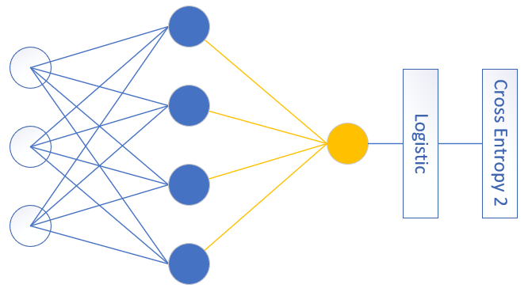

<!--Copyright © Microsoft Corporation. All rights reserved.
  适用于[License](https://github.com/Microsoft/ai-edu/blob/master/LICENSE.md)版权许可-->

## 10.2 非线性二分类实现

### 10.2.1 定义神经网络结构

首先定义可以完成非线性二分类的神经网络结构图，如图10-6所示。

图10-6 非线性二分类神经网络结构图

- 输入层两个特征值$x_1,x_2$
  $$
  X=\begin{pmatrix}
    x_1 & x_2
  \end{pmatrix}
  $$
- 隐层$2\times 2$的权重矩阵$W1$
$$
  W1=\begin{pmatrix}
    w1_{11} & w1_{12} \\\\
    w1_{21} & w1_{22} 
  \end{pmatrix}
$$
- 隐层$1\times 2$的偏移矩阵$B1$

$$
  B1=\begin{pmatrix}
    b1_{1} & b1_{2}
  \end{pmatrix}
$$

- 隐层由两个神经元构成
$$
Z1=\begin{pmatrix}
  z1_{1} & z1_{2}
\end{pmatrix}
$$
$$
A1=\begin{pmatrix}
  a1_{1} & a1_{2}
\end{pmatrix}
$$
- 输出层$2\times 1$的权重矩阵$W2$
$$
  W2=\begin{pmatrix}
    w2_{11} \\\\
    w2_{21}  
  \end{pmatrix}
$$

- 输出层$1\times 1$的偏移矩阵$B2$

$$
  B2=\begin{pmatrix}
    b2_{1}
  \end{pmatrix}
$$

- 输出层有一个神经元使用Logistic函数进行分类
$$
  Z2=\begin{pmatrix}
    z2_{1}
  \end{pmatrix}
$$
$$
  A2=\begin{pmatrix}
    a2_{1}
  \end{pmatrix}
$$

对于一般的用于二分类的双层神经网络可以是图10-7的样子。

图10-7 通用的二分类神经网络结构图

输入特征值可以有很多，隐层单元也可以有很多，输出单元只有一个，且后面要接Logistic分类函数和二分类交叉熵损失函数。

### 10.2.2 前向计算

根据网络结构，我们有了前向计算过程图10-8。

图10-8 前向计算过程

#### 第一层

- 线性计算

$$
z1_{1} = x_{1} w1_{11} + x_{2} w1_{21} + b1_{1}
$$
$$
z1_{2} = x_{1} w1_{12} + x_{2} w1_{22} + b1_{2}
$$
$$
Z1 = X \cdot W1 + B1
$$

- 激活函数

$$
a1_{1} = Sigmoid(z1_{1})
$$
$$
a1_{2} = Sigmoid(z1_{2})
$$
$$
A1=\begin{pmatrix}
  a1_{1} & a1_{2}
\end{pmatrix}=Sigmoid(Z1)
$$

#### 第二层

- 线性计算

$$
z2_1 = a1_{1} w2_{11} + a1_{2} w2_{21} + b2_{1}
$$
$$
Z2 = A1 \cdot W2 + B2
$$

- 分类函数

$$a2_1 = Logistic(z2_1)$$
$$A2 = Logistic(Z2)$$

#### 损失函数

我们把异或问题归类成二分类问题，所以使用二分类交叉熵损失函数：

$$
loss = -Y \ln A2 + (1-Y) \ln (1-A2) \tag{12}
$$

在二分类问题中，$Y,A2$都是一个单一的数值，而非矩阵，但是为了前后统一，我们可以把它们看作是一个$1\times 1$的矩阵。

### 10.2.3 反向传播

图10-9展示了反向传播的过程。

图10-9 反向传播过程

#### 求损失函数对输出层的反向误差

对损失函数求导，可以得到损失函数对输出层的梯度值，即图10-9中的$Z2$部分。

根据公式12，求$A2$和$Z2$的导数（此处$A2,Z2,Y$可以看作是标量，以方便求导）：

$$
\begin{aligned}
\frac{\partial loss}{\partial Z2}&=\frac{\partial loss}{\partial A2}\frac{\partial A2}{\partial Z2} \\\\
&=\frac{A2-Y}{A2(1-A2)} \cdot A2(1-A2) \\\\
&=A2-Y \rightarrow dZ2
\end{aligned}
\tag{13}
$$

#### 求$W2$和$B2$的梯度

$$
\begin{aligned}
\frac{\partial loss}{\partial W2}&=\begin{pmatrix}
  \frac{\partial loss}{\partial w2_{11}} \\\\
  \frac{\partial loss}{\partial w2_{21}}
\end{pmatrix}
=\begin{pmatrix}
  \frac{\partial loss}{\partial Z2}\frac{\partial z2}{\partial w2_{11}} \\\\
  \frac{\partial loss}{\partial Z2}\frac{\partial z2}{\partial w2_{21}}
\end{pmatrix}
\\\\
&=\begin{pmatrix}
  dZ2 \cdot a1_{1} \\\\
  dZ2 \cdot a1_{2} 
\end{pmatrix}
=\begin{pmatrix}
  a1_{1} \\\\ a1_{2}
\end{pmatrix}dZ2
\\\\
&=A1^{\top} \cdot dZ2 \rightarrow dW2  
\end{aligned}
\tag{14}
$$
$$\frac{\partial{loss}}{\partial{B2}}=dZ2 \rightarrow dB2 \tag{15}$$

#### 求损失函数对隐层的反向误差

$$
\begin{aligned}  
\frac{\partial{loss}}{\partial{A1}} &= \begin{pmatrix}
  \frac{\partial loss}{\partial a1_{1}} & \frac{\partial loss}{\partial a1_{2}} 
\end{pmatrix}
\\\\
&=\begin{pmatrix}
\frac{\partial{loss}}{\partial{Z2}} \frac{\partial{Z2}}{\partial{a1_{1}}} & \frac{\partial{loss}}{\partial{Z2}}  \frac{\partial{Z2}}{\partial{a1_{2}}}  
\end{pmatrix}
\\\\
&=\begin{pmatrix}
dZ2 \cdot w2_{11} & dZ2 \cdot w2_{21}
\end{pmatrix}
\\\\
&=dZ2 \cdot \begin{pmatrix}
  w2_{11} & w2_{21}
\end{pmatrix}
\\\\
&=dZ2 \cdot W2^{\top}
\end{aligned}
\tag{16}
$$

$$
\frac{\partial A1}{\partial Z1}=A1 \odot (1-A1) \rightarrow dA1\tag{17}
$$

所以最后到达$Z1$的误差矩阵是：

$$
\begin{aligned}
\frac{\partial loss}{\partial Z1}&=\frac{\partial loss}{\partial A1}\frac{\partial A1}{\partial Z1}
\\\\
&=dZ2 \cdot W2^{\top} \odot dA1 \rightarrow dZ1 
\end{aligned}
\tag{18}
$$

有了$dZ1$后，再向前求$W1$和$B1$的误差，就和第5章中一样了，我们直接列在下面：

$$
dW1=X^{\top} \cdot dZ1 \tag{19}
$$
$$
dB1=dZ1 \tag{20}
$$
