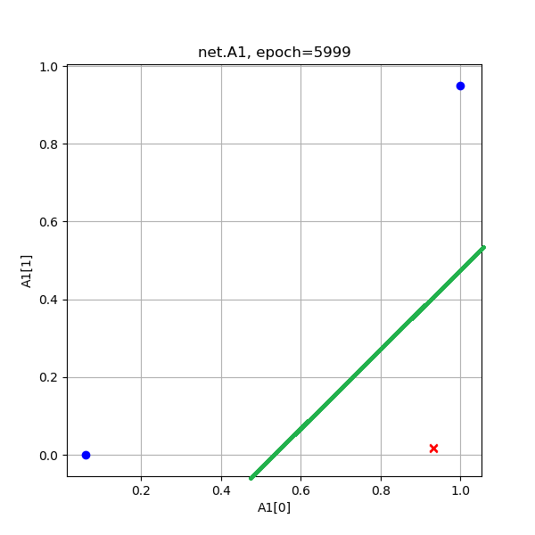
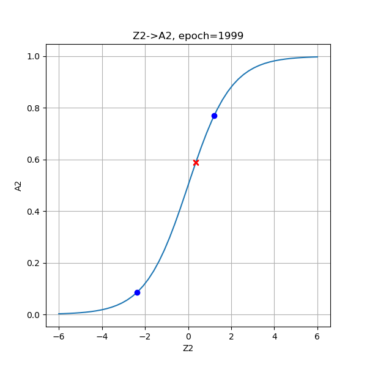
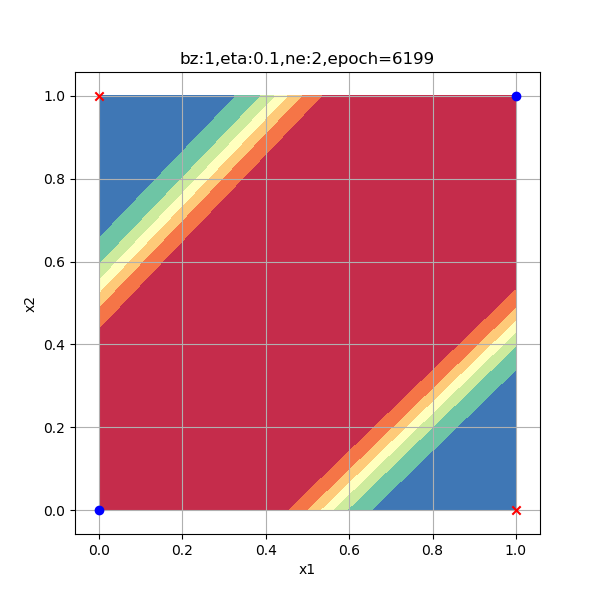
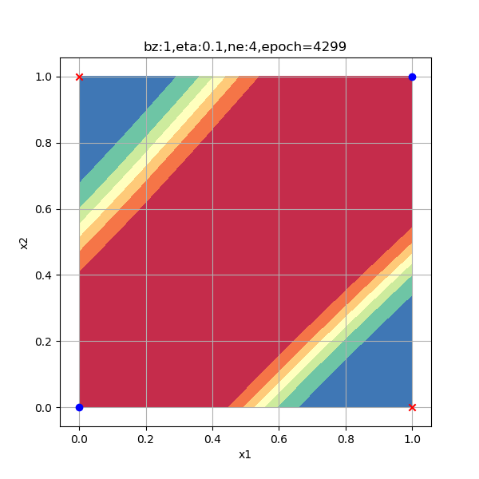

<!--Copyright © Microsoft Corporation. All rights reserved.
  适用于[License](https://github.com/Microsoft/ai-edu/blob/master/LICENSE.md)版权许可-->

## 10.4 逻辑异或门的工作原理

上一节课的内容从实践上证明了两层神经网络是可以解决异或问题的，下面让我们来理解一下神经网络在这个异或问题的上工作原理，此原理可以扩展到更复杂的问题空间，但是由于高维空间无法可视化，给我们的理解带来了困难。

### 10.4.1 可视化分类结果

为了辅助理解异或分类的过程，我们增加一些可视化函数来帮助理解。

#### 显示原始数据

```Python
import numpy as np
from pathlib import Path
import matplotlib.pyplot as plt

from Level1_XorGateClassifier import *

def ShowSourceData(dataReader):
    DrawSamplePoints(dataReader.XTrain[:,0],dataReader.XTrain[:,1],dataReader.YTrain, "XOR Source Data", "x1", "x2")

def DrawSamplePoints(x1, x2, y, title, xlabel, ylabel, show=True):
    assert(x1.shape[0] == x2.shape[0])
    fig = plt.figure(figsize=(6,6))
    count = x1.shape[0]
    for i in range(count):
        if y[i,0] == 0:
            plt.scatter(x1[i], x2[i], marker='^', color='r', s=200, zorder=10)
        else:
            plt.scatter(x1[i], x2[i], marker='o', color='b', s=200, zorder=10)
        #end if
    #end for
    plt.grid()
    plt.title(title)
    plt.xlabel(xlabel)
    plt.ylabel(ylabel)
    if show:
        plt.show()
```

1. 首先是从Level_XorGateClassifier中导入所有内容，省去了我们重新写数据准备部分的代码的麻烦
2. 获得所有分类为1的训练样本，用红色叉子显示在画板上
3. 获得所有分类为0的训练样本，用蓝色圆点显示在画板上

由此我们会得到样本如图10-11所示。


图10-11 异或样本数据

异或问题的四个点分布在[0,1]空间的四个角上，红色点是正类，蓝色点是负类。

#### 显示推理的中间结果

由于是双层神经网络，回忆一下其公式：$Z1 = X \cdot W1 +B1,A1=Sigmoid(Z1),Z2=A1 \cdot W2+B2,A2=Logistic(A2)$，所以会有$Z1,A1,Z2,A2$等中间运算结果。我们把它们用图形方式显示出来帮助读者理解推理过程。

```Python
def ShowProcess2D(net, dataReader):
    net.inference(dataReader.XTest)
    # show z1    
    DrawSamplePoints(net.Z1[:,0], net.Z1[:,1], dataReader.YTest, "net.Z1", "Z1[0]", "Z1[1]")
    # show a1
    DrawSamplePoints(net.A1[:,0], net.A1[:,1], dataReader.YTest, "net.A1", "A1[0]", "A1[1]")
    # show sigmoid
    DrawSamplePoints(net.Z2, net.A2, dataReader.YTrain, "Z2->A2", "Z2", "A2", show=False)
    x = np.linspace(-6,6)
    a = Sigmoid().forward(x)
    plt.plot(x,a)
    plt.show()
```

1. 先用测试样本做一次推理；
2. Z1是第一层神经网络线性变换的结果，由于Z1是一个4行两列的数组，我们以Z1的第1列作为x1，以Z1的第2列作为x2，画出4个点来；
3. A1是Z1经过激活函数后的结果，同Z1一样作为4个点画出来；
4. Z2是第二层神经网络线性变换的结果，A2是Z2的Logistic Function的运算结果，以Z2为x1，A2为x2，画出4个点来，并叠加Logistic函数图像，看是否吻合。

于是我们得到下面三张图，放入表10-8中（把原始图作为对比，放在第一个位置）。

表10-8 XOR问题的推理过程

|||
|---|---|
|||
|原始样本|Z1是第一层网络线性计算结果|
|||
|A1是Z1的激活函数计算结果|Z2是第二层线性计算结果，A2是二分类结果|

- Z1：通过线性变换，把原始数据红色点移动到两个对角上，把蓝色点向中心移动，接近重合。图中的蓝色点看上去好像是一个点，实际上是两个点重合在了一起，可以通过在原画板上放大的方式来看细节
- A1：通过Sigmoid运算，把Z1的值压缩到了[0,1]空间内，使得红色点的坐标向[0,1]和[1,0]接近，蓝色点的坐标向[0,0]靠近
- Z2->A2：再次通过线性变换，把两类点都映射到横坐标轴上，并把红点向负方向移动，并把蓝点向正方向移动，再Logistic分类，把两类样本点远远地分开到[0,1]的两端，从而完成分类任务

我们把中间计算结果显示在表10-9中，便于观察比较。

表10-9 中间计算结果

||1（蓝点1）|2（红点1）|3（红点2）|4（蓝点2）|
|---|---|---|---|---|
|x1|0|0|1|1|
|x2|0|1|0|1|
|y|0|1|1|0|
|Z1|2.868856|-4.142354|-4.138914|-11.150125|
||-8.538638|-3.024127|-3.023451|2.491059|
|A1|0.946285|0.015637|0.015690|0.000014|
||0.000195|0.046347|0.046377|0.923512|
|Z2|-5.458510|5.203479|5.202473|-5.341711|
|A2|0.004241|0.994532|0.994527|0.004764|

#### 显示最后结果

到目前位置，我们只知道神经网络完成了异或问题，但它究竟是如何画分割线的呢？

也许读者还记得在第四步中学习线性分类的时候，我们成功地通过公式推导画出了分割直线，但是这一次不同了，这里使用了两层神经网络，很难再通过公式推导来解释W和B权重矩阵的含义了，所以我们换个思路。

思考一下，神经网络最后是通过什么方式判定样本的类别呢？在前向计算过程中，最后一个公式是Logistic函数，它把$(-\infty, +\infty)$压缩到了(0,1)之间，相当于计算了一个概率值，然后通过概率值大于0.5与否，判断是否属于正类。虽然异或问题只有4个样本点，但是如果：

1. 我们在[0,1]正方形区间内进行网格状均匀采样，这样每个点都会有坐标值；
2. 再把坐标值代入神经网络进行推理，得出来的应该会是一个网格状的结果；
3. 每个结果都是一个概率值，肯定处于(0,1)之间，所以不是大于0.5，就是小于0.5；
4. 我们把大于0.5的网格涂成粉色，把小于0.5的网格涂成黄色，就应该可以画出分界线来了。

好，有了这个令人激动人心的想法，我们立刻实现：

```Python
def ShowResult2D(net, dr, title):
    print("please wait for a while...")
    DrawSamplePoints(dr.XTest[:,0], dr.XTest[:,1], dr.YTest, title, "x1", "x2", show=False)
    count = 50
    x1 = np.linspace(0,1,count)
    x2 = np.linspace(0,1,count)
    for i in range(count):
        for j in range(count):
            x = np.array([x1[i],x2[j]]).reshape(1,2)
            output = net.inference(x)
            if output[0,0] >= 0.5:
                plt.plot(x[0,0], x[0,1], 's', c='m', zorder=1)
            else:
                plt.plot(x[0,0], x[0,1], 's', c='y', zorder=1)
            # end if
        # end for
    # end for
    plt.title(title)
    plt.show()
```

在上面的代码中，横向和竖向各取了50个点，形成一个50x50的网格，然后依次推理，得到output值后染色。由于一共要计算2500次，所以花费的时间稍长，我们打印"please wait for a while..."让程序跑一会儿。最后得到图10-12。


图10-12 分类结果的分割图

第一次看到这张图是不是很激动！从此我们不再靠画线过日子了，而是上升到了染色的层次！请忽略图中的锯齿，因为我们取了50x50的网格，所以会有马赛克，如果取更密集的网格点，会缓解这个问题，但是计算速度要慢很多倍。

可以看到，两类样本点被分在了不同颜色的区域内，这让我们恍然大悟，原来神经网络可以同时画两条分割线的，更准确的说法是“可以画出两个分类区域”。

### 10.4.2 更直观的可视化结果

#### 3D图

神经网络真的可以同时画两条分割线吗？这颠覆了笔者的认知，因为笔者一直认为最后一层的神经网络只是一个线性单元，它能做的事情有限，所以它的行为就是线性的行为，画一条线做拟合或分割，......，稍等，为什么只能是一条线呢？难道不可以是一个平面吗？

这让笔者想起了在第5章里，曾经用一个平面拟合了空间中的样本点，如表10-10所示。

表10-10 平面拟合的可视化结果

|正向|侧向|
|---|---|
|||

那么这个异或问题的解是否可能是个立体空间呢？有了这个更激动人心的想法，我们立刻写代码：

```Python
def Prepare3DData(net, count):
    x = np.linspace(0,1,count)
    y = np.linspace(0,1,count)
    X, Y = np.meshgrid(x, y)
    Z = np.zeros((count, count))
    input = np.hstack((X.ravel().reshape(count*count,1),Y.ravel().reshape(count*count,1)))
    output = net.inference(input)
    Z = output.reshape(count,count)
    return X,Y,Z

def ShowResult3D(net, dr):
    fig = plt.figure(figsize=(6,6))
    ax = Axes3D(fig)
    X,Y,Z = Prepare3DData(net, 50)
    ax.plot_surface(X,Y,Z,cmap='rainbow')
    ax.set_zlim(0,1)
    # draw sample data in 3D space
    for i in range(dr.num_train):
        if dataReader.YTrain[i,0] == 0:
            ax.scatter(dataReader.XTrain[i,0],dataReader.XTrain[i,1],dataReader.YTrain[i,0],marker='^',c='r',s=200)
        else:
            ax.scatter(dataReader.XTrain[i,0],dataReader.XTrain[i,1],dataReader.YTrain[i,0],marker='o',c='b',s=200)

    plt.show()
```

函数Prepare3DData()用于准备一个三维坐标系内的数据：

1. x坐标在[0,1]空间分成50份
2. y坐标在[0,1]空间分成50份
3. np.meshgrid(x,y)形成网格式点阵X和Y，它们各有2500个记录，每一行的X必须和对应行的Y组合使用形成网点
4. np.hstack()把X,Y合并成2500x2的样本矩阵
5. net.inference()做推理，得到结果output
6. 把结果再转成50x50的形状并赋值给Z，与X、Y的50x50的网格点匹配
7. 最后返回三维点阵XYZ
8. 函数ShowResult3D()使用ax.plot_surface()函数绘制空间曲面
9. 然后在空间中绘制4个样本点，X和Y值就是原始的样本值x1和x2，Z值是原始的标签值y，即0或1

最后得到表10-11的结果。

表10-11 异或分类结果可视化

|斜侧视角|顶视角|
|---|---|
|||

这下子我们立刻就明白了神经网络都做了些什么事情：它通过样本点，推算出了平面上每个坐标点的分类结果概率，形成空间曲面，然后拦腰一刀（一个切面），这样神经网络就可以在Z=0.5出画一个平面，完美地分开对角顶点。如果看顶视图，与我们在前面生成的2D区域染色图极为相似，它的红色区域的概率值接近于1，蓝色区域的概率值接近于0，在红蓝之间的颜色，代表了从0到1的渐变值。

平面上分割两类的直线，只是我们的想象：使用0.5为门限值像国界一样把两部分数据分开。但实际上，神经网络的输出是个概率，即，它可以告诉你某个点属于某个类别的概率是多少，我们人为地设定为当概率大于0.5时属于正类，小于0.5时属于负类。在空间曲面中，可以把过渡区也展示出来，让大家更好地理解。

#### 2.5D图

3D图虽然有趣，但是2D图已经能表达分类的意思了，只是不完美，那我们想办法做一个2.5D图吧。

```Python
def ShowResultContour(net, dr):
    DrawSamplePoints(dr.XTrain[:,0], dr.XTrain[:,1], dr.YTrain, "classification result", "x1", "x2", show=False)
    X,Y,Z = Prepare3DData(net, 50)
    plt.contourf(X, Y, Z, cmap=plt.cm.Spectral)
    plt.show()
```

在二维平面上，可以通过plt.contourf()函数画出着色的等高线图，Z作为等高线高度，可以得到图10-13。


图10-13 分类结果的等高线图

2.5D图通过颜色来表示不同区域的概率值，可以看到红色区和蓝色区分别是概率接近于0和1的区域，对应着两类样本点。我们后面将会使用这种方式继续研究分类问题。

但是神经网络真的可以聪明到用升维的方式来解决问题吗？我们只是找到了一种能自圆其说的解释，但是不能确定神经网络就是这样工作的。下面我们会通过探查神经网络的训练过程，来理解它究竟是怎样学习的。

### 10.4.3 探查训练的过程

随着迭代次数的增加，对异或二分类问题的分类结果也越来越精确，我们不妨观察一下训练过程中的几个阶段，来试图理解神经网络的训练过程。

在下面的试验中，我们指定500、2000、6000三个迭代次数，来查看各个阶段的分类情况。

表10-12 异或分类训练过程中Z1和A1的值的演变

|迭代次数|Z1的演变|A1的演变|
|---|---|---|
|500次|||
|2000次|||
|6000次|||

从上图Z1演变过程看，神经网络试图使得两个红色的点重合，而两个蓝色的点距离越远越好，但是中心对称的。

从A1的演变过程看，和Z1差不多，但最后的目的是使得红色点处于[0,1]空间两个顶点（和原始数据一样的位置），蓝色点重合于一个角落。从A1的演变过程最后一张图来看，两个红色点已经被挤压到了一起，所以完全可以有一根分割线把二者分开，如图10-14所示。



图10-14 经过空间变换后的两类样本数据

也就是说到了这一步，神经网络已经不需要做升维演算了，在二维平面上就可以解决分类问题了。从笔者个人的观点出发，更愿意相信这才是神经网络的工作原理。

下面我们再看看最后的分类结果的演变过程，如表10-13所示。

表10-13 异或分类训练过程中分类函数值和结果的演变

|迭代次数|分类函数值的演变|分类结果的演变|
|---|---|---|
|500次|||
|2000次|||
|6000次|||

从分类函数情况看，开始时完全分不开两类点，随着学习过程的加深，两类点逐步地向两端移动，直到最后尽可能地相距很远。从分类结果的2.5D图上，可以看出这个方形区域内的每个点的概率变化，由于样本点的对称分布，最后形成了带状的概率分布图。

### 10.4.4 隐层神经元数量的影响

一般来说，隐层的神经元数量要大于等于输入特征的数量，在本例中特征值数量是2。出于研究目的，笔者使用了6种数量的神经元配置来试验神经网络的工作情况，请看表10-14中的比较图。

表10-14 隐层神经元数量对分类结果的影响

|||
|---|---|
|||
|1个神经元，无法完成分类任务|2个神经元，迭代6200次到达精度要求|
|||
|3个神经元，迭代4900次到达精度要求|4个神经元，迭代4300次到达精度要求|
|||
|8个神经元，迭代4400次到达精度要求|16个神经元，迭代4500次到达精度要求|

以上各情况的迭代次数是在Xavier初始化的情况下测试一次得到的数值，并不意味着神经元越多越好，合适的数量才好。总结如下：

- 2个神经元肯定是足够的；
- 4个神经元肯定要轻松一些，用的迭代次数最少。
- 而更多的神经元也并不是更轻松，比如8个神经元，杀鸡用了宰牛刀，由于功能过于强大，出现了曲线的分类边界；
- 而16个神经元更是事倍功半地把4个样本分到了4个区域上，当然这也给了我们一些暗示：神经网络可以做更强大的事情！
- 表中图3的分隔带角度与前面几张图相反，但是红色样本点仍处于蓝色区，蓝色样本点仍处于红色区，这个性质没有变。这只是初始化参数不同造成的神经网络的多个解，与神经元数量无关。

### 代码位置

ch10, Level2
