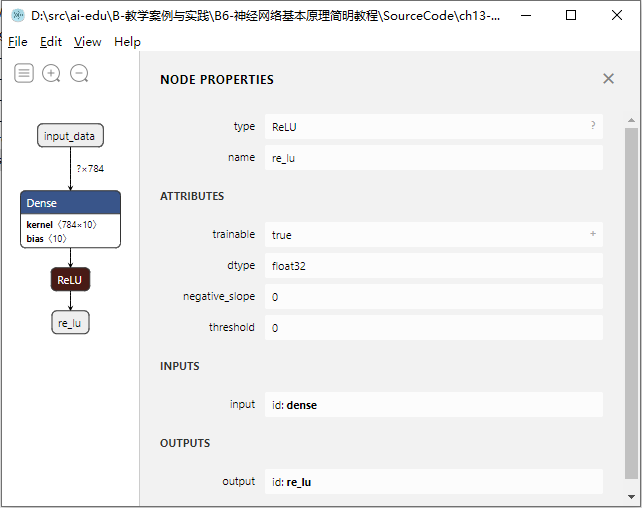

<!--Copyright © Microsoft Corporation. All rights reserved.
  适用于[License](https://github.com/Microsoft/ai-edu/blob/master/LICENSE.md)版权许可-->

## 13.1 模型文件概述

上一节中重复使用了保存过的权重矩阵，省去了重新训练的过程，但是不难发现还有一些其它的问题。

比如说，加载权重矩阵之前要先搭建网络，而且要和训练时的网络结构一致。所以，网络结构最好也可以像权重矩阵一样保存下来，在需要使用的时候进行加载。

实际上，几乎所有的训练平台也是这么做的，会把网络结构、权重矩阵等信息保存在文件中，这就是我们常说的模型文件，后面也直接简称为模型。

### 13.1.1 模型文件快问快答

下面我们通过快问快答的形式了解下模型文件。

**1. 为什么需要模型文件？**

如今人工智能发展的越来越快，在图像分析、自然语言处理、语音识别等领域都有着令人惊喜的效果。而模型，可以想象为一个“黑盒”，输入是你需要处理的一张图像，输出是一个它的类别信息或是一些特征，模型文件也因此保存了能完成这一过程的所有重要信息，并且还能用来再次训练、推理等，方便了模型的传播与发展。

**2. 模型文件描述的是什么？**

首先我们需要了解，目前绝大部分的深度学习框架都将整个AI模型的计算过程抽象成数据流图（Data Flow Graphs），用户写的模型构建代码都由框架组建出一个数据流图（也可以简单理解为神经网络的结构），而当程序开始运行时，框架的执行器会根据调度策略依次执行数据流图，完成整个计算。

当有了这个背景知识后，我们很容易想到，为了方便地重用AI模型的计算过程，我们需要将它运行的数据流图、相应的运行参数（Parameters）和训练出来的权重（Weights）保存下来，这就是AI模型文件主要描述的内容。

**3. AI模型的作用是什么？**

以视觉处理为例，人通过眼睛捕获光线，传递给大脑处理，返回图像的一些信息，比如，这是花，是动物。AI模型的作用就相当于大脑的处理，能根据输入的数据给予一定的判断。使用封装好的AI模型，那么设计者只需要考虑把输入的数据处理成合适的格式（类似于感光细胞的作用），然后传递给AI模型（大脑），之后就可以得到一个想要的输出。

**4. 模型文件有哪些类型，TensorFlow和其他框架的有什么区别？**

由于每个深度学习框架都有自己的设计理念和工具链，对数据流图的定义和粒度都不一样，所以每家的AI模型文件都有些区别，几乎不能通用。例如，TensorFlow的Checkpoint Files用Protobuf去保存数据流图，用SSTable去保存权重；Keras用Json表述数据流图而用h5py去保存权重；PyTorch由于是主要聚焦于动态图计算，模型文件甚至只用pickle保存了权重而没有完整的数据流图。

TensorFlow在设计之初，就考虑了从训练、预测、部署等复杂的需求，所以它的数据流图几乎涵盖了整个过程可能涉及到操作，例如初始化、后向求导及优化算法、设备部署（Device Placement）和分布式化、量化压缩等，所以只需要通过TensorFlow的模型文件就能够获取模型完整的运行逻辑，所以很容易迁移到各种平台使用。

**5. 我拿到了别人的一个模型文件，我自己有一些新的数据，就能继续训练AI么？如果不能，还差什么呢？**

训练模型的时候，除了网络架构和权重，还有训练时所使用的各种超参，比如使用的优化器（Optimizer）、批量大小（Batch size）、学习率（Learning rate）、冲量（Momentum）等，这些都会影响我们再训练的效果，需要格外注意。

比如Caffe的记录模型结构的文件会分为`train_val.prototxt`和`inference.prototxt`。首先，`train_val.prototxt`文件是网络结构及训练的配置文件，在训练时使用，而`inference.prototxt`在测试与部署时使用。因此，像网络结构部分，如：name，type，top，input_param等，两个文件都需要用到，在两个文件中都进行了保存；而一些训练部分的参数，如：max_iter（训练集一共要过多少次网络），lr_policy（使用的学习率方法）等，只在训练使用的模型文件中保存。

**6. ONNX文件是什么，如何保存为ONNX文件?**

开放式神经网络交换（Open Neural Network Exchange，简称ONNX）是由微软、FaceBook、亚马逊等多个公司一起推出的，针对机器学习设计的开放式文件格式，可以用来存储训练好的模型。它使得不同的人工智能框架可以采用相同格式存储模型数据并交互。

目前很多机器学习框架都支持ONNX格式，如PyTorch、Caffe2、CNTK、ML.NET、MXNet等，它们都有专门的export_to_onnx方法，通过遍历它们原生的数据流图，转化为ONNX标准的数据流图。而对于TensorFlow这样并不原生支持ONNX的框架，通常会使用图匹配（Graph Matching）的方式转化数据流图。

**7. 转化得来的模型文件有什么信息丢失么？**

由于模型文件仅仅描述了数据流图和权重，并不包含操作符（Op）的具体实现，所以不同框架对于“同名”的操作符理解和实现也会有所不同（例如不同框架的Conv/Pool Padding方式），最终有可能得到不完全一致的推理结果。

**8. 模型文件是如何与应用程序一起工作的？**

应用程序使用模型文件，本质也是要执行模型文件的数据流图。一般有两种方式实现模型文件和应用程序的协作：如果有可以独立执行模型文件的运行时（Runtime），例如系统级别的CoreML、WinML和软件级别的Caffe、DarkNet等，我们就可以在程序中动态链接直接使用；除此以外，我们也可以将数据流图和执行数据流图的程序（一般称为Op Kernel）编译在一起，从而脱离运行时，由于单一模型涉及到的操作有限，这样可以极大减少框架所占用的资源。

在将模型集成到应用程序中前，应该先使用模型查看工具（如Netron等）查看模型的接口、输入输出的格式和对应的范围，然后对程序中传入模型的输入作对应的预处理工作，否则可能无法得到预期的效果。

**9. 如果我本地机器有GPU，那么我在运行推理模型的时候，怎么能利用上本地的资源呢？**

首先需要安装匹配的显卡驱动、CUDA和GPU版的框架，然后根据框架进行代码调整：对于TensorFlow这样能够自动做设备部署（Device Placement）的框架，它会尽量把GPU支持的操作自动分配给GPU计算，不太需要额外的适配；对于PyTorch、MXNet这样不具有自动设备部署功能的框架，可能需要进行一个额外的操作将模型、张量（Tensor）从CPU部署到GPU上。

**10. 模型文件有单元测试来保证质量标准么？**

在机器学习领域，混淆矩阵又称为可能性表格或是错误矩阵。它是一种特定的矩阵，其每一列代表预测值，每一行代表的是实际的类别。它可以用来呈现算法性能的可视化效果，通常被用来显示监督学习的效果（非监督学习通常用匹配矩阵：matching matrix）。混淆矩阵的名字来源于它可以非常容易的表明多个类别是否有混淆，也就是一种类别是否被预测成另一类别。图13-4是混淆矩阵可视化的效果。


图13-4 混淆矩阵可视化

那么我们为什么需要它呢？比如说，程序员们训练了一轮模型，经过测试，该模型在大部分测试样例上表现的很好，但有个别的表现不好。于是经过了对不好的样例的分析，对模型进行调整和重新训练。也许重新训练后在这些特定的例子上准确率已经很高，但是我们无法确认，新的模型是否在原来已经预测很准确的例子上仍然表现良好。这时就引入了混淆矩阵，可以直观的可视化模型的质量。

**11. 如果一个模型文件已经集成到一个应用程序中发布到了很多用户那里， 这时候我们又训练出了一个新的模型，怎么更新众多的应用达到持续开发和持续集成的效果呢？**

如果应用程序是依赖额外的运行来使用模型，只需要更新模型文件就可以了；如果是使用的模型和Kernel编译在一起的方式，就需要重新编译程序。

### 13.1.2 查看模型文件

通过前面的快问快答，我们对模型文件有了一个直观的认识。做一个简单的回忆，模型文件描述了什么？如何把深度学习模型和应用程序结合起来？在这个过中需要注意些什么？

如果全部记住了，那么恭喜你！你已经对神经网络模型有了一个很好的认识了！如果没有，也不要着急，下面我们会用一个例子，来分析我们上面提到的模型文件内容。

为了阐述的方便，我们用`TensorFlow`的`Keras`封装，快速生成一个简单的模型，这个模型由一个全连接层和一个ReLU激活层组成，其中全连接层在`Keras`中也叫`Dense`层。

```python
from tensorflow import keras

inputs = keras.Input(shape=(784,), name='input_data')
dense_result = keras.layers.Dense(10)(inputs)
outputs = keras.layers.ReLU()(dense_result)

model = keras.Model(inputs=inputs, outputs=outputs, name='simple_model')
model.save('simple_model.h5')
```

在这份代码中，首先定义了尺寸为784的输入数据，可以理解为是尺寸为$28\times 28$的单通道图片，比如MNIST数据集的图片。然后让输入数据经过一层`Dense`层，设置该层的输出尺寸为10。最后经过一层`ReLU`激活，得到最终的输出。代码中甚至没有给这个神经网络进行训练，就直接进行了保存。

接下来，我们可以使用开源工具[Netron](https://github.com/lutzroeder/netron)打开模型文件，看一下模型文件里描述了哪些信息。

打开模型后，首先可以看到模型的整体网络结构，点击输入节点，还可以查看整个模型的属性及输入输出，如图13-5所示。


图13-5 模型的结构及属性

这里使用的网络非常简单，可以看到图13-5中一共有4个节点：输入节点、`Dense`层、`ReLU`层、输出节点，和我们代码中定义的一致。

在模型属性中可以看到该模型文件的格式是`Keras v2.2.4-tf`，同时指明了对应的运行时为`tensorflow`，这样使用者就可以知道运行该模型需要什么样的环境。同时还可以看到模型需要的输入为`float32[?,784]`，这里的784指每个输入的尺寸，`?`号表示该模型支持批量推理，可以一次性推理多个输入。

点击`Dense`节点，可以查看该节点的属性，如图13-6所示。`Dense`层就是前面章节中我们用过的全连接层，有一点不一样的是，`Keras`中的`Dense`可以将激活函数内置在该层中，就是图13-6中的`activation`属性，这里为了例子的方便，没有在`Dense`中使用激活。属性中还可以看到该层的权重矩阵使用了`GlorotUniform`初始化，这其实是Xavier初始化的另一个名字，而偏置矩阵使用了零初始化，后面的章节中会对各种初始化方法做详细的介绍。另外，展开权重和偏置，还可以看到模型文件保存的具体的参数值，由于代码中只进行了初始化但是没有进行训练，所以可以看到偏置的值全部是0。


图13-6 Dense层的属性

点击`ReLU`节点，可以查看激活层的属性，如图13-7所示。`ReLU`层中有两个比较特殊的参数，`negative_slope`控制的是负区间的斜率，如果不为零，那么`ReLU`就变成了`LeakeReLU`；`threshold`控制的是`ReLU`在输入值超过哪个阈值时才开始激活。如果这两个值都为0，那么它和前面章节中讲到的`ReLU`就完全一致。



图13-7 ReLU层的属性

**代码位置**

ch13, Level2
