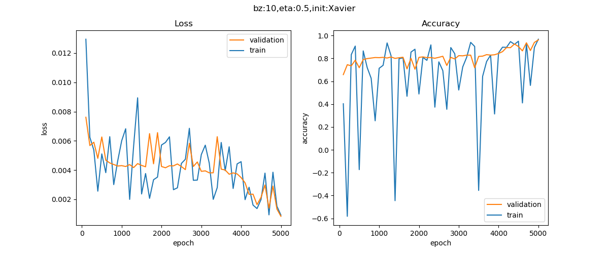

<!--Copyright © Microsoft Corporation. All rights reserved.
  适用于[License](https://github.com/Microsoft/ai-edu/blob/master/LICENSE.md)版权许可-->

## 14.1 回归任务功能测试

在第九章中，我们用一个两层的神经网络，验证了万能近似定理。当时是用hard code方式写的，现在我们用迷你框架来搭建一下。

### 14.1.1 搭建模型

这个模型很简单，一个双层的神经网络，第一层后面接一个Sigmoid激活函数，第二层直接输出拟合数据，如图14-2所示。


图14-2 完成拟合任务的抽象模型

```Python
def model():
    dataReader = LoadData()
    num_input = 1
    num_hidden1 = 4
    num_output = 1

    max_epoch = 10000
    batch_size = 10
    learning_rate = 0.5

    params = HyperParameters_4_0(
        learning_rate, max_epoch, batch_size,
        net_type=NetType.Fitting,
        init_method=InitialMethod.Xavier,
        stopper=Stopper(StopCondition.StopLoss, 0.001))

    net = NeuralNet_4_0(params, "Level1_CurveFittingNet")
    fc1 = FcLayer_1_0(num_input, num_hidden1, params)
    net.add_layer(fc1, "fc1")
    sigmoid1 = ActivationLayer(Sigmoid())
    net.add_layer(sigmoid1, "sigmoid1")
    fc2 = FcLayer_1_0(num_hidden1, num_output, params)
    net.add_layer(fc2, "fc2")

    net.train(dataReader, checkpoint=100, need_test=True)

    net.ShowLossHistory()
    ShowResult(net, dataReader)
```

超参数说明：

1. 输入层1个神经元，因为只有一个`x`值
2. 隐层4个神经元，对于此问题来说应该是足够了，因为特征很少
3. 输出层1个神经元，因为是拟合任务
4. 学习率=0.5
5. 最大`epoch=10000`轮
6. 批量样本数=10
7. 拟合网络类型
8. Xavier初始化
9. 绝对损失停止条件=0.001

### 14.1.2 训练结果



图14-3 训练过程中损失函数值和准确率的变化

如图14-3所示，损失函数值在一段平缓期过后，开始陡降，这种现象在神经网络的训练中是常见的，最有可能的是当时处于一个梯度变化的平缓地带，算法在艰难地寻找下坡路，然后忽然就找到了。这种情况同时也带来一个弊端：我们会经常遇到缓坡，到底要不要还继续训练？是不是再坚持一会儿就能找到出路呢？抑或是模型能力不够，永远找不到出路呢？这个问题没有准确答案，只能靠试验和经验了。


图14-4 拟合结果

图14-4左侧子图是拟合的情况，绿色点是测试集数据，红色点是神经网路的推理结果，可以看到除了最左侧开始的部分，其它部分都拟合的不错。注意，这里我们不是在讨论过拟合、欠拟合的问题，我们在这个章节的目的就是更好地拟合一条曲线。

图14-4右侧的子图是用下面的代码生成的：

```Python
    y_test_real = net.inference(dr.XTest)
    axes.scatter(y_test_real, y_test_real-dr.YTestRaw, marker='o')
```

以测试集的真实值为横坐标，以真实值和预测值的差为纵坐标。最理想的情况是所有点都在y=0处排成一条横线。从图上看，真实值和预测值二者的差异明显，但是请注意横坐标和纵坐标的间距相差一个数量级，所以差距其实不大。

再看打印输出的最后部分：

```
epoch=4999, total_iteration=449999
loss_train=0.000920, accuracy_train=0.968329
loss_valid=0.000839, accuracy_valid=0.962375
time used: 28.002626419067383
save parameters
total weights abs sum= 45.27530164993504
total weights = 8
little weights = 0
zero weights = 0
testing...
0.9817814550687021
0.9817814550687021
```

由于我们设置了`eps=0.001`，所以在5000多个`epoch`时便达到了要求，训练停止。最后用测试集得到的准确率为98.17%，已经非常不错了。如果训练更多的轮，可以得到更好的结果。

### 代码位置

ch14, Level1
