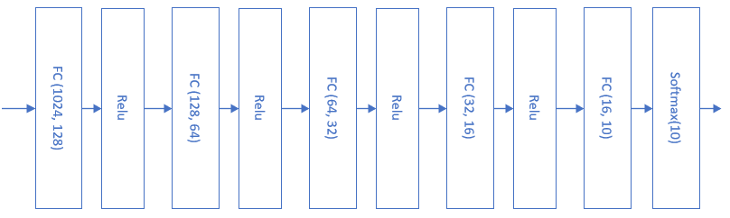
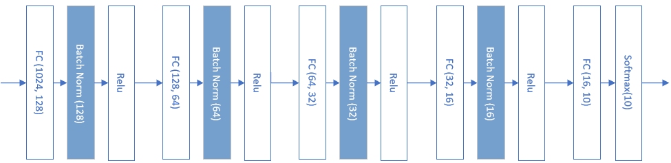

<!--Copyright © Microsoft Corporation. All rights reserved.
  适用于[License](https://github.com/Microsoft/ai-edu/blob/master/LICENSE.md)版权许可-->

## 15.6 批量归一化的实现

在这一节中，我们将会动手实现一个批量归一化层，来验证批量归一化的实际作用。

### 15.6.1 反向传播

在上一节中，我们知道了批量归一化的正向计算过程，这一节中，为了实现完整的批量归一化层，我们首先需要推导它的反向传播公式，然后用代码实现。本节中的公式序号接上一节，以便于说明。

首先假设已知从上一层回传给批量归一化层的误差矩阵是：

$$\delta = \frac{dJ}{dZ}，\delta_i = \frac{dJ}{dz_i} \tag{10}$$

#### 求批量归一化层参数梯度

则根据公式9，求$\gamma,\beta$的梯度：

$$\frac{dJ}{d\gamma} = \sum_{i=1}^m \frac{dJ}{dz_i}\frac{dz_i}{d\gamma}=\sum_{i=1}^m \delta_i \cdot n_i \tag{11}$$

$$\frac{dJ}{d\beta} = \sum_{i=1}^m \frac{dJ}{dz_i}\frac{dz_i}{d\beta}=\sum_{i=1}^m \delta_i \tag{12}$$

注意$\gamma$和$\beta$的形状与批大小无关，只与特征值数量有关，我们假设特征值数量为1，所以它们都是一个标量。在从计算图看，它们都与N,Z的全集相关，而不是某一个样本，因此会用求和方式计算。

#### 求批量归一化层的前传误差矩阵

下述所有乘法都是element-wise的矩阵点乘，不再特殊说明。

从正向公式中看，对z有贡献的数据链是：

- $z_i \leftarrow n_i \leftarrow x_i$
- $z_i \leftarrow n_i \leftarrow \mu_B \leftarrow x_i$
- $z_i \leftarrow n_i \leftarrow \sigma^2_B \leftarrow x_i$
- $z_i \leftarrow n_i \leftarrow \sigma^2_B \leftarrow \mu_B \leftarrow x_i$

从公式8，9：

$$
\frac{dJ}{dx_i} = \frac{dJ}{d n_i}\frac{d n_i}{dx_i} + \frac{dJ}{d \sigma^2_B}\frac{d \sigma^2_B}{dx_i} + \frac{dJ}{d \mu_B}\frac{d \mu_B}{dx_i} \tag{13}
$$

公式13的右侧第一部分（与全连接层形式一样）：

$$
\frac{dJ}{d n_i}=  \frac{dJ}{dz_i}\frac{dz_i}{dn_i} = \delta_i \cdot \gamma\tag{14}
$$

上式等价于：

$$
\frac{dJ}{d N}= \delta \cdot \gamma\tag{14}
$$

公式14中，我们假设样本数为64，特征值数为10，则得到一个$64\times 10$的结果矩阵（因为$1\times 10$的矩阵会被广播为$64\times 10$的矩阵）：

$$\delta^{(64 \times 10)} \odot \gamma^{(1 \times 10)}=R^{(64 \times 10)}$$

公式13的右侧第二部分，从公式8：
$$
\frac{d n_i}{dx_i}=\frac{1}{\sqrt{\sigma^2_B + \epsilon}} \tag{15}
$$

公式13的右侧第三部分，从公式8（注意$\sigma^2_B$是个标量，而且与X,N的全集相关，要用求和方式）：

$$
\begin{aligned}
\frac{dJ}{d \sigma^2_B} &= \sum_{i=1}^m \frac{dJ}{d n_i}\frac{d n_i}{d \sigma^2_B} 
\\
&= -\frac{1}{2}(\sigma^2_B + \epsilon)^{-3/2}\sum_{i=1}^m \frac{dJ}{d n_i} \cdot (x_i-\mu_B) 
\end{aligned}
\tag{16}
$$

公式13的右侧第四部分，从公式7：
$$
\frac{d \sigma^2_B}{dx_i} = \frac{2(x_i - \mu_B)}{m} \tag{17}
$$

公式13的右侧第五部分，从公式7，8：

$$
\frac{dJ}{d \mu_B}=\frac{dJ}{d n_i}\frac{d n_i}{d \mu_B} + \frac{dJ}{d\sigma^2_B}\frac{d \sigma^2_B}{d \mu_B} \tag{18}
$$

公式18的右侧第二部分，根据公式8：

$$
\frac{d n_i}{d \mu_B}=\frac{-1}{\sqrt{\sigma^2_B + \epsilon}} \tag{19}
$$

公式18的右侧第四部分，根据公式7（$\sigma^2_B和\mu_B$与全体$x_i$相关，所以要用求和）：

$$
\frac{d \sigma^2_B}{d \mu_B}=-\frac{2}{m}\sum_{i=1}^m (x_i- \mu_B) \tag{20}
$$

所以公式18是：

$$
\frac{dJ}{d \mu_B}=-\frac{\delta \cdot \gamma}{\sqrt{\sigma^2_B + \epsilon}} - \frac{2}{m}\frac{dJ}{d \sigma^2_B}\sum_{i=1}^m (x_i- \mu_B) \tag{18}
$$

公式13的右侧第六部分，从公式6：

$$
\frac{d \mu_B}{dx_i} = \frac{1}{m} \tag{21}
$$

所以，公式13最后是这样的：

$$
\frac{dJ}{dx_i} = \frac{\delta \cdot \gamma}{\sqrt{\sigma^2_B + \epsilon}} + \frac{dJ}{d\sigma^2_B} \cdot \frac{2(x_i - \mu_B)}{m} + \frac{dJ}{d\mu_B} \cdot \frac{1}{m} \tag{13}
$$

### 15.6.2 代码实现

#### 初始化类

```Python
class BnLayer(CLayer):
    def __init__(self, input_size, momentum=0.9):
        self.gamma = np.ones((1, input_size))
        self.beta = np.zeros((1, input_size))
        self.eps = 1e-5
        self.input_size = input_size
        self.output_size = input_size
        self.momentum = momentum
        self.running_mean = np.zeros((1,input_size))
        self.running_var = np.zeros((1,input_size))
```
后面三个变量，`momentum`、`running_mean`、`running_var`，是为了计算/记录历史方差均差的。

#### 前向计算

```Python
    def forward(self, input, train=True):
        ......
```
前向计算完全按照上一节中的公式6到公式9实现。要注意在训练/测试阶段的不同算法，用train是否为True来做分支判断。

#### 反向传播

```Python
    def backward(self, delta_in, flag):
        ......
```

`d_norm_x`需要多次使用，所以先计算出来备用，以增加代码性能。

公式16中有一个$(\sigma^2_B + \epsilon)^{-3/2}$，在前向计算中，我们令：
```Python
self.var = np.mean(self.x_mu**2, axis=0, keepdims=True) + self.eps
self.std = np.sqrt(self.var)
```
则：

$$self.var \times self.std = self.var \times self.var^{0.5}=self.var^{(3/2)}$$

放在分母中就是(-3/2)次方了。

另外代码中有很多`np.sum(..., axis=0, keepdims=True)`，这个和全连接层中的多样本计算一个道理，都是按样本数求和，并保持维度，便于后面的矩阵运算。

#### 更新参数
```Python
    def update(self, learning_rate=0.1):
        self.gamma = self.gamma - self.d_gamma * learning_rate
        self.beta = self.beta - self.d_beta * learning_rate
```
更新$\gamma$和$\beta$时，我们使用0.1作为学习率。在初始化代码中，并没有给批量归一化层指定学习率，如果有需求的话，读者可以自行添加这部分逻辑。

### 15.6.3 批量归一化层的实际应用

首先回忆一下第14.6节中的MNIST的图片分类网络，当时的模型如图15-15所示。



图15-15 第14.6节中MNIST图片分类网络

当时用了6个epoch（5763个Iteration），达到了0.12的预计loss值而停止训练。我们看看使用批量归一化后的样子，如图15-16所示。



图15-16 使用批量归一化后的MNIST图片分类网络

在全连接层和激活函数之间，加入一个批量归一化层，最后的分类函数Softmax前面不能加批量归一化。

#### 主程序代码

```Python
if __name__ == '__main__':
    ......
    params = HyperParameters_4_1(
        learning_rate, max_epoch, batch_size,
        net_type=NetType.MultipleClassifier,
        init_method=InitialMethod.MSRA,
        stopper=Stopper(StopCondition.StopLoss, 0.12))

    net = NeuralNet_4_1(params, "MNIST")

    fc1 = FcLayer_1_1(num_input, num_hidden1, params)
    net.add_layer(fc1, "fc1")
    bn1 = BnLayer(num_hidden1)
    net.add_layer(bn1, "bn1")
    r1 = ActivationLayer(Relu())
    net.add_layer(r1, "r1")
    ......
```

前后都省略了一些代码，注意上面代码片段中的bn1，就是应用了批量归一化层。

#### 运行结果

为了比较，我们使用与14.6中完全一致的参数设置来训练这个有批量归一化的模型，得到如图15-17所示的结果。


图15-17 使用批量归一化后的MNIST图片分类网络训练结果

打印输出的最后几行如下：

```
......
epoch=4, total_iteration=4267
loss_train=0.079916, accuracy_train=0.968750
loss_valid=0.117291, accuracy_valid=0.967667
time used: 19.44783306121826
save parameters
testing...
0.9663
```

列表15-12比较一下使用批量归一化前后的区别。

表15-12 批量归一化的作用

||不使用批量归一化|使用批量归一化|
|---|---|---|
|停止条件|loss < 0.12|loss < 0.12|
|训练次数|6个epoch(5763次迭代)|4个epoch(4267次迭代)|
|花费时间|17秒|19秒|
|准确率|96.97%|96.63%|

使用批量归一化后，迭代速度提升，但是花费时间多了2秒，这是因为批量归一化的正向和反向计算过程还是比较复杂的，需要花费一些时间，但是批量归一化确实可以帮助网络快速收敛。如果使用GPU的话，花费时间上的差异应该可以忽略。

在准确率上的差异可以忽略，由于样本误差问题和随机初始化参数的差异，会造成最后的训练结果有细微差别。

### 代码位置

ch15, Level6
