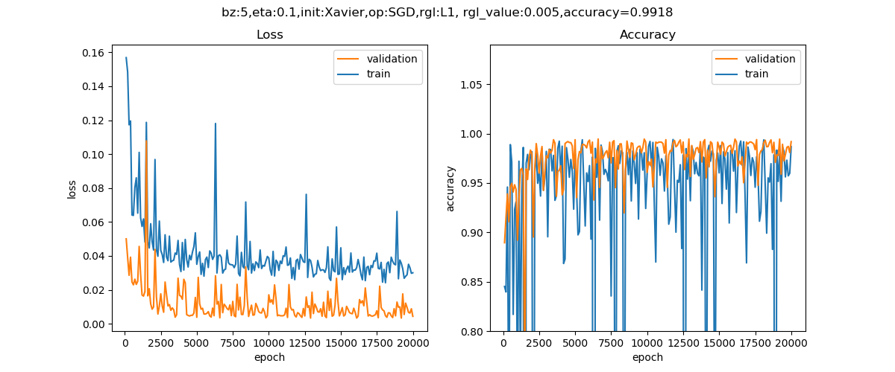

<!--Copyright © Microsoft Corporation. All rights reserved.
  适用于[License](https://github.com/Microsoft/ai-edu/blob/master/LICENSE.md)版权许可-->

## 16.3 L1正则

### 16.3.1 另一个朴素的想法

我们把熟悉的等高线图拿出来再看一眼，如图16-16所示。


图16-16 损失函数值的等高线图

假设只有两个参数需要学习，那么这两个参数的损失函数就构成了上面的等高线图。

在L2正则中，我们想办法让W的值都变得比较小，这样就不会对特征敏感。但是也会杀敌一千，自损八百，连有用特征一起被忽视掉了。那么换个思路，能不能让神经网络自动选取有用特征，忽视无用特征呢？也就是让有用特征的权重比较大，让无用特征的权重比较小，甚至为0。

用上面的图举例，公式为：

$$z=x_1 \cdot w_1 + x_2 \cdot w_2 + b$$

假设$x_1$是无用特征，想办法让$w_1$变得很小或者是0，就会得到比较满意的模型。这种想法在只有两个特征值时不明显，甚至不正确，但是当特征值有很多时，比如MNIST数据中的784个特征，肯定有些是非常重要的特征，有些是没什么用的特征。

### 16.3.2 基本数学知识

#### 拉普拉斯分布

$$
\begin{aligned}
f(x)&=\frac{1}{2b}\exp(-\frac{|x-\mu|}{b})\\\\
&= \frac{1}{2b} \begin{cases} \exp(\frac{x-\mu}{b}), & x \lt \mu \\\\ \exp(\frac{\mu-x}{b}), & x \gt \mu \end{cases}
\end{aligned}
$$


#### L0范数与L1范数

L0范数是指向量中非0的元素的个数。如果我们用L0范数来规则化一个参数矩阵W的话，就是希望W的大部分元素都是0，即让参数W是稀疏的。

L1范数是指向量中各个元素绝对值之和，也叫“稀疏规则算子”（Lasso regularization）。为什么L1范数会使权值稀疏？有人可能会这样给你回答“它是L0范数的最优凸近似”。实际上，还存在一个更美的回答：任何的规则化算子，如果他在$w_i=0$的地方不可微，并且可以分解为一个“求和”的形式，那么这个规则化算子就可以实现稀疏。w的L1范数是绝对值，所以$|w|$在$w=0$处是不可微。

为什么L0和L1都可以实现稀疏，但常用的为L1？一是因为L0范数很难优化求解，二是L1范数是L0范数的最优凸近似，而且它比L0范数要容易优化求解。所以大家才把目光转于L1范数。

综上，L1范数和L0范数可以实现稀疏，L1因具有比L0更好的优化求解特性而被广泛应用。

### 16.3.3 L1正则化

假设：

- W参数服从拉普拉斯分布，即$w_j \sim Laplace(0,b)$
- Y服从高斯分布，即$y_i \sim N(w^Tx_i,\sigma^2)$

贝叶斯最大后验估计：
$$
\begin{aligned}
\arg\max_wL(w) = &\ln \prod_i^n \frac{1}{\sigma\sqrt{2 \pi}}\exp(-\frac{1}{2}(\frac{y_i-w^Tx_i}{\sigma})^2) 
\cdot \prod_j^m{\frac{1}{2b}\exp(-\frac{\lvert w_j \rvert}{b})}
\\\\
=&-\frac{1}{2\sigma^2}\sum_i^n(y_i-w^Tx_i)^2-\frac{1}{2b}\sum_j^m{\lvert w_j \rvert}
-n\ln\sigma\sqrt{2\pi}-m\ln b\sqrt{2\pi} 
\end{aligned}
\tag{1}
$$

因为$\sigma,b,n,\pi,m$等都是常数，所以损失函数$J(w)$的最小值可以简化为：

$$
\arg\min_wJ(w) = \sum_i^n(y_i-w^Tx_i)^2+\lambda\sum_j^m{\lvert w_j \rvert} \tag{2}
$$

我们仍以两个参数为例，公式2的后半部分的正则形式为：

$$L_1 = \lvert w_1 \rvert + \lvert w_2 \rvert \tag{3}$$

因为$w_1,w_2$有可能是正数或者负数，我们令$x=|w_1|,y=|w_2|,c=L_1$，则公式3可以拆成以下4个公式的组合：

$$
y=-x+c \quad (当w_1 \gt 0, w_2 \gt 0时)
$$
$$
y=\quad x+c \quad (当w_1 \lt 0, w_2 \gt 0时)
$$
$$
y=\quad x-c \quad (当w_1 \gt 0, w_2 \lt 0时)
$$
$$
y=-x-c \quad (当w_1 \lt 0, w_2 \lt 0时)
$$

所以上述4个公式（4条直线）会组成一个二维平面上的一个菱形。

图16-17中三个菱形，是因为惩罚因子的数值不同而形成的，越大的话，菱形面积越小，惩罚越厉害。


图16-17 L1正则区与损失函数等高线示意图

以最大的那个菱形区域为例，它与损失函数等高线有多个交点，都可以作为此问题的解，但是其中红色顶点是损失函数值最小的，因此它是最优解。

图16-17中菱形的红色顶点的含义具有特殊性，即$W=[w2, 0]$，也就是w1的值为0。扩充到三维空间，菱形的6个顶点，上下的两个顶点是z值不为0，xy值为0；左右的两个顶点是x值不为0，yz值为0；前后的两个顶点是y值不为0，xz值为0。也就是说，如果xyz是三个权重值的话，那么顶点上只有一个权重值不为0，其它两个都是0。

高维空间，其顶点就是只有少数的参数有非零值，其它参数都为0。这就是所谓的稀疏解。可以这样理解，这个菱形像个刺猬，用它去触碰一个气球，一定是刺尖儿先扎到气球。上图中的三个菱形，都是顶点先接触到等高线。

在回归里面，把具有L1项的回归叫“Lasso Regression”（Tibshirani, 1995, Least Absolute Shrinkage and Selection Operator）。

### 16.3.4 损失函数的变化

假设我们以前使用的损失函数为$J_0$，则新的损失函数变成：

$$J = J_0 + \frac{\lambda}{m} \sum_i^m \lvert w_i \rvert$$

代码片段如下：

```Python
  regular_cost = 0
  for i in range(self.layer_count-1,-1,-1):
      layer = self.layer_list[i]
      if isinstance(layer, FcLayer):
          if regularName == RegularMethod.L1:
              regular_cost += np.sum(np.abs(layer.weights.W))
          elif regularName == RegularMethod.L2:
              regular_cost += np.sum(np.square(layer.weights.W))
      # end if
  # end for
  return regular_cost * self.params.lambd
```

可以看到L1部分的代码，先求绝对值，再求和。那个分母上的m是在下一段代码中处理的，因为在上一段代码中，没有任何样本数量的信息。

```Python
loss_train = self.lossFunc.CheckLoss(train_y, self.output)
loss_train += regular_cost / train_y.shape[0]
```
`train_y.shape[0]`就是样本数量。

### 16.3.5 反向传播的变化

假设一个两层的神经网络，其前向过程是：

$$Z1=W1 \cdot X + B1$$
$$A1 = Sigmoid(Z1)$$
$$Z2=W2 \cdot A1 + B2$$
$$J(w,b) = J_0 + \lambda (\lvert W1 \rvert+\lvert W2 \rvert)$$

则反向过程为：

$$
\begin{aligned}
dW2&=\frac{dJ}{dW2}=\frac{dJ}{dZ2}\frac{dZ2}{dW2}+\frac{dJ}{dW2} \\\\
&=dZ2 \cdot A1^T+\lambda \odot sign(W2)
\end{aligned}
$$
$$dW1= dZ1 \cdot X^T + \lambda \odot sign(W1) $$

从上面的公式中可以看到，正则项在方向传播过程中，唯一影响的就是求W的梯度时，要增加一个$\lambda \odot sign(W)$，sign是符号函数，返回该值的符号，即1或-1。所以，我们可以修改`FullConnectionLayer.py`中的反向传播函数如下：

```Python
def backward(self, delta_in, idx):
    dZ = delta_in
    m = self.x.shape[1]
    if self.regular == RegularMethod.L2:
        self.weights.dW = (np.dot(dZ, self.x.T) + self.lambd * self.weights.W) / m
    elif self.regular == RegularMethod.L1:
        self.weights.dW = (np.dot(dZ, self.x.T) + self.lambd * np.sign(self.weights.W)) / m
    else:
        self.weights.dW = np.dot(dZ, self.x.T) / m
    # end if
    self.weights.dB = np.sum(dZ, axis=1, keepdims=True) / m
    ......
```
符号函数的效果如下：
```Python
>>> a=np.array([1,-1,2,0])
>>> np.sign(a)
>>> array([ 1, -1,  1,  0])
```
当w为正数时，符号为正，值为1，相当于直接乘以w的值；当w为负数时，符号为负，值为-1，相当于乘以(-w)的值。最后的效果就是乘以w的绝对值。

### 16.3.6 运行结果

在主过程中，修改超参实例如下：
```Python
from Level0_OverFitNet import *

if __name__ == '__main__':
    dr = LoadData()
    hp, num_hidden = SetParameters()
    hp.regular_name = RegularMethod.L1
    hp.regular_value = 0.005
    net = Model(dr, 1, num_hidden, 1, hp)
    ShowResult(net, dr, hp.toString())
```

设置L1正则方法，系数为0.005。



图16-18 训练过程中损失函数值和准确率的变化曲线

从图16-18上看，无论是损失函数值还是准确率，在训练集上都没有表现得那么夸张了，不会极高（到100%）或者极低（到0.001）。这说明过拟合的情况得到了抑制，而且准确率提高到了99.18%。还可以画出拟合后的曲线与训练数据的分布做对比，如图16-19所示。


图16-19 拟合后的曲线与训练数据的分布图

从输出结果分析：

1. 权重值的绝对值和等于391.26，远小于过拟合时的1719
2. 较小的权重值（小于0.01）的数量为22935个，远大于过拟合时的2810个
3. 趋近于0的权重值（小于0.0001）的数量为12384个，大于过拟合时的25个。

可以看到L1的模型权重非常稀疏（趋近于0的数量很多）。那么参数稀疏有什么好处呢？有两点：

1. 特征选择(Feature Selection)：

    大家对稀疏规则化趋之若鹜的一个关键原因在于它能实现特征的自动选择。一般来说，x的大部分元素（也就是特征）都是和最终的输出y没有关系或者不提供任何信息的，在最小化目标函数的时候考虑x这些额外的特征，虽然可以获得更小的训练误差，但在预测新的样本时，这些没用的信息反而会被考虑，从而干扰了对正确y的预测。稀疏规则化算子的引入就是为了完成特征自动选择的光荣使命，它会学习地去掉这些没有信息的特征，也就是把这些特征对应的权重置为0。

2. 可解释性(Interpretability)：

    另一个青睐于稀疏的理由是，模型更容易解释。例如患某种病的概率是y，然后我们收集到的数据x是1000维的，也就是我们需要寻找这1000种因素到底是怎么影响患上这种病的概率的。假设我们这个是个回归模型：$y=w_1x_1+w_2x_2+…+w_{1000}x_{1000}+b$（当然了，为了让y限定在$[0,1]$的范围，一般还得加个Logistic函数）。通过学习，如果最后学习到的w就只有很少的非零元素，例如只有5个非零的wi，那么我们就有理由相信，这些对应的特征在患病分析上面提供的信息是巨大的，决策性的。也就是说，患不患这种病只和这5个因素有关，那医生就好分析多了。但如果1000个$w_i$都非0，医生面对这1000种因素，无法采取针对性治疗。


### 16.3.7 L1和L2的比较

表16-4展示了L1和L2两种正则方法的比较项目。

表16-4 L1和L2的比较

|比较项|无正则项|L2|L1|
|---|---|---|---|
|代价函数|$J(w,b)$|$J(w,b)+\lambda \Vert w \Vert^2_2$|$J(w,b)+\lambda \Vert w \Vert_1$|
|梯度计算|$dw$|$dw+\lambda \cdot w/m$|$dw+\lambda \cdot sign(w)/m$|
|准确率|0.961|0.982|0.987||
|总参数数量|544|544|544|
|小值参数数量(<1e-2)|7|204|524|
|极小值参数数量(<1e-5)|0|196|492|
|第1层参数Norm1|8.66|6.84|4.09|
|第2层参数Norm1|104.26|34.44|6.38|
|第3层参数Norm1|97.74|18.96|6.73|
|第4层参数Norm1|9.03|4.22|4.41|
|第1层参数Norm2|2.31|1.71|1.71|
|第2层参数Norm2|6.81|2.15|2.23|
|第3层参数Norm2|5.51|2.45|2.81|
|第4层参数Norm2|2.78|2.13|2.59|

#### 第一范数值的比较

通过比较各层的权重值的第一范数值Norm1，可以看到L1正则化的值最小，因为L1正则的效果就是让权重参数矩阵稀疏化，以形成特征选择。用通俗的话讲就是权重值矩阵中很多为项0或者接近0，这把有用的特征提出来，无用特征的影响非常小甚至为0。

这一点从参数值小于`1e-4`的数量中也可以看出来，一共才有544个参数，L1达到了492个，90%的参数都是很小的数。

L2正则化的Norm1的值，比无正则项时也小很多，说明参数值普遍减小了。

#### 第二范数值的比较

比较各层的第二范数值Norm2，可以看到L2正则化的值最小，也就是说L2正则化的结果，是使得权重矩阵中的值普遍减小，拉向坐标原点。权重值变小，就会对特征不敏感，大部分特征都能起作用时。

这一点从参数值小于`1e-2`的数量中也可以看出来，有204个参数都小于`1e-2`，与没有正则项时的7个形成了鲜明对比。

为什么L2和L1的Norm2值相差无几呢？原因是虽然L1的权重矩阵值为0的居多，但是针对有些特征的权重值比较大，形成了“一枝独秀”的效果，所以Norm2的值并不会很小。而L2的权重矩阵值普遍较小，小于`1e-4`的个数比L1少很多，属于“百花齐放”的效果。

### 代码位置

ch16, Level3

### 思考和练习

1. 观察代码的打印输出的最后一部分，关于Norm1和Norm2的结果，仔细体会L1的作用
2. 尝试改变代码中$\lambda$的数值，看看最后的拟合结果及准确率有何变化。

### 参考资料

https://blog.csdn.net/red_stone1/article/details/80755144

https://www.jianshu.com/p/c9bb6f89cfcc
