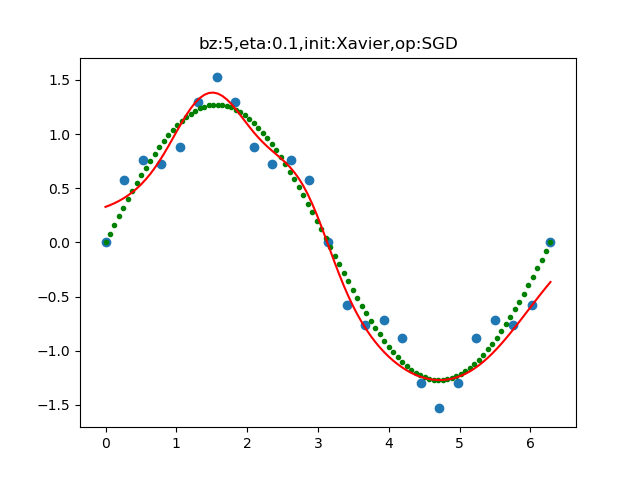

<!--Copyright © Microsoft Corporation. All rights reserved.
  适用于[License](https://github.com/Microsoft/ai-edu/blob/master/LICENSE.md)版权许可-->

## 16.5 丢弃法 Dropout

### 16.5.1 基本原理

2012年，Alex、Hinton在其论文《ImageNet Classification with Deep Convolutional Neural Networks》中用到了Dropout算法，用于防止过拟合。

我们假设原来的神经网络是这个结构，最后输出三分类结果，如图16-24所示。


图16-24 输出三分类的神经网络结构图

Dropout可以作为训练深度神经网络的一种正则方法供选择。在每个训练批次中，通过忽略一部分的神经元（让其隐层节点值为0），可以明显地减少过拟合现象。这种方式可以减少隐层节点间的相互作用，高层的神经元需要低层的神经元的输出才能发挥作用，如果高层神经元过分依赖某个低层神经元，就会有过拟合发生。在一次正向/反向的过程中，通过随机丢弃一些神经元，迫使高层神经元和其它的一些低层神经元协同工作，可以有效地防止神经元因为接收到过多的同类型参数而陷入过拟合的状态，来提高泛化程度。

丢弃后的结果如图16-25所示。


图16-25 使用丢弃法的神经网络结构图

其中有叉子的神经元在本次迭代训练中被暂时的封闭了，在下一次迭代训练中，再随机地封闭一些神经元，同一个神经元也许被连续封闭两次，也许一次都没有被封闭，完全随机。封闭多少个神经元是由一个超参来控制的，叫做丢弃率。

### 16.5.2 算法与实现

#### 前向计算

正常的隐层计算公式是：

$$
Z = W \cdot X + B \tag{1}
$$

加入随机丢弃步骤后，变成了：

$$
r \sim Bernoulli(p) \tag{2}
$$
$$Y = r \cdot X \tag{3}$$
$$Z = Y \cdot W + B \tag{4}
$$

公式2是得到一个分布概率为p的伯努利分布，伯努利分布在这里可以简单地理解为0-1分布，$p=0.5$时，会以相同概率产生0、1，假设一共10个数，则：
$$
r=[0,0,1,1,0,1,0,1,1,0]
$$
或者
$$
r=[0,1,1,0,0,1,0,1,0,1]
$$
或者其它一些分布。

从公式3，Y将会是X经过r的mask的结果，1的位置保留原x值，0的位置相乘后为0。

#### 反向传播

在反向传播时，和Relu函数的反向差不多，需要记住正向计算时得到的mask值，反向的误差矩阵直接乘以这个mask值就可以了。

#### 训练和测试/阶段的不同

在训练阶段，我们使用正向计算的逻辑。在测试时，不能随机丢弃一些神经元，否则会造成测试结果不稳定，比如某个样本的第一次测试，得到了结果A；第二次测试，得到结果B。由于丢弃的神经元的不同，A和B肯定不相同，就会造成无法解释的情况。

但是如何模拟那些在训练时丢弃的神经元呢？我们仍然可以利用训练时的丢弃概率，如图16-26所示。


图16-26 利用训练时的丢弃概率模拟丢弃的神经元

图16-26的左侧部分为训练时，输入的信号会以概率p存在，如果$p=0.6$，则会有40%的概率被丢弃，此神经元被封闭；有60%的概率存在，此神经元可以接收到输入并向后传播。

图16-26的右侧部分为测试/推理时，输入信号总会存在，但是在每个输出上，都应该用原始的权重值，乘以概率p。比如`input=1`，权重值`w=0.12`，`p=0.4`，则output$=1 \times 0.4 \times 0.12=0.048$。

#### 代码实现

```Python
class DropoutLayer(CLayer):
    def __init__(self, input_size, ratio=0.5):
        self.dropout_ratio = ratio
        self.mask = None
        self.input_size = input_size
        self.output_size = input_size

    def forward(self, input, train=True):
        assert(input.ndim == 2)
        if train:
            self.mask = np.random.rand(*input.shape) > self.dropout_ratio
            self.z = input * self.mask
        else:
            self.z = input * (1.0 - self.dropout_ratio)

        return self.z
       
    def backward(self, delta_in, idx):
        delta_out = self.mask * delta_in
        return delta_out
```

上面的代码中，`ratio`是丢弃率，如果`ratio=0.4`，则前面的原理解释中的`p=0.6`。

另外，我们可以看到，这里的`DropoutLayer`是作为一个层出现的，而不是寄生在全连接层内部。

写好`Dropout`层后，我们在原来的模型的基础上，搭建一个带`Dropout`层的新模型，如图16-27所示。


图16-27 带`Dropout`层的模型结构图

与前面的过拟合的网络相比，只是在每个层之间增加一个`Drouput`层。用代码理解的话，请看下面的函数：

```Python
def Model_Dropout(dataReader, num_input, num_hidden, num_output, params):
    net = NeuralNet41(params, "overfitting")

    fc1 = FcLayer(num_input, num_hidden, params)
    net.add_layer(fc1, "fc1")
    s1 = ActivatorLayer(Sigmoid())
    net.add_layer(s1, "s1")
    
    d1 = DropoutLayer(num_hidden, 0.1)
    net.add_layer(d1, "d1")

    fc2 = FcLayer(num_hidden, num_hidden, params)
    net.add_layer(fc2, "fc2")
    t2 = ActivatorLayer(Tanh())
    net.add_layer(t2, "t2")

    #d2 = DropoutLayer(num_hidden, 0.2)
    #net.add_layer(d2, "d2")

    fc3 = FcLayer(num_hidden, num_hidden, params)
    net.add_layer(fc3, "fc3")
    t3 = ActivatorLayer(Tanh())
    net.add_layer(t3, "t3")

    d3 = DropoutLayer(num_hidden, 0.2)
    net.add_layer(d3, "d3")
    
    fc4 = FcLayer(num_hidden, num_output, params)
    net.add_layer(fc4, "fc4")

    net.train(dataReader, checkpoint=100, need_test=True)
    net.ShowLossHistory(XCoordinate.Epoch)
    
    return net
``` 

运行程序，最后可以得到这样的损失函数图和验证结果，如图16-28所示。


图16-28 训练过程中损失函数值和准确率的变化曲线

可以提高精确率到98.17%。

拟合效果如图16-29所示。



图16-29 拟合后的曲线与训练数据的分布图

### 16.5.3 更好地理解Dropout

#### 对Dropout的直观理解

关于Dropout，论文中没有给出任何数学解释，Hintion的直观解释和理由如下：

1. 由于每次用输入网络的样本进行权值更新时，隐含节点都是以一定概率随机出现，因此不能保证每2个隐含节点每次都同时出现，这样权值的更新不再依赖于有固定关系隐含节点的共同作用，阻止了某些特征仅仅在其它特定特征下才有效果的情况。

2. 可以将Dropout看作是模型平均的一种。对于每次输入到网络中的样本（可能是一个样本，也可能是一个batch的样本），其对应的网络结构都是不同的，但所有的这些不同的网络结构又同时share隐含节点的权值。这样不同的样本就对应不同的模型，是Bagging方法的一种极端情况。

3. 还有一个比较有意思的解释是，Dropout类似于性别在生物进化中的角色，物种为了使适应不断变化的环境，性别的出现有效地阻止了过拟合，即避免环境改变时物种可能面临的灭亡。由于性别是一半一半的比例，所以Dropout中的p一般设置为0.5。

### 代码位置

ch16, Level5

### 思考与练习

1. 分别调整3个dropout层的`drop_ratio`参数，观察训练结果的变化。
2. 尝试改变`NeuralNet41.py`中的`inference`函数中的`output = self.__forward(X, train=False)`，把`train`设置成`True`，看看会得到什么结果。

MiniFramework, DropoutLayer

### 参考资料

- http://www.cs.toronto.edu/~rsalakhu/papers/srivastava14a.pdf
- http://jmlr.org/papers/v15/srivastava14a.html
- https://blog.csdn.net/program_developer/article/details/80737724

