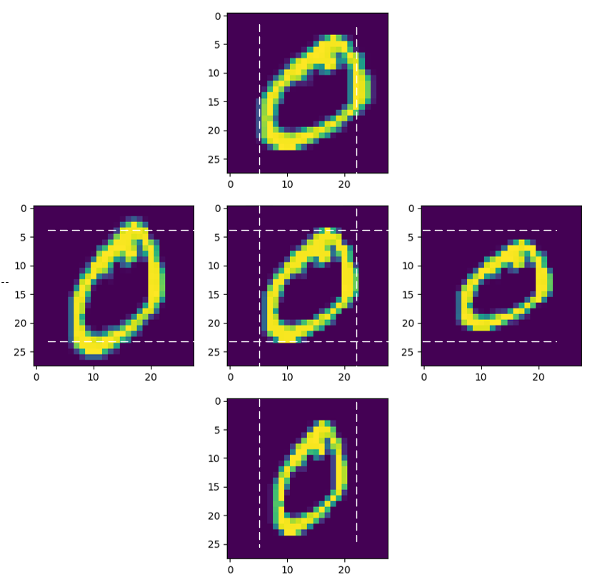
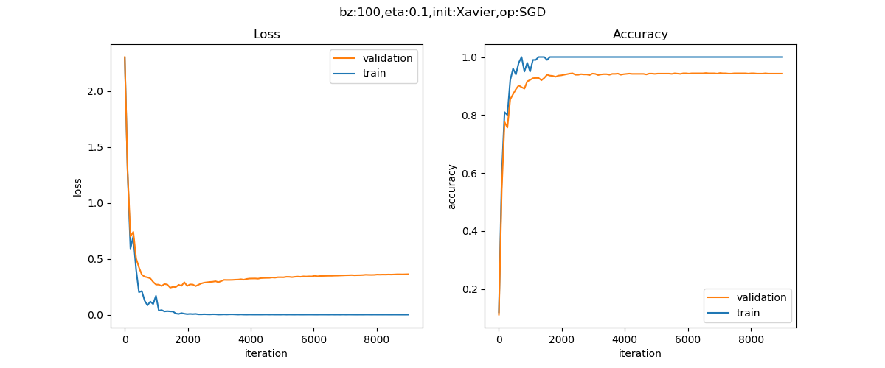

<!--Copyright © Microsoft Corporation. All rights reserved.
  适用于[License](https://github.com/Microsoft/ai-edu/blob/master/LICENSE.md)版权许可-->

## 16.6 数据增强 Data Augmentation

过拟合的原因之一是训练数据不够，而在现代的机器学习中，数据量却是不成问题，因为通过互联网上用户的交互行为，或者和手机App的交互行为，可以收集大量的数据用于网络训练。

但是对于一些图片类数据，不是很容易从原始渠道搞到，所以可以采用增加一些假数据的方式来满足需要，尤其是当这个任务是分类任务时，更加适合。

对于拟合任务，在当前样本数据附近增加一些假的样本数据并无意义，相当于把整个样本数据变“粗”。对于概率密度计算任务，增加假样本很可能破坏原始样本的概率密度。

通过丰富的图像处理手段，我们往往可以把样本数量翻好几倍。下面我们通过手写数字识别的例子，来说明如何做简单的图片增强。

### 16.6.1 图像数据增强

#### 旋转

定义图片中心和旋转角度，进行微小的旋转。


图16-30 原始图片与旋转后的图片

图16-30中，中间的是原始图片，左右是旋转后的图片。

选择操作的代码：

```Python
def rotate(image, angle):
    height, width = image.shape
    center = (height // 2, width // 2)
    rotation = cv2.getRotationMatrix2D(center, angle, 1)
    rotated_image = cv2.warpAffine(image, rotation, (width, height))
    return rotated_image
```
在调用上面的代码时，angle=10或者-10，相当于向左或向右旋转10度。

#### 缩放



图16-31 原始图片与缩放后的图片

图16-31中各部分的图片分别是：

- 上：水平方向放大到1.2倍
- 左：垂直方向放大到1.2倍
- 中：原始图片
- 右：垂直方向缩小到0.8倍
- 下：水平方向缩小到0.8倍

#### 平移和添加噪音


图16-32 原始图片与平移后的图片、带噪声的图片

图16-32中各部分的图片分别是：

- 上左：原始图片
- 上右：向下平移2像素
- 下左：向右平移2像素
- 下右：添加噪音

平移操作的代码：
```Python
def translate(image, distance, direction=0):
    height, width = image.shape

    if direction == 0:
        M = np.float32([[1, 0, 0], [0, 1, distance]])
    else:
        M = np.float32([[1, 0, distance], [0, 1, 0]])
    # end if

    return cv2.warpAffine(image, M, (width, height))
```    

添加噪音的代码：
```Python
def noise(image, var=0.1):
    gaussian_noise = np.random.normal(0, var ** 0.5, image.shape)
    noise_image = image + gaussian_noise
    return np.clip(noise_image, 0, 1)
```

做完上述变换后，我们得到了额外的9000个数据，连同原始的1000个数据一起保存在.npz文件中，供后面使用。

#### 其它图像处理方法

- 翻转图像：即左右镜像，或者上下镜像，但是对于数字识别来说不合适
- 剪裁图像：从图像中随机选择一部分，再调整为原始图像大小，对于本例也不适合
- 颜色变化：对图像进行颜色抖动，即对RGB值进行随机扰动，如椒盐噪声和高斯噪声
- 对比度变化：通过修改HSV空间中的色调和饱和度来改变图像的对比度，也可以用直方图均衡化
- 亮度变化：改变整个图像的亮度
- 颜色增强：对于颜色暗淡的图片进行全图的颜色增强

以上这些方法，其实就相当于用照相机在不同的角度、光线、背景、远近的条件下，对目标数据进行再次采样，所以从原理上来说是完全合理的。

### 16.6.2 在增强数据集上训练

只需要在`Level0`的代码基础上，修改数据集操作部分，就可以使用增强后的数据进行训练，以下是训练结果。



图16-33 训练过程中损失函数值和准确率的变化曲线

```
epoch=199, total_iteration=17910
loss_train=0.0001, accuracy_train=1.000000
loss_valid=0.3276, accuracy_valid=0.942000
epoch=199, total_iteration=17999
loss_train=0.0001, accuracy_train=1.000000
loss_valid=0.3279, accuracy_valid=0.942000
time used: 28.778401613235474
total weights abs sum= 2010.710018228446
total weights = 26520
little weights = 2613
zero weights = 29
testing...
rate=9016 / 10000 = 0.9016
```

在图16-33中可以看到还是有些过拟合的现象方式，实际上这不是数据的问题，而是这个网络太复杂，即使用原始的MNIST数据集训练，也是会过拟合的。

但是，我们可以对比图16-34所示的数据增强之前的1000个样本的训练结果。


图16-34 数据增强之前的损失函数值和准确率的变化曲线

```
epoch=199, total_iteration=1799
loss_train=0.0015, accuracy_train=1.000000
loss_valid=0.9956, accuracy_valid=0.860000
time used: 5.082462787628174
total weights abs sum= 1722.470655813152
total weights = 26520
little weights = 2815
zero weights = 27
testing...
rate=8423 / 10000 = 0.8423
```
通过对比可以发现：

1. 过拟合现象极大程度地消减了，从损失函数的U型曲线的角度可以看出来
2. 我们使用了原始的MNIST数据集中的测试集来测试两个模型：
>> - 原始1000个样本的模型的测试结果是84.23%
>> - 增强后的10000个样本的模型的测试结果是90.16%

数据增强后的样本在真实的测试数据下，准确率比增强前的样本高了很多，说明数据增强起到了很大的作用。

### 16.6.3 多样本合成法

#### SMOTE

SMOTE,Synthetic Minority Over-sampling Technique$^{[1]}$，通过人工合成新样本来处理样本不平衡问题，提升分类器性能。

类不平衡现象是数据集中各类别数量不近似相等。如果样本类别之间相差很大，会影响分类器的分类效果。假设小样本数据数量极少，仅占总体的1%，所能提取的相应特征也极少，即使小样本被错误地全部识别为大样本，在经验风险最小化策略下的分类器识别准确率仍能达到99%，但在验证环节分类效果不佳。

基于插值的SMOTE方法为小样本类合成新的样本，主要思路为：

1. 定义好特征空间，将每个样本对应到特征空间中的某一点，根据样本不平衡比例确定采样倍率N；
2. 对每一个小样本类样本$(x,y)$，按欧氏距离找K个最近邻样本，从中随机选取一个样本点，假设选择的近邻点为$(x_n,y_n)$。在特征空间中样本点与最近邻样本点的连线段上随机选取一点作为新样本点，满足以下公式:

$$(x_{new},y_{new})=(x,y)+rand(0,1)\times ((x_n-x),(y_n-y))$$

3. 重复选取取样，直到大、小样本数量平衡。

在`python`中，SMOTE算法已经封装到了`imbalanced-learn`库中。

#### SamplePairing

SamplePairing$^{[2]}$方法的处理流程如图16-35所示，从训练集中随机抽取两张图片分别经过基础数据增强操作（如随机翻转等）处理后经像素取平均值的形式叠加合成一个新的样本，标签为原样本标签中的一种。


图16-35 SamplePairing方法的处理流程

经SamplePairing处理后可使训练集的规模从N扩增到N*N，在CPU上也能完成处理。

训练过程是交替禁用与使用SamplePairing处理操作的结合：

1. 使用传统的数据增强训练网络，不使用SamplePairing 数据增强训练。
2. 在ILSVRC数据集上完成一个epoch或在其他数据集上完成100个epoch后，加入SamplePairing 数据增强训练。
3. 间歇性禁用 SamplePairing。对于 ILSVRC 数据集，为其中的300000 个图像启用SamplePairing，然后在接下来的100000个图像中禁用它。对于其他数据集，在开始的8个epoch中启用，在接下来的2个epoch中禁止。
4. 在训练损失函数和精度稳定后进行微调，禁用SamplePairing。

实验结果表明，因SamplePairing数据增强操作可能引入不同标签的训练样本，导致在各数据集上使用SamplePairing训练的误差明显增加，而在检测误差方面使用SamplePairing训练的验证误差有较大幅度降低。

尽管SamplePairing思路简单，性能上提升效果可观，符合奥卡姆剃刀原理，遗憾的是的可解释性不强，目前尚缺理论支撑。目前仅有图片数据的实验，还需下一步的实验与解读。

#### Mixup

Mixup$^{[3]}$是基于邻域风险最小化（VRM）原则的数据增强方法，使用线性插值得到新样本数据。在邻域风险最小化原则下，根据特征向量线性插值将导致相关目标线性插值的先验知识，可得出简单且与数据无关的mixup公式：

$$
x_n=\lambda x_i + (1-\lambda)x_j \\\\
y_n=\lambda y_i + (1-\lambda)y_j
$$

其中$(x_n，y_n)$是插值生成的新数据，$(x_i,y_i)$和$(x_j，y_j)$是训练集中随机选取的两个数据，λ的取值满足贝塔分布，取值范围介于0到1，超参数α控制特征目标之间的插值强度。

Mixup的实验丰富，实验结果表明可以改进深度学习模型在ImageNet数据集、CIFAR数据集、语音数据集和表格数据集中的泛化误差，降低模型对已损坏标签的记忆，增强模型对对抗样本的鲁棒性和训练对抗生成网络的稳定性。

Mixup处理实现了边界模糊化，提供平滑的预测效果，增强模型在训练数据范围之外的预测能力。随着超参数α增大，实际数据的训练误差就会增加，而泛化误差会减少。说明Mixup隐式地控制着模型的复杂性。随着模型容量与超参数的增加，训练误差随之降低。

尽管有着可观的效果改进，但mixup在偏差—方差平衡方面尚未有较好的解释。在其他类型的有监督学习、无监督、半监督和强化学习中，Mixup还有很大的发展空间。

#### 小结

Mixup、SMOTE、SamplePairing三者思路上有相同之处，都是试图将离散样本点连续化来拟合真实样本分布，但所增加的样本点在特征空间中仍位于已知小样本点所围成的区域内。但在特征空间中，小样本数据的真实分布可能并不限于该区域中，在给定范围之外适当插值，也许能实现更好的数据增强效果。

### 代码位置

ch16, Level6

先运行`Level6_DataAugmentationGenerator.py`生成数据，然后运行`Level6_DataAugmentationLearner.py`训练数据。

### 思考与练习

1. 由于MNIST数据集是灰度数据，不能采用色彩变化，但是可以有明暗亮度的变化。尝试在1000个原始数据集上用亮度变化的方式再增加1000个样本数据，再结合上面的其它数据增强方法，得到一共11000个样本，看看训练效果如何。


### 参考资料

[1] Chawla N V, Bowyer K W, Hall L O, et al. SMOTE: synthetic minority over-sampling technique[J]. Journal of Artificial Intelligence Research, 2002, 16(1):321-357.

[2] Inoue H. Data Augmentation by Pairing Samples for Images Classification[J]. 2018.

[3] Zhang H, Cisse M, Dauphin Y N, et al. mixup: Beyond Empirical Risk Minimization[J]. 2017.

