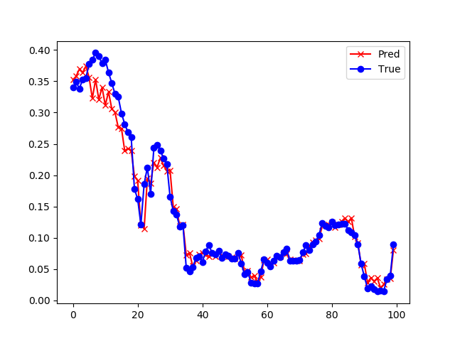

<!--Copyright © Microsoft Corporation. All rights reserved.
  适用于[License](https://github.com/Microsoft/ai-edu/blob/master/LICENSE.md)版权许可-->

## 19.4 实现空气质量预测

在19.3节中搭建了一个通用的循环神经网络模型，现在看看如何把这个模型应用到实际中。

### 19.4.1 提出问题

大气污染治理问题迫在眉睫，否则会严重影响人类健康。如果能够根据当前的空气质量条件和气象条件，预测未来几个小时的空气质量，就会为预警机制提供保证，以提醒人们未来几小时的出行安排。

用当前时刻的数据来预测未来的数据，也是循环神经网络的重要功能之一，它与前面学习的回归问题的重要区别在于：假设在[0,1]区间内，给定任意x值，预测y值，是属于普通的回归问题；而预测$x>1$时的y值，就属于循环神经网络的预测范畴了。

### 19.4.2 准备数据

#### 原始数据格式

北京空气质量数据来源于此：https://archive.ics.uci.edu $^{[1]}$，它的原始数据格式见表19-6。

表19-6 空气质量数据字段说明

|字段序号|英文名称|中文名称|取值说明|
|---|---|---|---|
|1| No |行数|1~43824|
|2| year|年|2010~2014|
|3| month|月|1~12|
|4| day|日|1~31|
|5| hour|小时|0~23|
|6| pm2.5|PM2.5浓度|0~994|
|7| DEWP|露点|-40~28|
|8| TEMP|温度|-19~42|
|9| PRES|气压|991~1046|
|10| cbwd|风向|cv,NE,NW,SE|
|11| lws|累积风速|0.45~585.6|
|12| ls|累积降雪量|0~27|
|13| lr|累积降雨量|0~36|

注意数据中最后三个字段都是按小时统计的累积量，以下面的数据片段为例：

```
No. 年      月  日  时  污染  露点  温  气压  风向  风速  雪  雨
-------------------------------------------------------------
...
22	2010	1	1	21	NA	-17	-5	1018	NW	1.79	0	0
23	2010	1	1	22	NA	-17	-5	1018	NW	2.68	0	0
24	2010	1	1	23	NA	-17	-5	1020	cv	0.89	0	0
25	2010	1	2	0	129	-16	-4	1020	SE	1.79	0	0
26	2010	1	2	1	148	-15	-4	1020	SE	2.68	0	0
27	2010	1	2	2	159	-11	-5	1021	SE	3.57	0	0
28	2010	1	2	3	181	-7	-5	1022	SE	5.36	1	0
29	2010	1	2	4	138	-7	-5	1022	SE	6.25	2	0
30	2010	1	2	5	109	-7	-6	1022	SE	7.14	3	0
31	2010	1	2	6	105	-7	-6	1023	SE	8.93	4	0
32	2010	1	2	7	124	-7	-5	1024	SE	10.72	0	0
...
```

第22行数据和第23行数据的风向都是NW（西北风），前者的风速为1.79米/秒，后者的数值是2.68，但是应该用$2.68-1.79=0.89$米/秒，因为2.68是累积值，表示这两个小时一直是西北风。第24行数据的风向是cv，表示风力很小且风向不明显，正处于交替阶段。可以看到第25行数据的风向就变成了SE（东南风），再往后又是持续的东南风数值的累积。

降雪量也是如此，比如第28行数据，开始降雪，到第31行数据结束，数值表示持续降雪的时长，单位为小时。

#### 累积值的处理

前面说过了，风速是累积值，这种累积关系实际上与循环神经网络的概念是重合的，因为循环神经网络设计的目的就是要识别这种与时间相关的特征，所以，我们需要把数据还原，把识别特征的任务交给循环神经网络来完成，而不要人为地制造特征。

假设原始数据为：

```
24	cv	0.89
25	SE	1.79
26	SE	2.68
27	SE	3.57
28	SE	5.36
29	SE	6.25
```
则去掉累积值之后的记录为：
```
24	cv	0.89
25	SE	1.79
26	SE	0.89(=2.68-1.79)
27	SE	0.89(=3.57-2.68)
28	SE	1.79(=5.36-3.57)
29	SE	0.89(=6.25-5.36)
```
所以在处理数据时要注意把累积值变成当前值，需要用当前行的数值减去上一行的数值。

#### 缺失值的处理

大致浏览一下原始数据，可以看到PM2.5字段有不少缺失值，比如前24条数据中，该字段就是NA。在后面的数据中，还有很多段是NA的情况。

很多资料建议对于缺失值的处理建议是删除该记录或者填充为0，但是在本例中都不太合适。
 - 删除记录，会造成训练样本的不连续，而循环神经网络的通常要求时间步较长，这样遇到删除的记录时会跳到后面的记录。假设时间步为4，应该形成的记录是[1,2,3,4]，如果3、4记录被删除，会变成[1,2,5,6]，从时间上看没有真正地连续，会给训练带来影响。
 - 如果填充为0，相当于标签值PM2.5数据为0，会给训练带来更大的影响。

所以，这两种方案我们都不能采用。在不能完全还原原始数据的情况下，我们采用折中的插值法来补充缺失字段。

假设有PM2.5的字段记录如下：

```
1 14.5
2 NA
3 NA
4 NA
5 NA
6 20.7
```
中间缺失了4个记录，采用插值法，插值=$(20.7-14.5)/(6-1)=1.24$，则数据变为：
```
1 14.5
2 15.74(=14.5+1.24)
3 16.98(=15.74+1.24)
4 18.22(=16.98+1.24)
5 19.46(=18.22+1.24)
6 20.7
```

#### 无用特征的处理

1. 序号肯定没用，因为是人为给定的
2. 年份字段也没用，除非你认为污染值是每年都会变得更糟糕
3. 雨和雪的气象条件，对于PM2.5来说是没有用的，因为主要是温度、湿度、风向决定了雨雪的成因，而降水本身不会改变PM2.5的数值
4. “月日时”三个字段是否有用呢？实际上“月日”代表了季节，明显的特征是温度、气压等；“时”代表了一天的温度变化。所以有了温度、气压，就没有必要有“日月时”了

对于以上的无用特征值，要把该字段从数据中删除。如果不删除，网络训练也可以进行，造成的影响会是：

1. 需要更多的隐层神经元
2. 需要更长的计算时间

#### 预测类型

预测，可以是预测PM2.5的具体数值，也可以是预测空气质量的好坏程度，按照标准，我们可以把PM2.5的数值分为以下6个级别，如表19-7所示。

表19-7 PM2.5数值及级别对应

|级别|数值|
|---|---|
|0|0~50|
|1|50~100|
|2|100~150|
|3|150~200|
|4|200~300|
|5|300以上|

如果预测具体数值，则是个回归网络，需要在最后一个时间步上用线性网络，后接一个均方差损失函数；如果预测污染级别，则是个分类网络，需要在最后一个时间步上用Softmax做6分类，后接一个交叉熵损失函数。

由于我们在19.3节实现了一个“通用的循环神经网络”，所以这些细节就可以不考虑了，只需要指定网络类型为NetType.Fitting或者NetType.MultipleClassifier即可。

#### 对于PM2.5数值字段的使用

在前面的前馈神经网络的学习中，我们知道在本问题中，PM2.5的数值应该作为标签值，那么它就不应该出现在训练样本TrainX中，而是只在标签值TrainY中出现。

到了循环神经网络的场景，很多情况下，需要前面时间步的所有信息才能预测下一个时间步的数值，比如股票的股价预测，股价本身是要本预测的标签值，但是如果没有前一天的股价作为输入，是不可能预测出第二天的股价的。所以，在这里股价既是样本值，又是标签值。

在这个PM2.5的例子中，也是同样的情况，前一时刻的污染数值必须作为输入值，来预测下一时刻的污染数值。笔者曾经把PM2.5数值从TrainX中删除，试图直接训练出一个拟合网络，但是其准确度非常的低，一度令笔者迷惑，还以为是循环神经网络的实现代码有问题。后来想通了这一点，把PM2.5数值加入到了训练样本，才得到了比较满意的训练效果。

具体的用法是这样的，我们先看原始数据片段：

```
No. 污染  露点  温  气压  风向  风速
-------------------------------------------------------------
...
25	129	-16	-4	1020	SE	1.79
26	148	-15	-4	1020	SE	2.68
27	159	-11	-5	1021	SE	3.57
28	181	-7	-5	1022	SE	5.36
29	138	-7	-5	1022	SE	6.25
30	109	-7	-6	1022	SE	7.14
31	105	-7	-6	1023	SE	8.93
32	124	-7	-5	1024	SE	10.72
...
```

这里有个问题：我们的标签值数据如何确定呢？是把污染字段数据直接拿出来就能用了吗？

比如第26行的污染数值为148，其含义是在当前时刻采样得到的污染数据，是第25行所描述的气象数据在持续1个小时后，在129的基础上升到了148。如果第25行的数据不是129，而是100，那么第26行的数据就可能是120，而不是148。所以，129这个数据一定要作为训练样本放入训练集中，而148是下一时刻的预测值。

这样就比较清楚了，我们可以处理数据如下：

```
No. 污染  露点  温  气压  风向  风速  标签值Y
-------------------------------------------------------------
...
25	129	-16	-4	1020	SE	1.79  148
26	148	-15	-4	1020	SE	2.68  159
27	159	-11	-5	1021	SE	3.57  181
28	181	-7	-5	1022	SE	5.36  138
29	138	-7	-5	1022	SE	6.25  109
30	109	-7	-6	1022	SE	7.14  105
31	105	-7	-6	1023	SE	8.93  124
32	124	-7	-5	1024	SE	10.72 134
...
```
仔细对比数据，其实就是把污染字段的数值向上移一个时间步，就可以作为标签值。

如果想建立一个4个时间步的训练集，那么数据会是这样的：

```
  No. 污染  露点  温  气压  风向  风速  标签值Y
-------------------------------------------------------------
(第一个样本，含有4个时间步)
  25	129	-16	-4	1020	SE	1.79  
  26	148	-15	-4	1020	SE	2.68  
  27	159	-11	-5	1021	SE	3.57  
  28	181	-7	-5	1022	SE	5.36  138
(第二个样本，含有4个时间步)  
  29	138	-7	-5	1022	SE	6.25 
  30	109	-7	-6	1022	SE	7.14  
  31	105	-7	-6	1023	SE	8.93  
  32	124	-7	-5	1024	SE	10.72 134
...
```
该样本是个三维数据，第一维是样本序列，第二维是时间步，第三维是气象条件。针对每个样本只有一个标签值，而不是4个。第一个样本的标签值138，实际上是原始数据第28行的PM2.5数据；第二个样本的标签值134，是原始数据第33行的PM2.5数据。

如果是预测污染级别，则把PM2.5数据映射到0~5的六个级别上即可，标签值同样也是级别数据。

### 19.4.3 训练一个回归预测网络

下面我们训练一个回归网络，预测具体的PM2.5数值，由于有19.3节的代码支持，只需要在19.4节的代码上改一行就可以了：

```Python
    net_type = NetType.Fitting
```

图19-16显示了训练过程，一开始变化得很快，然后变得很平缓。


图19-16 训练过程中的损失函数值和准确度的变化

然后分别预测了未来8、4、2、1小时的污染数值，并截取了中间一小段数据来展示预测效果，如表19-8所示。

表19-8 预测时长与准确度的关系

|预测时长|结果|预测结果|
|---|---|---|
|8小时|损失函数值：<br/>0.001171<br/>准确率：<br/>0.737769||
|4小时|损失函数值：<br/>0.000686<br/>准确率：<br/>0.846447||
|2小时|损失函数值：<br/>0.000414<br/>准确率：<br/>0.907291||
|1小时|损失函数值：<br/>0.000268<br/>准确率：<br/>0.940090||

从上面的4张图的直观比较可以看出来，预测时间越短的越准确，预测8小时候的污染数据的准确度是72%，而预测1小时的准确度可以达到94%。

### 19.4.4 几个预测时要注意的问题

#### 准确度问题

预测8小时的具体污染数值的准确度是73%，而按污染程度做的分类预测的准确度为60%，为什么有差异呢？

在训练前，一般都需要把数据做归一化处理，因此PM2.5的数值都被归一到[0,1]之间。在预测污染数值时，我们并没有把预测值还原为真实值。假设预测值为0.11，标签值为0.12，二者相差0.01。但是如果都还原为真实值的话，可能会是110和120做比较，这样差别就比较大了。

#### 预测方法

以预测4小时为例，具体的方法用图19-17可以示意性地解释。


图19-17 预测未来4个时间步的示意图

1. $a,b,c,d$为到当前为止前4个时间步的记录，用它预测出了第5个时间步的情况$w$，并在第二次预测时加入到预测输入部分，挤掉最前面的$a$；
2. 用$b,c,d,w$预测出$x$；
3. 用$c,d,w,x$预测出$y$；
4. 用$d,w,x,y$预测出$z$。

### 代码位置

ch19, Level4

如果想改变数据集，可以修改SourceCode/Data/ch19_PM25.py，来重新生成数据集。

### 思考和练习

1. 把预测值还原为真实值后，再计算准确度，看看数值会是多少？
2. 做分类预测时，把max_epoch的数值变大，看看是否可以得到更好的效果？
3. 分别调整隐层神经元数num_hidden、时间步数num_step，并仍旧预测8、4、2、1小时的数据，看看结果是否有变化？
4. 不删除原始数据中的年、月、日、时、雨、雪等字段，看看对训练效果的影响如何。

### 参考文献

[1] Liang, X., Zou, T., Guo, B., Li, S., Zhang, H., Zhang, S., Huang, H. and Chen, S. X. (2015). Assessing Beijing's PM2.5 pollution: severity, weather impact, APEC and winter heating. Proceedings of the Royal Society A, 471, 20150257.

