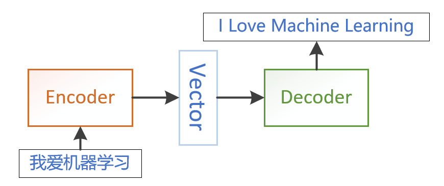

<!--Copyright © Microsoft Corporation. All rights reserved.
  适用于[License](https://github.com/Microsoft/ai-edu/blob/master/LICENSE.md)版权许可-->

## 20.4 序列到序列模型

序列到序列模型在自然语言处理中应用广泛，是重要的模型结构。本小节对序列到序列模型的提出和结构进行简要介绍，没有涉及代码实现部分。

### 20.4.1 提出问题

前面章节讲到的RNN模型和实例，都属于序列预测问题，或是通过序列中一个时间步的输入值，预测下一个时间步输出值（如二进制减法问题）；或是对所有输入序列得到一个输出作为分类（如名字分类问题）。他们的共同特点是：输出序列与输入序列等长，或输出长度为1。

还有一类序列预测问题，以序列作为输入，需要输出也是序列，并且输入和输出序列长度不确定，并不断变化。这类问题被成为序列到序列（Sequence-to-Sequence, Seq2Seq）预测问题。

序列到序列问题有很多应用场景：比如机器翻译、问答系统（QA）、文档摘要生成等。简单的RNN或LSRM结构无法处理这类问题，于是科学家们提出了一种新的结构 —— 编码解码（Encoder-Decoder）结构。

### 20.4.2 编码-解码结构（Encoder-Decoder）

图20-9 为Encoder-Decoder结构的示意图。

图20-9 Encoder-Decoder结构示意图

Encoder-Decoder结构的处理流程非常简单直观。

- 示意图中，输入序列和输出序列分别为中文语句和翻译之后的英文语句，它们的长度不一定相同。通常会将输入序列嵌入（Embedding）成一定维度的向量，传入编码器。
- Encoder为编码器，将输入序列编码成为固定长度的状态向量，通常称为语义编码向量。
- Decoder为解码器，将语义编码向量作为原始输入，解码成所需要的输出序列。

在具体实现中，编码器、解码器可以有不同选择，可自由组合。常见的选择有CNN、RNN、GRU、LSTM等。

应用Encoder-Decoder结构，可构建出序列到序列模型。

### 20.4.3 序列到序列模型（Seq2Seq）

Seq2Seq模型有两种常见结构。我们以RNN网络作为编码和解码器来进行讲解。

图20-10和图20-11分别展示了这两种结构。

图20-10 Seq2Seq结构一

图20-11 Seq2Seq结构二

#### 编码过程

两种结构的编码过程完全一致。

输入序列为 $x=[x1, x2, x3]$。

RNN网络中，每个时间节点隐层状态为:

$$
h_t = f(h_{t-1}, x_t), \quad t \in [1,3]
$$

编码器中输出的语义编码向量可以有三种不同选取方式，分别是：

$$
\begin{aligned}
c &= h_3 \\
c &= g(h_3) \\
c &= g(h1, h2, h3) \\
\end{aligned}
$$

#### 解码过程

两种结构解码过程的不同点在于，语义编码向量是否应用于每一时刻输入。

第一种结构，每一时刻的输出$y_t$由前一时刻的输出$y_{t-1}$、前一时刻的隐层状态$h^{'}_{t-1}$和$c$共同决定，即： $y_t = f(y_{t-1}, h^{'}_{t-1}, c)$。

第二种结构，$c$只作为初始状态传入解码器，并不参与每一时刻的输入，即：

$$
\begin{cases}
    y_1 = f(y_0, h^{'}_{0}, c) \\
    y_t = f(y_{t-1}, h^{'}_{t-1}), t \in [2,4]
\end{cases}
$$

以上是序列到序列模型的结构简介，具体实现将在以后补充。
