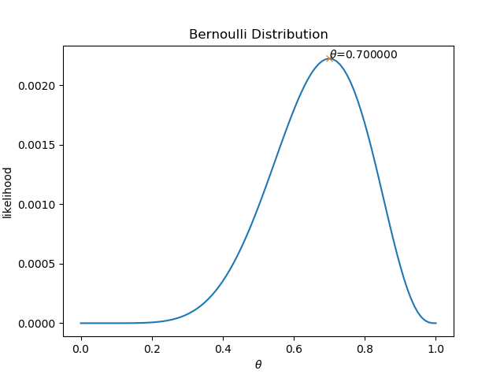

<!--Copyright © Microsoft Corporation. All rights reserved.
  适用于[License](https://github.com/Microsoft/ai-edu/blob/master/LICENSE.md)版权许可-->

## 最大后验概率估计与贝叶斯估计

## 最大后验概率估计

简称MAP（Maximum Posteriori Estimation）。

问题：有50个白球，50个黑球，在一个袋子里，从中任意拿出10个球，放到第二个袋子里，再从第二个袋子里抽取一个球，记录颜色，放回，再抽取，重复10次。结果一共抽取到7次白球，3次黑球，求最大似然和最大后验概率。

问题：有一枚匀质硬币，投10次，7次正面向上，求

利用前面学到的知识，求解最大似然函数：

$$
L(X;\theta)= \theta^7 (1-\theta)^3 \tag{1}
$$
解得：
$$
\theta_{max}=0.7
$$

图1

意味着有10个球里最可能有7个白球和3个黑球，但是我们知道从第一个袋子里拿出10个球的最大概率是5个白球和5个黑球，也就是先验分布值为0.5，而不是0.7，这违背了人们的常识。

其实$\theta_{max}=0.7$这件事，并不是说$\theta=0.7$，而是说 $\theta$ 的最可能的值是0.7，还有可能是别的值。这时，我们如果把先验分布知识加进来，是不是能够在一定程度上让 $\theta$ 值接近0.5呢？这就是最大后验概率估计的想法。

提到后验概率，我们想到了前面学过的后验概率中的贝叶斯定理，把公式中的 $A、B$ 换成 $X、\theta$，可以得到公式2：

$$
P(\theta|X)=\frac{P(X|\theta)P(\theta)}{P(X)} \tag{2}
$$

其中：

- $P(\theta|X)$ 是后验分布；
- $P(X|\theta)$ 是似然函数，也就是公式4中的 $L(X;\theta)$，写成$P(X|\theta)$是为了与贝叶斯公式的命名规则相吻合；
- $P(\theta)$ 是先验分布，即$\theta=0.5$时的概率分布；
- $P(X)$ 是采样概率，在一次试验中该值是固定的，所以可以在公式2中忽略。

如此一来，估算最大后验概率 $P(\theta|X)$ 的任务变成了：

$$
\argmax_\theta P(\theta|X)=\argmax_\theta \frac{P(X|\theta)P(\theta)}{P(X)} \propto \argmax_\theta P(X|\theta)P(\theta) \tag{3}
$$

在公式3中，$P(X|\theta)$ 是似然函数，我们如果再知道 $P(\theta)$ 的先验概率表达式，就可以得到结果了。

### 共轭分布与共轭先验

在贝叶斯统计中，如果后验分布与先验分布属于同类，则先验分布与后验分布被称为共轭分布，而先验分布被称为似然函数的共轭先验（Conjugate prior）。比如，高斯分布家族在高斯似然函数下与其自身共轭（自共轭），而我们在本节的问题中遇到的伯努利分布的共轭先验分布是Beta分布。

采用共轭先验，使得先验分布和后验分布的形式相同，这样一方面合符人的直观（它们应该是相同形式的）另外一方面是可以形成一个先验链，即现在的后验分布可以作为下一次计算的先验分布，如果形式相同，就可以形成一个链条。

### Beta分布（Beta Distribution）

在概率论中，也称B分布（注意不要和公式4中的B函数混淆），是一组定义在（0,1）区间的连续概率分布，有两个参数 $\alpha，\beta >0$，其概率密度函数是：

$$
\begin{aligned}
f_{Beta}(x;\theta) &= \frac{\Gamma(\alpha+\beta)}{\Gamma(\alpha)\Gamma(\beta)}\theta^{\alpha-1}(1-\theta)^{\beta-1} \\
&=\frac{1}{B(\alpha,\beta)}\theta^{\alpha-1}(1-\theta)^{\beta-1}
\end{aligned} \tag{4}
$$

其中$B$函数和$\Gamma$函数的具体细节不再展开，请阅读最下方的参考材料。

Beta分布的概率密度函数图：

图2

从图中可以看到实线所代表的参数组合$\alpha=3, \beta=3$与正态分布相似，最满足作为先验分布的要求，根据公式3，最大后验概率估计为：

$$
\begin{aligned}
MAP &= P(X|\theta)P(\theta)=L(X;\theta) \times f(x;\theta) \\
&=\theta^7 (1-\theta)^3 \times \frac{1}{{B(\alpha,\beta)}}\theta^{\alpha-1}(1-\theta)^{\beta-1} \\
&=\frac{1}{{B(\alpha,\beta)}}\theta^{\alpha+6}(1-\theta)^{\beta+2}
\end{aligned} \tag{5}
$$

对$MAP$求导，并令其结果为0，此时B函数是个常数，不参与求导：

$$
\frac{d MAP}{d \theta}=(\alpha+6)\theta^{\alpha+5}(1-\theta)^{\beta+2}-(\beta+2)\theta^{\alpha+6}(1-\theta)^{\beta+1}=0
$$

解得：
$$
\theta = \frac{\alpha + 6}{\alpha+\beta+8}=\frac{3+6}{3+3+8} \approx 0.64
$$

图3

可以看到经过先验概率的矫正后，参数值已经从以前的最大似然估计的0.7变成了0.643，向0.5的方向靠近了一些，但是不可能达到0.5的，因为本次的采样就是7个白球3个黑球，太偏了。解决此问题的方法是多做几次试验，相当于增加采养数量，就会向真实的概率值逼近。

## 贝叶斯估计

贝叶斯估计是最大后验估计的进一步扩展，贝叶斯估计同样假定$\theta$是一个随机变量，但贝叶斯估计并不是直接估计出$\theta$的某个特定值，而是估计$\theta$的分布，这是贝叶斯估计与最大后验概率估计不同的地方。

在贝叶斯估计中，先验分布$P(X)$必须参与计算。回到球的例子中，在已知 $X$ 的情况下，描述 $\theta$ 的分布即描述$P(\theta|X)$，是一种后验分布。如果后验分布的范围较窄，则估计值的准确度相对较高，反之，如果后验分布的范围较广，则估计值的准确度就较低。

在连续型随机变量中，根据公式2，分母的$P(X)$可以展开成下面的形式：

$$
P(\theta|X)=\frac{P(X|\theta)P(\theta)}{\int P(X|\theta)P(\theta)d\theta} \tag{6}
$$

但是求分母的积分是不可能的，如果使用共轭先验分布，就可以解决此问题。二项分布参数的共轭先验是Beta分布，由于 $\theta$ 的似然函数服从二项分布，因此在贝叶斯估计中，假设 $\theta$ 的先验分布服从$P(\theta)\sim Beta(\alpha, \beta)$，Beta分布的概率密度为公式4，把它代入公式6中代替$P(\theta)$，可以得到如下形式：

$$
\begin{aligned}
P(\theta|X)&=\frac{\theta^7(1-\theta)^3 \theta^{\alpha-1} (1-\theta)^{\beta-1}/B(\alpha,\beta)}{\int [\theta^7(1-\theta)^3 \theta^{\alpha-1} (1-\theta)^{\beta-1}/B(\alpha,\beta)] d\theta} \\
&=\frac{\theta^{\alpha+7-1}(1-\theta)^{\beta+3-1}}{B(\alpha+7,\beta+3)} \\
&= \frac{\theta^{a-1}(1-\theta)^{b-1}}{B(a,b)}\\
&=f_{Beta}(a,b;\theta)
\end{aligned} \tag{7}
$$

公式7的演变是：
1. 首先合并同类项，并把分子分母中与$\theta$无关的$B(\alpha,\beta)$去掉；
2. 然后根据B函数的定义把分母之间写成B函数；
3. 令$a=\alpha+7, b=\beta+3$，做一个简单符号替换；
4. 最后的形式正好符合Beta分布的概率密度函数（公式4）。

得到$P(\theta|X)$后，我们需要求积分：

$$
\int p(x|\theta)P(\theta|X)d\theta=E(\theta)=\frac{a}{a+b}=10/(10+6)=0.625
$$

贝叶斯估计的求解步骤：

1. 确定参数的似然函数；
2. 确定参数的先验分布，应是后验分布的共轭先验；
3. 确定参数的后验分布函数；
4. 根据贝叶斯公式求解参数的后验分布。

### 比较MLE,MAP,BE三种方法

|方法|公式|数值（本例）|目标|
|--|--|--|--|
|最大似然估计|$P(X\vert\theta)$|0.7|从观测数据中找出最优解|
|最大后验估计|$P(X\vert\theta)P(\theta)$|0.64|从观测数据结合先验分布中找出最优解|
|贝叶斯估计|$P(X\vert\theta)P(\theta)/P(X)$|0.625|找出后验分布|

https://www.jianshu.com/p/9c153d82ba2d
https://en.wikipedia.org/wiki/Beta_function
