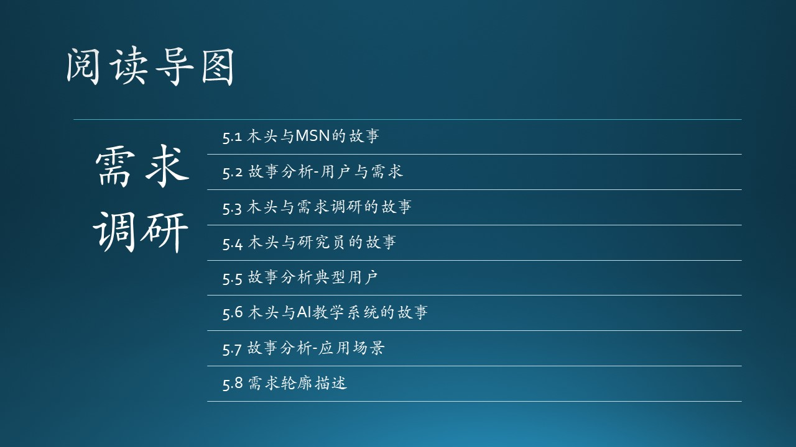

（插入一些说明性文字，重点在介绍上下文，串连）

### 参考资料

- [1] 科技怪人：曾经有一个聊天工具叫MSN，https://mini.eastday.com/a/190821074638925-8.html
- [2] 我们在为谁做产品，https://zhuanlan.zhihu.com/p/25230310
- [3] 应用场景，https://www.zhihu.com/question/20515576/answer/15375358
- [4] 《构建之法》，邹欣
- [5] 英语词源 https://www.tjxz.cc/26456
- [6] 用户画像 http://www.woshipm.com/operate/707658.html