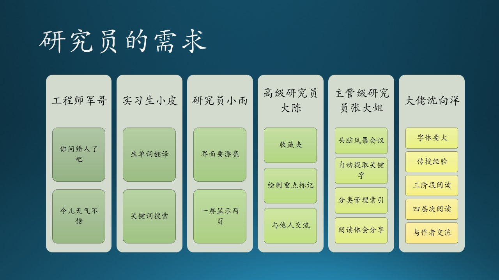

# 5.4 木头与研究员的故事

7月份到了，微软一年一度的 Hackathon（黑客马拉松）又要开始了！虽然前几年做的项目一个奖都没拿到，但是木头还是跃跃欲试地琢磨今年要做什么有趣的项目了。

MSRA 的研究员很多，木头经常看到有人打印了一些已经发表的论文在纸上，边阅读边用笔在上面写写画画做标记。在很多情况下，写一篇论文要阅读十几篇论文。研究员们是如何做这些论文管理的呢？能否做一个工具帮助到大家呢？

怀着好奇的心情，木头和几个同事进行了简单的访谈。图 5.4.1 概要展示了用户的基本需求。

图 5.4.1 - 研究员的需求

## 5.4.1 工程师军儿哥

军儿哥，北京人，经常一起和木头打台球，爱听摇滚，走路晃晃悠悠的。左侧的耳朵受过伤，所以他一般坐在你的左侧，以便用右侧的耳朵听对方说话。如果面对面的谈话，他经常会偏过头来听，很认真的样子，这就是所谓的“侧耳倾听”。

木头：我想做一个辅助读论文的工具，你觉得咋样？

军儿哥：哥们儿你问错人了吧，我哪儿懂论文那玩意儿呀？

木头：......今天天气不错哈......

军儿哥：那是！我这戒烟好几天了都！

## 5.4.2 实习生小皮

小皮，武汉人，来研究院实习一年多了，满头蓬松杂乱的头发，总是一副睡不醒的样子。

木头：还在为你的第一篇论文而努力吗？

小皮：（揉揉困倦的眼皮）是呀！要参考的论文好多好多，都看晕了！

木头：你觉得有个工具能辅助你读论文的话，会不会有帮助？

小皮：真的有这种工具吗？快给我看看！

木头：......哦，我是说想做一个......

小皮：嗐！我白高兴了，你怎么大喘气啊？我的科技英语现在还不好，如果有工具能帮我自动翻译生词就好了！尤其是计算机视觉领域的论文，好多生词！

木头：这个容易！还有其它的需要吗？

小皮：如果能找到某个关键词的 Bing（必应）搜素结果也很有帮助！

木头：嗯嗯，我记下来！还有吗？

小皮：那个......论文尾部的那些参考论文，能点击一下自动下载打开的话，就完美了！

木头：这个（咬咬牙）......可以有！

## 5.4.3 研究员小雨

小雨，上海人，五官小巧，说话声音很好听。兼顾的项目很多，所以经常会丢三落四，有时候也会因为早晨找不到袜子而穿凉鞋出门，但仍然从骨子里透出一股优雅的气质。

木头：我要做个阅读论文的辅助工具，你希望做成什么样子？

小雨：哦！好极啦！界面一定要漂亮，否则我不用的哦！

木头：（挠挠头）......好吧......功能上没有什么需要吗？

小雨：有的有的呀！现在电脑屏幕都好大的呀，能不能一屏显示两页的呀？

木头：可以的呀！

小雨：那能同时显示两篇论文吗？做对比很方便的呀！

木头：嗯嗯，好主意的呀！

小雨：那个字体呀、图标呀、颜色呀，都要很 fancy（好看）的才好的呀！

木头：好的呀好的呀！

## 5.4.4 高级研究员大陈

大陈是重庆人，为人诚恳热情，总是笑眯眯的表情。经常拿着一个 iPAD 看论文，按他自己的话说是“假装看论文”，我总说他是“看假论文”。他和木头是老朋友了，谈话直接了当。

木头：我要做个论文阅读辅助工具，你老实交代读论文时有什么痛点？

大陈：论文太多啦！东一篇西一篇的，我的浏览器的收藏夹里已经100多篇论文了，找起来特麻烦！

木头：你删掉它们不行呀？

大陈：万一以后要看呢？还得再去找，更麻烦。

木头：好吧。我看你经常打印出来看论文，还在上面做标记。

大陈：对，把重点画出来，下次再看时一目了然，别的地方都不用看了。

木头：好方法！还有别的什么需求？

大陈：其实我特想知道其它人看这篇论文时有什么习惯，比如大家都做标记吗？写注释吗？可是在 MSRA 研究区块链的就我一个人，我也找不到可以交流的人。

木头：嗯嗯......（记在小本本上）。

## 5.4.5 主管级研究员张大姐

张大姐是老炮儿了，在机器学习领域十多年耕耘，硕果累累，如今带了十几个研究员工作。张大姐语速超快，木头只得全神贯注地倾听，不敢落下节奏，否则就跟不上了。

木头：张大姐，我想做一个读论文的辅助工具，您阅“文”无数，是否可以提供一些经验技巧，能分享给大家的？

张大姐：（思考了一下）......嗯，我现在自己读论文虽然不需要什么帮助，但是我看到我手下的其它研究员们还是需要一些帮助的。比如，今年的 NIPS 还有五个月就要开了，大家还没有什么好的主意，这个很让人着急。

木头：那......（被张大姐打断）

张大姐：历年 NIPS 的论文能不能自动爬出来，给大家看？哦，不！还应该自动提取关键字，做初步晒选，然后再分给不同的人看。然后再交换着看。

木头：这......（被张大姐打断）

张大姐：各个不同会议的论文最好分门别类地管理，要根据引用数量排序，如果是 Best Paper（会议最佳论文）要重点标记出来，已经阅读下载人数最好也能显示出来，这样我们会有针对性地避开一些热点。

木头：我......（被张大姐打断）

张大姐：大家各自的阅读体会最好能共享出来，便于开会时讨论，比如：这篇论文哪里好，哪里没说清楚，哪里可以改进，如果我写的话会把重点放在什么地方，它解决了人们的痛点吗，或者它指出了一个什么新的方向吗？

......

木头后悔没带录音笔来，记了密密麻麻一大堆，满头大汗地走出了张大姐的办公室，感觉被打断的不仅仅是话头，还有肋骨与智商。

## 5.4.6 大佬沈向洋

最不可思议的是，木头还得到了和大佬 Harry Shum（沈向洋）1:1（读做one on one，二人面对面谈话）的机会。

Harry：“听说你要做个工具，很好呀！先说几点自己读论文的现状吧：

1. 每天坚持读论文，跟上最新研究成果；
2. 岁数大了，眼睛有些花，读纸上的论文很费劲了，字太小；
3. 想把读写论文的经验传授给年轻人。

“我正好在教一门课，训练实习生们如何阅读论文。我觉得读论文要分三个阶段：

1. Fast Reading（快速阅读）
2. Intensive Reading（精读）
3. Analyze Reading（研读）

“每个阶段达到不同的目的。在读的时候，还要带着不同的态度，一遍一遍地重复读，比如：

1. Passive Reading（被动地读）
2. Active Reading（主动地读）
3. Critical Reading（批判地读）
4. Creative Reading（有创造性地读）

“这样才能真正领会一篇论文的精髓，好论文就要这样读。还有就是我总会想：

1. 如何才能和作者交流呢？
2. 我真的领会作者的原意了吗？
3. 其它人有类似的想法吗？
4. 大家能聚在一起讨论吗？

......

Harry 的话条理清晰，木头听得频频点头，不时地发表一下自己微不足道的看法，但是总能得到 Harry 的肯定。

最后 Harry 站起来，有力地和木头握手，说：“希望你能把它做出来，然后咱们再一起看一下！”
