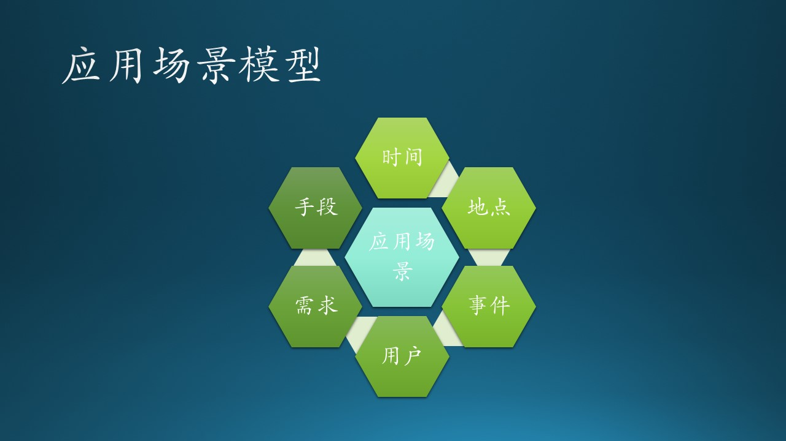
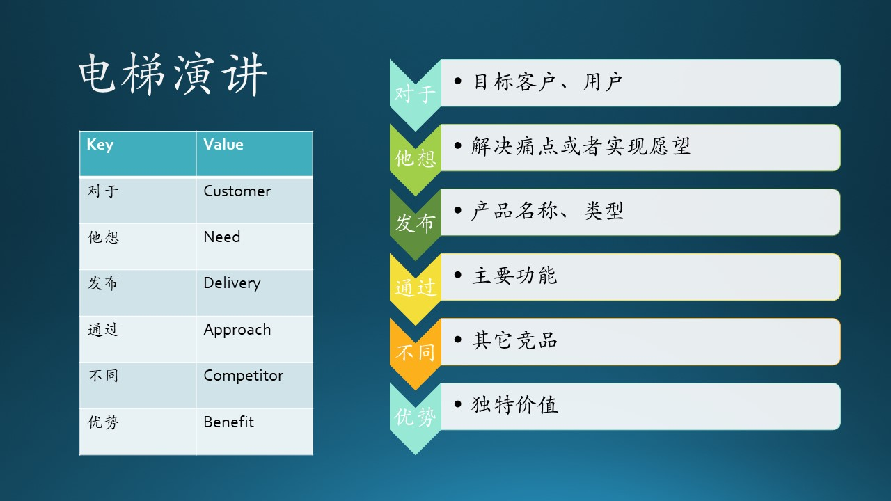

# 5.7 故事分析-应用场景

## 5.7.1 应用场景（Scenario）

### 为什么要使用应用场景方法

在传统的软件开发流程中，产品经理会提供一份功能列表，其中会有类似与这种的描述：

- 学生可以提交自己的作业（代码或者模型）；
- 有一个自动评分系统辅助（而不是老师去判作业）；
- 评分系统可以发送结果通知，到微信或者邮件或者短信；
- 评分系统可以给出全班同学的作业成绩排名。

这种功能列表所使用的描述方式往往是以程序实现逻辑为导向的，弊端是：

- PM 有可能是看到了竞争对手的宣传资料，而非分析了用户的真实需求；
- Designer 因为没有上下文而不知道如何做交互和视觉设计；
- 系统设计人员不能直接体会到该功能的具体用途，从而不知道其在整个系统的地位如何；
- 开发工程师是最苦的，因为可能性太多，而无法动手实现。

使用故事的方式描述需求，相当于还原了用户的真实生活，所有项目成员都用上帝视角来观察用户行为，知道这个功能是为了帮助用户解决什么问题，发生频率，需求强度，用户能力，辅助工具等等。大家可以及时表达意见，否决不靠谱的功能，对有价值的功能重点关注。

### 模型

图 5.7.1 展示了应用场景模型所包含的必备元素。

图 5.7.1 - 应用场景模型

中学语文课中，我们学到过的叙事文的结构，需要时间、人物、地点、事件、发生、发展、结果等等。应用场景和叙事文一样，应该有以下基本元素，构成完整的场景模型：

- 时间（when）
  
  比如老师在晚上是要备课，而在白天要上课；学生在晚上要复习、预习，白天上课。

- 地点（where）
  
  老师在办公室要备课，在教室要讲课写板书；学生在实验室要做作业，在课堂要听讲做笔记。

- 事件（what）

  学生和老师都来到电教室，开始上课。

- 特定类型的用户（who）
  
  老师或学生，进一步细化，是在电教室上课的老师和学生。其它的在普通教室上课的老师和学生不符合这个场景。

- 需求（need）
  
  老师需要使用 PPT 展示课件，在屏幕上写板书；学生要通过系统提交实验作业。

- 满足需求的手段（way）
  
  给老师配备 Azure、Surface Hub、Office 等软硬件设备，给学生提供自动作业系统。

## 5.7.2 功能提取

图 5.7.2 - 功能提取过程

有了场景故事后，下面要做的事就是功能提取。图 5.7.2 展示了基本的提取过程：

1. 找到人物（使用者），比如老师、学生、管理员等；
2. 找到动作，比如登录、提交、保存等；
3. 找到对象，比如作业、课件、数据、模型等；
4. 找到设备，比如 Azure、Surface Hub、网络等；
5. 找到一些特殊要求，比如数量、时间等。

### 学生场景功能提取

通过毛毛同学的故事场景，我们可以知道一个电教系统所需要的基本功能：

1. 是一个网站，可以部署在校园网或者 Azure 上；
2. 要求 7x24 小时运行；
3. 支持并发用户数最大为在校学生数，但是考虑到忙时时段并发，可以用在校学生数除以 10 来配置；
4. 学生需要使用自己的用户名和密码登录；
5. 学生入校和离校，需要有用户注册、注销功能；
6. 学生可以提交自己的作业（代码或者模型）；
7. 有一个自动评分系统辅助（而不是老师去判作业）；
8. 对于机器学习模型类的作业，有非公开的测试数据；
9. 还必须有可以运行模型推理的环节，比如 Python + PyTorch；
10. 评分系统可以发送结果通知，到微信或者邮件或者短信；
11. 评分系统可以给出全班同学的作业成绩排名；
12. 作业系统是否可以运行二次提交作业，不确定

### 老师场景功能提取

通过木头老师的故事场景，我们可以知道一个教学实验系统所需要的基本功能：

1. 是一个网站，可以部署在校园网或者 Azure 上；
2. 要求白天时段运行，即 5x8 小时；
3. 支持并发用户数最大为两个班的同学数量（因为这类系统比较贵，学校只能配备一两个电教教室）；
4. 需要有可支持手写（笔）的宽屏幕，如 Surface Hub（微软的手写大屏幕硬件，配有定制的 Windows 10 操作系统）；
5. 手写（笔）数据可以保存为矢量或者图像，作为板书记录；
6. 系统是 Windows 操作系统，可以安装 Office 办公套件；
7. 系统本身可以上网，或连接 Azure；
8. 有一个交互式软件可以支持使用拖拽方式搭建神经网络模型；
9. 后台连接有多任务训练系统（如OpenPAI）；
10. 训练系统中最好配置有单块或多块 GPU
11. 训练系统可以做任务调度，如排队、训练、保存模型、输出状态信息和最终结果等等；
12. 系统搭建在 Azure 虚拟机上，按使用时长付费，非常便宜；
13. 电教室可以录像，录制整个教学过程，以便回顾。

## 5.7.3 特性（Feature）与功能（Function）的关系

产品特性（feature），是指一组逻辑上相关的功能需求，它们为用户提供某项功能，使业务目标得以满足。对商业软件而言，特性则是一组能被客户识别，并帮助他决定是否购买的需求，也就是产品说明书中用着重号标明的部分。

比如微软最新发布的 Edge 浏览器，有一个特性（feature）叫做 Save money with price comparison，意思是通过比较（商品价格）来省钱。这个特性通过 Collections（收藏集）来实现，而 Collections 里面又包含一堆的操作，如增加、删除、移动等等功能。

图 5.7.3 - 特性与功能

有另外一种观点认为特性可以是非常小的一个功能点，比如：

- 按钮的形状和颜色
- 手机 APP 内换页时是否有过渡动画
- 广告是否动态更换图片

笔者认为这也是未尝不可的，主要依赖上下文，不要让其它人造成误解即可。在微软所谓的 Feature Team 其实也是大大小小的特性都要考虑的，不会严格区分特性与功能的区别。

具有讽刺意味的是，“特性”往往是市场人员想出来的一种称谓，非常贴合用户的一些心理预期，比如“省钱”。而且一般是先有功能，然后才会有人把一些功能组合在一起成为“特性”，所以特性并非天然存在。
