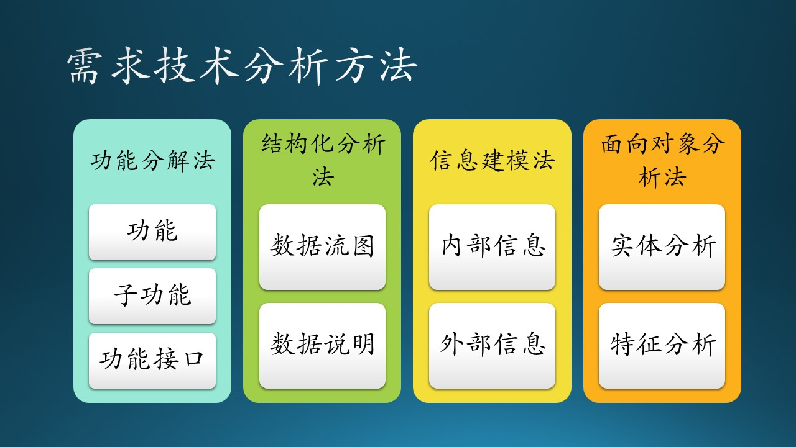
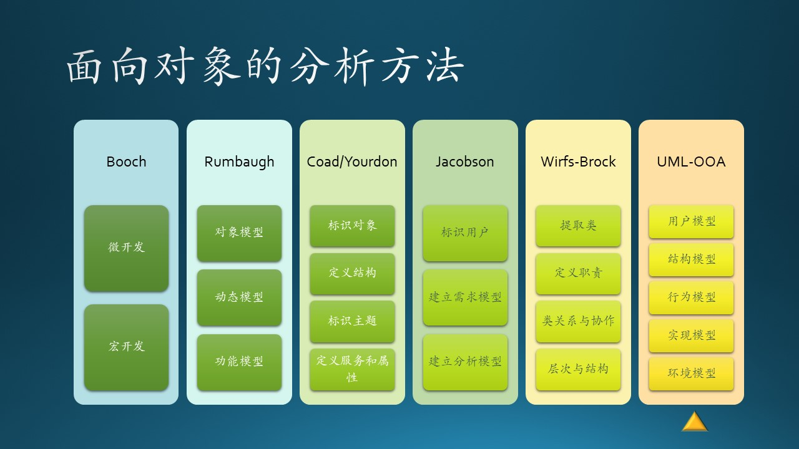
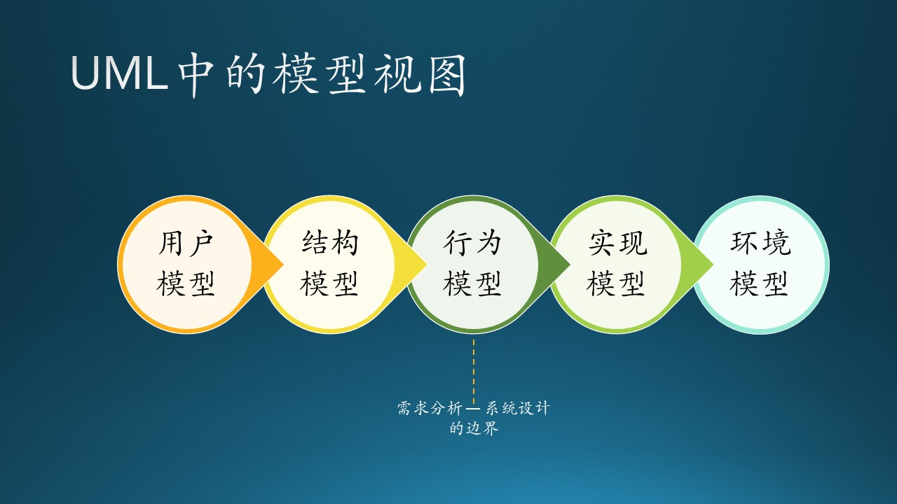

# 6.6 需求技术分析

目前，软件需求的技术分析方法较多，如图 6.6.1 所示，有一些大同小异，而有的则基本思路相差很大，比如有自下而上的，也有自上而下的，这两者的思路正好相反。笔者提倡自上而下由全局出发全面规划分析，然后逐步设计实现。

图 6.6.1 - 需求技术分析的各种方法

在这一节中，我们泛泛地介绍各种需求技术分析方法，只要求大家知道有这些方法存在，不要求全部掌握，有兴趣的读者可以自己做深入研究。最后我们会详细介绍面向对象的分析方法，这是本书中要重点介绍的方法。

## 6.6.1 各种软件需求分析方法

从系统分析出发，可将需求分析方法大致分为功能分解方法、结构化分析方法、信息建模法和面向对象的分析方法。$^{[1]}$

- 功能分解方法

  将新系统作为多功能模块的组合，各功能也可分解为若干子功能及接口，子功能再继续分解，便可得到系统的雏形，即公式 6.6.1 所示：

$$
功能分解 = 功能 + 子功能 + 功能接口 \tag{6.6.1}
$$

- 结构化分析方法

  结构化分析方法是由数据流图和数据词典构成并表示，所以此分析法又称为数据流法。其基本策略是跟踪数据流，即研究问题域中数据流动方式及在各个环节上所进行的处理，从而发现数据流和加工方法。结构化分析可定义为数据流、数据处理或加工、数据存储、端点、处理说明和数据字典。

$$
\begin{aligned}
数据流图 =& 数据流 + 数据处理 + 数据存储 + 端点 \\
数据说明 =& 端点 + 处理说明 + 数据字典 \\
结构化分析 =& 数据流图 + 数据说明 \tag{6.6.2}
\end{aligned}
$$

- 信息建模方法

  信息建模可定义为实体或对象、属性、关系、父类型/子类型和关联对象。此方法的核心概念是实体和关系，最初由 P.P.S. Chen 在1976年提出，基本工具是 E-R 图。1981年 M.Flavin 改进后称之为信息建模法，后来又发展为语义数据建模法，并引入了面向对象的特定。其基本要素由实体、属性和联系构成。该方法的基本策略是从现实中找出实体，然后再用属性进行描述。

$$
\begin{aligned}
内部信息 =& 实体或对象 + 属性 \\
外部信息 =& 关系 + 父子类型 + 关联对象 \\
信息建模 =& 内部信息 + 外部信息 \tag{6.6.3}
\end{aligned}
$$

- 面向对象的分析方法

  面向对象的分析方法的关键是识别问题域内的对象，分析它们之间的关系，并建立三类模型，即：

  - 对象模型
  - 动态模型
  - 功能模型

  面向对象主要考虑类或对象、结构与连接、继承和封装、消息通信，只表示面向对象的分析中几项最重要特征。类或对象是对问题域中事物的完整映射，包括事物的数据特征（即属性）和行为特征（即服务）。

$$
\begin{aligned}
实体 =& 对象或类 + 结构与连接 \\
特征 =& 继承 + 封装 + 消息通信 \\
 =& 数据特征 + 行为特征 \\
面向对象分析 =& 实体分析 + 特征分析 \tag{6.6.4}
\end{aligned}
$$

由于面向对象分析方法的先进性和重要性，我们在下面着重介绍一下。

## 6.6.2 面向对象的分析方法

OOA（Objec-Oriented Analysis），面向对象的分析方法，目前已经衍生出许多方法，每种方法都有各自的进行产品或系统分析的过程，有一组可描述过程演进的图形标识，以及能使得软件工程师以一致的方式建立模型的符号体系。

图 6.6.2 - 面向对象的需求分析方法

现在广泛使用的 OOA 方法有以下几种：

### Booch 方法

Booch 方法包含“微开发过程”和“宏开发过程”。微开发过程定义了一组任务，并在宏开发过程的每一步骤中反复使用它们，以维持演进途径。Booch OOA 宏开发过程的任务包括标识类和对象、标识类和对象的语义、定义类与对象间的关系，以及进行一系列求精从而实现分析模型。

### Rumbaugh 方法

Rumbaugh 和他的同事提出的对象模型化技术（OMT）用于分析、系统设计和对象级设计 。分析活动建立三个模型：对象模型（描述对象、类、层次和关系），动态模型（描述对象和系统的行为），功能模型（类似于高层的DFD，描述穿越系统的信息流）。

1. 建立对象模型

   面向对象分析首要的工作，是建立问题域的对象模型。这个模型描述了现实世界中的“类与对象”以及它们之间的关系，表示了目标系统的静态数据结构。静态数据结构对应用细节依赖较少，比较容易确定；当用户的需求变化时，静态数据结构相对来说比较稳定。因此，用面向对象方法开发绝大多数软件时，都首先建立对象模型，然后再建立另外两个子模型。

   对象模型通常有5个层次，基本的工作步骤是：

   - 确定对象和类（object and class）
      
     这里所说的对象是对数据及其处理方式的抽象，它反映了系统保存和处理现实世界总某些事物的信息能力。
     
     类是多个对象的共同属性和方法集合的描述，它包括如何在一个类中建立一个新对象的描述。

   - 确定结构（structure）
  
     结构是指问题域的复杂性和连接关系。类成员结构反映了泛化—特化关系，整体—部分结构反映整体和局部之间的关系。

   - 确定主题（subject）
    
     主题是指事物的总体概貌和总体分析模型。

   - 确定属性（attribute）

     属性就是数据元素，可用来描述对象或分类结构的实例。

   - 确定方法（method）
    
     方法是在收到消息后必须进行的一些处理方法。

2. 建立动态模型

   - 第一步，编写典型交互行为的脚本。虽然脚本中不可能包括每个偶然事件，但是，至少必须保证不遗漏常见的交互行为。
   - 第二步，从脚本中提取出事件，确定触发每个事件的动作对象以及接受事件的目标对象。
   - 第三步，排列事件发生的次序，确定每个对象可能有的状态及状态间的转换关系，并用状态图描绘它们。
   - 最后，比较各个对象的状态图，检查它们之间的一致性，确保事件之间的匹配。

3. 建立功能模型

   功能模型表明了系统中数据之间的依赖关系，以及有关的数据处理功能，它由一组数据流图组成。其中的处理功能可以用IPO（Input/Processing/Output，输入/处理/输出）图（或表）、伪码等多种方式进一步描述。通常在建立对象模型和动态模型之后再建立功能模型。

### Coad 和 Yourdon 方法

Coad 和 Yourdon 方法常常被认为是最容易学习的 OOA 方法。建模符号相当简单，而且开发分析模型的导引直接明了。其 OOA 过程概述如下：

1. 使用“要找什么”准则标识对象；
2. 定义对象之间的一般化∕特殊化结构；
3. 定义对象之间的整体∕部分结构；
4. 标识主题（系统构件的表示）；
5. 定义属性及对象之间的实例连接；
6. 定义服务及对象之间的消息连接。

### Jacobson方法

也称为 OOSE（面向对象软件工程）。Jacobson方法与其他方法的不同之处在于他特别强调使用实例（use case）——用以描述用户与系统之间如何交互的场景。Jacobson方法概述如下：

1. 标识系统的用户和它们的整体责任；
2. 通过定义参与者及其职责、使用实例、对象和关系的初步视图，建立需求模型；
3. 通过标识界面对象、建立界面对象的结构视图、表示对象行为、分离出每个对象的子系统和模型，建立分析模型。

### Wirfs-Brock 方法

Wirfs-Brock 方法不明确区分分析和设计任务。从评估客户规格说明到设计完成，是一个连续的过程。与 Wirfs-Brock 分析有关的任务概述如下：

1. 评估客户规格说明；
2. 使用语法分析从规格说明中提取候选类；
3. 将类分组以表示超类；
4. 定义每一个类的职责；
5. 将职责赋予每个类；
6. 标识类之间的关系；
7. 基于职责定义类之间的协作；
8. 建立类的层次表示；
9. 构造系统的协作图。

### 统一的OOA方法（UML）

统一的建模语言（UML）已经在企业中广泛使用，它把Booch、Rumbaugh和Jacobson 等各自独立的 OOA 和 OOD 方法中最优秀的特色组合成一个统一的方法。UML 允许软件工程师使用由一组语法的语义的实用的规则支配的符号来表示分析模型。

在UML中用5种不同的视图来表示一个系统，这些视图从不同的侧面描述系统。每一个视图由一组图形来定义。这些视图形成一个序列，如图 6.6.3 所示：

图 6.6.3 - UML 中的模型视图

1. 用户模型视图：这个视图从用户（ 在UML中叫做参与者）角度来表示系统。它使用用例（use case）来建立模型，并用它来描述来自终端用户方面的可用的场景，在 6.7 节中讲述。
   
2. 结构模型视图：从系统内部来看数据和功能，即对静态结构（类、对象和关系）模型化，在 6.8 节中讲述。
   
3. 行为模型视图：这种视图表示了系统状态和行为，还描述了在用户模型视图和结构模型视图中所描述的各种结构元素之间的交互和协作，在 6.9 节中讲述。
   
4. 实现模型视图：将系统的结构和行为表达成为易于转换为实现的方式，在本书的第 5 部分中讲述。
   
5. 环境模型视图：表示系统实现环境的结构和行为，在本书的第 5 部分中讲述。

通常，UML 分析建模的注意力放在系统的用户模型和结构模型视图，而 UML 设计建模则定位在行为模型、实现模型和环境模型。

## 6.6.3 划分需求分析与系统设计的边界

在 OOA 方法中，要求建立对象模型、动态模型、功能模型。其实 OOA 这个理论本身是一种系统分析的技能，对很多“需求分析”的内容并不涵盖。在很多资料上并没有介绍具体如何做，导致很多人在实践中把分析和设计阶段的任务混为一谈。

为什么这种情况能一直持续下去呢，一个重要原因是在一般的软件公司里，总会有一位“领域专家”，往往是他/她既做需求分析，又做系统设计。在微软其实也是这样，没有各自独立的角色分别做需求分析和系统设计两件事，往往是一个从底层做起的程序员，逐渐成长为领域专家后，再去负责需求分析与系统设计的工作。这样做的问题是：

1. 他/她在做需求分析（做什么）的时候，脑子里会不自觉地想到如何去实现（如何做），这样就混淆了“做什么”和“如何做”；
2. 写出来的文档没有边界；
3. 定义出来的类会让后续的开发人员感觉到限制；
4. 隐藏了一些真实的用户需求，而用自己的理解直接代替。

用一个简单的比喻帮助大家理理解它们的分界线：我们在做需求分析的时候，可以把每个角色、实体、模块等等都看作一个鸡蛋，它们在需求分析阶段都是不透明的，我们也不需要在需求分析阶段去窥探鸡蛋内部的构造，否则的话，我们会得到一堆破鸡蛋——所有的蛋液流出来并混在一起，造成无法进行下一步的分析。

这个鸡蛋壳，就处于上述的“统一的 OOA 方法”的5个视图中的第3个上。

笔者在多年的软件工程实践中也总结出了一套方法，经过与各种模型、理论的对比，发现竟然与“统一的 OOA 方法”完全一致！所以，我们会在后续的章节中通过真实的案例继续介绍这种方法。

