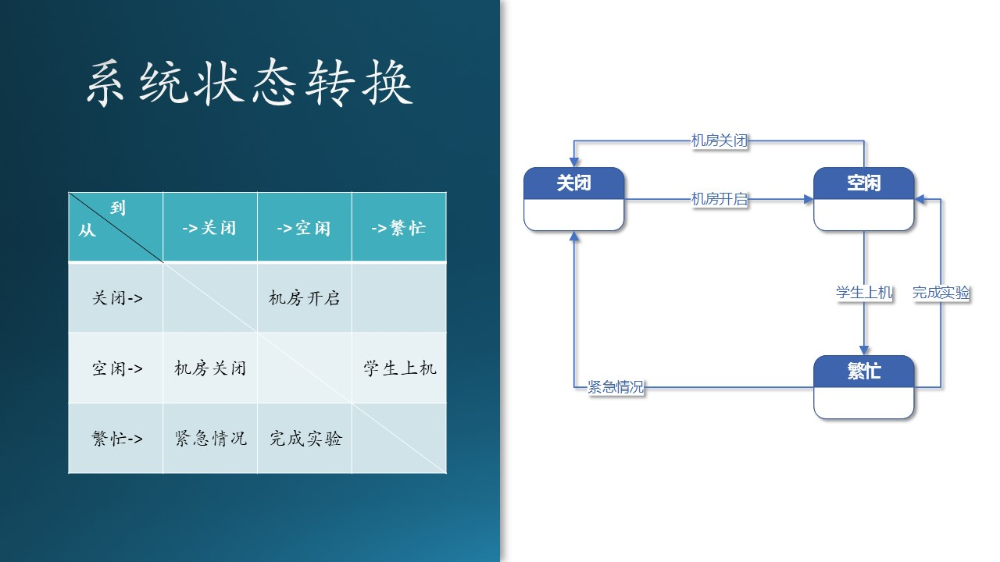

# 6.9 状态转换与行为模型

在这一步中，我们会建立“行为模型视图”，这种视图表示了：

- 系统动态和行为，或者是对象的状态和行为；
  
- 还描述了在用户模型视图和结构模型视图中所描述的各种结构元素之间的交互和协作。

请注意：到了这里已经快接近设计范畴了，也就是说，我们已经快破开鸡蛋壳了，一旦破壳，就会进入设计的大门。所以到了这一步，是需求分析的最后一个环节了。说到底，需求分析和系统设计也不是完全隔离的，所以在这一步里有些交融也是合理的。

## 6.9.1 对象级别的状态转换

State Machine，状态转换（迁移）图是描述对象的状态在响应外部的信号后进行转换的一种图形表示。

### 需求分析阶段的状态转换分析

图 6.9.1 - 对象级别的状态转换（需求分析阶段）

我们以作业对象为例，绘制出状态转换图，如图 6.9.1。我们可以看到四种图例：

1. 起始和终止状态，圆形；
2. 状态，被观察到的对象行为模式，用圆角矩形表示；
3. 事件或行为，引起状态转换的外界事件，用有方向的连接线表示；
4. 菱形，判断条件。

在需求分析阶段，是对现实世界做状态转换分析。

1. “启示”状态：老师布置作业。比如，老师在课堂上布置作业：“同学们回去后把 CNN 的模型在 Cifar-10 数据集上再跑一遍，自己调参，看看准确率如何”；

2. 学生听到后，把内容记录在小本子上，状态为“已接收”；

3. 学生课下做试验，调整参数，把自己最满意的结果记录下来，成为作业上交，状态为“已提交”；

4. 老师接收到作业后进行批改评测，并把分数记录在案，状态为“已批改”；

5. 如果有不合格的作业，则打回给学生重新做，状态变回“已提交”；

6. 合格的作业最后会回到“终止”状态。

## 6.9.2 系统级别的状态转换

前面我们介绍的是某个对象（类）的微观状态转换，对于一个大系统来说，也是有状态转换的，比如传统的机房系统，如图 6.9.3 所示：

图 6.9.3 - 系统状态转换

转换过程解释：

1. 平时，机房处于关闭状态，节省电力，封闭管理硬件资源；
2. 机房管理员可以开启机房，达到空闲状态；
3. 也可以关闭系统，从空闲状态返回关闭状态；
4. 有学生上机时，系统进入繁忙状态；
5. 所有学生完成实验后，系统从繁忙状态返回空闲状态；
6. 如果有紧急情况发生，比如火灾、地震等，机房管理员会直接关闭所有电源，回到关闭状态。

