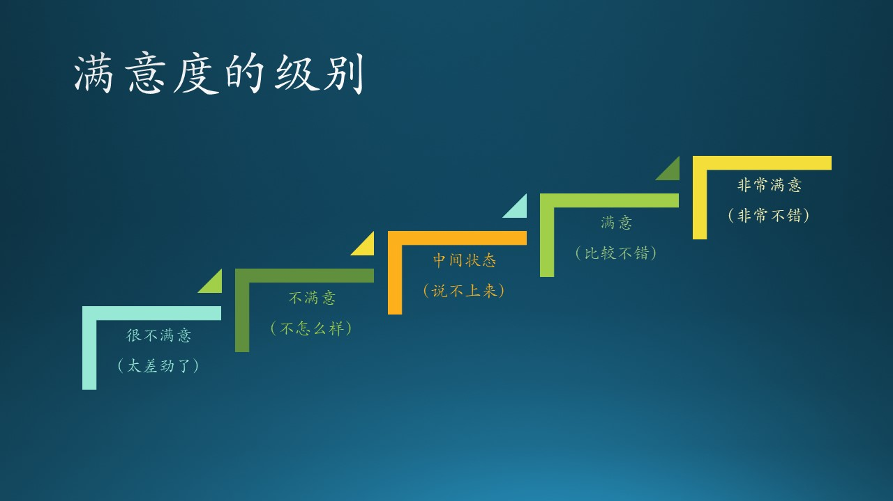
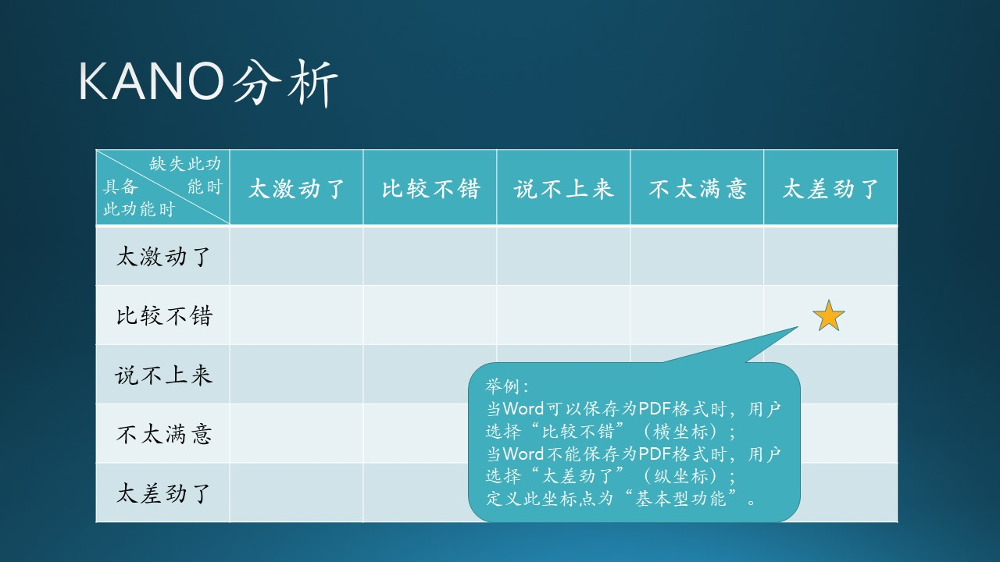
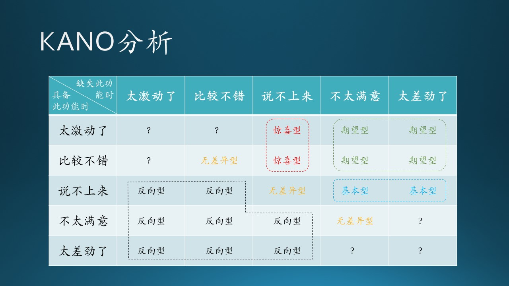
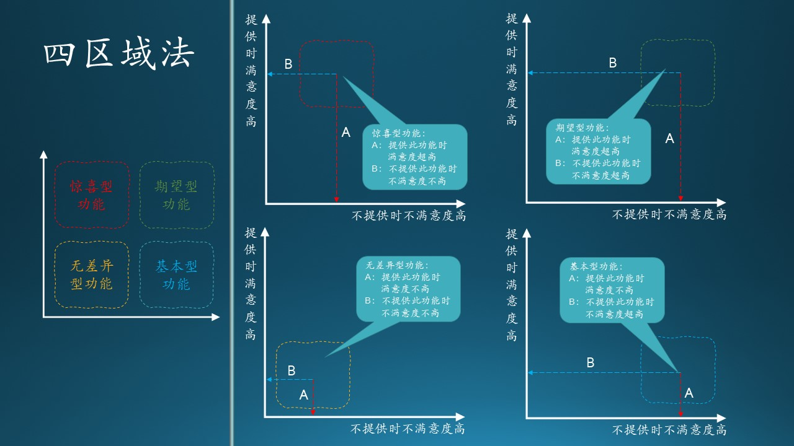
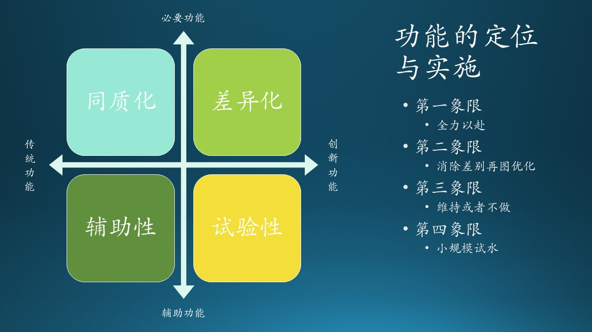
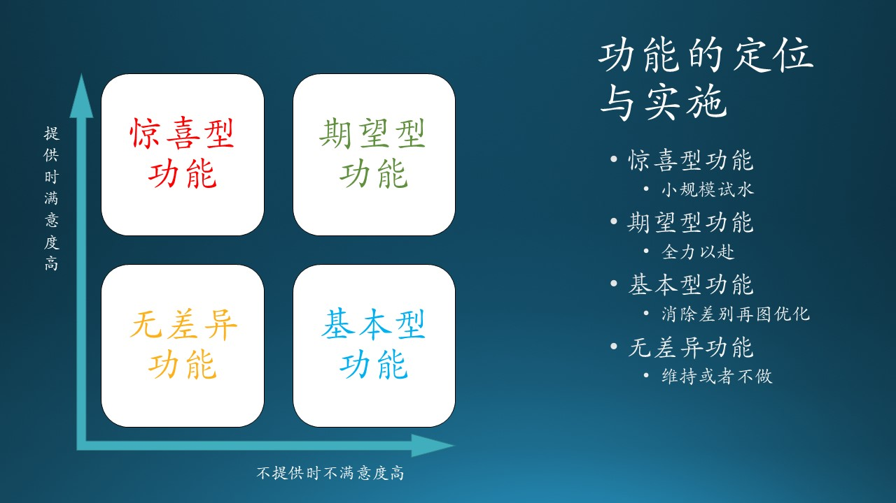

# 7.2 满意度分析

## 7.2.1 用户满意度的五种级别

图 6.9.1 - 类内状态转换图

对任何事物的好坏的判断，用户的态度一般不是非此即彼的0/1问题，而是有一个过渡。在微软面试中，要求面试官给“Hire”或“No hire”，但有时候太难选择了，所以会出现一个“Weak hire”的选择，尽管不是官方要求的。

由于笔者喜欢流行音乐（还在微软内部组建了一支乐队），所以经常看一些音乐节目，如《歌手》、《乐队的夏天》。节目组通常让普通观众选择“是否喜欢一个歌手或一支乐队”，其实这非常的不合理。观众并非总是理智的，往往凭借一些非常奇怪的原因决定“喜欢”还是“不喜欢”，比如“我不喜欢那个贝斯手的发型”，这就偏离了比赛的本来用意。

但是另一方面，在《乐队的夏天》中，节目组会给专业乐迷五分制的投票权力。同理，在调查用户的满意度时，一般也会使用五种级别作为一个平滑过渡的设计。下表就是五种级别和对应的口语化形象描述：

表 7.2.1 - 满意度的五种级别

|非常满意|满意|中间状态|不满意|很不满意|
|--|--|--|--|--|
|太激动了|比较不错|说不上来|不怎么样|太差劲了|

在使用 KANO 模型时，一般采用调查问卷的形式，即正反两个方向的问题：

- 正向问题 A：如果Word可以保存为PDF格式，用户的感觉是什么？
- 反向问题 B：如果Word不能保存为PDF格式，用户的感觉是什么？

|级别|描述|正向问题 A|反向问题 B|
|:--:|--|:--:|:--:|
|1|太激动了||
|2|比较不错|$\sqrt{}$|
|3|说不上来||
|4|不怎么样||
|5|太差劲了||$\sqrt{}$|

图 6.9.1 - 类内状态转换图

于是我们在上图中的坐标（2，5）做一个标记，表示问题 A 和问题 B 的交点位置。

## 7.2.2 定性分析

再进一步，通过对问题 A 和 B 的分析，结合上一节所述的产品的五类功能，我们认为“Word可以保存为PDF格式”这个功能是一个期望型功能。这样，就可以得到一个功能的分类了。

为什么定位为“期望型”功能呢？我们看看“期望型”功能的定义：

*也称为意愿型功能，是指用户的满意状况与功能的满足程度成比例关系的功能，此类功能得到满足或表现良好的话，用户满意度会显著增加。当此类功能得不到满足或表现不好的话，用户的不满也会显著增加。*

再看一下：

- 问题 A 的用户反馈是“比较不错”，即“此类功能得到满足或表现良好的话，用户满意度会显著增加”；

- 问题 B 的用户反馈是“太差劲了”，即“当此类功能得不到满足或表现不好的话，用户的不满也会显著增加”。

正反两个方面的回答完全符合期望型功能的定义。

通过对不同的问题得到的交点位置做分析，我们可以得到所有25个交点所属的功能分类，如下图：

图 6.9.1 - 类内状态转换图

可以看到：
- 中间有两个红色的“惊喜型”
- 右上角是绿色的“期望型”
- 右侧有两个蓝色的“基本型”
- 对角线上有三个黄色的“无差异型”
- 左下角是一堆“反向型”

以此方法，我们就得出了每个功能所属的分类。

还有几个问号所处的位置，是不可能出现的分类。比如左上角的那个问号，相当于问：
- A) 如果有功能F，用户满意吗？用户答“太激动了”；
- B) 如果没有功能F，用户满意吗？用户答“太激动了”。

从逻辑上分析，如果问题A得到肯定的回答，那么不可能也会对问题B有肯定的回答。其它几个问号都是类似的情况。

不同的人对图中交叉点的位置所属类型的持有不同的观点，图中只是笔者自己的观点。

## 7.2.3 定量分析

KANO 图还可以有定量分析，但是需要大量的调查问卷数据，比较难以实现，所以我们在此只是讲解一下定量分析的结论：四区域分类法。至于定量分析的过程，有兴趣的同学可以参考相应的资料$^{[2]}$。

关于“四区域分类法”，在很多资料中，包括笔者给的参考资料中，有的写四象限法，有的写四分位法，这都是错误的命名。我们先解释四区域法的分析过程，后面再说上面两种叫法为什么是错误的。

笔者发现，即使不计算 better-worse 系数$^{[2]}$，也可以得到同样的结果：在图？？中，各个区域有明显的分割线：

- 首先，我们不考虑问号的情况，因为它无意义；
- 其次，我们不考虑反向型的功能，因为它比较容易分辨；
- 在惊喜型和期望型之间，有一条竖的分割线；
- 在期望型和基本型之间，有一条横的分割线；
- 把无差异型的范围稍微缩小一些。

然后我们可以得到一个四部分的区域图：

图 6.9.1 - 类内状态转换图

四个图中的坐标轴的含义是相同的：

- 横坐标：不提供某个功能时，用户会的不满意程度，从左到右增加，用线 B 的长度表示；
- 纵坐标：提供某个功能时，用户的满意程度，从下到上增加，用线 A 的长度表示。

### 惊喜型功能

处于左上角的区域。

- 当提供此功能时，A 的长度显著增加，表示满意度剧增；
- 当不提供此功能时，B 的长度没有显著增加，表示没有很大的不满意。

### 期望型功能

处于右上角的区域。

- 当提供此功能时，A 的长度显著增加，表示很满意；
- 当不提供此功能时，B 的长度显著增加，表示很不满意。

### 无差异功能

处于左下角的区域。

- 当提供此功能时，A 的长度没有显著增加，表示满意度不高；
- 当不提供此功能时，B 的长度没有显著增加，表示没有很大的不满意。

### 基础型功能

处于右下角的区域。

- 当提供此功能时，A 的长度没有显著增加，表示满意度不高；
- 当不提供此功能时，B 的显著增加，表示有很大的不满意。

我们再回过头说说上面提到的两种错误叫法：

- 四象限法：象限是指平面直角坐标系上，由横纵坐标轴所分割的四个区域，以零点为中心。我们所面对的问题虽然是处于平面直角坐标系上，但是零点在左下角，四个区域都是在第一象限。

- 四分位法：四分位是统计学的一个名词，是指处于一维坐标上的数据中，处于25%分位和75%分位的数值。我们所面对的问题是一个二维平面上的分类问题，不能使用四分位的叫法。

## 7.2.4 竞争策略

根据 KANO 模型，我们得到了四个区域的功能划分，这其实和传统的“紧急/重要四象限法则”是同一个道理。

图 6.9.1 - 类内状态转换图

【slide】table

### 无差异功能

人有我无或人无我无。

最简单的就是无差异功能了，属于不紧急不重要。

这类功能，如果已经存在了的话，就放在那里不要动了吧，两个原则：

1. 只要它不影响新功能实现，或者说和新功能没有矛盾；
2. 它还能正常工作，不会被某一次的软件更新破坏掉。

这也是满足一些老用户的需要，向后（低版本）兼容。如果通过统计发现使用率太低了，那就可以干脆去掉了。使用率需要通过两方面来衡量：

1. 百分比，比如低于0.01%，即万分之一；
2. 同时，低于一个绝对值，比如每个月仅有100次使用。

这二者缺一不可，因为用户群总数是未知的，千万级的总用户量，即使是万分之一，用户量也还是客观的。如果总用户量少，每个月100次造访使用量（unique user）也是客观的，我们不能丢失掉这100个用户。

在这类功能上的投入力度建议：小于5%。

### 基本型功能

人有我有。

基本型功能属于紧急不重要的。不重要不代表不做，而是说赶紧做完后，就不要再费心思考虑它们了。

不同的软件的基本功能都有不同的定义，这主要取决于“业界”的共识，即你的产品和其它竞争对手的产品所共有的功能。如果有新加入的竞争者，它也必须实现这些基础功能才能站稳脚跟。

对于这个类别的功能，我们主要以低成本维持为主，不需要超过竞争对手的品质。比如，Chrome 浏览器可以容纳4096个网页收藏，那么 Edge 浏览器非要容纳8192个网页收藏也没什么意义，因为没有用户需要那么多网页收藏。

在这类功能上的投入力度建议：10%~15%。

### 期望型功能

人有我优。

期望型功能属于紧急且重要的，这是软件产品的核心竞争力所在，需要花大力气来做，并保持行业领先。

在微软必应搜索产品的开发上，必应团队为了从谷歌的搜索市场中抢到份额，先是经历了痛苦的“基本型”功能的开发，当时讲的最多的一句话就是“fix the gap”，即弥补差距。到了后来，系统逐步完善，也积累了一定的用户量，产品团队改变了关注焦点，口号变成为“钢需、痛点、海量”，即解决用户的真正需求。

钢需、痛点，这两个衡量点都容易理解，“海量”的意思是用户量，由于必应搜索的用户量是千万级别的，所以如果一个功能不能满足百万级别以上的用户，这个功能就不要考虑花资源去做了。

在这类功能上的投入力度建议：55%~60%。

### 惊喜型功能

人无我有。

惊喜型功能属于不紧急但重要的。“不紧急”指的是在商业利益上，该类功能目前还不是主力创收来源，但是放眼未来的赢利点，实现差异化优势，它们却是最重要的。

佛教中有个说法叫做“顿悟”，就是忽然发明/发现了一个新功能，但实际上是不可能有顿悟的事件发生的，都是水滴石穿、集腋成裘的结果。宋词中的“崆峒访道至湘湖，万卷诗书看转愚。踏破铁鞋无觅处，得来全不费功夫。”很多人只看到了“不费功夫”，却没有看到“踏破铁鞋”。

惊喜型功能，是建立在对产品的熟悉、对技术的追求基础上的，厚积薄发，才有可能出现一个案例。比如 Windows Hello face（人脸识别）登录技术，是建立在以下技术基础上的：

- 高分辨率摄像头，并且是双通道，可以识别景深；
- 人脸数字化特征提取技术；
- CPU 的高速计算能力。

可以看到，其中有硬件、软件、算法的多方面结合，才能实现这个功能。

在这类功能上的投入力度建议：15%~20%。
