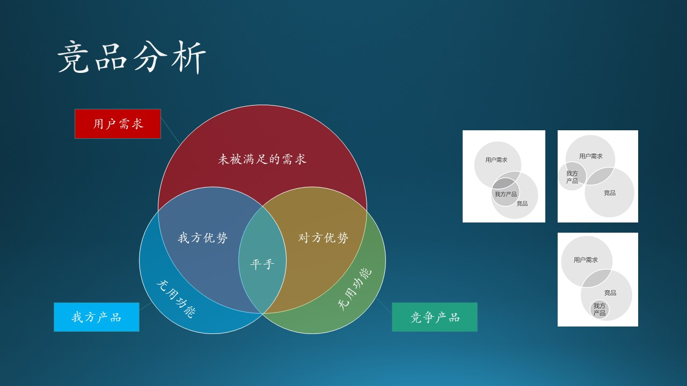

# 7.3 竞争策略

## 7.3.1 定位与实施策略

根据 KANO 模型，我们得到了四个区域的功能划分，这其实和传统的“紧急/重要四象限法则”是同一个道理。

图 7.3.1 - 需求定位与实施策略

### 惊喜型功能

人无我有。

惊喜型功能属于不紧急但重要的。“不紧急”指的是在商业利益上，该类功能目前还不是主力创收来源，但是放眼未来的赢利点，实现差异化优势，它们却是最重要的。

佛教中有个说法叫做“顿悟”，就是忽然发明/发现了一个新功能，但实际上是不可能有顿悟的事件发生的，都是水滴石穿、集腋成裘的结果。宋词中的“崆峒访道至湘湖，万卷诗书看转愚。踏破铁鞋无觅处，得来全不费功夫。”很多人只看到了“不费功夫”，却没有看到“踏破铁鞋”。

惊喜型功能，是建立在对产品的熟悉、对技术的追求基础上的，厚积薄发，才有可能出现一个案例。比如 Windows Hello face（人脸识别）登录技术，是建立在以下技术基础上的：

- 高分辨率摄像头，并且是双通道，可以识别景深；
- 人脸数字化特征提取技术；
- CPU 的高速计算能力。

可以看到，其中有硬件、软件、算法的多方面结合，才能实现这个功能。

在这类功能上的投入力度建议：20%。

### 期望型功能

人有我优。

期望型功能属于紧急且重要的，这是软件产品的核心竞争力所在，需要花大力气来做，并保持行业领先。

在微软必应搜索产品的开发上，必应团队为了从谷歌的搜索市场中抢到份额，先是经历了痛苦的“基本型”功能的开发，当时讲的最多的一句话就是“fix the gap”，即弥补差距。到了后来，系统逐步完善，也积累了一定的用户量，产品团队改变了关注焦点，口号变成为“钢需、痛点、海量”，即解决用户的真正需求。

钢需、痛点，这两个衡量点都容易理解，“海量”的意思是用户量，由于必应搜索的用户量是千万级别的，所以如果一个功能不能满足百万级别以上的用户，这个功能就不要考虑花资源去做了。

在这类功能上的投入力度建议：60%。

### 基本型功能

人有我有。

基本型功能属于紧急不重要的。不重要不代表不做，而是说赶紧做完后，就不要再费心思考虑它们了。

不同的软件的基本功能都有不同的定义，这主要取决于“业界”的共识，即你的产品和其它竞争对手的产品所共有的功能。如果有新加入的竞争者，它也必须实现这些基础功能才能站稳脚跟。

对于这个类别的功能，我们主要以低成本维持为主，不需要超过竞争对手的品质。比如，Chrome 浏览器可以容纳4096个网页收藏，那么 Edge 浏览器非要容纳8192个网页收藏也没什么意义，因为没有用户需要那么多网页收藏。

在这类功能上的投入力度建议：15%。

### 无差异功能

人有我无或人无我无。

最简单的就是无差异功能了，属于不紧急不重要。

这类功能，如果已经存在了的话，就放在那里不要动了吧，两个原则：

1. 只要它不影响新功能实现，或者说和新功能没有矛盾；
2. 它还能正常工作，不会被某一次的软件更新破坏掉。

这也是满足一些老用户的需要，向后（低版本）兼容。如果通过统计发现使用率太低了，那就可以干脆去掉了。使用率需要通过两方面来衡量：

1. 百分比，比如低于0.01%，即万分之一；
2. 同时，低于一个绝对值，比如每个月仅有100次使用。

这二者缺一不可，因为用户群总数是未知的，千万级的总用户量，即使是万分之一，用户量也还是客观的。如果总用户量少，每个月100次造访使用量（unique user）也是客观的，我们不能丢失掉这100个用户。

在这类功能上的投入力度建议：小于5%。

## 7.3.2 竞品分析

图 7.3.2 - 竞品分析

