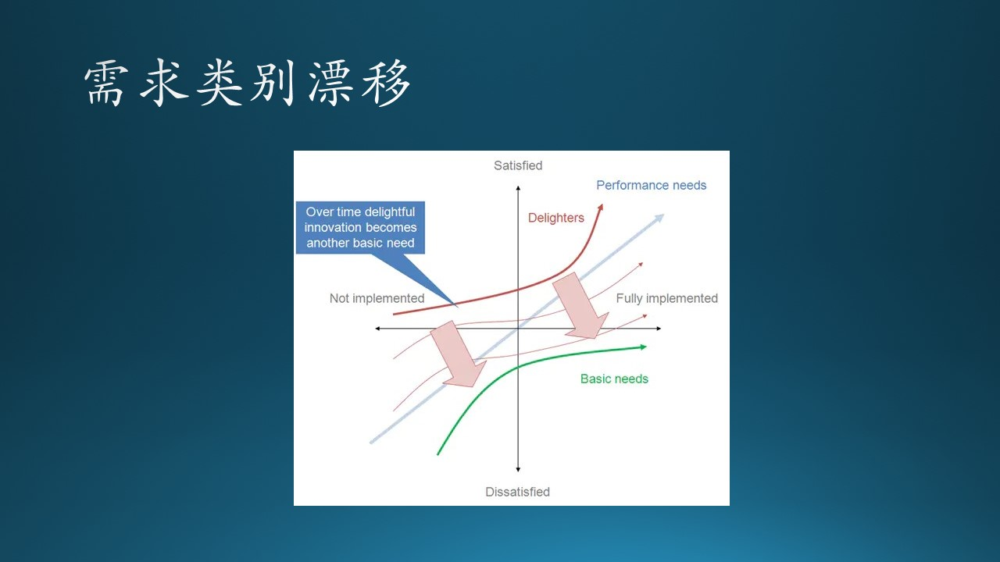
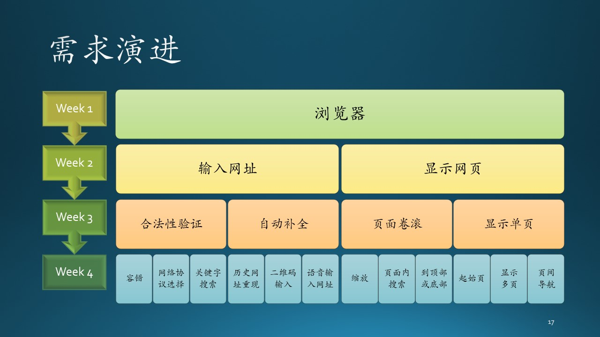

# 7.3 需求的漂移与演进

## 7.3.1 需求漂移

需求偏差，是指同样一个功能，在不同场合会有不同的理解、效果、满意度，这是由于“场合”对该需求的偏好影响。

图 7.2.4 - 类内状态转换图

### 因使用者而异

由于教育水平、工作性质、年龄阶段等的差别，人们的需求各不不同。

比如我们上面举的关于 Word 的三个看似无用的功能的例子，也许有的人没有浏览器使用基础（比如一些老人），这些功能对他们来说就有很大的帮助。

再比如手机上的计算器功能，如果是科技工作者使用，希望有乘方、开方、对数、指数等功能；如果是普通老百姓使用，那么有加减乘除就足够用了，功能多了反而容易按错键。

### 因为文化差而异

在中国的即时消息通信软件中，各种搞笑的表情包被广泛使用，有些甚至是需要付费购买的。表情包通常是漫画形式的，体现出创作者的别具匠心。

微软的 Teams 团队协作软件功能强大，其中的消息模块也有发送表情包的功能，但是由于是美国文化，表情包都是那种电影里截出来的人物表情片段，中国人使用起来觉得特别别扭，所以在 Teams 日常通信中，笔者及其它同事们都很少使用表情包。

### 因产品地位而异

SmartArt 对 Power Point 这个产品本身来说，开发者要持续对这个功能的维护，比如增加更多的组合图形，是一种期望型功能。但是对于其它竞争者来说，没有这个功能的话，就根本别想进入市场了，那么这个功能就会变成基本型功能。

所以对于后来者、竞争者来说，用户对它们的要求是必须提供惊喜型功能，或者提供很多期望型功能，才有可能后来居上。

## 7.3.2 需求演进

需求总在持续变化。正因为需求在持续变化，所以产品经理需要持续调研功能、产品需要持续迭代，与时俱进才能取得成绩。

（edge的例子）

图 7.2.4 - 类内状态转换图

