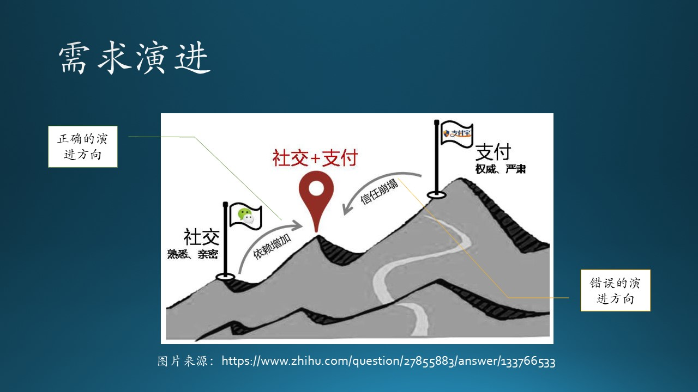
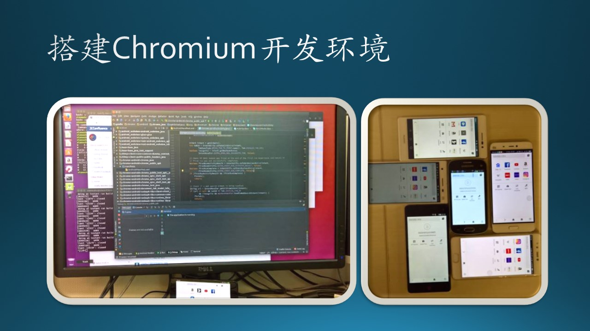

# 7.4 需求的漂移与演进

## 7.4.1 需求漂移

需求漂移，准确地说是需求的类别漂移，是指同样一个功能，在不同场合会有不同的理解、效果、满意度，这是由于“场合”对该需求的偏好影响。

图 7.4.1 - 需求类别漂移

### 因使用者而异

由于教育水平、工作性质、年龄阶段等的差别，人们的需求各不不同。

比如我们上面举的关于 Word 的三个看似无用的功能的例子，也许有的人没有浏览器使用基础（比如一些老人），这些功能对他们来说就有很大的帮助。因为这些软件都有 Telemetry（日志）机制，所以可以知道有多少人还在使用这些看似“过时”的功能，所以也就没有取消掉。

再比如手机上的计算器功能，如果是科技工作者使用，希望有乘方、开方、对数、指数等功能；如果是普通老百姓使用，那么有加减乘除就足够用了，功能多了反而容易按错键。

### 因为文化差而异

在中国的即时消息通信软件中，各种搞笑的表情包被广泛使用，有些甚至是需要付费购买的。表情包通常是漫画形式的，体现出创作者的别具匠心。

微软的 Teams 团队协作软件功能强大，其中的消息模块也有发送 GIF 表情包的功能。但是由于是美国文化，表情包都是那种电影里截出来的人物表情片段，中国人使用起来觉得特别别扭，所以在 Teams 日常通信中，笔者及其它同事们都很少使用 GIF 表情包。

### 因产品地位而异

SmartArt 对 Power Point 这个产品本身来说，开发者要持续对这个功能的维护，比如增加更多的组合图形，是一种期望型功能。但是对于其它竞争者来说，没有这个功能的话，就根本别想进入市场了，那么这个功能就会变成基本型功能。

所以对于后来者、竞争者来说，用户对它们的要求是必须提供惊喜型功能，或者提供很多期望型功能，才有可能后来居上。

### 因时间而异

即使是惊喜型功能，在经过一段时间的使用后，新鲜感会消失；或者随着竞争对手也跟风推出类似的功能，变得不那么吸引人。

比如 Windows Hello 人脸识别登录功能，在刚刚随着 Windows 10 发布时，大家觉得特别的高科技，配合着 Surface Book 的时尚感，使得 Windows 10 很快普及。所以它属于惊喜型功能。

但是一段时间过后，假设没有这个功能了，用户会觉得不方便，它就会退化为期望型功能。

## 7.4.2 需求演进

需求总在持续地演进，所以软件开发团队需要持续调研功能，产品需要持续迭代，与时俱进才能赢得用户。

木头用开发手机浏览器的经历，来推演一下当年浏览器领域的需求演进过程。图 7.4.2 展示了木头在前四周的学习过程。

图 7.4.2 - 需求演进

微软在 IE 落伍后尝试继续自研内核，开发基于 EdgeHTML 渲染内核和Chakra JS 解析引擎的 Edge 浏览器，而且继续绑定在 Windows 10 上发布。但是一些问题依然存在：性能，兼容性，扩展插件，更新频率等。所以在 2017 年的时候，微软想尝试一下使用 Chromium 内核开发浏览器。为了保险起见，微软决定先让中国的开发团队在手机上开发移动端浏览器，先试试水，如果成功的话，再在桌面端更新浏览器内核策略。于是，木头所在的团队接受了这一“光荣”的任务。

### Week 1（第一周）

在这之前，浏览器对于木头来说，就是日常使用，没有仔细研究过功能、架构、竞品等等。所以，在第一周（Week 1），木头认为浏览器就是“浏览器”本身的字面意思。所以，哥儿几个每个人都分到了一个 Android 手机，又把一个台式机装成 Ubuntu 16.0，下载了 Chromium 的代码后，编译出一个浏览器来，安装到 Android 手机上。成果如图 7.4.3 所示。

图 7.4.3 - 搭建开发环境

恍惚间有一种大功告成的感觉，但是，这仅仅是一个开始，后面的几周是疯狂学习浏览器知识的日子，就如同当年开发第一个浏览器的先行者们那样，不断探索这个产品的奥秘。

### Week 2（第二周）

木头使用着自己编译出来的浏览器，仔细端详着手机屏幕，忽然发现原来浏览器是由“地址栏”和“窗口”两部分组成的！所以，我们至少应该有两个模块，才能实现完整的浏览器功能：

1. 地址栏，用于输入网址，我们称之为输入模块；
2. 窗口，用于显示网页，我们称之为显示模块。

虽然地址栏很窄，但很重要。在手机上，由于屏幕小，有时候甚至是要隐藏地址栏的。

至于显示网页的功能吗，当然是由 Chromium 提供的渲染引擎（Render Engine）完成的，这也是浏览器的核心。

### Week 3（第三周）

木头使用着初步演进后的浏览器，刚开始还洋洋自得：输入输出都有了，很完备。但是很快就发现了新的需求，如表 7.4.1 和 7.4.2 所示，并且随着这些功能的加入，以前的输入和显示“模块”要升级为“子系统”了。

表 7.4.1 - 输入子系统的改进
|功能|描述|
|--|--|
|合法性验证|随着测试次数的增加，在地址栏里输入的网址越来越不规范，HTTP GET 经常会出错。那我们就加入一个网址合法性验证的功能吧，避免错误的网址传到后端。|
|自动补全|“https://www.microsoft.com”这个网址太长了，每次都需要输入得很准确才能正常工作。能不能在输入“www.m”以后，自动补全为“www.microsoft.com”呢？|

表 7.4.2 - 显示子系统的改进
|功能|描述|
|--|--|
|页面卷滚|页面内容很多，手机屏幕小，绝大多数网页显示不下，那就只好加一个卷滚功能了。|
|刷新单页|有时候由于网络原因，造成页面加载不畅，css没有下载完整，页面乱七八糟的。所以增加一个刷新功能吧。|

经过第三周的探索，我们浏览器已经演进为一个较为人性的“成品”了，但是距离“产品”还差得很远。

### Week 4（第四周）

在经过前三周的摸索后，到了第四周，木头已经懂得了需求不断演进的趋势，变得小心翼翼了。果然，经过一段时间的使用，又发现了很多新功能，可以让输入和显示两部分演进得更加完善。表 7.4.3 和 表 7.4.4 列出了新的功能。

表 7.4.3 - 输入子系统的完善

|功能|描述|
|--|--|
|容错|输入“http://”时，由于手机键盘小，每次都会打成“htp:/”，我们需要地址栏模块可以认识这个常见的“错误”。|
|Cookie|每次登录网页都需要重新输入用户名和密码，烦死了。增加一个 Cookie 功能来替我们节省些时间。|
|关键字搜索|如果输入的是一个关键字，比如“azure”，这个浏览器能不能智能地懂得我们是想搜索“azure”这个名词呢？|
|历史网址重现|以前输入过“www.microsoft.com”，也输入过“www.mail.163.com”，能不能在用户输入“www.m”后，自动显示一个下拉列表，列出以上两个网址供用户选择呢？|
|二维码扫描|手机摄像头可以扫描二维码形式的网址，这个也可以算作输入模块的一个功能吧。|
|语音输入|手机话筒可以接收语音，识别为关键字，然后进行搜索或者浏览，当然也算作输入模块的功能。|

表 7.4.4 - 显示子系统的完善

|功能|描述|
|--|--|
|页面缩放|在手机屏幕上可以看清更小的细节，或者看到网页的全局。|
|页内搜索|搜索页面文本内的关键字。|
|回到顶部|一键即可回到页面顶部，重新浏览。|
|起始页|展示新闻，或者常用网址，当然还可能有广告。|
|显示多页|同时浏览多个页面，可以切换。|
|导航|在当前页前进、后退，通过缓存看网页。|

