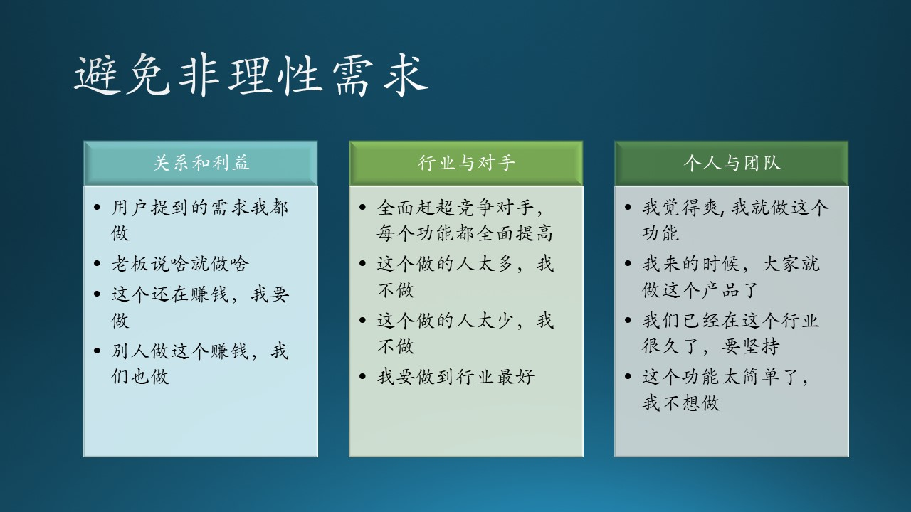

# 7.5 需求的引导与推荐

先说明一下“需求演进”和“需求引导”的区别：
- 需求演进是来自用户的，主要是解决一些痛点，实现基本型和期望型功能；
- 需求引导是来自产品团队的，主要是实现一些新颖的想法，实现期望型和惊喜型功能。

## 7.5.1 需求引导

### 微信支付的需求是怎么来的？$^{[3]}$

支付是电商平台的重要组成环节，所以说是淘宝促成了支付宝的诞生，是钢需，可以说是理所当然的。但是微信定位在通信上，为什么会有支付的需求产生呢？

在微信支付存在之前，只有支付宝和银行可以支付，而且银行系统死守传统观念，不注重服务质量。

仔细看一下微信中的其它业务点：
- 公众号打赏
- 表情商店的付费表情包
- 在线游戏充值
- 朋友圈转账还钱

需要支付时，堂堂的腾讯微信 APP 总不能要求用户用阿里的支付宝吧？所以产生了微信支付的需求。

最开始，微信支付采取了简单的方式——直接绑定银行卡，但是在体验上存在两个问题：

- 验证码问题，当时快捷支付的使用流程是用户输入密码然后接收验证短信，输入验证码完成支付。用户希望去掉短信验证这个环节。
- 密码问题，当时支付工具的支付密码普遍采用英文数字混合的形式，张小龙希望能够像 ATM 一样使用六位的数字密码。

在产品团队的努力下，这两个需求得以实现。也正是因为这两项优化，微信支付变得流程简短、操作便捷。

实际上，微信支付的需求有两层：
1. 能够支付；
2. 快捷支付。

第一层是基本型功能需求，第二层是期望型功能需求。微信在保证了平台业务发展的同时，也满足了用户的需求。

### 微信红包的需求是怎么来的？$^{[3]}$

腾讯年初八“刷红包”的传统，每年发“开工利是”时，会在红包中随机放入不同金额的现金，这种不确定性让领红包的人充满期待，也引起了相互比较，产生话题性。

腾讯联合创始人 Tony 将一些微信团队成员拉进了一个微信群，希望能够依托微信群，趁着春节做一个红包产品，能够让用户感到惊喜和好玩，在收到红包之后也能情不自禁地参与到发红包的行列中，让红包像击鼓传花一样传起来。于是，“拼手气红包”便这样诞生了。

起初，微信红包是一个H5产品，使用公众号向用户推送领取通知。为了让用户体验更好，张小龙提出把微信红包做成原生功能。他希望通知用户的行为不通过公众号推送这种比较重的模式，转而采用群内通知，既不打扰用户，又不割裂产品体验。随着产品交互的调整和央视春晚“摇一摇”活动的进行，微信红包迅速向三四线城市下沉，用户活跃度显著提升。

如果用 KANO 模型来分析，“微信红包”是一个惊喜型功能。它的来源并非是最终用户提出的，而是产品团队提出的，这是惊喜型功能的一个重要特征。

### 支付宝的社交功能是怎么来的？$^{[4]}$

从阿里的角度来看，如果微信做支付是合理的，那么支付宝做社交就没有什么不合理的。人们既然能在聊天的时候花钱，那么为什么不能在花钱的时候聊天呢？

阿里选择支付宝做社交功能，是因为在其所有产品中，支付宝是最有可能的入口，无需被“购物”、“电商”的概念绑架。这也证明了笔者在前面对“我们是否要做旺信 UWP 的质疑”，阿里自己都不看好旺信，微软为什么还要去做？

但是，“在花钱的时候聊天”这件事儿，不是用户的真实需要，而是支付宝产品团队臆想出来的，试图引领、教育用户的行为。从社交到支付的需求引导，是自然发生的，是一种依赖增加；而从支付到社交的“引导”，是一种信任崩塌。

图 7.5.1 - 需求引导

同样的两件事，有一个先后发生的条件，如同概率论中的条件概率公式：

$$
P(AB) = P(A) \cdot P(B|A) \tag{7.7.1}
$$
$$
P(BA) = P(B) \cdot P(A|B) \tag{7.7.2}
$$

其中：
- $P(A)$ 表示聊天需要的概率
- $P(B)$ 表示支付需要的概率
- $P(AB)$ 表示聊天和支付同时需要的概率
- $P(A|B)$ 表示在支付时去聊天的需要（后面的 B 表示条件）
- $P(B|A)$ 表示在聊天时去支付的需要（后面的 A 表示条件）

可以推断，没有人会在支付时去聊天，所以$P(A|B)$会非常小，尽管$P(B)$很大（使用支付宝的人很多），但是两者的乘积$P(BA)$会很小，即在支付宝中加聊天是行不通的。

支付宝团队看到了公式 7.7.1 的成功（即微信上加支付的成功），并且主观地认为$P(AB) == P(BA)$，因此推论$P(A|B)$也可以成功。

有一个类似的故事是这样的：

信徒：“我可以在祷告时吸烟吗？”

神父：“不可以！这是对神的不敬。”

信徒：“那我可以在吸烟时祷告吗？”

神父：“可以！这是对神的无时无刻的挂念。”

## 7.5.2 需求推荐

一个大家都知道的例子是“纸尿裤和啤酒”的故事，并不是“多喝啤酒会需要纸尿裤”，而是“去超市买纸尿裤的男人通常会顺便买啤酒”。图 7.5.2 左侧子图表明，“啤酒”和“纸尿裤”没有直接联系，而是通过“男人”联系起来的。

图 7.5.2 - 需求推荐

### 乐器的例子

木头喜欢音乐，经常买一些乐器，10孔的布鲁斯口琴就买了三把（C调，E调，G调）。可是每次再登录淘宝或者京东时，给木头推荐的还是各种品牌的口琴，很无语。用户一旦下单了，系统能监控到下单动作，就不要再推荐类似商品了。

那么买完口琴后，系统应该推荐什么呢？根据木头的音乐爱好者的身份，应该推荐：

1. 谱架，因为吹口琴需要看谱子；
2. 麦克风和音响：没有音响系统，口琴的声音是没有感召力的，高灵敏度麦克风也很重要；
3. 电子琴和吉他：在吹奏乐器的鄙视链上游，是键盘乐器和弹拨乐器，电子琴比较容易学，吉他配口琴特别好听。

这比那个“啤酒和纸尿裤”的例子更具有专业知识性。图 7.5.2 右侧下方的子图说明了依赖本领域知识而得到的推荐顺序。

### 外卖的例子

疫情期间，自己做饭太烦了，难免要点一些外卖。木头今天点了宫保鸡丁，系统明天还推荐宫保鸡丁；木头今天点了米饭炒菜，系统明天还推荐米饭炒菜。是想让用户吃腻为止吗？

让木头斗胆来建议一下一个好的外卖推荐系统应该怎么做。衡量饮食的参数要分几个方面：

1. 口味，酸辣咸甜苦淡；
2. 主食，米饭面条饺子；
3. 食量，半斤还是四两；
4. 偏好，肉菜主食比例；
5. 价位，温饱还是饕餮；
6. 营养，蛋白纤维碳水。

图 7.5.2 右侧上方的子图说明了这些参数。

有了以上这些指标，在按照星期循环和早中晚饭推荐，可以做到精准推送了。尤其是“营养”因素，还没有任何系统做到，而且用户往往是偏食的，只吃几种口味的菜，对于营养均衡极为不利。尤其是晚上十点钟以后点外卖的，应该提高价格并加以警告，因为对人的作息时间是极为不利的，吃完立刻睡觉，很可能造成食管胃酸回流。

有可能是电商和外卖系统的用户黏度足够好，不愁用户群，所以大家都还没有开发出有 AI 或专家参与的推荐系统来，这会是一个商机吗？
