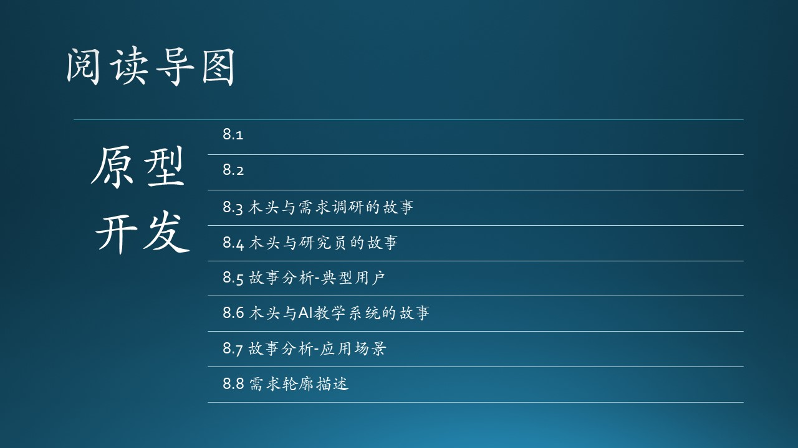

（插入一些说明性文字，重点在介绍上下文，串连）

技术选型
原型实现
工作量估计
项目计划

- [1] http://www.zhoujingen.cn/blog/5610.html
- [2] 低保真原型与高保真原型，https://www.jianshu.com/p/c1fa72cb4021

- [3] Prototyping Model，https://ecomputernotes.com/software-engineering/explain-prototyping-model

prototype

MVP

 

原型工具

需求在产品开发中的重要性已经是不需争议的事实，现在需求方法有很多， 业界最常用的一种办法就是通过原型展现需求，通过用例表达需求。业务人员掌握制作原型能够更快更清楚的表达业务，同客户和开发可以进行更直观的沟通，使得大家在理解上容易更一致。然而原型工具有非常多，比如大多数人用过的Excel、Access、Delphi、PowerPoint、Axure、Balsamiq Mockups、ForeUI、iRise、Lucid Spec、Mockup Screens、Pencil、Serena等，甚至开发工具雅奇等也可以用来做原型。工欲善其事，必先利其器，对于刚刚使用原型方法的业务人员来说，如何选择适合自己的原型工具呢？这就需要首先根据原型的目的明确做原型的粒度。

在限定时间内能够将需求表达更清晰需要一个合适的工具。业务人员一般都不会有什么编程经验，我们怎么能够做出表达静态元素界面，又能加入动态交互功能的原型呢？为了能在需求阶段都能够更好的采用原型开发方法，我搜集并使用过多种原型工具，希望找打一款比较使用简单，但又能实现一般的交互功能，最好是业务人员学个一个小时就可以完全自己动手使用了。我用过一个原型工具 GUI Design Studio ，它的主要特点就是操作简单，不需要开发人员帮助，通过半个小时的学习后你将可以自己开始做原型了。《原型工具GUI Design Studio》对这个工具的使用进行可简单介绍。

原型不仅仅是界面

我们可以通过原型来引导用户来使用系统解决问题，但原型不仅仅是需求，它还是设计、开发工具，所以作原型时不仅需要客户的参与，也需要技术人员的参与，但应该尽量由业务人员而非开发人员来实现原型的需求部分。下面是在UCD社区里面看到的一张图，原型最主要功能是表现界面，但要做好界面其实不容易，山下面还有很多东西需要考虑才能支撑界面，其实做原型的过程就是设计系统的过程。我们都希望尽量把开发工作前移，需求能做的工作就不留到开发环节做。如果软件模式一定，那么框架做得好的话就一定可以让业务人员来做一部分现在属于开发人员的工作（注：这部分工作其实本就该属于业务人员），那时大家就能体会到开发软件就如同做原型一样的乐趣了！

使用原型有三个主要目的：

OEA的原型工具将会考虑集成需求工具、设计工具和开发工具与一体，由业务需求人员、设计师和开发人员在OpenExpressApp平台下进行连贯的开发，它做的是水平、进化型、高保真原型。

- Prototyping Style: This addresses the various
approaches to developing prototypes. Prototypes can be developed as throwaway code
or paper products, as an evolution of a working design, or as an executable specification.

Different prototyping life cycle processes are
typically used for each style. The style chosen is based on the type of results the project
needs, the quality of the results needed, and
the urgency of the results.

- Prototyping Target: The target of the prototype activity is the specific product being
served by the prototyping effort. Examples
of prototyping targets include a requirements
specification, an architectural design element
or component, an algorithm, or a humanmachine user interface.

- Prototyping Evaluation Techniques: A prototype may be used or evaluated in a number of ways by the software engineer or
other project stakeholders, driven primarily
by the underlying reasons that led to prototype development in the first place. Prototypes may be evaluated or tested against
the actual implemented software or against 
Software Engineering Models and Methods 9-9
a target set of requirements (for example, a
requirements prototype); the prototype may
also serve as a model for a future software
development effort (for example, as in a user
interface specification).

6.2. Prototyping
Prototyping is commonly a means for validating
the software engineer’s interpretation of the software requirements, as well as for eliciting new
requirements. As with elicitation, there is a range
of prototyping techniques and a number of points
in the process where prototype validation may
be appropriate. The advantage of prototypes is
that they can make it easier to interpret the software engineer’s assumptions and, where needed,
give useful feedback on why they are wrong. For
example, the dynamic behavior of a user interface can be better understood through an animated prototype than through textual description
or graphical models. The volatility of a requirement that is defined after prototyping has been
done is extremely low because there is agreement
between the stakeholder and the software engineer—therefore, for safety-critical and crucial
features prototyping would really help. There are
also disadvantages, however. These include the
danger of users’ attention being distracted from
the core underlying functionality by cosmetic
issues or quality problems with the prototype. For
this reason, some advocate prototypes that avoid
software, such as flip-chart-based mockups. Prototypes may be costly to develop. However, if
they avoid the wastage of resources caused by
trying to satisfy erroneous requirements, their
cost can be more easily justified. Early prototypes may contain aspects of the final solution.
Prototypes may be evolutionary as opposed to
throwaway.