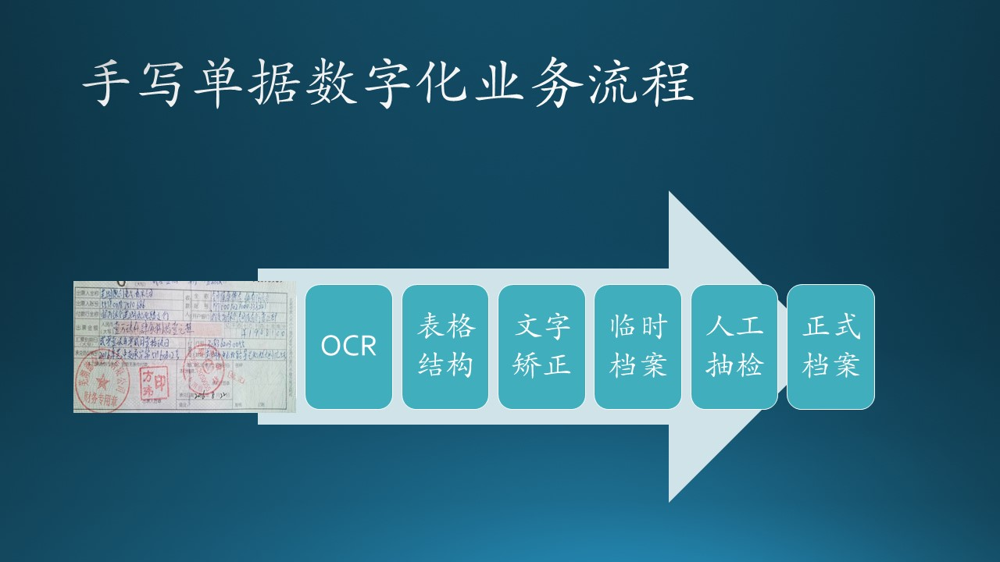

# 8.2 原型的种类

## 8.2.1 水平原型与垂直原型

我们和业务人员经常谈到的是水平原型，水平原型也叫做“行为原型” (behavioral prototype)。探索预期系统的一些特定行为，并达到细化需求的目的。当用户在考虑原型中所提出的功能可否使他们完成各自的业务任务时，原型使用户所探讨的问题更加具体化。它更多从业务需求着手，应用在需求阶段。

垂直原型（vertical prototype），也叫做结构化原型或概念的证明，实现了一部分应用功能。当预期实现阶段可能存在技术风险时，可以开发一个垂直原型。垂直原型通常用在生产运行环境中的生产工具构造，使其结果一目了然（更有意义）。比起在软件的需求开发阶段，垂直原型更常用于软件的设计阶段以减少风险。

## 8.2.2 抛弃型原型或进化型原型

从原型存在生命时机考虑分为抛弃型原型和进行型原型，抛弃型原型不作为最终产品的一部分，只是作为探索性的回答一些需求问题，细化需求并提高需求质量。由于在开发阶段最终将抛弃这些原型，因此不需要花太大力气去建立该原型。

进化型原型是在已经清楚地定义了需求的情况下，为开发渐进式产品提供了坚实的开发基础，作为产品的部分实现。与抛弃型原型的快速、粗略的特点相比，进化式模型一开始就必须具有健壮性和产品质量级的代码。因此，对于描述相同的功能，建立进化型原型比建立抛弃型原型所花的时间要多。一个进化型原型必须设计为易于升级和优化的，因此，你必须重视软件系统性和完整性的设计原则。要达到进化型原型的质量要求并没有捷径。进化型原型一般在处理架构时会采用。

## 8.2.3 低保真原型和高保真原型

原型分低保真原型和高保真原型，低保真原型目标在于表达工作主要内容，体现静态的元素，不需要动态交互。高保真原型目标是作出一个和实际上线后的产品差不多的样子，不仅包括静态的界面，还包括交互，甚至有的还把数据保存、逻辑验证等都包含在内。如果客户要求开发之前必须看到和实际产品一样的原型时，这时就需要做高保真原型，如果对于小型项目，或者只是用来做交流主要需求用时，就可以做低保真原型。

，利用这些不确定性来判断系统中哪一部分需要建立原型和希望从用户对原型的评价中获得什么。原型可以使他们的想象更具体化，有助于说明和纠正这些不确定性，总的来说通过原型法可以很好的减少项目风险。

当与系统输入和输出需求相关的详细信息不可用时，应用原型模型。在这个模型中，假设所有的需求在系统开发开始时可能不知道。通常在系统不存在或大型复杂系统中没有手动过程来确定需求时使用。这个模型允许用户与被称为原型的系统工作模型进行交互和实验。原型给用户一个真实的系统感觉。

。一般情况下，可以通过以下方法制备原型。

•通过创建主用户界面而无需进行任何实质性编码，以便用户能够感受到实际系统的外观。

•通过缩写将执行有限功能子集的系统版本。

•使用系统组件说明将要开发的系统中包含的功能。

使用原型，客户可以获得系统的实际感受。因此，这种模型在需求最初无法冻结的情况下是有益的。

这个原型是根据当前已知的需求开发的。原型的开发显然要经过设计、编码和测试，但这些阶段的每一个阶段都不是非常正式或彻底地完成的。

通过使用这个原型，客户可以对系统有一个真实的感觉，因为与原型的交互可以使客户更好地理解所需系统的需求。

对于那些没有手动过程或现有系统来帮助确定需求的复杂和大型系统，原型设计是一个很有吸引力的想法。通过使用原型，与项目相关的风险正在降低。原型的开发通常在需求规范文档的初始版本开发完成后开始。

现阶段，对该制度有合理的认识，其需求不明确或可能发生变化。原型开发完成后，最终用户和客户都有机会使用原型。

他们向开发人员提供关于原型的反馈：什么是正确的，什么需要修改，什么是缺失的，什么是不需要的，等等。根据反馈，原型被修改为包含一些可以轻松完成的建议更改，然后用户和客户再次被允许使用系统。

在原型和分析员的判断中，这个循环一直重复到。根据反馈，修改初始需求以生成最终需求规范，然后用于开发生产质量体系。

图说明了在原型模型中执行的步骤。下面列出了这些步骤。

1需求收集和分析：原型模型从需求分析开始，详细定义系统的需求。访问用户以了解系统的需求。

2快速设计：当需求已知时，为系统创建一个初步设计或快速设计。它不是一个详细的设计，只包括系统的重要方面，这给用户一个系统的想法。快速设计有助于开发原型。

三。构建原型：从快速设计中收集的信息被修改成第一个原型，它代表所需系统的工作模型。

4用户评估：接下来，将建议的系统提交给用户，以便对原型进行全面评估，以识别其优势和弱点，例如要添加或删除的内容。从用户那里收集意见和建议并提供给开发人员。

5精化原型：用户对原型进行评价后，如果不满意，则根据需求对当前原型进行细化。也就是说，使用用户提供的附加信息开发一个新的原型。新原型的评估与之前的原型一样。此过程将持续到满足用户指定的所有要求。一旦用户对所开发的原型满意，就在最终原型的基础上开发出最终的系统。

6工程产品：一旦完全满足要求，用户接受最终原型。对最终系统进行全面评估，然后定期进行日常维护，以防止大规模故障和减少停机时间。

表中列出了与原型模型相关的各种优缺点。
