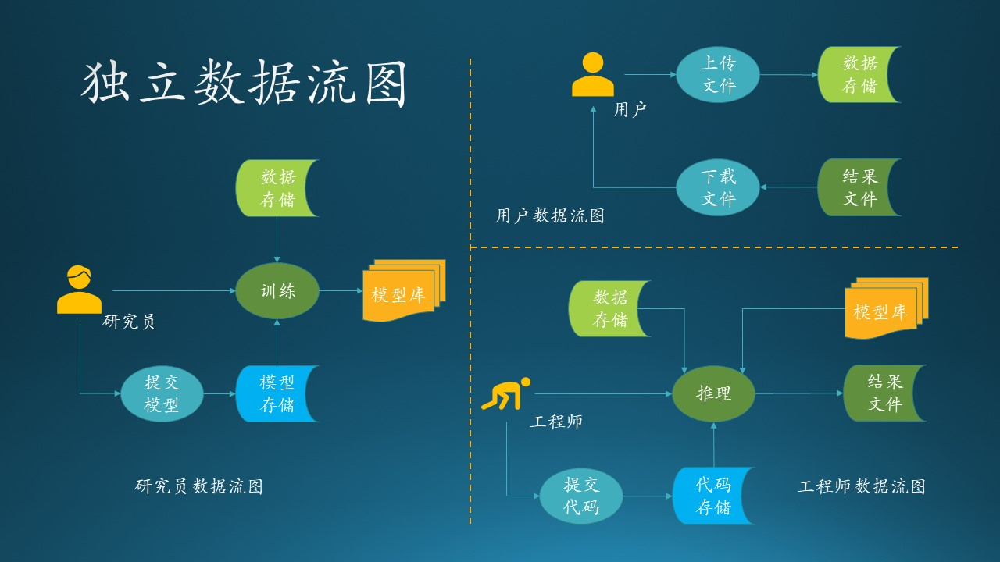
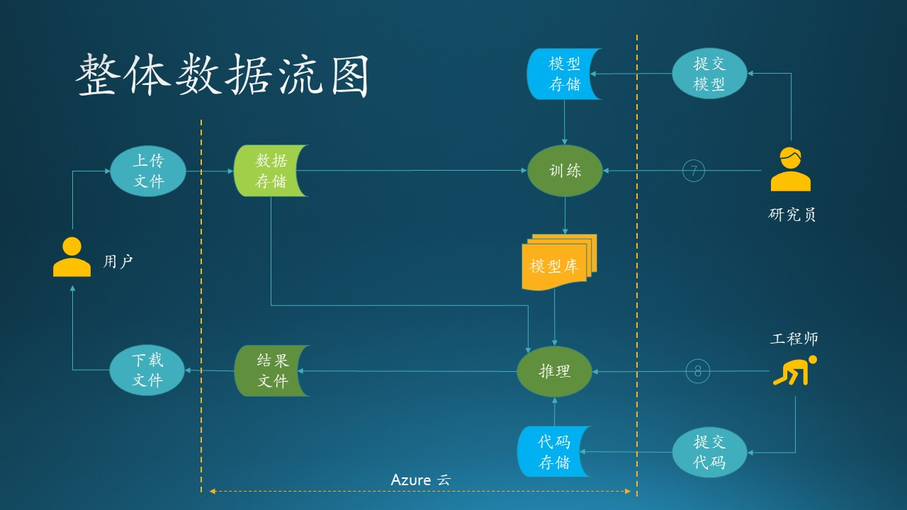
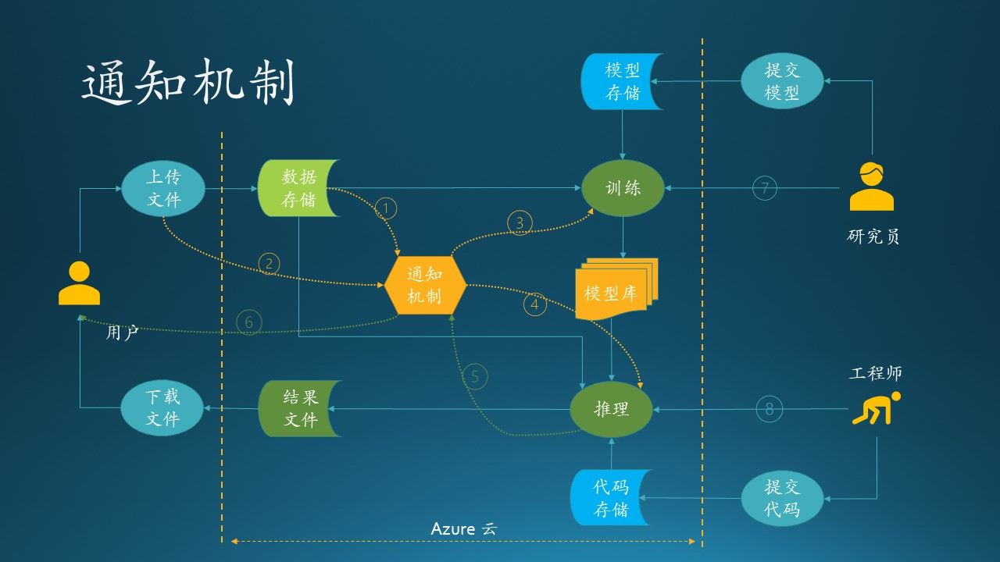
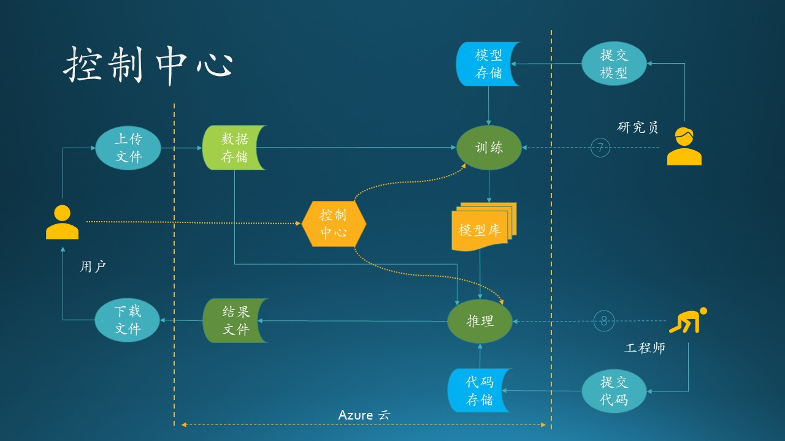

# 8.3 技术选型

技术选型
原型实现

## 8.3.1 项目的故事

木头参与的一个真实项目，虽然不怎么大，但是麻雀虽小五脏俱全，面向客户的系统，无论规模如何，都要全力以赴，谨慎对待。

- 某基金客户想使用热门的深度学习来预测 A 股股票行情走向，所以找到了 MSRA 请求合作。客户将会在每周末上传上一周的股票交易数据，在微软 Azure 上完成存储、处理、预测、输出等一系列过程，然后从 Azure 上下载预测结果。

- 我软的研究员们深入研究了几个月，他们根据股票交易历史数据，在 Azure 上训练了一系列基于神经网络的深度学习模型，存入模型库中。

- 我软的工程师们，会监控客户的上传数据动作，一旦上传结束后，立刻在 Azure 上启动预测流程，调用研究员的模型库，根据最新交易结果进行预测，得到预测结果后，通知客户下载。

## 8.3.2 需求分析初步

我们根据上面的需求描述，把每个参与者（用户、研究员、工程师）的数据流图单独画出来，这样可以避免一开始就陷入复杂的逻辑纠缠中。

图 8.3.1 的独立数据流图描述了需求分析的结果。

图 8.3.1 - 独立数据流图

### 研究员数据流图

流程：

1. 研究员在自己的计算机上设计模型，并提交训练代码到云端存储；
2. 云端有一个代码存储库（蓝色部分），包括模型、代码、初始参数等；
3. 研究员登录到云端服务器，启动训练过程；
4. 在训练开始时，需要读取存储在云端的股票历史数据（浅绿色部分）；
5. 训练结束后，把成熟的模型存放到模型库（黄色部分），供预测使用。

对研究员来说，“提交训练代码”和“训练”是两个主要动作，需要写代码实现，还要看应该部署在什么设备上运行；其它的一些辅助存储需要确定使用 Azure 上的什么存储设备。

### 用户数据流图

流程：

1. 用户上传数据到云端的数据存储上；
2. 用户得到通知后，下载预测结果文件。

对用户来说比较简单，就是两个动作：上传、下载，后面的一切流程都是透明的。所以，我们需要设计“上传”和“下载”的实现。

### 工程师数据流图

流程：

1. 开发完毕后，提交预测代码到云端部署（蓝色部分）；
2. 启动预测过程；
3. 在预测开始前，要读取股票历史数据和最新上传的数据（浅绿色部分），还要从模型库（黄色部分）中读取最新模型；
4. 预测完毕后，输出结果文件（绿色部分），并通知用户去下载。

对于工程师来说，“提交预测代码”和“预测”是两个主要动作，需要写代码实现，还要看应该部署在什么设备上运行；其它的一些辅助存储需要确定使用 Azure 上的什么存储设备。

## 集成

下面我们需要把三个独立的数据流图合并成一个完整的数据流图，来发现需要改进的地方。如图 8.3.2 所示。

图 8.3.2 - 整体数据流图

图 8.3.3 - 原型开发流程

图 8.3.4 - 原型开发流程

