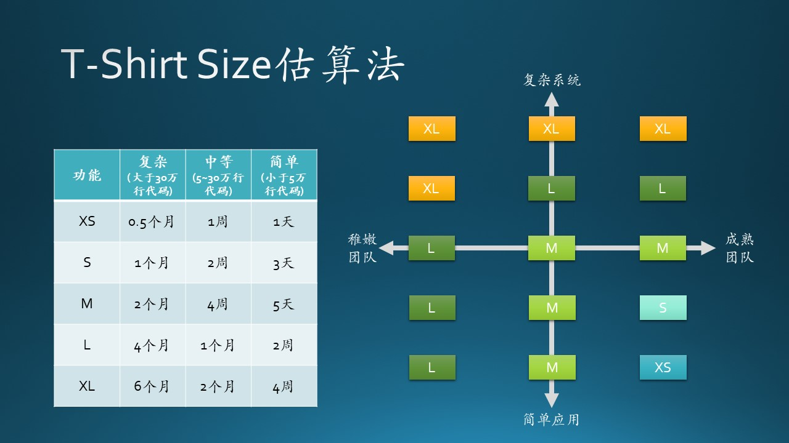

# 10.4 估计与计划

## 10.4.1 培养估计的能力

木头在给学生上高级软件工程课时，曾经给同学们出了一道题：一个小组4个同学，骑自行车环游中国陆地边界，问需要多少个星期？见图 10.4.1。

图 10.4.1 - 培养估计的能力

原题在《构建之法》$^{[5]}$中，小组6-8人，步行。木头把人数减为4人，把步行改成骑车，降低复杂度，提高估计的准确度。

经过20分钟的热烈讨论后，七个小组依次上台讲解本组的估计结果和理由，列表如下：

|组|估计时间|主要论点|
|--|--|--|
|1|120|考虑了设备维修、人员伤病等情况|
|2|130|一边骑行，一边旅游观景，不着急|
|3|95|如果有人生病，其它人先走，病人痊愈后再赶上来|
|4|62|“997”，即每天9点出发，21点休息，每周7天|
|5|108|考虑了设备维修、人员伤病、气候温度、地理路况|
|6|114|额外考虑了邻国边境争端引起的滞留|
|7|250|逢年过节要回家休息|

由于总长度（4.1万公里）和平均速度（15公里/小时）已经有参考值了，所以同学们要做的是风险估计，即把各种意外情况考虑进去，用时间来补偿。

## 10.4.2 需求与已有产品的匹配

需求分析文档中需要填写项目计划，如：

- 何时完成开发工作？
- 何时开始集成测试？
- 何时可以交付给用户使用？
- 系统的性能如何定义？

要回答上面的问题，先要看需求和乙方已有产品的匹配程度，见表 10.4.1。

表 10.4.1 - 甲方需求和乙方产品的匹配程度
|匹配程度|需求分析|架构设计|软件开发|软件测试|安装部署|验收培训|估计时长|
|--|--|--|--|--|--|--|--|
|完全不匹配，从零开始构建|$\sqrt{}$|$\sqrt{}$|$\sqrt{}$|$\sqrt{}$|$\sqrt{}$|$\sqrt{}$|假设时长为$L$个月|
|小部分匹配，结构需要调整|$\sqrt{}$|大部分调整|只有小部分代码重用|$\sqrt{}$|$\sqrt{}$|$\sqrt{}$|$\frac{4}{5}L$|
|部分匹配，结构可重用|部分调整|部分调整|部分逻辑重用|$\sqrt{}$|$\sqrt{}$|$\sqrt{}$|$\frac{3}{5}L$|
|大部分匹配，结构不需要调整|细微调整|$\times$|重写小部分功能代码|增量测试|$\sqrt{}$|$\sqrt{}$|$\frac{2}{5}L$|
|全部匹配|$\times$|$\times$|$\times$|$\times$|$\sqrt{}$|$\sqrt{}$|$\frac{1}{5}L$

表 10.4.1 中，对勾（$\sqrt{}$）表示需要从零做起，叉子（$\times$）表示不需要做。

- 最理想的是最后一级，对于轻车熟路的项目，比如建设一个呼叫中心，或者人工智能问答平台，乙方的软件已经是成熟的了，那么只要考虑安装部署、验收培训等的时间就可以了。

- 最不理想的是第一级，没有成熟产品，只能从零开始搭建，那就需要准确地预估时间，制定产品开发计划。

我们下面看看如何估计 $L$ 的具体数值。

## 10.4.3 工作量的精确估计方法

## 10.4.4 微软常用的估计方法

在微软经常使用T-Shirt Size方法来估算开发时间，具体见图10.4.3。

图 10.4.1 - 培养估计的能力

