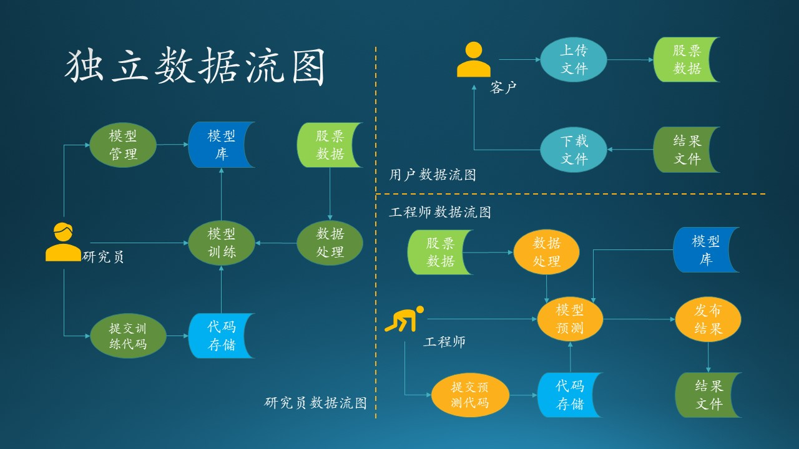
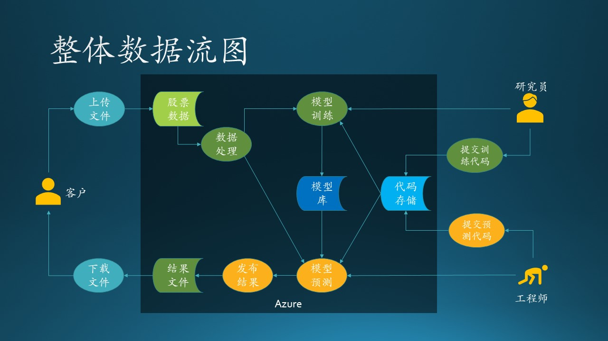
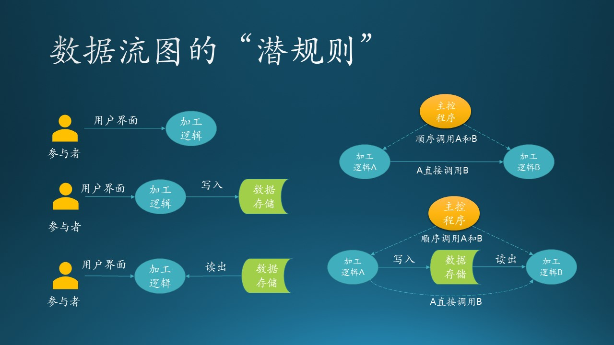

# 第二步 从用例图到数据流图

## 10.2.1 需求分析初步

我们根据上面的需求描述，把每个参与者（用户、研究员、工程师）的数据流图单独画出来，这样可以避免一开始就陷入复杂的逻辑纠缠中。

图 10.3.1 的独立数据流图描述了需求分析的结果。

图 10.3.1 - 独立数据流图

### 用户数据流图

流程：

1. 用户上传数据到云端的数据存储上；
2. 用户得到通知后，下载预测结果文件。

对用户来说比较简单，就是两个动作：上传、下载，后面的一切流程都是透明的。所以，我们需要设计“上传”和“下载”的实现。

### 研究员数据流图

流程：

1. 研究员在自己的计算机上设计模型，并提交训练代码到云端存储；
2. 云端有一个代码存储库（蓝色部分），包括模型、代码、初始参数等；
3. 研究员登录到云端服务器，启动训练过程；
4. 在训练开始时，需要读取存储在云端的股票历史数据（浅绿色部分）；
5. 训练结束后，把成熟的模型存放到模型库（黄色部分），供预测使用。

对研究员来说，“提交训练代码”和“训练”是两个主要动作，代码可以在本地计算机上完成实现，与 Azure 交互的是“提交”动作，还要考虑“训练”部署在什么设备上运行，其它的一些辅助存储需要 Azure 上的哪种存储设备。

### 工程师数据流图

流程：

1. 开发完毕后，提交预测代码到云端部署（蓝色部分）；
2. 启动预测过程；
3. 在预测开始前，要读取股票历史数据和最新上传的数据（浅绿色部分），还要从模型库（黄色部分）中读取最新模型；
4. 预测完毕后，输出结果文件（绿色部分），并通知用户去下载。

对于工程师来说，“提交预测代码”和“预测”是两个主要动作，代码可以在本地计算机上完成实现，与 Azure 交互的是“提交”动作，还要考虑“预测”部署在什么设备上运行，其它的一些辅助存储需要 Azure 上的哪种存储设备。

## 10.3.2 集成分析

下面我们需要把三个独立的数据流图合并成一个完整的数据流图，来发现需要改进的地方。如图 10.3.2 所示。

图 10.3.2 - 整体数据流图

合并的过程很简单，把图 10.3.1 中重复（具有相同名字并且相同颜色）的单元删掉，但是保留连接线。比如“股票数据（存储）”单元一共有三个，删掉右侧的两个，然后把“上传文件”连接到左侧的“股票数据（存储）”上，再把“预测”连接到左侧的“股票数据（存储）”上，箭头方向保持不变。

如此重复，去掉所有重名重色的单元后，再调整各个单元的位置，尽量让连接线没有交叉，就变成了图 10.3.2 的样子。当然，由于这是一个拓扑图，所以可能画法不止一种。

与图 10.3.1 不同的是，这里多了一个深色的矩形区域“Azure”，表明在我们的设计中，矩形区域内的元素，包括数据、行为、流程，都应该使用 Azure 提供的技术。

## 10.3.4 数据流图的潜规则

得到图 10.3.2 后，就可以进行下一步的设计工作了。注意，在依赖数据流图把需求分析变成系统设计的过程中，有一些“潜规则”：

图 10.3.3 - 数据流图的“潜规则”

1. “参与者”到“加工逻辑”之间的连线（有方向），表示有交互式用户界面，或者可执行程序（也可以看作是界面的一种）。
2. 两个“加工逻辑”之间的连线，表示前者调用/通知后者，也可能需要设计出来一个主控程序，按顺序调用二者，但是主控程序并不在数据流图内。
3. “加工逻辑”到“数据存储”的连线（有方向），表示调用“写入”功能。
4. “数据存储”到“加工逻辑”的连线（有方向），表示调用“读出”功能，但是此时的“加工逻辑”不能凭空运行，需要有调用者，见2。
