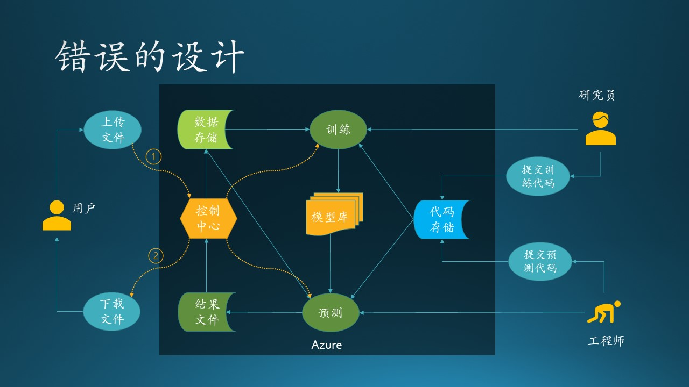

# 11.3 第三步：数据设计

下面我们针对整体数据流图（图11.2.2）中的各个数据存储图例来进行分析设计。

首先要把存储图例转换成 Azure 支持的存储技术，这就需要做技术选型，这一点我们在 10.2 节中做过详细介绍，最后使用了两种技术：

- 对于数据文件，使用 Azure Blob；
- 对于代码，使用Github；
- 对于模型，使用ML-flow，它后台使用了MySql作为索引，Azure Blob作为存储。

图 11.3.1 - 数据设计

## 11.3.1 数据文件

如图 11.3.1 所示，数据文件存放在以下层级目录下：

1. 股票数据根目录（蓝色）
   
   建立根目录，为了把股票数据与模型数据分开。

2. 用户上传文件时的时间戳，如20210111071507
   
   由于客户是每周上传一次数据，具有时效性。并且股票数据也是按天汇集在一起的，所以我们可以利用这种较强的时间关系，设计出用时间戳为目录名称的存储结构，比如，就使用客户上传文件的时间，格式是“YYYYMMDDHHmmSS”。

3. 三个子目录
   - Data：上传的股票数据文件，一般情况下会有一周五天的.csv和.mat文件，每天一个。
   - Report：预测过程产生的日志，工程师会根据此文件中的内容来判断预测结果是否正确。
   - Output：预测结果文件，客户最后从此目录中下载结果。

## 11.3.2 模型文件

如图 11.3.1 所示，模型文件存放在以下层级目录下：

1. 模型数据根目录（橙色）
   
   建立根目录，为了把股票数据与模型数据分开。

2. 从0开始累加的整数值，用于存放训练试验数据
   
   在训练模型时，需要做多次试验，测试各种参数的组合，所以每次都放在一个不重名的目录里即可。ML-flow有一个内置的计数器，初始化一次试验时，会返回一个唯一的整数 ID，比如 12、13 等等依次递加。

3. Artifacts子文件夹，存放Pytorch的模型数据文件
   - npy：数据文件
   - pkl：压缩文件
   - pth：路径信息

## 11.3.3 代码

代码一般存放在 Github 里面，在研究员和工程师的本地计算机中编写、调试，让后提交到仓库中；在 Azure 机器里面把代码再同步下来，运行调试。

## 11.3.4 数据库设计

模型文件的索引信息

|试验序号|时间戳|文件夹名称|实验结果|模型位置|
|--|--|--|--|--|
|12|2020-12-20 11:34:23||0.936||
|13|2020-12-22 12:47:35||0.941||

