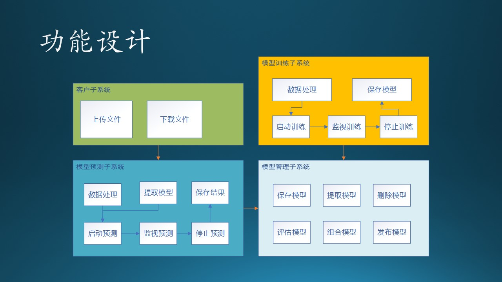
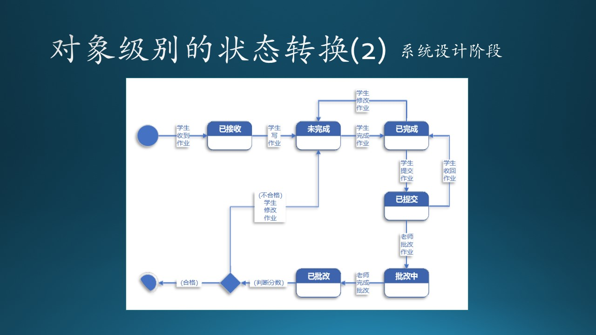

# 11.4 第四步：从加工逻辑到模块划分

下面我们针对整体数据流图（图11.2.2）中的各个图例来进行分析设计。

## 11.4.1 处理加工逻辑图例

### 客户

- 上传文件：由于使用了Azure Blob，又不需要做交互式界面，所以直接使用 AzCopy.exe 即可，在客户机器上用脚本调用；
  
- 下载文件：AzCopy.exe 同样可以下载文件，也使用脚本调用。

### 研究员

- 模型训练
  
  模型训练作为一个子系统，包含很多子模块，比如：
  - 数据读取
  - 数据处理
  - 提取特征值
  - 数据归一化
  - 训练代码载入
  - 超参数初始化
  - 启动训练
  - 观察训练过程
  - 停止训练
  - 保存模型
  
  我们就不展开说明了。由于训练模块对计算资源的要求非常高，我们必须把它设计为一个独立的子系统。

- 模型管理

  模型管理作为一个子系统，也包含很多子模块，比如：
  - 保存模型
  - 提取模型
  - 评估模型
  - 组合模型
  - 删除模型
  - 发布模型
  

- 数据处理：这是一个共用模块，被模型训练子系统调用，同时也被模型预测子系统调用。

- 提交训练代码：是一个 Azure 之外的模块，可以使用任何支持深度学习的框架，不在本系统的设计范围内。

### 工程师

- 模型预测
  
  包含很多子模块，比如：
  - 数据读取
  - 数据处理
  - 提取特征值
  - 数据归一化
  - 预测代码载入
  - 启动预测
  - 保存结果

  等等，我们就不展开说明了。由于预测模块对计算资源的要求较高，我们也必须把它设计为一个独立的子系统。

## 11.4.2

## 11.3.1 设计触发机制

需求要求我们在用户上传完文件后，立刻触发训练或者预测功能执行。

我们仔细看一下整体数据流图（图11.2.2）：“上传文件”是一个动作，在设计时对应到一个可执行程序或者界面，文件存储到“数据存储”单元后，如何触发“训练”和“预测”的动作发生呢？

激活一个程序，有四种方式：

1. 人工手动启动程序
  
   不适合本场景，因为客户是在周末非工作时段上传文件的，工程师不一定保证能及时响应；而且我们也不能让客户来启动训练和预测过程，那样做风险太大。

2. 定时启动

   不适合本场景，因为不知道用户何时上传数据，如果正上传一半时启动程序，数据不完整，程序就会出错。无论怎样设置定时器，都有可能发生这种情况。

3. 由特殊事件触发
   
   使用块存储时，每次的文件上次都可以触发一次事件。我们是否可以监听这个事件作为触发机制呢？

   对于股票交易来说，如果上周有5个交易日，一共5个文件；如果只有3个交易日，就只有3个文件。所以用户每次上传一个文件，都会触发一次独立的文件变化通知，那么我们如何知道哪个通知是最后一个呢？也许用户上传了3个文件，喝了杯咖啡，然后又上传了2个文件。

   当时木头在做这个设计时，在小组内讨论了多次，其中一个 Dev Lead 认为我们应该在服务器端维护一套完美的逻辑，能够判断出“用户上传文件是否结束了”。但是，木头想来想去都觉得这是不可能完成的任务，总会有意外发生，不可能完美。

   还有一种设计：
   - 在客户端把所有要上传的文件先打包压缩成一个文件，然后把压缩文件上传，这样就只触发一次通知事件。但是这需要在客户端有“压缩”的逻辑代码，或者用一个第三方软件来完成。
   - 传到 Blob 上以后，在使用前需要先解压，在服务器端需要用同样的软件/协议来解压，然后再写回 Blob 中，便于以后使用。

   从逻辑上看，复杂很多，遂放弃。

4. 由其它程序调用

   由于 Azure 边界的存在，上传文件行为是在客户端发生的，远在 Azure 之外，它不可能“调用”部署在 Azure 内的“训练”和“预测”模块，它只能“通知”。那么就需要我们再编制一个主控程序来接收“通知”，这样会多出一些工作来，但目前看来，这是我们唯一的解决方案。
   
   考虑到“训练”和“预测”模块的独立性，我们尽量不要改它们的业务逻辑，而是在外面单独增加一个控制中心，来接收来自客户端的“通知”，再做后续处理。即，在用户上传完文件后，由客户端手动或自动发送一个通知给控制中心，以便触发后面的工作流程。“上传”和“通知”两个动作最好在一个事务中完成。

图 11.3.1 - 设计控制中心

图 11.3.1 描述了上面的分析，图中的两条红色的虚线表示不正确的设计：

1. 上传文件结束后通知“控制中心”，这也避免了客户端程序直接接触到系统的核心功能，需要的话，在控制中心可以做各种保护措施；
2. 控制中心调度，执行训练；
3. 训练完毕后确定是否启用最新模型，如果新模型性能不如旧模型，则依然使用旧模型预测，然后执行预测；
4. 预测结束后通知用户去下载结果文件。

这种中心化的设计在系统设计中是很常见的。其缺点是要多设计、编码、部署出一个控制中心来，优点是业务逻辑非常容易调整，安全隔离，利大于弊。

## 11.3.2 控制中心的设计误区

在设计控制中心时，有一个非常常见的误区，见图 11.3.2：

图 11.3.2 - 错误的设计

1. 在控制中心做一个网页提供文件上传功能，然后由控制中心把文件写到数据存储中。
2. 在下载时同样通过控制中心读取结果文件，再由网页引导下载。

为什么是错误的？

1. 开发一个网页是有成本的。
   - 实习生说：很多框架都使得开发网页非常方便，基本上一天搞定。
   - 木头说：开发网页需要引入 Designer 来设计，需要引入 CELA（法务部门）来审查。一旦提供了网页，会引发出客户的很多隐含需求，那么开发周期就没有保证了。如果这个系统的客户数量多的话，可以考虑开发网页，但是目前看来只有一个客户，没必要开发。
2. 现在的网页一般使用 HTTPS 协议来保证安全性，需要申请域名并架设证书服务，这都需要费用，而在与客户的合同中不包含这部分费用。
   - 实习生说：可以找到免费的证书服务软件的，而且一些提供开源软件服务的网站都使用它。
   - 木头说：对不起，我们不能给客户提供第三方的免费的证书服务软件，这不在合同里；而且还需要定期去更新证书，维护成本增加。
3. 当客户的文件较多较大而且网络不稳定时，需要服务器有断点续传功能。
   - 实习生说：断点续传的开源软件很多呀，很多web框架里，大概十几行代码就可以完成了。
   - 木头说：AzCopy.exe可执行文件，实际上已经实现了大数据压缩、断点续传、安全验证等功能，我们没有必要去重复造轮子。它是一个成熟的微软产品，完全可信任。

从以上分析可以看到：
- 实习生关心的就是用开源的框架、服务去实现一个功能，对于实习生来说，开源的都可以使用；
- 而作为工程师的木头，要关心成本、安全、合规、维护、性能等等一堆问题，这也是软件工程的根本所在。对于工程师来说，开源首先意味着可信度低，可靠性差，在没有充分调研之前不能使用。

## 11.3.3 控制中心的技术选择

首先要确定软件开发环境。因为训练、预测、模型管理都使用了 Python，所以我们干脆也用 Python 来实现控制门户吧，代码管理方便，部署环境一致，技术栈统一。

在 Python 中有很多 RESTful Web 框架，如 Django REST framework，Flask-RESTful 等等。

- Django REST framework 是一个功能强大且灵活的 REST Web API 框架，包含 OAuth1a、OAuth2身份验证策略，支持 ORM 和非 ORM 数据源的序列化，使用基于函数的常规视图实现自定义你所需要的功能，有广泛的文档资料和社区支持。

- Tornado是一种 Web 服务器软件的开源版本。Tornado 和现在的主流 Web 服务器框架（包括大多数 Python 的框架）有着明显的区别：它是非阻塞式服务器，而且速度相当快。得利于其非阻塞的方式和对epoll的运用，Tornado 每秒可以处理数以千计的连接，因此 Tornado 是实时 Web 服务的一个理想框架。

- Flask 是一个使用 Python 编写的轻量级 Web 应用框架。其 WSGI 工具箱采用 Werkzeug ，模板引擎则使用 Jinja2 。Flask也被称为 “microframework” ，因为它使用简单的核心，用 extension 增加其他功能。Flask没有默认使用的数据库、窗体验证工具。Flask 很轻，花很少的成本就能够开发一个简单的网站。非常适合初学者学习。Flask 框架学会以后，可以考虑学习插件的使用。例如使用 WTForm + Flask-WTForm 来验证表单数据，用 SQLAlchemy + Flask-SQLAlchemy 来对你的数据库进行控制。

还有4、5个其它的框架，都有很多拥趸。对于我们这个系统，用户很少，所以对性能没什么要求，只要开发简单、能够稳定运行即可。所以最后木头选择了 Flask API，只用十几行代码就可以搞定框架部分，每个 API 定义一个函数，指定好传入的参数，非常的方便，调试也很简单。
