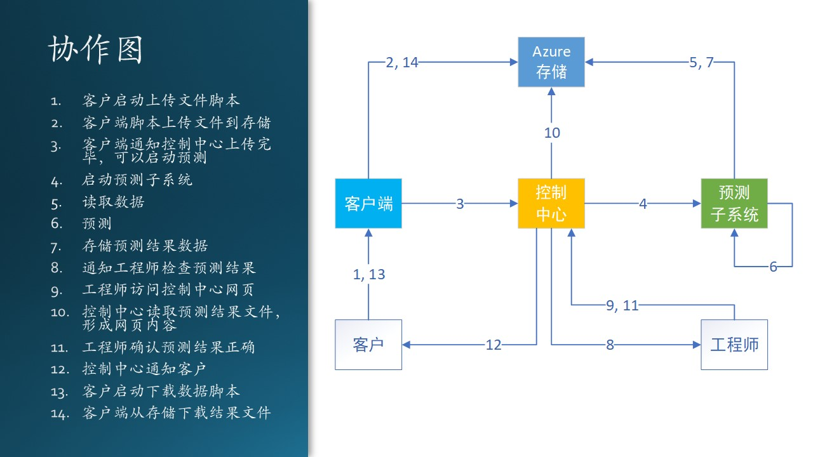
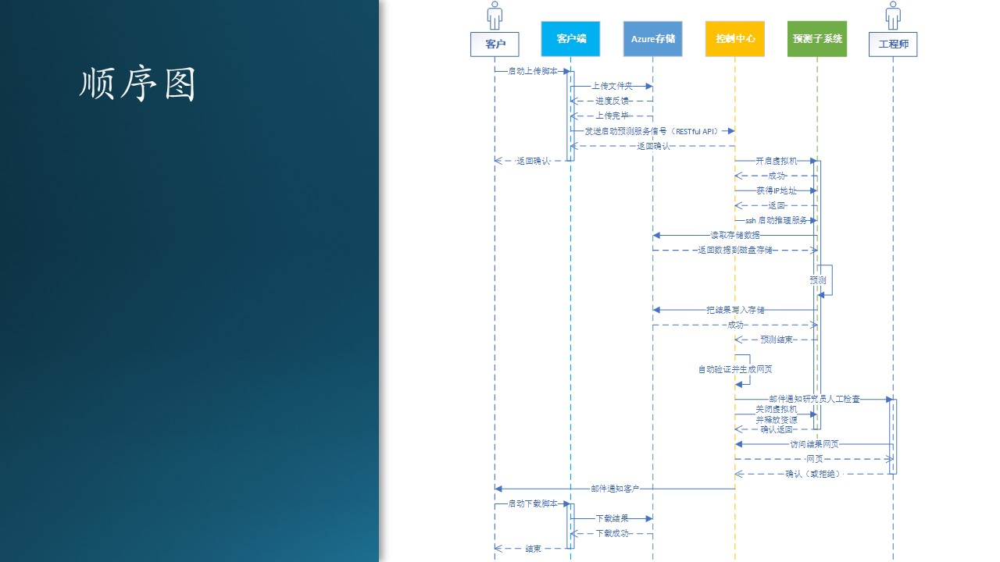

# 11.6 交互设计

上一节中得到了控制中心的状态设计，下面我们要设计控制中心、训练子系统、预测子系统、存储服务，还有参与者之间的交互关系，让整个系统能够运转起来。

交互设计是用于描述对象之间的交互关系，可以用两种图来辅助设计，一是协作图，二是顺序图。

## 11.6.1 协作图

协作图描述对象之间的协作关系，进一步弥补了 11.4 节中关于通知/调用的顺序问题。

图 11.6.1 - 协作图

在图 11.6.1 中，以“控制中心”对象（也可以叫做模块、子系统等等）为中心，连接起来周围的几个对象，所有的对象都与控制中心有交互，而对象之间（除了存储）基本没有交互。

为什么存储是个例外呢？因为存储在这里作为一个底层的公共模块，最好是被所有模块直接访问，如果都通过控制中心来访问的话，就太 Heavy 了。除了一种情况：对于存储，你的系统封装了一层业务逻辑，或者存储是一种分布式的，必须通过单点访问。

图 11.6.1 的左侧列出了右侧连接线上的序号所代表的实际交互行为，是按顺序发生的。连线的箭头方向表示交互的发起者到接收者的方向，而不是数据流或信息流的方向。

交互行为有以下几种：

- 人机交互
  
  人操作计算机，可以是键盘、语音、手势等，比如 1，13。

- 本地运行程序
  
  启动一个可执行文件，比如 6。

- 远过程调用
  
  以 TCP/IP 为基础的自定义通信协议，在本例中，使用 ssh 方式登录到其它机器上，然后执行程序。比如 4。

- RESTful API

  通过 RESTful API 调用服务器上的功能。比如 3，11。

- 网页访问
  
  用浏览器与服务器进行交互，执行简单逻辑。比如 9。

- 数据访问
  
  存取数据库、块存储、数据文件等。比如 2，5，7，10，14。

- 邮件通知
  
  通过第三方的电子邮件系统，异步通知对方做下一步动作。比如 8，12。这种方式比较特殊，由于大家对电子邮件方式非常熟悉，所以不做详细说明。在电子邮件内容或附件中，一般包含了下一步动作的指示。

## 11.6.2 顺序图

协作图刻画的是控制流，是一种初级的交互设计，但是还不够细，不能让程序员在实现阶段得到全面的信息。顺序图进一步弥补了这一缺陷。

图 11.6.2 - 顺序图

图 11.6.2 中的六个对象与图 11.6.1 中完全相同，每个对象下方的垂直虚线，表示该对象的作用域，而虚线上的长条表示改对象在系统运行中具有的生命周期（如果没有长条，则表示一直运行）。比如，控制中心是一直运行的，但预测子系统只会运行一小段时间，其他时间关机。

对比协作图中的动作 1 至 3：

1. 客户启动上传文件脚本；
2. 客户端脚本上传文件到存储；
3. 客户端通知控制中心启动预测。

在顺序图中，会有更为详尽的设计描述：

1. 客户启动上传脚本；
2. 上传文件夹内的数据文件；
3. 获得进度反馈，显示在脚本运行界面上（文本方式）；
4. 上传完毕后会返回控制权；
5. 客户端使用 REST API 发送启动预测服务的通知；
6. 控制中心接收，并返回确认；
7. 客户在脚本运行界面上看到确认返回的信息。

可以看到，顺序图会描述交互设计细节，包括以何种方式交互以及返回什么消息。有了顺序图，开发人员就可以开始编写代码了。

## 11.6.3 错误的顺序图设计

面对同样的问题，大家都会有不同的解决方案，没有对错，只是考虑的角度不同。但是有些设计却具有明显的错误。木头曾经把这个问题当作一个课堂练习，让同学们来设计系统，图 11.6.3 是其中一组同学的设计。

图 11.6.3 - 错误的设计

我们来一起分析一下这个设计的错误在哪里。这种图没有用标准的 UML 图例来画，也没有使用正确的工具，这个问题我们暂且不追究。

1. 使用浏览器来上传下载文件
   
   这个问题实际上在 10.2 节中已经讨论过了，做网页存在诸多弊端，如安全性、合规要求、数据断点续传、网页设计开发成本、引发潜在客户需求、部署 Web 服务等等。而它唯一的优点是在客户端不需要部署任何代码，为了这个“优点”，我们要做很多事情，在本项目中是得不偿失的。如果有成百上千的匿名访问客户使用该系统，我们还可以考虑使用浏览器技术。

2. 使用 Azure File 来存储数据文件
   
   这个问题在 10.2 节也讨论过了，文件系统需要装载到服务器才能使用，如果想在远程客户端使用 Azure 中的文件系统，那还需要额外的协议才能做到，还要考虑安全性、效率等等。而 Azure Blob 没有以上这些问题，可以在任何地方访问，作为共享存储的理想选择。

3. 使用 Azure Funtion 来开发控制中心逻辑
   
   Azure Function 是一种无服务（serverless）模式，可以通过一些事件触发机制来处理 HTTP 请求，然后做一些可以快速响应的任务，把结果返回给客户端浏览器。

   但是在图 11.6.3 的设计中，控制中心通过“启动程序”消息来启动预测子系统，预测结束后返回，在图中看，应该是设计了一个同步过程，但是这个预测的过程需要1个多小时，这就违反了 Azure Function 的设计初衷。如果设计成异步模式，“预测结束”这个事件并不能通知到Azure Function上，它只能接收事先定义好的系统事件。

   按前面的分析和设计，控制中心是一个状态机，恐怕用一个处理简单事件的 Azure Function 不能满足要求，而是需要一个完整的自定义系统来支持，比如虚拟机。

4. 启动预测子系统没有给出设计细节
   
   从控制中心启动预测子系统，在该设计中只给出了“启动程序”一条消息，过于笼统，另后续的程序员无法开始编码。预测子系统一定是一个独立的子系统，运行在专有服务器上。如果想启动它，则需要跨越机器操作，方法有很多种，必须要说清楚。

   在本例中，由于预测子系统是一台 Linux 操作系统的虚拟机，所以我们使用了 ssh 的“偷懒”方式，远程登录到该机器上启动程序，然后原地停等，直到预测过程结束后返回。其中，ssh 是用程序调用的。

5. 使用单独的组件来验证结果
   
   该组同学把验证程序作为一个Docker/Container来设计和实现，似乎是想把 Azure 上的相关技术全都使用上，这是没有必要的。“验证结果”功能完全可以作为预测子系统的一部分来提供，在预测完毕后立刻执行，没有必要设计一个单独的组件，增加了设计、实现、部署、维护的复杂性。

6. 人工检查确认结果没有给出设计细节
   
   在预测完毕后，需要工程师来人工检查预测结果并确认，但是该设计中没有指出如何检查，比如：

   - 通过电子邮件内容来检查
   - 远程登录到控制中心来检查
   - 通过一个网页检查
   
   可能性太多了。并且也没有说明如何“确认”，比如：

   - 在命令行输入什么命令？
   - 在界面上点击什么按钮？
   - 在系统中启动什么程序？

总结一下，图 11.6.3 这种粒度的设计，只能用于示意性说明，需要后期更完善的文字辅助来细化设计。最糟糕的情况是，有可能在做原型实现时，忽然发现某个设计在技术上是行不通的。
