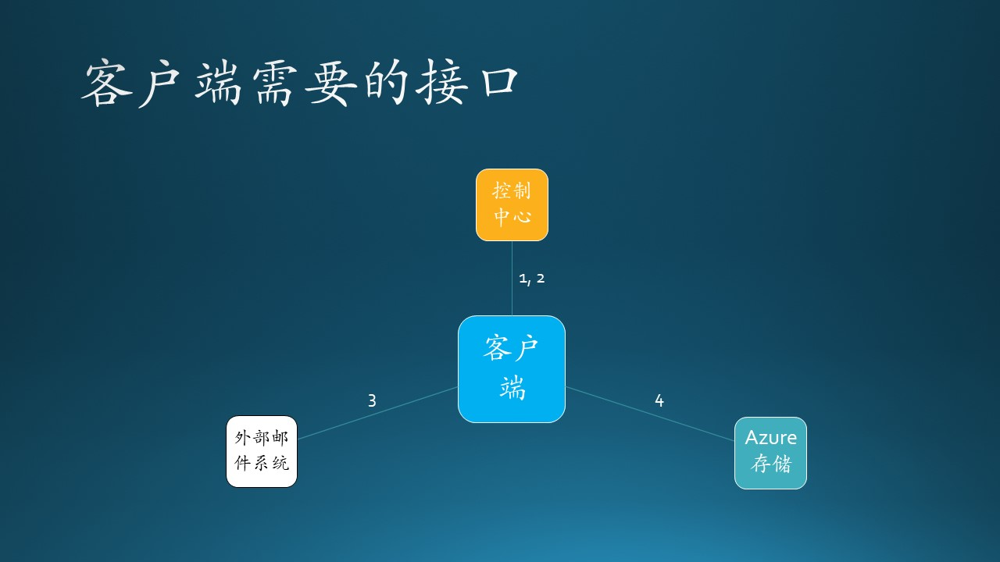
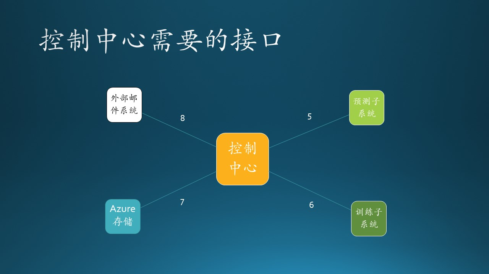
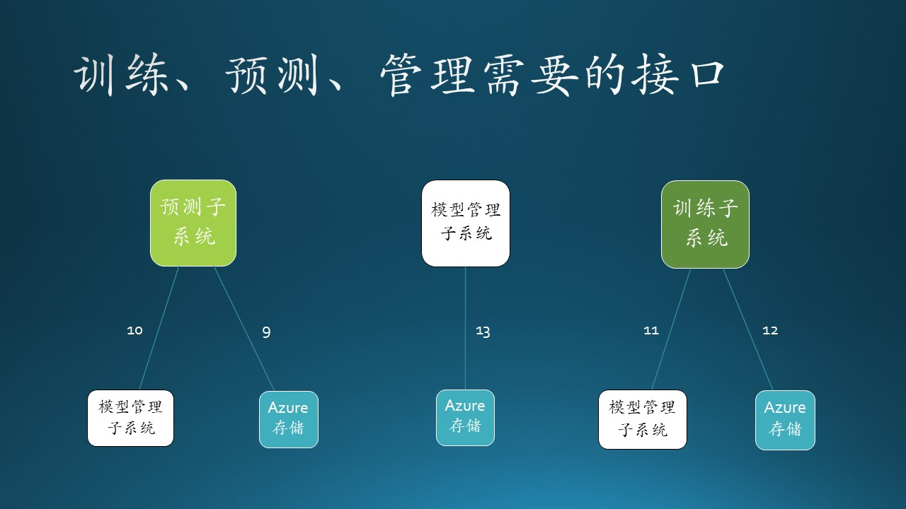
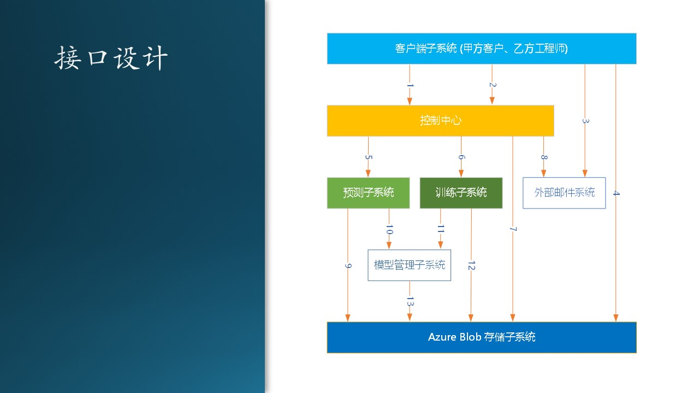

# 11.7 接口设计

# 11.7.1 接口技术选择

这里的接口指的是子系统之间的接口，而不是具体的编程语言接口，如 Java、C# 中定义的接口。另外，简单的 API 调用也不是我们要讨论的接口，我们主要讨论跨越进程甚至物理机器之间的接口设计问题。

在 11.6 节的交互设计中，我们确定了两个组件（子系统）之间如何交互，现在要设计具体接口，即：

1. 使用什么技术？
2. 传送什么数据？
3. 返回什么结果？

接口技术的选择：

- Web Service
  
  使用SOAP（Simple Object Access Protocol，简单对象访问协议）提供了在各种平台、框架上运行的不同软件之间可以进行互操作的标准方法。

- Web API/REST API
  
  使用 HTTP 协议的 GET、POST、PUT、DELETE 操作封装 JSON 数据作为参数，驱动服务器完成指定任务。

- RPC（Remote Procedure Call，远过程调用）
  
  有很多中间件可以完成 RPC，调用者在本地使用一个简单的 API，透明地通过服务器传递给被调用者完成指定功能。

- 管道
  
  是一种简单的 IPC（进程间通信）机制，可以是单向的或双向的，传送自定义消息，接收方自行解释执行相应功能。

- Message Queue

  消息队列，FIFO先入先出，是一种进程间通信的方式，接收方繁忙或掉线时，消息不会丢失，直到接收方可以重新主动获得消息。

- Socket

  最底层的套接字通讯，自己封装数据包并在发送和接收端解析，完成指定功能并返回给对方。

在本系统中由于有了控制中心的存在，使得不同子系统之间的网状连接变成了与控制中心的星形连接，大大简化了通信成本。由此可见，当系统中存在4个以上的子系统时，一定要使用星形连接来构建。

## 11.7.2 客户端需要的接口

图 11.6.3 - 客户端需要的接口

### 接口 1

接口 1 包括两个方法：

- 获得时间戳
   
   格式：GET /api/get_timestamp/

   客户端每周都要上传一次数据，带有强烈的时间信号，所以我们设计用时间戳来表示本批次的数据，时间戳的格式是“YYYYmmddHHMMSS”，即“年月日时分秒”。

- 通知控制中心

   格式：GET /api/start/<timestamp>

   这个方法用 POST 也是可以的，只不过用 GET 可以简化编程，也没有歧义。后面很多方法与此相同。
   
   客户端脚本上传完数据后，直接用 CURL.exe 可执行文件调用该接口，通知控制中心开始后续的工作。至于后续的工作是什么，由控制中心决定。

### 控制中心提供的接口

- 触发训练过程

  格式：GET /api/start_training/<timestamp>

- 检查训练结果
  
  格式：GET /api/review_training_result/<timestamp>

  这个接口实际上返回一个网页，研究员需要用此网页来检查训练结果的正确性，避免需要登录到 Azure 虚拟机上检查的麻烦。

- 确认训练结果
  
  格式：GET /api/confirm_training_result/<timestamp>

  在上面的接口返回的网页上，有一个按钮，研究员可以点击此按钮触发本接口，控制中心将接到通知。

- 触发预测过程
  
  格式：GET /api/start_inference/<timestamp>

- 检查预测结果
- 确认预测结果正确

### 客户子系统与存储

由于存储技术我们选择了 Azure Blob，它本身提供了多种访问方法。在客户端，我们决定使用 AzCopy.exe 可执行程序，通过参数指定文件位置的形式上传下载数据。这相当于一种远过程调用。

### 客户子系统与控制中心

## 11.7.3 控制中心

图 11.6.3 - 客户子系统的

图 11.6.3 - 客户子系统的

图 11.6.3 - 客户子系统的

