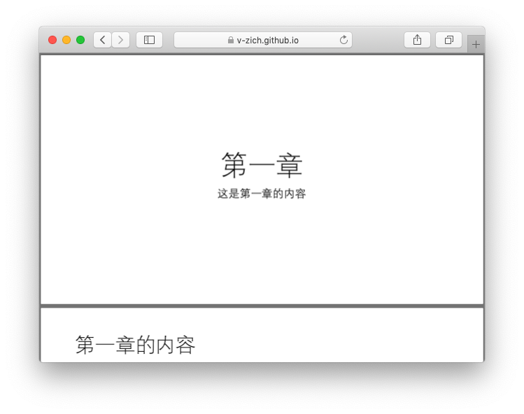

#  如何使用GitHub Pages展示教学资源

本文档介绍了如何使用GitHub Pages展示教学资源，如课件、文档等。利用GitHub Pages，您可以将教学资源整理成静态网页对外发布，方便读者阅读，且无需维护服务器。

点此可以[查看在线演示](https://v-zich.github.io/doc-page)。


> **关于GitHub Pages**
>
> GitHub Pages 是一项静态站点托管服务，它直接从 GitHub 上的仓库获取 HTML、CSS 和 JavaScript 文件，（可选）通过构建过程运行文件，然后发布网站。 您可以在 [GitHub Pages 示例集合](https://github.com/collections/github-pages-examples)中查看 GitHub Pages 站点的示例。
>
> [查看更多](https://help.github.com/cn/github/working-with-github-pages/about-github-pages#)


## 注意事项

* 为了方便在线查看，建议先将ppt、doc等文档转换成**pdf格式**


## 步骤

### 发布内容

1. 使用右上角+号下拉菜单，选择New repository（新建仓库）。


2. 输入仓库名，选择Create repository（创建仓库）。

   

3. 将待上传的资源按如下方式整理：

   ```
   - README.md # 可作为目录，在此引用其余内容
   
   /Chapter1 # 将本章节相关资源放置在此目录下
     - README.md # 打开此目录时会自动加载此文件
     - Example.md
     - Example.pdf
     ...
     
   /Chapter2 # 将本章节相关资源放置在此目录下
     - README.md
     ...
     
   ...
   ```

   

4. 将资源上传至GitHub

   使用如下命令：

   ```
   git remote add origin https://github.com/YOUR_NAME/YOUR_REPOS.git
   git push -u origin master
   ```

   

5. 打开仓库页面，选择Settings选项卡


6. 在GitHub Pages部分，更改Source为master branch

   


7. 稍等片刻后，可以查看已发布的GitHub Pages的链接

   


8. 打开链接即可加载仓库根目录下README.md的内容

   
   
   更多效果查看[效果演示](#效果演示)
   
   

### 更新内容

当您需要更新您的教学资源时，仅需使用如下命令，将本地更新后的内容推送至GitHub远程仓库

```
git push origin master
```

GitHub Pages将会**自动重新部署**并更新内容。


## 效果演示

在线效果演示：https://v-zich.github.io/doc-page/


1. 打开GitHub Pages链接，将展示仓库根目录下的README.md

   README.md可以作为教学资源的主页及目录，并引用其他资源或章节。


2. 从主页可以进入具体的章节

   在此可以书写详细的教学内容，也可以引用PDF等资源。

   

   可以在线打开PDF资源

   


## 参考资料

* [Getting Started with GitHub Pages](https://guides.github.com/features/pages/)

