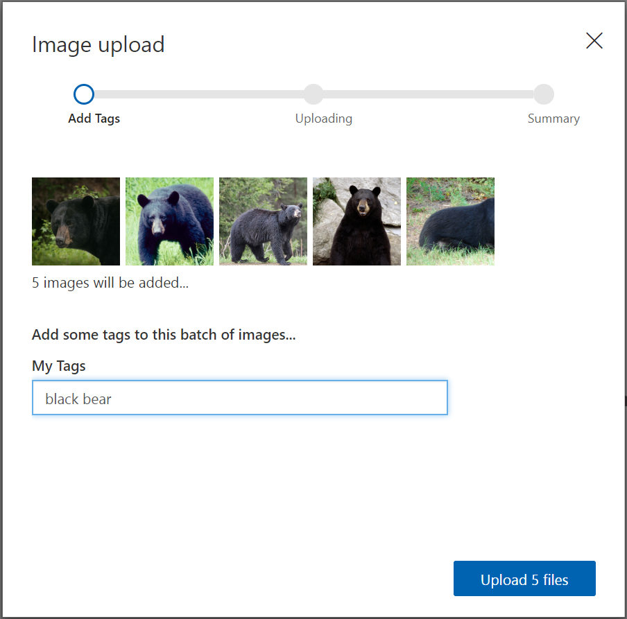
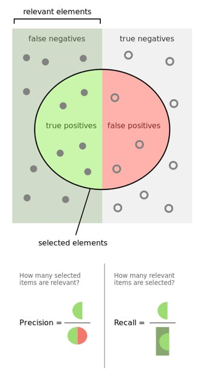
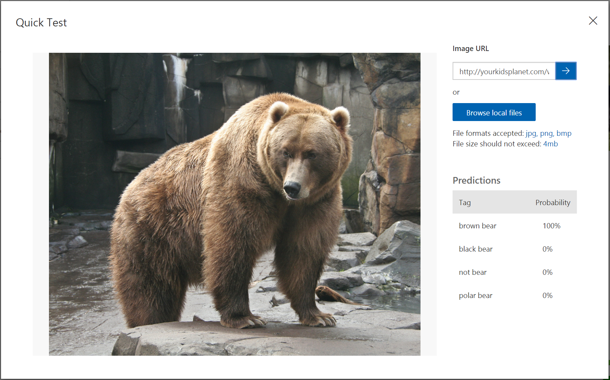
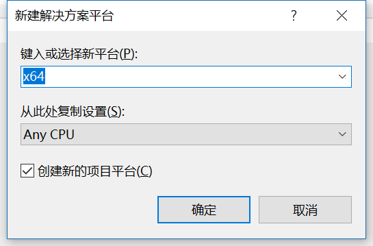
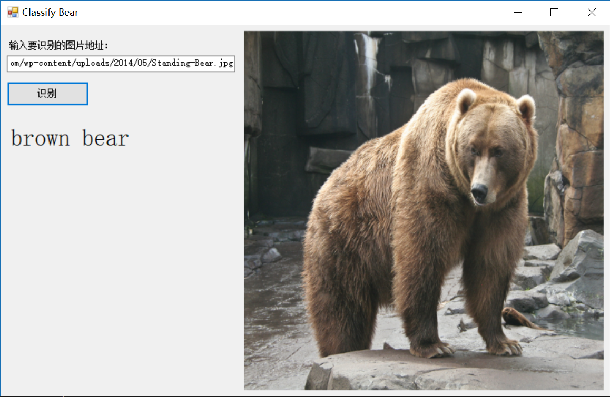

# 看图识熊

**主要知识点：**

  - 了解定制化视觉服务

  - 体验定制化视觉服务

  - 体验AI集成开发环境

  - 体验离线模型推理应用

# 目录

- [概述](#概述)
- [准备数据](#准备数据)
- [获取模型](#获取模型)
  - [定制化视觉服务简介](#定制化视觉服务简介)
  - [体验定制化视觉服务](#体验定制化视觉服务)
    - [登录定制化视觉服务](#登录定制化视觉服务)
    - [创建定制化视觉服务项目](#创建定制化视觉服务项目)
    - [添加数据](#添加数据)
    - [训练](#训练)
    - [测试](#测试)
    - [其它信息](#其它信息)
    - [导出模型](#导出模型)
- [构建应用](#构建应用)
  - [界面设计](#界面设计)
  - [查看模型信息](#查看模型信息)
  - [封装模型推理类库](#封装模型推理类库)
  - [使用模型推理类库](#使用模型推理类库)
  - [测试](#测试-1)
  - [更新模型](#更新模型)
- [小结](#小结)

# 概述

人工智能已经快要进入应用的高峰期了，但并不需要每个人都学习算法、建模。对于程序员来说，应该先从自己会的方向入手，学习如何应用AI来解决问题，开发应用。

本文将带着大家动手，从头做一个看图识熊的应用，输入一张熊的照片，程序输出这是什么熊。这里不会讲到AI的算法、模型，但会对涉及到的应用有关的概念做些介绍。

文中，我们将使用微软认知服务的必应图像搜索准备训练数据，然后用微软认知服务的定制化视觉服务训练模型，最后用Visual Studio Tools
for
AI将模型集成到应用中。

# 准备数据

机器学习总是离不开数据，没有数据就无法进行训练。

微软认知服务中除了提供了语音、视觉类的服务，还提供了搜索服务，其中就有必应图像搜索服务。

必应图像搜索的在线体验地址是<https://azure.microsoft.com/zh-cn/services/cognitive-services/bing-image-search-api/>。

输入要搜索图片的关键字，指定需要的图片的参数，右侧就可以预览搜索结果。还可以切换到JSON显示，可以看到返回值是结构化的数据，很容易得到每张图的链接地址。

如果需要大量的数据，可以申请一个密钥，写个简单程序调用必应图片搜索，然后下载图片即可。

本文计划让我们的程序可以识别出棕熊、黑熊、北极熊、熊猫这四种熊，所以需要分别搜索这四种熊的图片，每种熊需要的训练数据不多，5张图片就够了，大家可以手动下载图片。另外，为了防止随便给一张图片就被分类成某种熊，我们还需要一些负例，可以找5张其它动物的图片，作为负例。

这里需要注意一下，在选择训练数据的时候，要注意数据的泛化性。也就是说，选出来的图要尽可能的不一样。比如，不能只选草地上的，也不能只选走路的熊，还得选站着的熊。不然，可能模型会把草地认成熊。

最好是按照文件夹把熊都分好类，这样一会儿训练的时候就比较容易。这个用文件夹分类的过程，其实就是标记数据的过程。我们这次要解决的问题是分类问题，所以，标记起来是非常快的。有些应用标记起来就没那么容易了。比如图片中的目标检测，要对每个目标画一个框，而且要尽量画准。再比如音频的标记，要听录音，然后把文字打出来，甚至需要每个字都写上在什么时候开始、什么时候结束。所以，有了数据、再把人类知识应用到数据上，有时会是很大的工作量。

# 获取模型

在机器学习应用中，任何情况下都需要一个或大或小的模型。而怎么得到这个模型，往往是其中最复杂的部分。有的时候，在缺少强大计算资源与高性能算法的情况下，我们不一定需要自己从零开始训练模型。我们需要用的一些轮子，已经有人给我们造好了。比如微软提供的定制化视觉服务。

## 定制化视觉服务简介

定制化视觉服务，相当于在云端提供了一个生成模型的方法，把模型相关的复杂的算法都简化了。同时，它能够让用户自己管理训练数据，定义自己的分类问题。这样在易用、强大之间找到了一个平衡点。

从适用的范围上讲，如果要分类的项在图像中比较突出，则定制化视觉服务可发挥比较好的效果。但是，定制化视觉服务并不适合用于检测细微的差异。例如，检测质量发现产品中的细微裂纹或凹陷。另外，因为这个世界纷繁复杂，能进入人眼的物体和它们的排布、表现方式的组合，几乎是无穷无尽的。定制化视觉服务后面的模型也不能解决所有领域的问题，这样会影响精确性。所以定制化视觉服务既提供了通用模型，又提供了几个特定的领域模型。如果对识别性能要求很高，则需要定制化视觉服务后面的领域模型非常强大才行。

从训练速度上讲，传统的训练模型需要数小时的时间，而定制化视觉服务采用了迁移学习的方法，这种方法可以在已有的预训练模型的基础上，只有需要少量的训练图片和很短的训练时间，就可以训练出针对特定问题的新的模型。有点类似四五岁的小孩子学习新的动物，已经用了四五年的时间对动物的各种特征有了初步了解，也会基本的认知分类，然后再给他一种新的动物的几张图片，他瞬间就能学会如何成功的区分新的动物。

## 体验定制化视觉服务

下面我们一起动手在线体验一下定制化视觉服务，试着训练模型并导出。

### 登录定制化视觉服务

定制化视觉服务的官方地址是<https://customvision.ai/>，打开网站后，点击SIGN
IN。使用该服务需要准备微软账号，也可以直接在定制化视觉服务官方地址上创建。


登录后，界面会提示要求同意一些条约。条约的大致内容就是，个人必须在微软要求的规则下使用微软提供的这项服务。请勾选I
agree


此时，界面会提示注册Azure，因为定制化视觉服务实际上是Azure提供的一项云服务，正式使用这项服务需要有Azure订阅。

不过我们现在只是免费试用，所以选择Continue with
trial，如果在根据本文流程做完了一个小应用之后，你觉得确实需要使用这项服务，那么你可以去注册Azure账号，获取Azure订阅。

### 创建定制化视觉服务项目

点击NEW
PROJECT，填写项目信息。填写好Name和Description，这里Name不妨填写为BearClassification。随后选择Classification和General(compact)，点击Create。

Project Type一栏，定制化视觉服务提供了分类和目标检测两种服务，这里选择分类项目。

Classification
Types一栏，这里使用的图片中，每张图片只有一种熊，这里选择每张图片一个标签的模式。

Domains一栏，可以看到服务提供了多种预定义的场景，可以对特定领域的分类给出更好的结果。但是这里没有专门针对动物的，所以使用通用领域。另外还可以看到有的领域区分带compact标记和不带标记的，本文使用带标记的，即General(compact)领域。

带有compact标记，表明训练后的结果是一个压缩模型。压缩模型，顾名思义，模型占用的空间更少，运行更快，甚至可以放到手机这种移动设备里。当然，会有一个小问题就是精确度会受影响。但是压缩模型也有好处，导出模型后，模型文件的使用是没有任何限制的，而其余的几种场景只能通过调用API来进行预测，当前属于免费试用，有10000次调用上限。


### 添加数据

点击Add images，选择前面事先准备好的5张黑熊的照片，然后在弹出的Image upload页面中，设置My Tags的值为black
bear，然后点击Upload 5 files。

注意，My Tags值不能使用中文，否则后续识别的结果会乱码。



重复以上步骤，依次添加其它类别熊的训练数据，这里使用的对应的标签是brown bear、polar bear、not
bear。

注意，这里没有添加大熊猫的图片，我们在后面更新模型章节中再上传。

### 训练

在添加了所有的数据集和标签之后，点击网页上方的Train，开始训练模型。


大约十秒钟以后，训练就完成了，页面会自动跳转到Performance页面，并显示本次训练的结果。如图所示，这里只训练了一次，左侧只有一个Iteration1，如果有多次训练就会出现多个Iteration，右侧是本次训练得到的模型的一些指标。


这里简单解释一下Precision准确率和Recall召回率，这是两个评估模型好坏的主要指标。下图是维基百科中对这两个值的图形化的解释。

 

简单来说，两个数都是越大越好。但是这两个数据其实很难两全，提高其中一个，必然会降低另一个。举个例子，欧美的法律很讲证据，是无罪推定。即，不能证明某人有罪，那就判他无罪。所以，被判刑的人，都是证据确凿的。这时，我们说罪犯中实际犯罪的人的比例非常高，但是很多罪犯可能并没被抓起来，所以召回率很低。而电视里看到的特务经常会说，宁可错杀一千，不可放过一个。这是有罪推定。只要有疑点，就抓起来。我们假设这里说的都是真正的罪犯。这时，我们说，罪犯中实际犯罪的人比例可能不高，有不少都是被冤枉的，所以准确率很低。但可以认为罪犯基本上都被抓住了，所以召回率比较高。

在这个项目中，以brown
bear为例：Precision准确率，表示在所有被识别为棕熊的图片中真正有棕熊的图片所占的比例；而Recall召回率则是测试结果中正确识别为棕熊的图片占测试集中所有棕熊图片的比例。

### 测试

定制化视觉服务支持快速的在线测试，点击页面顶部的Predictions进入预测页面，然后点击Quick
Test，打开测试页面。输入一张网络图片的地址或上传一张本地图片就可以看到预测结果。

我们这里测试一张棕熊的图片，可以看到这个棕熊能够被正确的识别出来。



### 其它信息

点击界面右上角的齿轮，可以看到免费用户每个项目能够使用的服务额度：

一共可以上传5000张图片，创建50个不同标签，保存10次迭代的结果。


这十次迭代有什么用呢？当需要增删标签、给标签添加或删除训练图片时，这次再训练，就会花费掉一次迭代。

这些都是当前项目的总数而不是累计值。对于一般的免费用户，这基本上就相当于你可以随意使用这项服务了，如果有大量的训练数据，那么建议您还是订阅Azure云服务，Azure秉持着使用多少收费多少的原则，即使收费，也仍然良心。

### 导出模型

为了构建本地离线推理应用，我们需要下载模型。点击顶部Performance按钮回到训练结果页面并切换到要使用的Iteration，然后点击Export按钮，可以看到如下所示的导出页面。


定制化视觉服务一共提供了四种模型的导出，对三大操作系统都能支持，这里我们选择ONNX。

ONNX，全称Open Neural Network
Exchange，即开放神经网络交换格式，是由微软、FaceBook等多个相关公司一起推动的深度学习模型标准。Microsoft
Cognitive Toolkit、Caffe2、PyTorch等工具已经支持ONNX。

选择ONNX后，点击Export，等待服务器把模型导出，然后点击Download，即可下载模型，这里将名字改为BearModel.onnx。

注意，存放模型文件的路径不要包含中文。

# 构建应用

模型有了之后，这里就可着手构建应用程序来使用模型了。进行这一步之前，请确保已正确安装配置了Visual Studio 2017 和
Microsoft Visual Studio Tools for
AI环境。

项目的代码也可以在GitHub上找到，<https://github.com/MS-UAP/edu/tree/master/AI301/ClassifyBear/src>，下面的步骤是带着大家从头到尾做一遍。

## 界面设计

创建Windows窗体应用(.NET
    Framework)项目，这里给项目起名ClassifyBear。

注意，项目路径不要包含中文。

在解决方案资源管理器中找到Form1.cs，双击，打开界面设计器。从工具箱中向Form中依次拖入控件并调整，最终效果如下图所示：


左侧从上下到依次是：

  - Label控件，将内容改为“输入要识别的图片地址：”

  - TextBox控件，可以将控件拉长一些，方便输入URL

  - Button控件，将内容改为“识别”

  - Lable控件，将label的内容清空，用来显示识别后的结果。因为label也没有边框，所以在界面看不出来。可以将此控件的字体调大一些，能更清楚的显示推理结果。

右侧的控件是一个PictureBox，用来预览输入的图片，同时，我们也从这个控件中取出对应的图片数据，传给我们的模型推理类库去推理。建议将控件属性的SizeMode更改为StretchImage，并将控件长和宽设置为同样的值，保持一个正方形的形状，这样可以方便我们直观的了解模型的输入，因为在前面查看模型信息的时候也看到了，该模型的输入图片应是正方形。

## 查看模型信息

在将模型集成到应用之前，我们先来看一看模型的基本信息，比如模型需要什么样的输入和输出。打开Visual
Studio中的AI工具菜单，选择模型工具下的查看模型，会启动Netron模型查看工具。该工具默认不随Tools
for AI扩展一起安装，第一次使用时可以按照提示去下载并安装。

Netron打开后，点击Open
model选择打开之前下载的BearModel.onnx文件。然后点击左上角的汉堡菜单显示模型的输入输出。


上图中可以看到该模型需要的输入data是一个float数组，数组中要求依次放置227\*227图片的所有蓝色分量、绿色分量和红色分量，后面程序中调用时要对输入图片做相应的处理。

上图中还可以看到输出有两个值，第一个值loss包含所有分类的得分，第二个值classLabel是确定的分类的标签，这里只需用到第二个输出即可。

## 封装模型推理类库

由于目前模型推理用到的库只支持x64，所以这里需要将解决方案平台设置为x64。打开解决方案资源管理器，在解决方案上点右键，选择配置管理器。


在配置管理器对话框中，点开活动解决方案平台下拉框，选择新建


在新建解决方案平台对话框中，输入新平台名x64，点击确定即可



下面添加模型推理类库，再次打开解决方案资源管理器，在解决方案上点右键，选择添加，然后选择新建项目。

添加新项目对话框中，将左侧目录树切换到AI
Tools下的Inference，右侧选择模型推理类库，下方填入项目名称，这里用Model作为名称。


确定以后会出现检查环境的进度条，耐心等待一会就可以出现模型推理类库创建向导对话框。

点击模型路径后面的浏览按钮，选择前面下载的BearModel.onnx模型文件。

注意，这里会出现几处错误提示，我们需要手动修复一下。首先会看到“发现不支持的张量的数据类型”提示，可以直接点确定。


确定后如果弹出“正在创建项目…”的进度条，一直不消失，这里只需要在类名后面的输入框内点一下，切换下焦点即可。


然后，我们来手动配置一下模型的相关信息。类名输入框中填入模型推理类的名字，这里用Bear。然后点击推理接口右侧的添加按钮，在弹出的编辑接口对话框中，随便起个方法名，这里用Infer。输入节点的变量名和张量名填入data，输出节点的变量名和张量名填入classLabel，字母拼写要和之前查看模型时看到的拼写一模一样。然后一路确定，再耐心等待一会，就可以在解决方案资源管理器看到新建的模型推理类库了。


还有一处错误需要手动修复一下，切换到解决方案资源管理器，在Model项目的Bear目录下找到Bear.cs双击打开，将函数Infer的最后一行
```C#
return r0;
```
替换为
```C#
List\<List\<string\>\> results = new List\<List\<string\>\>();
results.Add(r0);
return results;
```
至此，模型推理类库封装完成。相信Tools for AI将来的版本中会修复这些问题，直接选择模型文件创建模型推理类库就可以了。

## 使用模型推理类库

首先添加对模型推理类库的引用，切换到解决方案资源管理器，在ClassifyBear项目的引用上点右键，选择添加引用。


在弹出的引用管理器对话框中，选择项目、解决方案，右侧可以看到刚刚创建的模型推理类库，勾选该项目，点击确定即可。


在Form1.cs上点右键，选择查看代码，打开Form1.cs的代码编辑窗口。

添加两个成员变量
```C#
// 使用Netron查看模型，得到模型的输入应为227\*227大小的图片
private const int imageSize = 227;

// 模型推理类
private Model.Bear model;
```

回到Form1的设计界面，双击Form的标题栏，会自动跳转到代码页面并添加了Form1\_Load方法，在其中初始化模型推理对象
```C#
private void Form1\_Load(object sender, EventArgs e)
{
    // 初始化模型推理对象
    model = new Model.Bear();
}
```

回到Form1的设计界面，双击识别按钮，会自动跳转到代码页面并添加了button1\_Click方法，在其中添加以下代码：

首先，每次点击识别按钮时都先将界面上显示的上一次的结果清除
```C#
// 识别之前先重置界面显示的内容
label1.Text = string.Empty;
pictureBox1.Image = null;
pictureBox1.Refresh();
```

然后，让图片控件加载图片
```C#
bool isSuccess = false;
try
{
    pictureBox1.Load(textBox1.Text);
    isSuccess = true;
}
catch (Exception ex)
{
    MessageBox.Show($"读取图片时出现错误：{ex.Message}");
    throw;
}
```

如果加载成功，将图片数据传给模型推理类库来推理。
```C#
if (isSuccess)
{
    // 图片加载成功后，从图片控件中取出227*227的位图对象
    Bitmap bitmap = new Bitmap(pictureBox1.Image, imageSize, imageSize);

    float[] imageArray = new float[imageSize * imageSize * 3];

    // 按照先行后列的方式依次取出图片的每个像素值
    for (int y = 0; y < imageSize; y++)
    {
        for (int x = 0; x < imageSize; x++)
        {
            var color = bitmap.GetPixel(x, y);

            // 使用Netron查看模型的输入发现
            // 需要依次放置227 *227的蓝色分量、227*227的绿色分量、227*227的红色分量
            imageArray[y * imageSize + x] = color.B;
            imageArray[y * imageSize + x + 1* imageSize * imageSize] = color.G;
            imageArray[y * imageSize + x + 2* imageSize * imageSize] = color.R;
        }
    }

    // 模型推理类库支持一次推理多张图片，这里只使用一张图片
    var inputImages = new List<float[]>();
    inputImages.Add(imageArray);

    // 推理结果的第一个First()是取第一张图片的结果
    // 之前定义的输出只有classLabel，所以第二个First()就是分类的名字
    label1.Text = model.Infer(inputImages).First().First();
}
```

注意，这里的数据转换一定要按照前面查看的模型的信息来转换，图片大小需要长宽都是227像素，并且要依次放置所有的蓝色分量、所有的绿色分量、所有的红色分量，如果顺序不正确，不能达到最佳的推理结果。

## 测试

编译运行，然后在网上找一张熊的链接填到输入框内，然后点击识别按钮，就可以看到识别的结果了。注意，这个URL应该是图片的URL，而不是包含该图片的网页的URL。



## 更新模型

我们可以再找一张大熊猫的图片进行测试，会发现程序不能认出大熊猫，这很正常，因为训练数据中根本就没有大熊猫。下面修复一下这个问题。

首先按照前一章节的办法，在定制化视觉服务中添加5张大熊猫的照片，并标记为giant
panda，然后再次点击训练。训练结束后，重新下载模型文件，保存为和之前下载的模型同名的文件。

然后在Visual
Studio中切换到解决方案资源管理器，依次展开`Model->Bear->00000001`，在该文件夹上点右键，选择“在文件资源管理器中打开文件夹”。


打开该文件夹后可以看到里面有一个BearModel.onnx文件，这是旧的模型。将新下载的模型拷贝到这，覆盖旧模型，然后重新编译解决方案。

再次运行并用大熊猫的照片测试，发现程序可以成功的识别大熊猫。

# 小结

我们回顾一下本案例体验了哪些过程。首先，我们收集了一些数据，并给它们进行了分类。然后，使用定制化视觉服务训练并导出了模型。再然后就是代码部分，设计了界面、让它与代码能够联动。再然后就是代码中比较复杂的部分，即数据的规范化。最后的推理预测其实只有一行代码就够了。完成后，我们又添加新数据重新训练了一遍。

这个案例很简单，主要是希望大家体验一下AI应用开发。其实AI应用开发和我们传统的应用开发没有太大区别，可以认为就是调用了一个神奇的函数，给它一些数据，它就还给你一个答案。如果多有几个神奇的函数，那么就能做出更加智能的程序，就成为了真正的产品了。

最后，给大家留个小作业：大家可以用卡通熊或者毛绒熊玩具的照片测试一下，然后考虑如何能把这几种熊从真实熊的照片中区分出来。完成后可以找出一些新的卡通熊或毛绒熊图片进行测试，看看能否达到较好的分类效果。
