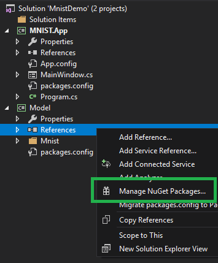
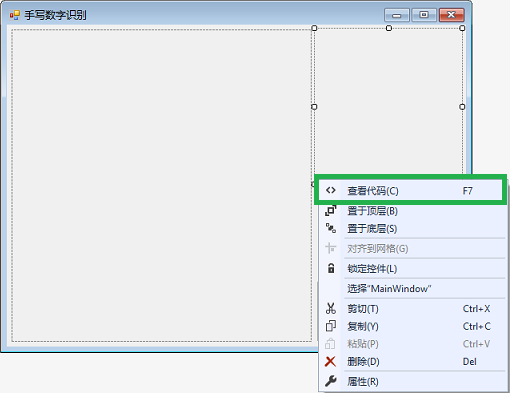

Copyright © Microsoft Corporation. All rights reserved.
  适用于[License](https://github.com/Microsoft/ai-edu/blob/master/LICENSE.md)版权许可

基于本地模型的手写数字识别应用开发案例
===
使用Visual Studio Tools for AI加速桌面智能应用开发
---

# 主要知识点
-	典型的AI应用的代码结构和功能，如处理输入；
-	使用Visual Studio Tools for AI进行TensorFlow模型到.Net Framework应用环境的快速集成。

# 简介

本文将介绍一例“手写数字识别应用”的开发过程。本文将通过这一入门级案例展示人工智能应用开发中的典型元素，如准备人工智能应用开发所需的软件环境，使用Visual Studio Tools for AI快速集成模型、加速人工智能应用开发，以及在代码中处理用户输入，以便人工智能模型能正确地接受输入的数据等等。本文将对这些工作和该应用的主要代码逻辑进行分析、讲解。此外，本文还将解答手写数字识别应用开发的一些常见问题，并介绍现实场景中的一些可能需求。开发将基于桌面.Net Framework环境和训练好的MNIST手写数字分类模型完成。

# 目标应用介绍

## 背景

在移动硬件得到高度发展的今天，手写输入已经成为了一种非常常见的输入方式。然而手写输入和传统的鼠标、键盘输入方式有很大的不同，相对于传统输入方式生产的数据，手写输入的内容——也即数据——在很多场景下都不是计算机能直接处理的。

传统的输入方式里，鼠标的点击可以对应到屏幕上精确的一点，进而对应到某一特定的UI控件；键盘的敲击可以产生一个特定的字符数据。这些都是计算机可以很容易处理的。而通过手写输入，计算机得到的只是一块具有“特别的形状”的图形，但这图形中蕴含着的用户真正的意图，计算机却不能识别。而这些蕴含其中的意图，才是很多应用场景的核心价值所在。比如用户希望设备上的手写输入法，可以将手写的字转换成传统的字符数据；笔记应用应能识别用户手写的笔记，并进行索引以便查询或计算一些数学表达式的结果……然而我们都有所了解，用传统的技术手段，很难高质量地达成这一识别任务。

不过近年来人工智能领域取得了很多令世人瞩目的成果，其中图像识别方面的很多成果，非常值得我们借鉴。那么这些人工智能领域的成果，能否助力我们广大应用开发者解决上述这些手写输入相关的难题呢？答案是肯定的。

本文将介绍一款“手写数字识别应用”的开发和其代码结构。这款应用通过借力MNIST数据集，具备了最基本的手写输入功能和图像识别功能，能将用户手写的0，1，2，…，9数字单个地识别出来。该应用使用效果如图：


麻雀虽小，五脏俱全。这款入门级应用涵盖很多了人工智能应用开发中的典型问题。本文将以这些基本问题为出发点，为读者展开人工智能应用开发的画卷。

## 开发环境

本文采取.Net Framework桌面环境作为开发环境，基于WPF框架实现用户界面，并依赖TensorFlow和VS Tools for AI等组件来完成人工智能模型的创建和集成。

后文将介绍的开发中需要用到人工智能模型的训练环境，请确保已经按照【引用：课程1 – 环境准备】中所述在本地机器上下载（Git的术语叫“克隆”）了微软AI样例库（即命令`git clone https://github.com/Microsoft/samples-for-ai.git`），并已成功安装了相关工具（即CUDA、cuDNN，若硬件允许）并成功运行了安装脚本（即`installer\install.py`）。

#	训练模型

##	模型介绍

之前下载的samples-for-ai样例库中包含了大量的机器学习训练和应用的示例，其中就有针对MNIST数据集的人工智能模型（下称MNIST模型）训练程序，这正是我们需要的。

MNIST数据集包含了大量单个手写数字的位图数据，包含各种手写风格，并且这些位图数据都已经被很好地标记过了。即每一张手写数字的位图都存在一个对应的数字，并且这个数字是可以以数据的形式被访问的。这极大地简化了我们的准备工作。

MNIST数据集为本文中识别手写数字的问题提供了大量素材，利用这些素材我们可以训练出专门用于识别单个手写数字的人工智能模型。

同时，我们选择使用TensorFlow来训练MNIST模型。TensorFlow是一款使用非常普遍、很有代表性的机器学习框架。

## 实际训练

打开“命令提示符”，再同cd命令进入samples-for-ai样例库中，TensorFlow示例集中的MNIST目录，如：

```cmd
cd D:\Users\squir\source\repos\samples-for-ai\examples\tensorflow\MNIST
```

> *小提示*
>
> 如果最初下载（即克隆）samples-for-ai的磁盘并非C盘（命令提示符默认的初始磁盘），如D盘，那么执行完cd命令后还需再执行D:命令将当前命令行切换到其他磁盘。

此时可以通过 `python –-version` 命令检查一下我们在命令行下能否访问到Python。

如果出现下图的情况：


则还需要执行下面的命令，将通过Visual Studio 2017 Installer安装的Python 3.6（也就是【课程1】中执行 `install.py` 脚本的Python）所在的目录加入 `PATH` 环境变量，以便我们接下来能正确执行Python：

```cmd
set PATH=C:\Program Files (x86)\Microsoft Visual Studio\Shared\Python36_64;%PATH%
```

> **注意**
>
> 此处的真正目的是将通过 `install.py` 脚本安装了机器学习工具的Python.exe引入命令行，而非引入任意的Python.exe。如果Python不是通过Visual Studio 2017 Installer安装的，或者执行 `install.py` 脚本的是别的环境下的Python.exe，那么上述 `set PATH` 命令将不适用，需要根据实际情况调整环境变量PATH。

然后我们执行下面的命令来启动MNIST模型的训练：

```cmd
python mnist.py
``` 

运行过程中会打印出一些 error 字样。别担心，这都是AI训练过程中正常的错误率信息。随着训练过程的进行，模型在训练时的错误率会逐步下降，这表示 AI 模型推理预测出的结果越来越准确了。模型训练的最终结果如下图：


训练结束后，我们可以在samples-for-ai样例库下的 `examples\tensorflow\MNIST\export` 文件夹内看到 `saved_model.pb` 文件和 `variables` 文件夹，它们即是我们训练出的MNIST模型。

> *小提示*
>
> 如果用来训练的机器没有配备高性能的GPU，训练MNIST可能会花费很长时间。如上图所示，需要8500个Step才能完成训练，我们可以靠观察Step数量的增量来判断训练速度。如果训练速度很慢（特别是没有高性能GPU的情况下），我们可以先进行下一章节的学习。之后需要用到训练出的MNIST模型时，再确保训练完成即可。

# 应用的构建和理解

本文已经为读者准备好了该手写数字识别应用的主体代码，但仍需要完成对MNIST模型的集成工作，才算完成整个人工智能应用的开发。接下来本文将介绍模型的集成工作和对整个项目内的重点代码片段进行分析讲解。

##	完成应用

###	克隆代码

本文所需的主体代码就在这个仓库中，可以通过 `git clone` 当前仓库来获取代码。

> **注意**
>
> 由于本教程使用的工具对中文路径的支持不好，请务必将 `sample-mnist` 文件夹复制到 **没有中文字符的路径** 下，再从那里打开解决方案。

成功获取代码后，可以双击打开本文件下的 `sample-mnist\MnistDemo.sln` 解决方案文件，以启动 Visual Studio 2017 并加载包含应用主体代码的解决方案。

###	引用模型

> **注意**
>
> 这一步骤需要用到我们在实际训练章节中训练出的模型。如果尚未训练完成，请等待训练完成后再继续阅读。

1.	首先创建模型项目。在解决方案资源管理器中，右击解决方案，指向添加，再点击新建项目，如下图所示：


2.	在弹出的添加新项目的对话框里，选择 **AI Tools** 下的 **Inference** 后，在右边选择 **模型推理类库(.NET Framework)**，如下图所示。然后在下面的 **名称** 处改为 **Model**，并点击确定。

> **注意**
>
> 名称（即“Model”）一定要保持一致（包括大小写），这是生成代码的命名空间。已有的代码会按照预设的名称来访问模型相关的代码。


3.	点击确定后，Visual Studio 会提示正在 **检查环境**。完成后会显示创建向导对话框，如下图。红色的框先不用担心，点击 **浏览**。


4.	找到之前训练出的 `saved_model.pb` 文件（一般在samples-for-ai样例库下的 `examples\tensorflow\MNIST\export` 文件夹内），并点击 **打开**。如下图所示。


5.	点击打开后，会出现 **分析模型** 的过程，等待分析完成。分析完成后，再如图所示在类名中输入 **Mnist**，最后点击 **确定**。第一次导入模型会下载所依赖的库，因此，**正在创建项目"Model"...** 的对话框会显示较长时间。


> **注意**
>
> 类名（即“Mnist”）一定要保持一致（包括大小写），这是生成的模型访问类的类名。已有的代码会按照预设的名称来访问模型相关的代码。

> *小提示*
>
> **分析模型** 会调用 TensorFlow 来分析模型文件的输入输出等信息，以便生成相应的代码，有时会花一两分钟。

6.	创建项目完成后，先检查一下是不是如图中高亮区域1所示产生了 Model 项目，并且里面有 `packages.config` 文件（高亮区域1）。如果没有看到此文件，通常是由于网速过慢，下载超时造成的。请参考5.2创建模型项目时出现错误。

推理类库创建成功后，我们还需要调整一个依赖项的版本，否则会出现不兼容的错误。要调整依赖项版本，请在解决方案管理器中，于 **Model** 项目下的 **引用** 上右键，选择 **管理NuGet包**，如下图所示。



然后在弹出的NuGet包管理页面里，找到 Microsoft.ML.Scoring 项（已经被自动安装了，比如下图中显示的 1.2.0 版），我们需要将它换成其他版本。请在下图所示的高亮区里，选择 **1.0.3** 版本并安装。之后等待安装完备。这样就设置好可以运行本教程的软件环境了。


完成NuGet包的版本替换之后，我们需要在主体界面的项目上，引用我们的模型推理类库。

在解决方案资源管理器中，右击 **MNIST.App** 项目的 **引用**，并点击 **添加引用**。如下图高亮区域2、3所示。


7.	在弹出的对话框中，点击 **项目**，并在右侧将 **Model** 勾上。这样就能在窗体项目MNIST.App中引用 Model 项目中用于访问MNIST模型的代码了。如图所示。


8.	现在按下 CTRL+F5，或者点击工具栏上的 **启动** 按钮。之后便会如下图一样，我们的手写数字识别应用运行起来了！


##	理解代码

上文主要介绍了人工智能模型的集成过程。人工智能模型的正确集成，是我们案例中人工智能应用开发的核心步骤。但要让一个人工智能应用顺利地被使用，除了集成模型之外的一些工作也是必不可少的，比如处理输入的数据，进行界面交互等。

应用的主体逻辑都在 MNIST.App 项目的 `MainWindow.cs` 文件中，该文件包括了界面联动、数据预处理两部分的代码，以及一行推理预测的代码。剩下的都是自动生成的代码。界面联动是为了实现手写输入时的良好体验；而数据预处理部分是在推理前，将用户输入的笔迹变为模型所需要输入的浮点数组。

> *小提示*
>
> 代码中包含了非常详尽的注释。建议在读完本章节后，再通读代码中的注释，以便更深入地理解整个代码逻辑。

###	界面联动

1.	展开 **MNIST.App** 项目，找到 `MainWindow.cs` 文件。所有的界面设计和代码都在这里。先双击它，打开设计界面。可以看到，设计界面和程序实际运行起来的效果非常像。窗体上包含了三个控件：`PictureBox`，`Label`，以及 `Button`。稍后会介绍控件对应的变量名称，以及绑定的控件事件响应函数、这些控件用途等。

2.	在窗体的设计界面上右击，并选择 **查看代码**，可以看到核心的代码。如图所示。



3.	打开代码后，可以看到，几乎每一行代码都有对应的注释。除了类里的 `ImageSize` 等几个变量外，剩下的逻辑几乎都在事件响应函数中。这些响应函数是在控件属性的事件面板中添加的。每个控件都在代码中可以通过变量名称来使用。界面逻辑的一些重要信息如下：

变量名称 | 控件类型 | 绑定的事件响应函数 | 控件的用途
--- | ---| --- | ---
`Form1` | `Form` | `Form1_Load` | 主窗体。加载时会一次性初始化部分变量。
`writeArea` | `PictureBox` | `writeArea_MouseDown`, <br> `writeArea_MouseMove`, <br> `writeArea_MouseUp` | 手写区域。 <br> 在鼠标操作时，响应鼠标的按下（MouseDown)、移动（MouseMove）、释放（MouseUp）事件。 <br> 在触摸屏操作时，与鼠标操作类似，会响应手指的接触屏幕、在屏幕上移动、离开屏幕的事件。
`outputText` | `Label` | | 文本标签。显示推理结果的数字。
`clean` | `Button` | `clean_Click` | 清除按钮。在每次推理前清除手写区内容，及文本标签显示的数字。

###	数据预处理

数据预处理是 AI 应用的重要一环。在大部分 AI 应用中，特别是本文的图片分类应用中，通过监督学习来训练模型。即先提供一些标记过分类的图片来训练出模型，然后输入未知的图片，推理预测出此图片的类别。因此，在训练和推理过程中，每次输入模型的数据格式必须完全一致，这样才能保证预测推理的效果。

本示例已知了训练数据的输入形式，所以按图索骥就能写出代码。在 AI 的实际应用中，一定要了解模型输入数据的格式细节，严格的实现它。如果数据格式细节不一致，通常会降低推理结果的正确率。而这类问题几乎不会产生编译或运行错误，而且数据是不易直观理解的浮点数组，所以对此类问题的诊断和修正较困难。

下面会介绍一下本例中的数据预处理过程，从而体会一下数据预处理中的细节问题。

1.	数据预处理的第一步，在窗体设计时，手写区域调整为了正方形，和训练数据的形状保持一致。

2.	定义了类变量 `ImageSize` 常量等于 `28`。这是训练数据的实际图片尺寸。界面上的正方形最终会缩小为 `28x28`。
```cs
private const int ImageSize = 28;
``` 

3.	`clear_Click` 函数中设置了手写区域的背景为白色。训练数据是黑白的，需要将前景、背景颜色同样设置，而与训练数据一样，达到最大的对比度。
```cs
graphics.Clear(Color.White);
```

4.	`writeArea_MouseMove` 事件中设置了手写笔风格。手写笔迹宽度是40，颜色为黑色，开始、结束位置设成圆头。

笔迹宽度与图片尺寸的比例基本匹配了训练数据的比例。但无法控制用户输入的文字大小，还会有一些误差。好在深度学习的模型适应性较强，对识别准确率的影响不太大。

黑色笔迹配合了白色背景，形成最大的对比度。

笔迹的开始、结束位置为圆头。在书写过程中会多次调用到鼠标移动事件中，每次根据上一次的结束位置到当前位置画了一条直线。如果不将笔头设置为圆头，就会像图 13中一样，这些直线会形成矩形拼接起来，形成很多不连续的位置。既影响识别，也不美观。

```cs
Pen penStyle = new Pen(Color.Black, 40) 
{
    StartCap = LineCap.Round, 
    EndCap = LineCap.Round 
};
```


5.	`writeArea_MouseUp` 事件中包含了其它的数据处理逻辑。首先构造了 28x28 的图片，将手写的图片缩放到了新的图片对象中。
```cs
Bitmap clonedBmp = new Bitmap(writeArea.Image, ImageSize, ImageSize);
``` 

6.	按行、列遍历了 28x28 位图中的所有节点，并取出了每个像素，处理后存入数组中。
```cs
for (int y = 0; y < ImageSize; y++)
{
    for (int x = 0; x < ImageSize; x++)
    {
        Color color = clonedBmp.GetPixel(x, y);
        // 此处略过处理过程。包括reversed变量的定义，请参见下文。
        image.Add((float)reversed);
    }
}
```

7.	将红绿蓝通道加和并平均，完成了像素灰度化。手写识别模型的输入数据是黑白图。

手写区是白底黑字，每个颜色通道的值其实是一样的。为了逻辑上的严密和便于理解，所以对值取了均值，进行灰度化。

```cs
double average = (color.R + color.G + color.B) / 3.0;
``` 

8.	将取值范围变换到了 0~1。机器学习中取值范围变化很大，因此绝大部分机器学习模型都用浮点数进行计算。
```cs
double oneValue = average / 255;
``` 

9.	将数值翻转，并做+0.5 的位移。这一步可以减少输入数据中零值的数量。

过多的零，会让中间结果也出现更多的零，使得神经网络容易丢失信息。白色背景通过灰度化之后灰度值是 255，经变换后为 -0.5；黑色笔迹灰度化之后灰度值是0，经变换后为 0.5。这样处理后，大部分值都成为了非零值。最重要的是我们所依赖的模型（衍生自`mnist.py`脚本），对输入数据的处理也是如此。

对于数据的取反，是经验的做法。通过试验，在很多情况下取反后的训练效果会更好。MNIST数据集的数据也是取反保存的。

```cs
double reversed = 0.5 - oneValue;
```

###	推理

推理即输入数据并获取模型的预测结果。这一步非常简单，输入变换后的一维数组，输出预测结果即可。推理函数每次调用可以输入多张图片，进行批量预测。 
```cs
long inferResult = model.Infer(new List<IEnumerable<float>> { image }).First().First();
```

> *小提示*
>
> 如果有兴趣的话，可以看看Mnist 项目中生成的用于访问模型代码。该项目里还包含了优化后的模型数据文件。 

##	实际场景

本示例非常简单，还不足以成为实际的手写识别产品。但经过这小小的一步，就迈入了开发 AI 应用的门槛。通过组合多个模型，混合传统的编程方法，就能打造出强大的 AI 产品。

这里抛砖引玉，提出一些实际中会遇到的问题，并提出一些解决方案供参考。除此之外，在真正应用时还会发现更多的问题，如连笔文字，歪斜矫正，梯形校正等等。所以，虽然有了 AI 模型，可以将更多的不可能变为可能，但所需要的软件开发工程量还是很大。要做出一款产品，除了与 AI 相关的新问题外，传统软件开发中的问题一样都不会少。

思考实际场景中问题的同时，也会培养 AI 的应用意识。做产品时，如果遇到了有很多数据，但很难找到规律的情况。不妨思考一下，能否使用 AI 模型来解决这个问题？有了这样的 AI 意识，就能更好的将 AI 和传统软件相结合，创造出让人眼前一亮、用户体验自然的产品。

在大部分 AI 应用中，数据非常重要。我们经常可以看到一些 AI 讨论中会说，数据是 AI 应用的基础。在下面的解决方案中也能看出，很多方案依赖于大量的、有代表性的数据才能实现。

另外，从下面的方案中也可以看到，传统方案很易于理解和实现，但处理噪音等数据却比较棘手。AI 模型的质量则取决于数据和算法。究竟哪个更好，要在实际应用中进行验证，才能有结论。也可以同时使用多种方案，再通过一个 AI 模型来决定使用哪个方法的结果。

###	大小不一或没有居中

在尝试书写的时候也会发现，当字写得小一点，或者写偏一点，错误识别的情况就会变多。这是因为训练数据为了提高识别率，对数据都进行了居中、缩放的处理。可能的解决方案有两种：

采用图像处理算法，找到笔迹像素的分布中心，将其居中。并根据外围的笔迹像素来进行缩放，适配到识别区中。此方法逻辑清晰，不需要数据进行训练。缺点是如果手写数据来源于摄像头，会有很多噪点，会造成误判。

训练一个目标检测（Object Detect）的 AI 模型来自动框出合适的大小。这种方法会将需要的目标（即字符）用矩形框出来、并基本保证其居中。将矩形做适当的缩放后，既可作为输入。如果数据量足够且有代表性，这种方法的效果会不错。但目标检测需要的数据标记工作却很繁琐，需要对每个训练数据中的字符画框标记，标记的质量也直接影响到了识别的质量。

###	一次识别多个字符

在书写时，实际情况通常是书写一句话或者一个等式，很少只输入一个字符。多字符识别时，需要将其分割为单字符进行逐个识别。其中主要有两个问题，一是将字符分割开，二是将字符进行排序。

1.	分割字符

传统的解决方案较多，这里列举两种：

    a.	找到相邻的点进行扩展，找到每一笔，然后根据矩形是否重合来找到每个字。这种方法的缺点是如果在识别中文等情况下，遇到左右或者上下结构，可能会被识别成两个字符。

    b.	检查每一列，如果没有任何笔迹像素，则将左右两方切割开来。但这样在左右结构时仍然会遇到问题，也不支持纵向书写。

用 AI 模型，可以使用上文提到的目标检测（Object Detect）方法，框出每个字符。

2.	字符排序

单个字符本身的意义还不够，语言文字中需要将字符组成词语和句子，才有更丰富的含义。在上一步中，虽然分割出了单个的字符，在完成识别后，还需要将它们组合成词语和句子。除了常见的横向书写外，还有纵向书写。如果纸上没有画线，还可能越写越歪。这一步可以用传统的方法根据各个方向的距离等因素判断是否是连续的字符串。

###	个人风格迥异

识别不同书写风格，是个数据问题。如果有了有代表性的数据集，这个问题就迎刃而解了。

###	识别字母、符号、中文

同上，数据是最重要的。另外，随着问题规模的变大，使用的 `AI` 模型有可能也需要做相应的修改，需要有足够的复杂度来容纳新的信息。如，中文字符比较复杂，可能 28x28 的大小不够表达足够多的细节，需要原始输入的尺寸更大。


 

#	常见问题

##	克隆代码出现错误

在教育网等网络环境里，访问 GitHub 较不稳定。如果不能找到其它网络环境的话，只能试着在网络的非高峰使用期进行克隆。

##	创建模型项目时出现错误

如果在添加模型项目完成后，没有在目录下看到 `packages.config` 文件。通常是因为网络不稳定，下载超时造成的。请参考下面的过程手工下载依赖的库。

右击 **Model** 项目，选择 管理 **NuGet 程序包...**。


如下图所示，在弹出的 NuGet 页面里，点击 **浏览**，然后输入 **ml.scoring**，来手工搜索需要的 NuGet 包。


点选搜索出的 **Microsoft.ML.Scoring**，点击右边的 **安装**，然后点击 **确定**，如下图所示。然后我们会在输出界面看到开始添加 **Microsoft.ML.Scoring** 的信息。如果网速较慢，这一步会花费一些时间。完成后，即可根据本文内容进行下一步操作。


##	运行时提示“系统找不到指定的路径” 


一般是由于路径中有中文字符造成的，需要将整个解决方案移动到不包含中文的路径中。

