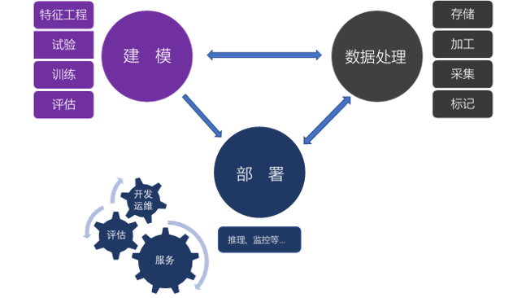
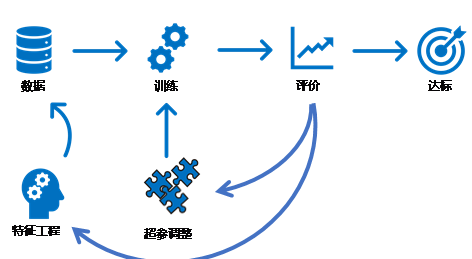
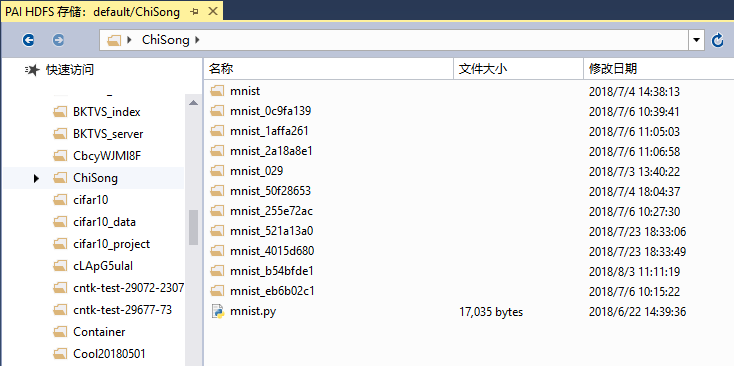
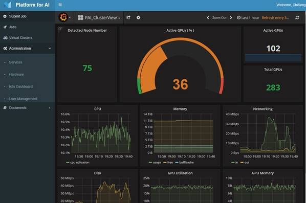

Copyright © Microsoft Corporation. All rights reserved.
  适用于[License](https://github.com/Microsoft/ai-edu/blob/master/LICENSE.md)版权许可

---
机器学习平台建设
---

本文从机器学习平台的架构开始，再到具体的功能，然后从需求的角度带给读者思考，找到合适的机器学习平台建设之路。最后，推荐了微软开源开放的机器学习平台OpenPAI，是可私有部署的机器学习训练平台。

本文不少要点都可以展开为一篇文章，进行单独介绍，缩减编排是为了帮助各层次读者，了解机器学习平台的概况，起到综述的作用。如果读者对大数据、计算平台比较了解，能看到许多熟悉的内容，发现大数据平台与机器学习平台的相通之处。如果没有了解过其它的数据或计算平台，也能从需求与技术决策的角度来思考机器学习平台该如何建设。如果是人工智能应用的初学者，能对机器学习平台，以及生产环境的复杂性有一定的认识。

机器学习不仅需要数据科学家研发新模型，软件工程师应用新模型，还需要软件工程师和运维工程师来建设机器学习平台。在应用机器学习的企业和团队中，建设机器学习平台是重要的一环。希望本文能在人工智能热潮中，给读者带来职业发展上的新思考、新方向。

本文力图覆盖了机器学习平台的方方面面，但并不表示每个机器学习平台都需要所有的功能。要根据业务的特点以及发展阶段，对机器学习平台做好定位，逐步演进。要保证大方向上是正确的，满足当前的需求且有一定的前瞻性。同时也要避免过度设计，过早开发，以免分散精力，影响业务目标的达成。

另外，还要管理好决策者、技术及业务团队对人工智能的期望。机器学习技术的发展阶段还不足以实现很多场景，除了从技术上不断创新勇攀高峰，也要让整个团队对人工智能的现状有清醒的认识，不可好高骛远。

- [一、概述](#%E4%B8%80%E6%A6%82%E8%BF%B0)
- [二、功能](#%E4%BA%8C%E5%8A%9F%E8%83%BD)
    - [数据](#%E6%95%B0%E6%8D%AE)
        - [数据采集](#%E6%95%B0%E6%8D%AE%E9%87%87%E9%9B%86)
            - [对接](#%E5%AF%B9%E6%8E%A5)
            - [安全](#%E5%AE%89%E5%85%A8)
            - [网络瓶颈](#%E7%BD%91%E7%BB%9C%E7%93%B6%E9%A2%88)
            - [网络爬虫](#%E7%BD%91%E7%BB%9C%E7%88%AC%E8%99%AB)
            - [隐私保护](#%E9%9A%90%E7%A7%81%E4%BF%9D%E6%8A%A4)
        - [数据存储](#%E6%95%B0%E6%8D%AE%E5%AD%98%E5%82%A8)
            - [可靠性](#%E5%8F%AF%E9%9D%A0%E6%80%A7)
            - [一致性](#%E4%B8%80%E8%87%B4%E6%80%A7)
            - [访问速度](#%E8%AE%BF%E9%97%AE%E9%80%9F%E5%BA%A6)
            - [版本控制](#%E7%89%88%E6%9C%AC%E6%8E%A7%E5%88%B6)
        - [数据加工](#%E6%95%B0%E6%8D%AE%E5%8A%A0%E5%B7%A5)
            - [导入导出](#%E5%AF%BC%E5%85%A5%E5%AF%BC%E5%87%BA)
            - [转换](#%E8%BD%AC%E6%8D%A2)
            - [校验与清洗](#%E6%A0%A1%E9%AA%8C%E4%B8%8E%E6%B8%85%E6%B4%97)
            - [可视化](#%E5%8F%AF%E8%A7%86%E5%8C%96)
        - [样本数据](#%E6%A0%B7%E6%9C%AC%E6%95%B0%E6%8D%AE)
            - [数据使用](#%E6%95%B0%E6%8D%AE%E4%BD%BF%E7%94%A8)
            - [标记工具](#%E6%A0%87%E8%AE%B0%E5%B7%A5%E5%85%B7)
            - [在线标记](#%E5%9C%A8%E7%BA%BF%E6%A0%87%E8%AE%B0)
            - [外包](#%E5%A4%96%E5%8C%85)
            - [众包](#%E4%BC%97%E5%8C%85)
            - [其它方法](#%E5%85%B6%E5%AE%83%E6%96%B9%E6%B3%95)
    - [建模](#%E5%BB%BA%E6%A8%A1)
        - [模型试验](#%E6%A8%A1%E5%9E%8B%E8%AF%95%E9%AA%8C)
            - [特征工程](#%E7%89%B9%E5%BE%81%E5%B7%A5%E7%A8%8B)
            - [超参调整](#%E8%B6%85%E5%8F%82%E8%B0%83%E6%95%B4)
            - [自动化建模](#%E8%87%AA%E5%8A%A8%E5%8C%96%E5%BB%BA%E6%A8%A1)
            - [组合模型](#%E7%BB%84%E5%90%88%E6%A8%A1%E5%9E%8B)
        - [平台支持](#%E5%B9%B3%E5%8F%B0%E6%94%AF%E6%8C%81)
            - [算力管理](#%E7%AE%97%E5%8A%9B%E7%AE%A1%E7%90%86)
            - [快速试验](#%E5%BF%AB%E9%80%9F%E8%AF%95%E9%AA%8C)
            - [可视化](#%E5%8F%AF%E8%A7%86%E5%8C%96-1)
            - [团队协作](#%E5%9B%A2%E9%98%9F%E5%8D%8F%E4%BD%9C)
    - [部署](#%E9%83%A8%E7%BD%B2)
        - [持续集成](#%E6%8C%81%E7%BB%AD%E9%9B%86%E6%88%90)
        - [模型评估](#%E6%A8%A1%E5%9E%8B%E8%AF%84%E4%BC%B0)
        - [特征抽取](#%E7%89%B9%E5%BE%81%E6%8A%BD%E5%8F%96)
        - [实时与批处理](#%E5%AE%9E%E6%97%B6%E4%B8%8E%E6%89%B9%E5%A4%84%E7%90%86)
        - [服务](#%E6%9C%8D%E5%8A%A1)
            - [负载均衡](#%E8%B4%9F%E8%BD%BD%E5%9D%87%E8%A1%A1)
            - [容器化管理](#%E5%AE%B9%E5%99%A8%E5%8C%96%E7%AE%A1%E7%90%86)
            - [API版本管理](#api%E7%89%88%E6%9C%AC%E7%AE%A1%E7%90%86)
            - [数据收集](#%E6%95%B0%E6%8D%AE%E6%94%B6%E9%9B%86)
    - [扩展能力](#%E6%89%A9%E5%B1%95%E8%83%BD%E5%8A%9B)
        - [通用与专业](#%E9%80%9A%E7%94%A8%E4%B8%8E%E4%B8%93%E4%B8%9A)
    - [运维支持](#%E8%BF%90%E7%BB%B4%E6%94%AF%E6%8C%81)
        - [监控](#%E7%9B%91%E6%8E%A7)
        - [高可用与灾备](#%E9%AB%98%E5%8F%AF%E7%94%A8%E4%B8%8E%E7%81%BE%E5%A4%87)
        - [配置化管理](#%E9%85%8D%E7%BD%AE%E5%8C%96%E7%AE%A1%E7%90%86)
        - [日志](#%E6%97%A5%E5%BF%97)
    - [易用性](#%E6%98%93%E7%94%A8%E6%80%A7)
    - [安全性](#%E5%AE%89%E5%85%A8%E6%80%A7)
        - [认证授权](#%E8%AE%A4%E8%AF%81%E6%8E%88%E6%9D%83)
        - [网络安全](#%E7%BD%91%E7%BB%9C%E5%AE%89%E5%85%A8)
        - [服务器安全](#%E6%9C%8D%E5%8A%A1%E5%99%A8%E5%AE%89%E5%85%A8)
        - [代码安全](#%E4%BB%A3%E7%A0%81%E5%AE%89%E5%85%A8)
        - [数据保护](#%E6%95%B0%E6%8D%AE%E4%BF%9D%E6%8A%A4)
        - [安全日志](#%E5%AE%89%E5%85%A8%E6%97%A5%E5%BF%97)
- [三、需求与技术决策](#%E4%B8%89%E9%9C%80%E6%B1%82%E4%B8%8E%E6%8A%80%E6%9C%AF%E5%86%B3%E7%AD%96)
    - [理解业务](#%E7%90%86%E8%A7%A3%E4%B8%9A%E5%8A%A1)
    - [定位](#%E5%AE%9A%E4%BD%8D)
        - [管理期望](#%E7%AE%A1%E7%90%86%E6%9C%9F%E6%9C%9B)
        - [服务规模](#%E6%9C%8D%E5%8A%A1%E8%A7%84%E6%A8%A1)
        - [数据特点](#%E6%95%B0%E6%8D%AE%E7%89%B9%E7%82%B9)
    - [技术决策](#%E6%8A%80%E6%9C%AF%E5%86%B3%E7%AD%96)
        - [云服务与私有部署](#%E4%BA%91%E6%9C%8D%E5%8A%A1%E4%B8%8E%E7%A7%81%E6%9C%89%E9%83%A8%E7%BD%B2)
        - [团队建设](#%E5%9B%A2%E9%98%9F%E5%BB%BA%E8%AE%BE)
        - [成本](#%E6%88%90%E6%9C%AC)
- [四、OpenPAI](#%E5%9B%9Bopenpai)
    - [特点](#%E7%89%B9%E7%82%B9)
    - [架构](#%E6%9E%B6%E6%9E%84)
    - [算力管理](#%E7%AE%97%E5%8A%9B%E7%AE%A1%E7%90%86-1)
    - [作业](#%E4%BD%9C%E4%B8%9A)
        - [作业配置](#%E4%BD%9C%E4%B8%9A%E9%85%8D%E7%BD%AE)
        - [提交作业](#%E6%8F%90%E4%BA%A4%E4%BD%9C%E4%B8%9A)
    - [运维](#%E8%BF%90%E7%BB%B4)

# 一、概述

下图是较简化的机器学习平台架构，概括了机器学习平台的主要功能和流程。本章会进行简要介绍，在功能章节再展开详述。机器学习最主要的三个步骤可概括为：数据处理、建模以及部署。



1.  数据处理，即所有和数据相关的工作，包括存储、加工、采集和标记几大主要功能。前三者与大数据平台几乎一致，标记部分是机器学习平台所独有。数据存储较好理解，要根据存取的特点找到合适的存储系统。数据加工，也被称为ETL（Extract，Transform，Load），即将数据在不同的数据源间导入导出，并对数据进行聚合、变形、清洗等操作。数据采集，即从外部系统获得数据，包括通过网络爬虫来采集数据。数据标记，是将人类的知识附加到数据上，产生样本数据，以便训练出模型能对新数据推理预测。

2.  建模，即创建模型的过程，包括特征工程、试验、训练及评估模型。特征工程，即通过数据科学家（也称为算法工程师）的知识来挖掘出数据更多的特征，将数据进行相应的转换后，作为模型的输入。试验，即尝试各种算法、网络结构及超参，来找到能够解决当前问题的最好的模型。模型训练，主要是平台的计算过程，好的平台能够有效利用计算资源，提高生产力并节省成本。

3.  部署，是将模型部署到生产环境中进行推理应用，真正发挥模型的价值。部署这个词本身，可以仅仅代表将模型拷贝到生产环境中。但计算机软件的多年发展证明，提供一个好的服务需要考虑多种因素，并通过不断迭代演进，解决遇到的各种新问题，从而保持在较高的服务水平。

4.  对平台的通用要求，如扩展能力，运维支持，易用性，安全性等方面。由于机器学习从研究到生产应用都还处于快速发展变化的阶段，所以框架、硬件、业务上灵活的扩展能力显得非常重要。任何团队都需要或多或少的运维工作，出色的运维能力能帮助团队有效的管理服务质量，提升生产效率。易用性对于小团队上手、大团队中新人学习都非常有价值，良好的用户界面也有利于深入理解数据的意义。安全性则是任何软件产品的重中之重，安全漏洞是悬在团队头上一把剑，不能依靠运气来逃避问题。

这里，不得不再分辨一下人工智能、机器学习、深度学习的含义，以便文中出现时，读者不会混淆。

1.  人工智能，是人们最常听到的说法。在不需要严谨表达时，一般都可以用这个词来表达一些不同以往的“智能”应用。而实际上，程序员写的每一行逻辑代码都是“人工智能”，每一个软件都饱含了“人工智能”，不是“人类智能”。如果要严谨的表达，“人工智能”和“软件”并没有什么区别，也不表达什么意义深刻的“智能“革新产品。

    但如果遵循普适的理解，那么“人工智能”一定是得有一些新奇的、超越以往的“人工智能”的东西，才能配得上这个词。比如，以往计算器（注意，不是计算机，是加减乘除的计算器）刚出现时，它就是新奇的事物，超越了人类的认知。在那个时刻，“计算器”就代表了“人工智能”的最高水平，是当之无愧的“人工智能”产品。

    那么，什么时候适合用“人工智能”这个词汇呢？如果别人在用这个词汇说明什么，那就跟着用就好了，不必过于严谨。如果觉得有什么超越以往的“智能”的事物，那就用“人工智能”来介绍它。放之当下（2018年），图像中识别出物体、语音中识别出文本、自动驾驶等等就可以称为“人工智能”了（本文也没少用）。但电灯能感应到人后自动点亮，就不足以说是“人工智能”了。

1.  机器学习。这是专业词汇，表达的是具有“学习“能力的软硬件产品，与程序员写就的代码相区别。可以认为，机器学习模型是一个函数，有输入输出，它的逻辑是数据驱动的，核心逻辑在数据中，不在代码中。

    机器学习的“学习过程“，如果也用函数来类比，那么就是首先给模型传入输入，获得输出。然后将模型的输出与期望的输出（即样本数据中的标记结果）进行比较。并根据比较结果来更新模型中的数据，以便下一次的模型输出能够与期望结果更接近。这个过程，和人学习时的题海战术很类似。

    由此看出，机器学习的学习过程是机器直接学习规律，改进数据，逐渐形成逻辑。而不是先有人类学习规律后，再写成代码。故称之为“机器学习”。

1.  深度学习。这是机器学习的子领域，但带来了非常大的变革，因此成为了流行的词汇。从字面上解释，所谓深度学习，即在机器学习时，数据组织成了多层次的、有“深度”的网络。传统成功的机器学习算法一般是三层，而深度学习能够实现多达上千层的网络。层次越多，可以认为机器学习模型就能越“聪明”，越有“智能”。

    深度学习成功的解决了大量和人类认知相关的问题，如：图像中识别物体、物体位置、人脸，语音中更精确的识别文字，文字中翻译、理解含义等。一方面，将机器学习模型的效果大大提升，另一方面，反而降低了机器学习模型应用的难度，让更多的人能够参与进来。最近的一次“人工智能“热潮，也是深度学习所带来的。

# 二、功能

机器学习平台上最重要的三个功能为：数据处理、建模、部署（也可称为推理）。每一个都可自成体系，成为一个独立的平台。本章从功能角度来描述机器学习平台，给读者以完整的认识。在不同的使用场景下，只需要部分功能，可删可减，不需要面面俱到。

比如，采用预构建的人工智能云服务时，在建模、部署上并不需要投入，主要精力会在数据处理上。再比如，对于以研究为主的团队来说，利用公开数据集进行模型评估等工作，不需要数据处理，也不需要部署。甚至对于个人研究者，强大的平台也不是必须的，手工作坊就能满足需求。

再比如，团队需要比较强大的平台。虽然说工欲善其事必先利其器，但是，常常是业务需求生死攸关的情况，相比之下提升平台从而提高生产力的工作，还没到不做不可的时候。这时候，平台的功能如果不能产生立竿见影、显著的成效，可以缓一缓，先实现投入产出较高的功能，待以后再增量开发或重构。如何很好的平衡开发投入，是艺术也是持续的话题，这里就不展开了。

在建设平台时，要注意合理利用现有的成果。比如，一些在发展初期的平台，其实已经解决了核心需求，可以直接拿来用。还有一些大数据平台，通过改造也能很好的解决机器学习的计算问题。再不济，多使用开源的小模块，在系统中减少一些重复开发的工作。

总之，平台对服务稳定性、时效性、生产力、成本等各方面有很大的价值，但建设平台不是一朝一夕的事情，也没有一个平台能满足各种需求。比如关系型数据库经过了多年的成熟发展，除了流行的几种数据库外，也不断的有满足新需求的新数据库出现。如，理论容量无限的分布式关系数据库，还有不少大企业根据自己的应用情况开发的高性能数据库系统，以及兴起的各种NoSQL数据库。在使用数据库时，不少团队会组合多种数据库来满足需求。在建设机器学习平台时也如此，除了用已有的平台外，可能还需要自己搭建一些周边的支持系统。

## 数据

机器学习的本质即通过数据来理解信息，掌握知识。因此，数据是机器学习的知识来源，没有数据，计算机就无处学习知识，巧妇难做无米之炊。绝大部分机器学习系统需要样本数据，并从而进行学习。对于Alpha
go这样的强化学习系统，数据全部从规则中生成，则不需要外部的数据。自动驾驶虽然也涉及到强化学习的部分，却需要与实际环境交互的数据，数据的收集难度就更高了。

人类文明早期就开始了数据的利用。结绳记事的信息中，就有相当一部分是产量等数据信息。前些年流行的大数据系统更是将数据的作用进一步发挥出来，并产生了丰富、成熟的分布式存储系统、数据加工流程、数据采集等平台和工具。机器学习平台可直接重用这些大数据平台中的工具。数据标记是机器学习特有的数据需求，数据标记就是在数据上加上人类知识，形成样本数据的过程。

数据的建设上要根据需求来定。如，强化学习不需要数据采集系统；小数据量的业务也不需要强大的分布式存储系统；企业数据已经有了强大的数据加工能力，尽量不要再建立新的数据加工流水线。

### 数据采集

数据采集，即将系统外部的数据导入到机器学习平台中。包括企业内部的数据导入，企业间的数据交换，以及通过网络爬虫抓取数据等。

#### 对接

对于企业内部的机器学习应用，可充分挖掘内部数据的潜力。内部数据一般已有较成熟的数据解决方案，可尽量借用现有功能，尽量通过已有的功能来做数据加工、整理。

#### 安全

对于跨数据中心、跨安全域的数据传输，要注意保护接口安全。不能假设外部人员不知道接口地址、规范，就能幸运的一直安全下去。要通过威胁建模来分析数据接口的受攻击面，找出解决方案，从而减小数据的泄露风险。不仅要对数据传输通道加密，增加认证、授权功能，还要从流程上保证密钥等关键数据的安全性，发生泄露后还要有预案能快速、平稳的更新密钥。

#### 网络瓶颈

跨数据中心传输大量数据时，网络通常是瓶颈。遇到瓶颈时，除了增加投入，提升带宽外，还可以从技术方面进行优化。首先看看传输的数据是否还有压缩空间，其次可重新审查一下传输的数据是否都是需要的，有没有可以去掉的部分。在有的系统中，某些数据的实时性要求不强，可以在收集数据方进行细粒度的缓存，减少数据的重复传输。

除此之外，还要注意数据传输过程是否会占用大量带宽，对双方的其它业务系统的网络延迟，带宽等产生负面影响。这时，可考虑错峰传输数据，在非业务高峰期进行数据传输，或者隔离数据采集的带宽。

#### 网络爬虫

网络爬虫，即从互联网获取网页，并从中抽取信息。随着互联网的发展，网络中的数据越来越多，网络爬虫也得以发展成熟。在使用网络爬虫抽取数据时，要注意遵守相关的法律法规，互联网协议，以及道德规范。

如果被抓取方没有提供专门的数据接口，网络爬虫的数据采集效率会相对较低，且易受页面改动的影响，抓取失败。这种情况下，首先要通过人工分析确定目标网站的页面级联关系，页面结构等信息。然后来制定爬取逻辑，并抽取出需要的数据。在爬取网页时，如果爬取速度过快，有可能会影响到目标网站的正常访问。不仅影响目标网站的业务，也会影响数据爬取过程。所以要规划好一定的爬取速度。同时，应该有警报机制，对抓取中的异常预警，及时改进爬虫。

有的网站信息量较大，前来爬取数据的也较多，通常会有一定的反爬虫策略。反爬虫策略主要分成两个阶段：

1.  检测。有的网站会检查请求的数据格式，可以发现明显是网络爬虫的情况。还有的网站会对每个IP和cookie等的访问频率做分钟、小时级统计，超过一定阈值后，即视为网络爬虫。对于流行的搜索引擎，还会采用机器学习，对网络爬虫的行为建模，能更有效的检测到网络爬虫。

2.  应对。检测到网络爬虫后，接下来就会采取不同的应对策略。简单的直接封禁IP或网段，但一般会过期解禁。还有的会采用图片验证码等方式，确认是人类还是爬虫在访问，从而决定是否展示关键数据。还有的会对网络爬虫返回缓存的假数据，来影响爬虫结果。

    还有的情况，并不检测是否是网络爬虫，直接对关键数据进行保护。如电子商务网站将商品价格用图片显示，增加数据分析的难度。还有的采用自定义字体，将ascii编码映射到不同的字符上。

另外，有的网站会建立白名单，允许一部分合作伙伴采集数据，白名单内的网站会采取不同的检测、应对方法，甚至不做检测。

因此，网络爬虫在设计中要考虑以上因素，确定合理的爬取策略。如通过代理服务器来更换IP。严格模仿网站请求发送数据，或通过浏览器内核来生成数据请求。利用机器学习或人工服务，来识别图片中的信息等等。

网络爬虫应用已经非常广泛了，可以评估一下已有的软件，找到适合自己的方案。

#### 隐私保护

保护客户隐私是企业数据处理时不可忽视的一环，每次将数据传输到新环境都会增加数据泄露的风险。此时，一方面应仔细分析新系统的安全性，另一方面要避免将与建模无关的数据采集到机器学习平台中。如果机器学习过程需要一些隐私数据，如地址、电话等，应进行脱敏处理。从而减小数据泄露后产生的影响。

不少机器学习推理应用中，能获得用户的真实数据。使用真实数据，能够弥补测试数据集和真实数据集的差异，训练出更精准的模型。与此同时，要让用户充分知情，注意保护用户隐私，不要滥用数据。

### 数据存储

机器学习平台的整个流程中几乎都会产生数据。除了采集阶段的原始数据外，还有加工过的中间数据，训练好的模型，用户数据等等。对各类数据要考虑不同的需求，选择不同的数据存储方案。

数据存储的方案很多，在速度、容量、可靠性等各方面的性能上都能做到很高的水准。但每项指标的提升，都意味着成本的增加。在数据存储方案上，不能盲目追求性能，要量力而行。选择对的，而不是贵的。

#### 可靠性

可靠性即数据是否能在极端情况下正常使用，不会丢失。实际上，任何系统都不能保证在任何极端情况下都能正常使用。只能通过不断的演进来避免常见问题，从而搭建出可靠性不断逼近100%的可靠系统。

提升可靠性的常见方法，即进行数据冗余，对整个系统都避免单点依赖产生的风险。从网络、电力来源、主机、硬盘的各个方面都保证一个设备坏了之后，不影响整个服务。对硬件上的冗余方法不再详述，此处只讨论软件解决方案。

软件上的可靠性，其实主要依赖于数据的复制备份来实现。说起来简单，但具体的实现上却比较复杂。根据保障的场景不同，主要分为两种情况：

1.  高可用。即出现问题后，系统只允许丢失秒级的数据，而且要在数秒之内恢复。由于要求响应时间很快，所以高可用一般都在同一个数据中心，甚至相邻的机架上实现。数据会在不同的服务器间进行高速复制，及时保证有两三份或者更多的数据存在，并且几秒钟就检测一下服务器的可访问性，随时准备将不可达服务器从集群中剥离。高可用一般用于解决机器的故障问题。虽然一台服务器故障的故障概率比较低，但在机房中成千上万台服务器时，几乎每天都会有服务器坏掉。通过高可用集群，偶发的服务器物理损坏几乎不影响系统的使用。

2.  灾备。即出现灾难性问题后，系统仅丢失分钟级的数据，且要在十分钟或一小时内恢复服务。常见的灾难性问题包括地震、强烈天气、火灾等极端事件。由于要防止地震等地区性问题，灾备需要两个数据存储位置相距800公里以上。为了保证灾备的效果，灾备的数据中心之间也会进行持续的数据复制。为了提高资源的利用率，进行灾备的数据中心可能也要承担业务工作，数据中心之间的数据同步传输是双向的。这样虽然增加了系统设计上的复杂性，但可提高资源的利用效率。

分布式文件系统是比较流行的保障数据存储可靠性的方案。有的分布式文件系统不仅能提供高可用，还能提供灾备的解决方案。

#### 一致性

一致性即数据从各个方面来看，信息都是一致的。可分为两个层面来讨论：

1.  数据备份。在提高可靠性的分布式系统中，每份数据都有两到三份。系统在不断的保持各份数据都是一致的。当服务器出现故障时，就有可能出现几份数据不一致的情况。这时候，可取其中的某一份作为主数据，从这份数据来重新创建备份。这样有一定的概率会丢失数据，但保证了数据的一致性。在出现这种情况时，要以一致性优先，无论如何都要保证分布式系统备份数据间的一致，否则潜在的问题会更多。

2.  冗余信息。在不少系统中，因为性能、历史遗留问题等原因，会存在一定的数据冗余。一般会在数据更新时逐步刷新这些信息。当数据正在更新时出了问题，就有可能产生数据的不一致。传统的关系型数据库通过事务来处理这类问题，将前面更新的一半内容恢复还原。如果系统中不支持事务，或在分布式业务系统中，就需要设计一个可靠的同步机制来实现类似的恢复还原的功能。

    比如，银行系统中要完成跨行转账，需要从一个账户中扣除金额，再给另一个账户增加金额。其中涉及到的系统包括双方银行，中间的支付系统，甚至更多的系统。其中要通过多种同步、超时、重试的机制来保障账户金额的一致性，并尽量保证交易的成功进行。又比如，系统中可能会有些缓存信息。当原始信息刷新后，依赖于业务需求，缓存信息也需要一定的更新策略，要么即时刷新，要么定时刷新。

    要保持数据的一致性就会牺牲访问速度，不是所有的数据都需要一致性。这要根据业务的形态来决定。一般来说，如果业务没有要求，就尽量保证访问速度，提高系统响应能力。

#### 访问速度

根据业务的不同，有的数据可能经常写入很少读取，有的则相反。还有的数据存取的时候需要越快越好，而有的数据则对速度不敏感。如，备份数据几乎都是写入，且对读取时的延迟不敏感。而机器学习中的学习参数则需要在内存中保障最快的读取速度。当机器学习模型在推理应用时，对于模型只有读取需求，不需要写入。访问速度和一致性、可靠性的需求都有所冲突，鱼和熊掌不能兼得。

数据访问从CPU寄存器、缓存到内存、网络、磁盘、物理距离，数据延迟的数量级逐步增加。（见下表）同时，每单位容量的价格也随之快速下降。

| 存储类型                           | 读取速度                   |
| ---------------------------------- | -------------------------- |
| CPU寄存器                          | 0.3纳秒                    |
| CPU一级缓存                        | 1纳秒                      |
| CPU二级缓存                        | 10纳秒                     |
| 内存                               | 100纳秒                    |
| 高速网卡（1G）                     | 10,000纳秒                 |
| SSD                                | 1,000,000纳秒（1毫秒）     |
| 传统磁盘                           | 20,000,000纳秒（20毫秒）   |
| 从中国到美国往返的理论极限（光速） | 100,000,000纳秒（100毫秒） |

在实际应用中，数据库、分布式文件系统等，由于要处理更多的通用问题，或数据规模较大，同时要保证可靠性、一致性，并不能达到上面的理论速度。通常会慢一个或数个数量级。传输数据用的光纤，达不到理论光速。

另外，访问速度应该从整个系统来计算，有时存储本身并不是瓶颈。比如通过各个组件的运算，最终需要两秒钟才能返回结果。可以看出，通过存储也很难提升其速度。只能从算法、流程上来提升，如增加缓存等（这也意味着产生一致性问题）。

#### 版本控制

版本控制，即哪个版本的数据会被使用。在业务数据处理时，会经常产生新的数据。在多种场景下都需要对新数据进行版本控制。

在新数据写入完毕前，不应该可读取，否则会读取到部分数据。在写入完成后，应尽快允许读取，这样能够拿到最新的结果。如果有缓存时，在数据更新后，可能需要触发缓存同步更新。

在新数据中发现问题时，在某些场景下，应该允许切换回旧数据。这部分功能和业务结合紧密，因此通常需要自己实现相关功能。

### 数据加工

数据加工通常可称为ETL（Extract, Transform,
Load），即将数据导出、转换、加载（可称为保存）。总之，数据加工可以抽象为数据的导入导出和形态的转换，描述了数据加工的通用流程。成熟的ETL系统会提供大量的组件适配不同的数据源，以及丰富的数据变换操作，并解决了很多稳定性相关的问题。使用这样的ETL系统，能够达到事半功倍的效果。

在数据加工过程中，有可能需要多次ETL的数据加工才能得到最终需要的数据。这时，系统需要在完成前置的ETL任务后，触发下一轮的ETL任务。要考虑到上一节中提到的数据一致性、可靠性造成的延迟，防止下一轮ETL没有在最新的数据上运行，或因为找不到数据而出现错误。

#### 导入导出

导入导出，即将数据从各种异构的数据源中导出，并导入到另一个目的数据源中。导入导出的主要功能是支持关系型数据库、NoSQL数据库、json、csv、内存、web
api、程序结构体等各种形式的接口，能将数据无缝的在各种数据源中导入导出。各种数据源之间的数据结构并不一定能一一映射，如有的NoSQL能够存储树形结构的数据，而关系型数据库只能存储二维的数据表。

在导入导出过程中，可以对数据进行过滤、映射，可以选择出部分数据列，也可以增加查询条件，选择出部分数据条目。在导入时可以将不同名的数据列进行映射改名。

#### 转换

在数据平台中，数据转换是核心功能之一。常用的SQL、Map
Reduce等都是对数据的转换。数据转换可以串联起来，对数据进行多次处理。也可以并联起来，将两个数据源合并，或一份数据输出两种形态的数据。

将数据转换从导入导出中单独抽象出来，不必关心源数据存放在哪里，支持什么样的操作。所有的操作都会在ETL的转换过程中完成。大大方便了异构数据的处理，在数据需求非常多、数据源复杂的场景下，对效率提升非常高。但是，通过通用的转换流程处理数据，就不能使用数据源里原生的数据处理过程，在某些场景下数据转换效率会大幅降低。

通过组合不同的数据转换方式，能完成绝大部分的数据转换操作。在一些通用数据转换组件无法完成操作，或者效率太低的情况下，可以实现接口写出专用转换组件。数据转换的主要种类如下。

1.  单条数据内的变化。

    *  树形结构的调整。这种转换可以进行移动、复制、增加、删除树形结构内的节点，以及改名等操作。还可以将树形结构扁平化为只有一层节点。这样变化后，可以将键值对导入到关系型数据库中。机器学习中，大部分数据也是像关系型数据库一样的键值对，而不是树形结构。

    *  字段计算。在机器学习中，要对NULL值赋值，或者通过正则表达式来抽取出信息。这些都通过修改字段值，或增加新的计算字段来实现。

2.  数据打包拆包。在数据处理流程中，有些操作通过批处理效率会更高。这时需要将多条数据打包成一条，以便后面的流程可以进行批量操作。完成批量操作后，再拆成多条数据。

3.  分拆单条数据。树形结构中包含的数组，如果要在接下来的数据中单独处理则需要将数组分拆成多条数据。分拆后的数据，还可能需要包含原始数据的某些字段。

4.  聚合多条数据。聚合可以统计唯一键、进行求和等操作。如果聚合的数据量非常大，有可能需要外存来缓存。

5.  跨语言互操作。有时候ETL工具本身的语言和用户使用的目标语言不一致。可通过互操作接口来调用用户代码，如通过网络接口序列化数据。这样用户可以用目标语言写出业务相关的转换组件，集成到ETL工具中。

6.  数据流的合并与分支。如果多种数据需要合并，则可通过数据流的合并操作来进行。数据流合并，从独立的数据导出操作开始，在某一步中合并起来。或者在数据转换过程中，根据主键查询出新的数据后，直接合并。如果数据需要同时输出两种格式，如原始数据与聚合内容都需要输出，则可以在中间对数据进行分支，通过两条流水线来分别处理。

7.  定制化。如果原生的转换组件不足以处理复杂的业务逻辑，或者为了提高处理效率。可以实现转换组件的接口实现定制的逻辑。

#### 校验与清洗

大数据中异常数据是常见问题，大数据通常只进行一些聚合操作，少量的异常数据可以忽略不计。在机器学习应用中，所有数据都会影响模型的计算结果，在某些算法下，异常数据会对模型效果有非常大的影响。所以要对数据进行校验和修复，将异常数据在数据处理过程中过滤掉。对于常见的数据异常，要从数据源头调研，检查数据来源上是否有缺陷，并进行修复。

数据清洗是对数据进行修正。有些数据虽然不属于数据异常，但不利于机器学习。要么将数据标准化，要么忽略掉这类数据。比如，数值列中的空值，可能需要替换为零；在自然语言处理中，如果文本只有一两个字，基本没法生成有意义的模型，可直接忽略掉整条数据；有些空白字段可以训练一个小的机器学习模型来预测、填充，转换成正常数据。

#### 可视化

平台的核心目标是提高生产力。如果将提高生产力分解开来，其中很重要的方法就是降低学习成本，节约日常操作时间。可视化是降低学习成本，节约操作时间的重要方法。

数据处理过程可以完全是代码，也可以用json文件一样的配置方法来实现。使用配置来实现，就能很容易的接入各种系统，实现可视化。可视化后，一些数据的导入导出工作还可以交给非开发人员使用，节约沟通交流的时间。这也会让新人更容易上手，更快形成生产力。数据的可视化也能让人对数据处理过程有直观的感觉，甚至能发现一些数据处理中的错误。

### 样本数据

样本数据包含了数据以及从数据中期望得到的知识，也称为标记数据。有监督学习（supervised
learning）必须有样本数据才能训练出模型，从而将知识应用到新数据中。虽然从机器学习的分类上来看还有无监督学习、强化学习等不需要样本数据的场景。但有监督学习的应用更为广泛。

数据标记的过程是机器学习中，将人类知识赋予到数据上的过程。有了好的标记数据，才能训练出好的模型。如果标记数据的质量不高，会直接影响到训练出的模型质量。比如，人类的标记数据正确率在90%，那么模型的理论最好成绩也不会高于90%。

标记后的样本数据是团队独有的财富。它的价值不仅在于标记人员投入的时间、经济成本，也在于独有的样本数据带来的模型效果的提升。模型丢了可以重新训练，样本数据丢了，重新标记的时间成本和机会成本可能无法承受。因此，一方面要做好数据备份等工作，防止数据丢失，另一方面还要做好内部、外部的保密工作，防止样本数据泄露。

一般的数据标记方法是让有一定背景知识的人来标记，然后将数据和标记结果及其关联保存起来。训练时，会将数据和标记结果同时输入机器学习模型中，让模型来学习两者间的关系。数据标记方法的复杂程度不一，如：

1.  图片分类，即给定一张图片，对其进行分类。标记方法比较简单，给每张图片进行分类即可，标记速度也比较快。如工业应用中经常要检测流水线上是否有次品。可让人来判断成品、次品图片，然后点击相应的分类，或者将图片放入不同分类的文件夹即可。

2.  文本分类，即给定一段文本，判断它的分类。如：正面评价、负面评价、不相关评价、中性评价、垃圾广告等。这种数据的标记需要标记者通读文本，并领会其中的含义，也比较简单。在舆情监测领域有广泛的应用。

3.  目标检测，即给定一张图片，将其中需要检测的目标标示出来，并进行分类。这种标示方法有两种，一种是用矩形框将目标标示出来；另一种需要将目标的每个像素都标示出来。可以看出，这两种标记方法的工作量都大于前面两种标记任务，标记像素更需要大量的时间才能标记得非常准确。自动驾驶领域，就需要对行人、车辆、道路标识等信息标记其位置。

4.  语音识别，即将音频转换为文字。虽然这类数据已经较多，但仍然不能满足需求。如诗词、方言、特定噪音下的数据等都需要人工标记来丰富数据。语音识别应用非常广泛，最常见的就是对视频、音频内容自动生成字幕。

除了人工标记，有些领域可以利用已有数据来形成样本数据。如机器翻译可以利用大量已有的双语翻译资料。但机器翻译一般是逐句翻译，所以还要找出双语句子对。如果需要的应用领域没有足够的双语资料，翻译效果也会受影响。

#### 数据使用

在机器学习中，数据的使用上也有基本的原则。一般说来，会将数据按比例随机分成三组：训练集、验证集、测试集。

1.  训练集用来在训练中调整模型中的参数，使模型能够拟合出最佳效果。通常，训练集在所有数据中占的比例最高，大部分数据都用来进行训练。

2.  验证集用来在每轮拟合之后评估拟合效果。有的训练过程会在数据达到了一定的性能后停止训练，这就是用验证集来评估的。通过在验证集上进行推理预测，能够实时的了解模型当前的训练进度。可以了解训练是否在收敛，收敛的速度如何等信息。

    在有些训练过程中，验证集不是固定的集合。在每轮训练前，将数据随机分配至训练集和验证集。这样，参与模型训练过程的数据规模就更大了。

1.  测试集用于最终模型准备发布之前的评估。测试集就像最终考试一样，一般对一个模型只用一次，甚至对于一些训练结果不好的模型不使用。测试集用来解决模型的过拟合问题。过拟合，即模型只能很好的预测训练时使用的数据，对实际数据预测效果会明显打折扣。因此，在模型训练过程中要严格限制测试集的使用次数，否则，它和验证集就没有区别，无法发现过拟合的问题。

#### 标记工具

标记工具提供了用户界面，帮助数据标记人员高效的标记数据。根据不同的标记任务，标记工具的用户界面会有所不同，但后面的处理流程是相似的。标记工具最重要的任务是提升生产力，让标记人员的时间花在知识推理上，而不是操作工具、等待工具响应中。

标记工具的用户界面开发过程并不复杂，开发成本也不高。只要遵循基本的用户体验设计方法，以生产力为目标，就能做出易用、高效的标记工具。因此，几乎每个团队、平台都会开发自己的标记工具。

标记工具要紧密结合到整个数据处理过程中，从源数据到标记后数据的存储。除了要做好备份外，标记后的样本数据要融入整个数据流水线，尽快将标记的数据投入到模型训练中，让新数据尽早发挥作用。

#### 在线标记

用户数据收集的过程从产品设计实现，到后端数据处理的整个流程。有的场景下，用户不仅会提供数据，还会提供数据标记，从而能够减少标记数据上的投入。将这些标记数据及时补充到样本数据中，随着用户的使用，产品就会越来越好。

如，在搜索引擎中，排名第一的结果是模型计算出的第一个结果，接下来的结果相关性依次降低。而用户第一次点击的结果，则是用户标记的相关度最高的结果。因此，可以将用户的搜索关键词、第一次点击的结果保存下来作为样本数据，用于模型的下一轮训练。通过不断的迭代训练，用户就会感觉到搜索引擎越来越聪明，排在前面的结果就有自己想要的。

#### 外包

标记工作比较枯燥，如果长时间进行数据标记工作，人会感到厌烦。如果需要的样本数据量很大，团队人手不够，或者要解决其它更重要的事情，又或者标记数据的工作不是持续性的，没必要组建自己的标记团队。这时，外包数据标记工作是个很好的选项。随着机器学习的火热，数据标记工作已经逐步标准化。一些被称为“数字富士康”的公司，有成百上千人的团队专门进行数据标记工作，还有流程来保证标记质量的稳定。

外包数据标记工作时，最重要的是要保证标记结果的质量。虽然成熟的外包团队能够很好的控制质量，但对于业务相关的知识可能并不熟悉。需要团队悉心教导、传授知识，才能保证数据标记结果的质量。

#### 众包

众包也是一种将工作外包的方式，不同点在于是将任务直接包给个人，而不是公司。个人与项目的耦合也非常松散，完全按照工作量计费。众包的优势在于经济成本低廉，一旦运营好了，横向扩充标记速度非常容易。有一些公益性质的众包项目，人们甚至愿意免费参与。众包的技巧在于管理。通过合理的架构、结果评估以及激励方式，就能得出好的结果。

比如，ImageNet是一个众包的图片数据集，标注了1400万张图片的两万多个分类，以及超过100万张图片的边框。基于ImageNet的大赛让图像认知领域得到了长足的发展，对深度学习的发展起到了至关重要的推动作用。

一些数据标注的众包平台可以直接使用，能够节省众包的管理成本和风险。但是，平台的质量参差不齐，需要认真的评估。

#### 其它方法

如果实在找不到更多标记数据，可以通过一些机器学习中独特的方法来增加数据。这些方法虽然效果有限，但也有一定的价值。

1.  数据增广（Data Augmentation）。主要应用于图像领域，可通过往图片中增加噪点数据，翻转、小角度旋转、平移、缩放等方法将一张图片变为多张图片。从而增加样本数据总量。

2.  迁移学习（Transfer Learning）。可用于深度学习的多层网络中。在其它某个有丰富样本数据的领域先训练出较高质量的模型。然后将其输出端的一些隐藏层用本领域的样本数据重新训练，则可以得出较好的效果。一些图片分类的云服务，有的通过这种方法来基于用户上传的少量图片进行学习、分类，得到性能不错的模型。

3.  半监督学习（Semi-supervised Learning）、领域自适应（Domain Adaptation）等其它方法。

## 建模

建模，也被称为训练（Training）模型。包括了两个主要部分，一是数据科学家进行试验，找到解决问题的最佳方案，本节称之为模型试验；二是计算机训练模型的过程，本节在平台支持中介绍。

建模是数据科学家的核心工作之一。建模过程涉及到很多数据工作，称为特征工程，主要是调整、转换数据。数据科学家的主要任务是要让数据发挥出最大的价值，解决业务需求，或发现未知的问题，从而提升业务。建设机器学习平台时，要对数据科学家的工作有一定理解，才能建设出真正能帮助数据科学家的平台。

### 模型试验

特征工程与超参调整是建模过程中的核心工作。

特征工程是指对数据进行预处理，使处理后输入模型的数据能更好的表达信息，并提升输出结果的质量。特征工程是机器学习中非常重要的一环。数据和特征工程决定了模型质量的上限，而算法和超参只是逼近了这个上限。

超参调整包括选择算法、网络结构、初始参数等工作。这些工作不仅需要丰富的经验，也需要不断地试验来测试效果。

特征工程与超参调整不是独立的过程。做完特征工程后，即要开始通过超参的组合来试验模型的效果。如果结果不够理想，就要从特征工程、超参两方面来思索、改进，经过一次次迭代，才能达到理想的效果。



#### 特征工程

特征工程的内涵非常丰富，在输入模型前的所有数据处理过程都可以归到特征工程的范畴。通过特征工程，将人的知识（通常称为先验知识）加入到数据中，并降维来减小计算规模，从而提高模型性能和计算效率。

特征工程的数据处理过程大部分都可以在数据转换阶段进行。可以将常见的特征工程的处理函数抽象为数据转换组件，方便重用。

特征工程的主要内容有：

1.  数据清洗。在数据部分已介绍过，即处理异常数据，或对数据进行修正。

2.  纠正数据偏离（bias）。

    在一些应用中，虽然有大量的数据，但数据分布并不均衡。如，在流水线检测缺陷产品的场景下，如果缺陷率为千分之一，那么原始数据里99.9%都是正常产品的图片，只有0.1%是缺陷数据。这种情况下，训练出来的模型质量不会太高。

    还有些情况下，数据偏离很难被发现。比如，互联网新闻图片下训练的分类模型，在用于手机摄像头照片分类时，效果会差很多。原因是新闻图片通常选择了颜色饱满丰富，构图优美的图片，和用户自己拍摄照片的色彩构图上有不小的差异。

    这种情况下，一旦发现了数据偏离就要从数据和算法两方面来调整。有的机器学习算法能够自动将小量数据的作用放大。但大部分情况下，需要人工对数据比重进行调整，并引入接近真实情况的数据集。

1.  数值变换。机器学习需要的数据都是数值，如果是浮点数，一般要调整到0\~1之间。枚举值要拆成一组布尔值。不同来源的数据还要做计量单位的统一。

2.  输入先验知识。即根据人的判断，将一些数据中难以直接学习到的信息抽取成特征，从而减小学习难度。如，自然语言的评价分类问题中，可以建词表，将正面词语和负面词语总结出来，对每句话的正负面词计数，并作为单独的特征列。这样对正面负面的分类判断会有较大的帮助。虽然数据维度会增加，但模型有了更多的人类先验知识，会判断得更准确。

3.  数据降维。是在尽量不丢失信息的情况下，减小单条数据的大小，从而减小计算量。比较直观的降维方式就是把图片缩小到一定的尺寸，减小像素数量。深度学习是在多层网络里，保留信息的同时，逐步给数据降维。机器学习算法中的主成分分析（Primary
    Component Analysis, PCA）和线性判别分析（Linear Discriminant
    Analysis，LDA）是经典的降维方法，用线代的矩阵特征分解的算法，找出数据中区分度最大的特征，然后省略一些作用不大的特征。

#### 超参调整

在机器学习中，模型能够自己学习改变的权重等数据，叫做参数。而不能通过机器学习改变，需要提前人为指定的参数叫做超参数（hyperparameter，简称超参）。这些参数会直接影响最终模型的效果，超参调整过程非常依靠数据科学家的经验。

常见的超参如下：

1.  算法与网络结构。机器学习从经典算法到最近流行的深度学习算法，以及各种各样的深度学习网络结构。虽然每个算法的适用范围比较清晰，但同一个问题仍然有很多可选的算法来实现。每个算法还会有自己独有的超参需要调整。还有的算法还能改动网络深度，每层神经元数量，或者采用不同的方法来进行非线性化，误差传递，提高泛化性能。算法中能调整的超参非常多，有些超参值也是连续的。所有超参的排列组合数量可认为是无限的。

2.  批数据量大小，即每批数据的数量。如，每次取100条数据的平均值来更新模型。批数据量太小，会造成每批数据缺乏代表性，模型结果收敛时波动较大。而批数据量过大，会减少一些偏差很大特征的差异，无法学习到一些细节的信息。

3.  学习率，即每次迭代时对数值的修改幅度。早期的机器学习方法都是固定的学习率，调整起来比较复杂。现在一般都是动态的学习率，但仍然要调整一些学习幅度、用什么算法等。学习率过大，会造成结果震荡，无法很好的收敛。而学习率过小，会让收敛很慢，浪费计算资源。

每组超参的效果，需要通过一定时间的训练之后才知道。因此，超参的调整过程非常耗时，数据科学家需要通过超参的各种组合来研究它们之间的关系，找到较好的搭配。

平台可通过可视化界面，提交一组超参配置，并对数据结果进行比较，提高调参效率。

#### 自动化建模

自动化建模（AutoML），主要是通过对超参的自动化选择，来提升建模工作的效率。超参调整问题，实际上是研究
什么样的超参组合下会得到最好的模型效果。

对某个具体问题，需要试验的超参组合可能有无穷多种。数据科学家其实就是在这个组合空间里找到效果较好的组合。通过自动化建模的方式，可部分、甚至全自动的寻找超参组合。寻找超参的方法包括穷尽法，随机搜索，通过概率模型发现超参关联，遗传算法，梯度优化，或组合前述方法等等。

有的自动化建模方法可完全自动。只需要输入数据，即可探索从算法到网络结构等所有超参的组合。这种方法不需要有任何机器学习经验，但搜索过程较长，也用不上人的一些先验知识。

有的自动化建模方法是半自动的。除了输入数据，还需要输入一些算法、参数限定的组合，即可自动找出这些组合中的较佳组合。这种方法需要一定的机器学习建模经验，但搜索时间较上者短，同时能结合人的先验知识，在较小的组合范围内搜索。

#### 组合模型

在实际应用中，经常组合多个模型，以及规则代码才能完成整个功能。比如，在手写体识别时，需要先用目标检测模型将文本部分找出来，然后分割字符，最后通过分类模型识别单个字符。实际上，还会涉及到文本旋转、连笔等问题。这样的应用中，不能依靠一个单一的模型，输入了图片就期待这个强大的模型输出结果，而需要多个模型再加上一些算法才能得出结果。因此，机器学习平台需要有流水线的处理能力来支持模型、规则组合的应用。在建模阶段，多个模型可以分拆来处理，但在部署后的应用推理阶段，一般需要近实时的输出结果。

有些情况下，组合模型与通用规则还不够，还需要对推理结果进行基于数据的特殊规则。如，在搜索引擎中，当结果中含有某些关键词时，会增加或降低其权重，从而达到人工调整搜索结果的效果。

总之，模型试验时，不应考虑依靠一个模型就能达到最好的效果。要灵活的组合模型、自动规则以及人工调整的方法来获得最终的效果。

### 平台支持

模型实验阶段对平台支持有较多要求。好的工具能够提高生产力，减少人为错误，还能充分利用资源，让算力尽可能产生价值。

平台除了本节提到的功能外，还需要扩展能力、运维支持、易用性、安全性等方面的功能，这些与部署后的平台功能有所重叠，在随后的章节中集中讨论。

#### 算力管理

机器学习平台一般是计算密集型的平台。管理好算力才能提高生产力，节约成本。算力管理的基本思路是将所有计算资源集中起来，按需分配，让资源使用率尽量接近100%。

算力管理几乎对任何规模的资源都是有价值的。比如，一个用户，只有一个计算节点（如一块GPU）有多条计算任务时，算力管理通过队列可减少任务轮换间的空闲时间，比手工启动每条计算任务要高效很多。多计算节点的情况，算力管理能自动规划任务和节点的分配，让计算节点尽量都在使用中，而不需要人为规划资源，并启动任务。多用户的情况下，算力管理可以根据负载情况，合理利用其它用户的空闲资源。在节点数量上百甚至上千时，运维管理也是必不可少的功能。

1.  虚拟化。是将实际物理资源与运行时的逻辑物理资源进行隔离的技术。资源虚拟化后，能将一台性能很高的计算机拆分给多个不需要整台机器算力的任务使用，互不干扰。这样，在搭建机器学习平台的时候，按照性价比或最高性能的要求进行硬件采购即可，不必考虑实际任务的资源使用规模。在使用时，可灵活适配低资源要求的任务，而不会造成资源的闲置。Docker是目前比较流行的操作系统级的虚拟化方案，启动速度很快，还能将模型直接发布到部署环境。

2.  任务队列。任务队列的管理是算力管理中的重要方法。在一些小型团队中，成员们独自使用服务器，算力不能得到很好的规划。如果将计算机集中起来，通过提交任务的方式来申请计算资源，运行训练任务。一旦任务完成后就释放计算资源，这样能达到最高的使用效率。

    在计算任务较多时，还涉及到优化资源分配的问题。可按照比例为不同团队保障一定的资源。如，给团队A分配50%的资源，如果团队A没有使用到50%的资源，则空闲资源可分配给其它团队使用。若团队A有了更多的任务后，可立刻将其它团队的任务终止，或等任务完成后将团队A的任务优先执行。也可以按照任务优先级调度，保障某类任务的优先执行。训练任务在终止时，如果使用的框架支持保存点，下次启动时可以从保存点接着运行。如果不支持保存点，就要从头运行，这时候，终止任务会损失一定的算力。

    任务队列在分配资源时，还要注意到大小资源任务的抢占问题。如，某任务需要多个GPU来运行，但其它任务都只需要1个GPU运行。如果要保证100%的计算资源利用率，势必在每次释放出1个GPU后，立刻指派下一个只需要1个GPU的任务。这样会造成需要多个GPU的任务很难获得足够的资源开始执行。平台对物理资源的调度方式要能够解决这种问题，将某台满足条件计算机的空闲资源留存下来不分配，保障多GPU的任务的运行。

1.  代码集成。如果试验的模型输入输出比较固定后，可考虑进一步提高效率。在代码、配置提交后立刻执行配置好的训练任务，不需要手工配置任务模板并提交。代码集成带来的不仅是执行速度的提高，对于同样的输入输出更容易横向比较历史数据，获得更多的信息。

2.  分布式训练。一些训练任务花费的时间很长，即使最高性能的单台设备也无法快速完成训练，这时需要分布式训练来进一步提升速度。分布式训练通常由机器学习框架来具体实现。平台要做的是保留足够的资源，并通过参数等方式将IP、端口等信息传入到代码中，然后启动分布式训练任务。

3.  批量任务。在试验超参的过程中，经常需要对一组参数组合进行试验。批量提交任务能节约使用者时间。平台也可以将这组结果直接进行比较，提供更友好的界面。

4.  交互试验体验。在脚本开发中，不少用户习惯于在交互式工具中进行试验、开发，如：Jupyter
    Notebook。交互式开发可以对某一段代码提供所见即所得的交互式体验，对调试代码的过程非常方便。

    虽然任务调度的方法对平台算力的利用率是最高的，但交互式开发在代码变化很大的时候，会提高人的开发效率。在交互试验的场景下，需要独占计算资源。机器学习平台需要提供能为用户保留计算资源的功能。如果计算资源有限，可对每个用户申请的计算资源总量进行限制，并设定超时时间。例如，若一周内用户没有申请延长时间，
    就收回保留资源。在收回资源后，可继续保留用户的数据。重新申请资源后，能够还原上次的工作内容。

    在小团队中，虽然每人保留一台机器自己决定如何使用更方便，但是用机器学习平台来统一管理，资源的利用率可以更高。团队可以聚焦于解决业务问题，不必处理计算机的操作系统、硬件等出现的与业务无关的问题。

#### 快速试验

平台要通过标准化数据接口来提高试验的速度，也能横向比较试验的结果。如果团队的试验比较多，需要经常研究公开数据集、算法实现等。可以根据开源数据集来实现统一的数据处理接口，这样可以加快算法与数据集的对接，方便组合不同的数据集和算法。数据接口标准化后，可以通过在新算法上运行多个公开数据，或在新数据集上运行经典的算法，从而对新算法、新数据集进行自动的试验和评估。

另外，考虑到数据的保密或减小计算规模，可以保留好几份不同规模生产数据。小数据集用于本地调试代码，中等规模的数据集用于评估模型效果，大规模数据集用于正式训练模型。当某种候选算法准备好后，能够快速切换到生产数据进行评估。

#### 可视化

可视化也是机器学习领域的热点问题。包括结果分布、训练进度、训练效果对比等各方面的可视化。呈现出好的可视化效果，能让人直观的获得信息和经验，更容易理解信息。

1.  数据分布。经典的机器学习方法可以选择最主要的两三个特征，通过二维或三维坐标来展示数据的分布。通过数据分布的可视化，可以让人了解到数据聚类的效果、直接的看到数据的规律。

2.  训练进度。通过在模型中埋点（Telemetry），能够将模型的错误率、进度等信息保存下来。再绘制出图表，就能直观的看到模型错误率的收敛速度等信息。还可以对比多个模型的训练历史，对模型的效果和收敛速度的关系有更深的认识。

3.  可解释性。在深度学习模型中，可解释性是研究的重点，即为什么模型会得出这样的推理结果，这个结果受哪些神经元节点影响最大？通过高亮出相关的神经元，并对不同的推理结果、模型进行对比，能洞察出更多信息，帮助更快的调整超参。

#### 团队协作

如果团队有一定的规模，甚至有多个小团队时，平台需要支持团队协作相关的功能。团队的分工上可能会横向根据工作内容分，如将数据预处理与建模团队分开；也可能根据垂直的模型来划分，如根据应用将调试不同模型的团队分开。平台建设时，要根据需求来决定团队合作相关的功能如何实现。

团队协作时，主要需求是沟通和数据交换。沟通可通过邮件、消息平台来进行，本文不再讨论。而交换的数据包括样本数据、代码、脚本、训练好的模型以及一些配置文件等等，这些需要机器学习平台来实现。团队协作时，要防止数据误操作和丢失，并要方便共享、查找。

分布式文件系统需要避免硬件问题造成数据意外丢失。另外，还要利用定期备份来防止数据被误删，如果改动比较频繁，可考虑每日备份。如果备份数据量较大，可通过差异备份来节约空间。有了数据备份，还要提供方便的搜索功能。除了要能够按照日期、相关人等方式来搜索外，按照机器学习模型对应的数据版本、效果、配置等来查找也是很重要的搜索方式。如果是代码、脚本等文本内容，可利用源代码管理工具获得更强的版本管理功能。

有了统一的存储和搜索功能，团队能方便的共享资源。上下游团队约定好具体的流程后，可以大大加快诊断问题，协作的速度，就能将各自最新的成果尽快集成到业务系统中。

## 部署

绝大部分机器学习模型都用于推理预测，即输入数据，机器学习模型给出结果。模型创建好后，还需要部署后进行推理应用，产生价值。部署并不只是将模型复制到线上，还涉及到线上模型的管理等功能。

### 持续集成

持续集成是将新的模型自动的、可控的集成到生产环境的过程。与之相对的是手工集成，即每次有新模型后，需要人工配置，将新模型一次性发布到生产环境中。

新模型的集成对于某些业务是非常关键的，需要非常小心的测试、发布。虽然可以在模型的建模试验环节中进行很多试验，但模拟的试验和实际环境不完全一样。如果贸然发布，有可能给业务带来负面冲击。如，电子商务网站有几十万种商品，用户需要搜索才能找到自己想要的商品。如果发布的模型不能找出用户真正想要的商品，业务量会立刻出现显著的下降。

在发布业务敏感模型时，通常需要平台能控制到达新模型的用户请求数量，从而观察新模型对业务的影响是正面的还是负面的，再决定是进一步部署新模型，还是撤回模型。在平台的运维体系还不能精确获得业务影响指标时，可以多花一些时间，进行灰度发布，将业务分阶段切换到新模型上。在灰度发布的过程中，逐步验证新模型能够正常使用，响应速度上没有显著下降，对业务没有显著负面影响，最终完成新模型的部署。

有时候发布的新模型是和新代码相配合的，如果要回滚新模型，还涉及到将新代码同时回滚。操作上会更复杂，需要强大的运维体系和实践准则来保证整个过程的顺利进行。

除了模型的持续集成外，还包括数据的持续集成，即将模型持续的在最新数据集上训练，这样可以响应最新的热点数据。平台要将数据的采集工作打通，能够不断的将新数据集成到生产环境中。另外，在生产环境中要控制好进行数据持续集成所需的资源，避免需求的资源过大，影响整个服务的性能。

### 模型评估

对模型效果的精确评估，有助于确定模型是否可以上线，或哪些方面需要继续改进。

有些应用可以马上获得用户的标记结果，就能即时评估模型的效果。平台需要将模型的推理结果和用户标记结果组合到一起，汇总出模型的效果数据。平台可提供可视化的界面，帮助部署过程决策。

对于不能获得用户标记结果的模型，要寻找评估模型效果的方法，要能近实时的看到模型效果。如，对于商品推荐模型，需要提高用户点击推荐商品的比例。要把点击数量汇总起来，用于评估新的推荐模型的有效性。如果暂不能评定模型效果，可以用A/B测试的方法，让两个模型在线上共存一段时间，随机接受输入。最后再评估通过哪个模型对最终业务绩效的影响更好。

除了模型效果外，还需要评估计算资源负载和响应速度。如果模型有了较大的改动，可能会在执行性能上有较大变动。在资源紧张的情况下，如果没有注意到这些因素，可能会因为模型发布而造成服务负载过高，甚至影响会扩展到全线服务上，影响整个业务的稳定。

在一些复杂的多模型组合下，特别是有很大的团队在平行开发模型时，就需要更复杂的模型评估方法。如，一些大型搜索引擎，会有多至数十个团队在改进搜索引擎的排序算法，可能每天都有新模型要发布。这时候需要建立一套强大的模型效果验证工具，假设评估中的模型之间没有关联，可以让小部分用户的输入随机使用这些模型的组合。然后通过算法计算出每个模型对结果的影响数据，从而决定模型最终是否能上线。

下表为灰度发布比例与评估重点的建议。

| 发布比例 | 评估重点          | 系统要求                                                                                                   |
| -------- | ----------------- | ---------------------------------------------------------------------------------------------------------- |
| 1\~5%    | 响应速度 模型效果 | 能够观测到单个请求的延迟情况，或对某类请求能聚合计算。模型效果的评估需要用户标记的支持。数据延迟在分钟级。 |
| 10\~20%  | 系统资源负载      | 能够按服务器进行单台流量切换，从而能够观测到服务器的负载变化情况。                                         |
| 50%      | 对业务的影响      | 有模型以及整个业务的指标定义和收集方式。                                                                   |

### 特征抽取

通过特征工程定义的数据加工流程后，数据才能作为模型的输入。在部署后的模型应用时，生产数据也需要通过一致的特征抽取过程，才能输入到模型中。如果有成熟、高效的数据加工过程，可直接将数据加工过程的代码用于生产环境，与模型一同发布即可。

但是，在模型应用时的性能要求比试验更高，或者有可能运行环境不一致。比如，试验时可能用的是Python，而应用时需要C\#。这时需要通过一组特征工程的数据测试集，来保证试验时和应用时的特征抽取工程能得出一致结果，从而能够给模型输入同样格式的数据。否则，模型的正确率可能会比试验时低，甚至有明显的差距。

### 实时与批处理

在模型应用中，大部分要进行实时处理。如，搜索引擎、图片识别、相关推荐等功能，都需要将结果尽快返回给用户。这对响应速度等各方面要求都较高。而有些应用不必给用户实时返回结果。比如，个性化的商品推荐邮件，可以在每天的访问低峰时段完成计算并发送给用户。

在产品设计时，如果实在达不到实时返回的响应速度，可以将一些需要实时返回的结果做到近实时。比如，在一些依赖第三方数据的机票查询功能中，会设计搜索进行中的界面，管理好用户的期望。有些应用，对时间不是特别敏感，可以先行计算并缓存结果，这样也能做到近实时的效果。

### 服务

服务即通过web服务开放出的推理应用接口。现代运维体系对于如何提供内部服务有很多的沉淀，有包括虚拟化、容器化、微服务管理等各种工具和设计思想的支撑。本节会结合机器学习进行简单的介绍。

#### 负载均衡

负载均衡（Load
Balancing）是现代服务的重要概念，即将访问请求通过一组服务器来支持，而不是依靠单台服务器。负载均衡的主要原理是通过中心点来统一提供服务，而真正实现访问请求的节点在中心点上注册，并定期向服务器发送信息，刷新节点健康状态。实际的访问请求有的通过中心点直接转发给节点。有的服务会将节点地址给到访问请求方，由访问请求方再次向节点地址发送请求。

通过负载均衡可实现高可用、灾备、A/B测试、灰度发布等各种功能。负载均衡的实现方案也非常多，包括DNS、硬件集群、反向代理、服务发现等等，都是负载均衡的实现方案。理解了负载均衡的原理和多样的实现方式，以及不同方式间的优缺点，就可按需组合一些方法来实现高可用、灰度发布等功能。

负载均衡的中心点也需要备份来提供高可用服务，不能依赖于单个节点。有的通过网络层的负载均衡来实现，即所有的请求会送达所有服务器，但只有真正处理访问请求的服务器进行答复。服务器间通常用对等组网的方式来选举出主服务器。数据包会同时发送到多个节点上，根据算法会有选中的服务器响应请求。如果选中的服务器没有响应，依据算法下一台可用的服务器来响应。

#### 容器化管理

容器化管理是在操作系统级实现的虚拟化，如Docker（在算力管理中也提到了它）。通过容器化，可将服务分散在多个节点上。在此基础上来实现负载均衡，将新节点注册到服务上，新节点就可以马上对接用户请求，开始提供服务。

通过容器化的服务，可随时更新服务的系统级依赖，如操作系统的补丁、硬件升级等。而且可提供从开发到服务的完全一致的环境，减少因为操作系统等不一致造成的生产环境问题。另外，通过容器化管理，可以轻松的进行服务扩容。只需要在服务器上使用同样的配置创建新的实例，即可实现扩容。在发布时的版本更替过程也类似，通过创建新Docker实例，关闭旧的实例，即可完成版本发布。在这个过程中，只要保证服务器是无状态的、可共存的即可。

#### API版本管理

在服务的不断开发中，根据新需求，会出现修改API接口的场景。而在复杂的应用中，API会被不少下游的服务或客户端调用。这时，要管理好API更改，防止造成服务的中断。一般的API更改都要分步骤进行。在发布新API时，要同时支持旧API。即使旧API不能加入新的功能，也需要保证它继续可用。发布后，通知并帮助下游团队尽快迁移到新API。最后，在数据上看到旧API已经没有访问量时，才可删除旧API及其对应的数据、模型等。

因此，在API升级过程中，有一段时间新旧API会共存，甚至需要维护好两套数据加工流水线，要注意保证版本替换过程中服务的顺畅。

#### 数据收集

在提供服务时收集到的数据，是用户场景下真正的数据，对改进模型的帮助非常大。收集数据时，可通过数据加工流水线将数据传送到模型试验、批处理训练直接使用。

如果能收集到用户标记数据，则需要将用户原始输入数据与用户标记关联起来保存。一般来说，用户输入数据和用户标记数据会在两个请求中，因此，要注意进行正确的关联。特别是在用户有多次请求时，需要通过关联的id找到正确的标记与数据对。

## 扩展能力

近年，机器学习领域的变化非常大，新的算法、框架、硬件、理念等层出不穷。一个好的机器学习平台应该有足够的扩展能力，才能跟随时代演化。不求站在技术的最前端，但也不至于在出现颠覆式创新时，整个平台需要推倒重来。

### 通用与专业

在建设平台时，要把握的第一个方向就是，要通用平台，还是垂直场景下的专业平台。通用平台
，即尽可能的支持所有的机器学习框架、硬件、网络结构。而垂直平台，即将某个方面实现好，做到极致。比如对TensorFlow支持到极致，或者对图像识别支持到极致等等。这和公司业务方向有很大的关系，在每一层都可以进行通用、垂直的选择。

通用，意味着平台只做最少的工作，通过Kubernetes这样的容器编排软件来支持不同框架的配置镜像，并支持基础的硬件资源分配，任务管理等工作。平台会有最大的通用性，几乎能适应未来的任何变化。如，最近在研究上很热的自动化建模，超参自动搜索等，很可能会颠覆未来的建模过程。一旦有了成熟的方案，通用平台可以快速集成。但在使用通用平台时，需要自己配置docker镜像，并学习任务配置等功能，有一定的学习培训门槛。

专业，即对某些框架、硬件提供深度的支持和定制，甚至对于某些场景做更多的定制化工作。如专门用于处理图像识别的平台，可直接在界面上提供上传图片、标记数据、性能对比等功能。定制的平台还可以很容易的集成选定框架下的模型优化、代码生成工具。这样能提供最好的使用体验，也能深度挖掘框架、硬件的功能，提高效率。但不足的是，如果和框架、硬件、业务绑定太紧，在有了重大变化时，平台能重用的部分可能会比较少。如，出现了新的硬件能显著降低计算成本，或业务上有了其它机器学习建模需求。

通用和专业，一横一纵的两个方向并不是完全冲突的。这也要看团队当前所处的阶段。是在各种框架、算法间不断探索的试验阶段，还是已经找到了比较成熟的方案，应用上慢慢定型的应用阶段。如果框架选型已经完成，业务形态已经初步具备，构建专业化的平台会带来更高的生产力。也可以先构建一个通用平台，在上面对框架、硬件、业务组合做进一步的深度定制。在定制时，要考虑到框架、硬件、业务间不要耦合太紧，这样在某部分需要改动时，能最大程度的重用现有平台。当然，同时也不能为此而过度设计，重点是要支持好业务。比如：以前的ODBC（开放数据库连接）是一个几乎能兼容任何关系型数据库的协议，号称有了它之后，底层数据库可以轻松切换。但在实际应用中，需要切换数据库的情况非常少。而且当需要切换时，真正麻烦的并不是如何连接数据库，而是如何改动现有的SQL语言来兼容新的数据库系统。

## 运维支持

随着现代运维体系的不断发展，运维人员和使用的工具也越来越专业，运维理念也在不断的进步。而目标一直都很清晰：提升稳定性，降低成本。提升服务稳定性是所有在线服务提供商的追求，服务问题会直接影响到业务。此外，服务规模很大后，服务器消耗就成了服务成本中不可忽视的一部分。如何降低服务器成本也是现代化运维的研究方向。提升自动化水平是重点的方法，自动化水平的提高带来的益处很多，一方面是每个运维人员能够管理的服务器规模会随之提升，降低了管理成本，另一方面自动化会减少人工操作，减少手工错误的机会。

运维支持从层次来看，从机房建设的基础设施运维，操作系统、DNS服务等的系统级运维，到软件发布、监控的运营运维，覆盖了从物理层到服务质量的所有层次。可以说，从一台服务器都没有到业务能够顺利运行，整个建设过程都属于运维的范畴。

在运维支持时，最重要的是保证服务质量。这一点常常会被参与者所忽视，特别是开发人员。在遇到服务问题时，开发人员更容易想到的是哪里有缺陷，该如何修复。有时，服务问题可以暂时通过重启服务，版本回滚等方式临时修复，这种情况下应立即进行修复，而不是调研问题的根源。等服务恢复后，再调研出现问题的原因，并进行彻底修复。

### 监控

监控是运维服务中不可缺少的一环。在硬件层面，通过监控能发现硬件故障，及时进行替换，保证不丢失数据，不造成服务宕机。在服务层面，监控信息能帮助了解资源的使用情况，及时对资源进行调整，防止过载造成的服务问题。也可以帮助发现新代码部署的问题，从而终止发布。业务层面的监控还能在第一时间看到业务的健康状况，及时采取业务上的行动。

运营世界级平台时，运维支持和服务监控都是7x24全天候工作。一般会有人员轮流值守，保证服务的稳定运行。值守人员在遇到无法处理的问题时，还会联系开发人员或第三方合作伙伴来深入调查问题，尽快恢复服务。

有的监控还有警报的功能，在过载或者服务不正常时，通过短信、电话、邮件等方式通知到人，进一步采取行动。

除了出现问题的警报，监控还要支持日常数据观测、发现异常。在用户还没感知到时，就开始解决问题。如建模的试验平台的瓶颈在哪里，是网络速度、存储容量、还是计算单元的数量等等。再如，当应用服务部分响应速度变慢时，可以帮助分析具体的瓶颈在哪里，及时做出调整。

### 高可用与灾备

在数据部分，已经简单介绍过高可用和灾备的概念。根据需求，平台可能也要提供高可用和灾备的能力。

在高可用上，要充分利用各种负载均衡的方案，提高横向扩容的速度，同时要减少扩容时的手工操作以减少人为错误，将扩容过程自动化程度不断提高。另外，需要在监控中发现问题节点，及时将其终止服务，以免用户访问到这个节点出现异常。

灾备用于应付突发情况。平时需要做好演练，才能保证关键时刻能起到作用。灾备的同时，通过跨地域的多点服务也能有效提高不同地方的访问速度，也其称为异地多活。异地多活对数据同步、多版本共存都是很大的挑战。

### 配置化管理

现代运维开始从自动化脚本管理向配置化管理来演变。配置化管理，是为每个服务创建好脚本和配置，根据负载、升级需求等，按需创建、启动实例。整个过程几乎全自动进行，不需要人工干预。

在配置化管理的方法下，要准备好服务镜像，对应的服务部署脚本等。一旦需要增加服务器，就能自动分配资源，运行服务，并加入到负载均衡集群中。同样，从集群中删除服务器也需要配置化的流程管理。在这些过程中，要等服务准备好后，才能将其加入到集群中，否则部分用户流量可能会到达还没准备好的服务上，从而产生错误。

### 日志

日志是比监控信息更细的服务器运行情况，有些监控信息也是从日志中抽取的。线上服务不能像开发环境一样随时进行调试，一般的问题诊断都要依赖于日志。在建模时，除了对关键的指标进行埋点外，还需要在日志中记录一些辅助的信息，以便在生产环境中能够发现并定位问题。

日志需要统一收集到一起，方便进一步的日志分析和聚合。日志分析功能需要按照关键词、时间、组件、物理机等各个维度来缩小问题的日志范围，从而能快速找到问题。还有一些人工智能运维系统（AIOps）能够自动定位到可能的问题点，加快问题的诊断。

## 易用性

机器学习平台的易用性也非常重要。一方面是在平台管理上的易用性，另一方面是平台用户的易用性。

如果团队的产品就是机器学习平台本身，平台的部署、升级、扩容都要提高易用性，让新用户能够方便的做好运维。小团队部署机器学习平台时，没有太多精力进行系统调研，易用的平台是小团队的首选。所以，要考虑如何能让新用户很快的学会搭建平台，用上平台。有了新功能后，如何让用户知道，用户又如何升级。在用户需要对平台算力进行扩容时，是否通过简单配置就能完成。

平台的可视化管理也很重要。除了第一步部署很难完全通过可视化用户界面来实现外，其它步骤理论上都是可以通过界面来实现。这样能大大减低平台的学习门槛。当然，并不是有了可视化界面，就能提高易用性。可视化界面的设计要遵循用户的使用场景，并尽量简化。

平台使用时，也同样需要更高的易用性。不仅小团队需要直观易学的界面，大团队也有人员替换，易用的平台能让新人尽快熟悉工具、展开工作。

平台除了需要提供数据集、训练任务、模型的可视化管理功能外，还要有便利的任务提交功能。由于任务提交通常是伴随着代码编辑进行的，所以可以在流行的集成开发环境上，开发插件来帮助提交任务。有的开源机器学习平台已经在一些集成开发环境中实现了任务提交、管理和数据管理的插件。

## 安全性

安全性是互联网服务运维最重要的话题。几乎每个公开服务每天都会受到攻击。最典型、最普遍的是无差别扫描攻击，即对每个IP进行自动的全面扫描，如果服务器有明显漏洞，就会被自动攻击。攻陷后，就会成为僵尸网络的一部分，被黑客所利用，开始进行无差别扫描工具，参加定点攻击，作为黑客跳板等各种黑客活动。服务器不仅会干坏事，还消耗带宽、计算资源等成本。除了无差别攻击，一些著名公司和网站还会受到定点攻击，黑客不仅通过工具扫描，还会人工分析漏洞，进行更高强度的渗透攻击。一旦被攻破，就存在数据泄露和服务被破坏的风险，甚至会让整个公司的业务陷于失败。

安全保障是矛与盾之战，常常是道高一尺魔高一丈，是一场永不停息的战斗。有条件的团队可以请专业白帽黑客团队来进行渗透测试，或进行漏洞悬赏。找到漏洞后，要尽快修补。除了对已知漏洞的快速修补，还需要系统化的分析，进行威胁建模，对每一种攻击和自身的漏洞进行防护。下面列出了一些常见的安全方面的考虑，但远不是全集。只要建立了成体系的防护，一般的一两个漏洞也无法形成完整的攻击链条，不会对业务产生实际的威胁。

### 认证授权

认证授权是两个过程，认证是指的通过用户名、密码等方式，确认用户的身份。授权是在用户身份确认后，根据系统内的信息，决定给用户何种权限。

1.  统一认证。即多个系统都用同一套用户名密码来登录，修改密码、增删用户都是一体的。机器学习平台本身需要有认证授权的功能，让有权限的用户才能访问对应的资源。如果企业中资源过多，每个资源都是单独的认证体系，个人确实比较难以管理认证资源。这时需要提供统一认证来简化系统，让认证系统真正发挥作用。如果机器学习平台组合了带有认证功能的开源工具，要将这些工具的认证统一起来，方便使用。

2.  两阶段认证。即除了输入用户名密码外，还会依靠用户的其它电子设备或硬件来完成认证。用户名密码有可能会被钓鱼网站、用户计算机上的木马盗走，所以还需要第二阶段的认证来保证安全。一般是通过手机上定时刷新的二次认证码来进行第二阶段认证。也有通过短信、电话等方式进行第二阶段认证。

3.  用户权限管理。即管理如何给用户授权。一些业务系统还需要用户登录，也要防止用户信息被盗用。可参考一般的网站设计方法，对用户账户要防暴力破解，短信轰炸等攻击。

4.  内部管理。有的团队中，虽然有认证授权的机制，但实际上密码统一、账户互相借用，认证授权体系形同摆设，这都会造成漏洞。安全不仅是技术问题，同时也是管理问题。不仅要在工具上强制一些安全策略，在内部教育上也要有安全的一席之地。

### 网络安全

网络安全除了一些协议层的攻击外，主要还在于平台的安全建设。在建设机器学习平台时，可能会组合一些开源工具。不少开源的平台级工具都建议在内网使用，默认安装也没有配置认证，在默认的网络端口监听服务。

机器学习平台在内网部署时，虽然安全性要求要低一些，但也需要基本的保障。如果公司的网络安全建设不足，如果被攻破了，机器学习平台就会面临较大的安全威胁。

在将机器学习平台提供给外部用户使用，甚至允许用户直接部署时，更需要提供全面的安全建议。如，哪些服务器需要开放哪些端口，端口的用途是什么。哪些服务器要放在内网，哪些需要放在防火墙边缘区域。如果直接开放了开源组件的端口，要注意开源社区上发布的安全补丁，及时进行升级。

### 服务器安全

服务器管理上要注意的事情不少。包括关掉不必要的服务、端口，管理好账户、密码，不要使用弱口令，及时屏蔽服务安装后的默认账户、危险功能等，经常性的注意安装安全补丁。这些都能大幅减小服务器的被攻击面。

每个服务部署的时候，应使用单独的账户部署服务。一旦某个服务被攻陷后，减小对其它服务以及整台服务器的威胁。

### 代码安全

一般的现代语言，在服务器端要注意防止SQL注入攻击。如果有内部反向代理的，还要注意网址的白名单过滤。如果是c/c++代码，还要注意防止缓冲区溢出攻击等问题。

### 数据保护

数据常常是业务的核心资产，需要进行重点保护。要对内部、外部数据使用者都做好数据隔离、数据保护工作，减少数据泄露的风险。同时，对用户数据需要做隐私保护。

1.  数据隔离。即对数据分级管理，没有权限的人不能访问相应的数据。对于核心的业务数据，要最小化授权，只给予必须的人以权限，从而减少数据的泄露风险。对于核心数据，如用户的联系方式等，可以在授权时记录日志。一旦数据泄露后，可以根据泄露数据反查到泄露渠道。

    机器学习平台建设时也需要考虑到数据隔离问题。日常试验的样本数据应该是业务数据的一个子集，并在此数据集上抹除用户数据及业务敏感数据。如果要更新数据集来提高数据集的质量，可以对试验数据集单独进行更新，不推荐将整个生产数据集暴露给所有团队成员。

1.  隐私保护。即保护用户的核心个人数据，特别是能帮助找到某个人的信息。保护好用户隐私不仅是对用户负责，也是对团队、企业的名声负责。泄露后危害最大的是用户密码，要对用户密码通过哈希方法加盐（salt）加密。对用户姓名、电话、地址等信息，可加密后存储，并保管好密码，仅让核心运维人员来保管、配置此密码。对于非密码字段可以不加盐，这样，同样的加密后的内容还能保持一致，不影响后面的数据聚集等操作。

### 安全日志

安全日志是安全的最后一关。当发现漏洞后，有可能通过安全日志找到攻击路径、攻击方法，以便封堵漏洞，评估损失。需要将系统、软件、审查的安全日志都定期备份到独立的位置，防止被攻击方抹除。

# 三、需求与技术决策

上文对机器学习平台及其要考虑的功能做了大致的介绍。可以看出，建设一个完整的机器学习平台有很大的投入。每个团队、业务需要根据自己的需求来有所取舍、有先有后，不是什么都要有、马上就要。本章会从多个角度帮助团队，分析应该建设什么样的机器学习平台，来支持业务需求。

## 理解业务

技术最终服务于业务。即使是纯粹的软件公司，也要思考软件的用户需要什么。全方位的理解了业务，在每次进行技术决策时，能够从问题的源头出发，做出对当前、中长期的最佳决策。

对于小团队、小公司来说，理解业务相对容易。但业务也可能随时发生变化。对于中大型公司来说，特别是刚刚开始进行机器学习投入的公司，还处于探索阶段。机器学习平台支持的业务可能随时发生变化，要从公司业务、机器学习可能的应用来理解业务。

理解业务，首先要了解目标客户，要思考机器学习平台的用户是谁。建设的平台是否直接给外部用户使用？如果是的话，是每个客户部署一个平台，还是在同一个平台上服务所有的客户？或者只给用户提供端到端的服务，平台给自己的团队使用？平台的使用者是数据科学家还是开发人员？

业务规模以及发展速度的预期，决定了机器学习平台硬件投入的时间点以及成本的规划。如果业务规模较大，初期就要规划足够的算力、部署。如果团队强大，就要在运维、易用性上多下功夫。但也要注意，资源永远是有限的，要把好钢用在刀刃上，精力上要有所集中，解决当下最重要的痛点。

## 定位

定位，在机器学习平台建设时，要确定平台的目标，制定向此方向发展的路径。首先要确定团队服务的业务是某个垂直方向的应用，还是有可能成为跨业务的机器学习平台？如果是跨业务的，是要做成通用的机器学习平台解决底层架构问题，还是要做好某些专业方向，直接解决业务问题？定位以后，平台、开源工具的选型等工作就有了依据。

### 管理期望

当前的机器学习虽然在飞速发展，但能做的仍然有限，远远赶不上人类智能。媒体、业界对机器学习能做到的事情期待未免过高。机器学习从业者，包括数据科学家、应用开发者，应该帮助整个公司、业务部门都认识到机器学习的局限性。在业务模式设计上，不能将机器学习放在会有重大影响的决策位置，而是应该辅助人类做决策。

比如，车辆驾驶中的车道自动保持功能，在启动时也会同时检测用户是否手握方向盘，在用户没有握住方向盘时警告。这样，在设计上就对功能有合理的期望，同时也管理好了用户的期望，就保证了安全。再比如，不少机器学习模型已经能帮助分析医学影像了，但仍然只能作为医生的辅助，不能直接给出定论，做出诊断。

随着数据、特征工程的不断演进，机器学习模型效果会越来越好，同时也要看到，随着模型效果的提升，成本的投入也在指数级的增加。但无论如何，如果人不能做到100%准确的事情，机器学习模型也做不到。期望机器学习模型完全的解决某个问题，还是一个世界难题。比如，在手写识别的数字数据集中，即使人也很难分辨一些图片到底是什么数字，更不能期望机器学习模型能100%的识别正确。

### 服务规模

机器学习平台要对当前和预期的服务规模做好预测。以此为依据，就能决定运维需求是否强烈、紧急。如果计算出来一两台服务器即可满足需求，而且不需要进行高可用、灾备的投入。那么手工搭建一两台服务器即可满足需求。待业务量有了数量级的增加后，再寻求自动化的运维解决方案。

在估算服务规模时，也要以发展的眼光来看。如果是自建研发团队，可以在性能目标上稍稍超前6个月左右，不要太超前，也不能只满足当下。留出一定的时间，是为了给团队留出足够的设计演进的时间。如果是将系统进行外包，每次交付都有明确的目标，交付周期也较长，可设定更高的性能目标，这样能够有更多的时间来做好项目管理。

### 数据特点

数据是机器学习重要的外部输入，其特点会影响许多技术决策。

1.  数据来源。数据是否为企业内部数据，如果是的话，是否有很强的保密需求？如果不是的话，数据从何而来，是否有保密需求？如果数据有保密需求，一般是存储在企业内部平台上，不放到云中。如果数据在其它企业中，有可能整个系统都要构建在对方企业中。

    如果数据是通过网络抓取的，并在云平台中运行数据采集。那么，带宽、服务器等方面扩容较容易。进行私有部署时，就要从带宽、成本、机房大小来评估一下平台容量的瓶颈。

1.  数据量。
    数据量大概有多少？产生新数据的速度如何？数据采集、加工时的传输带宽需要多少？访问频率如何？

    如果数据量较大，需要建设较大的存储容量。如果自建机房，成本会较高，性能也不好保障。云平台可以按需建设，一次性投入也较小。如果数据访问频率很低，或几乎不访问，云平台中的冷数据存储的成本会更低。

    如果数据需要在企业和云平台之间大量的传输，就不得不考虑到带宽是否满足需求，成本是否可控。如果带宽、网络延迟无法满足需求，可能就无法使用云平台。

1.  数据格式。数据是结构化的还是非结构化的？存储在数据库中还是文件系统中？

    如果当前的数据格式是非结构化的，没有标记信息，就要进行人工标记工作，建立样本数据库。如果现有数据已经有了足够的标记数据，可直接转换为机器学习直接可用的形式。

    数据格式也涉及到数据加工流水线的对接工作。如果已经有了大数据平台，尽可能重用现有平台能够减小开发和维护成本。但是，重用现有平台会带来更多的系统关联问题，如果现有平台不够稳定，会影响新的机器学习平台的稳定性。

## 技术决策

### 云服务与私有部署

云服务已经占领了服务器市场很大一部分，不管是中小型企业还是一些大型企业，都开始将自己的整个业务构建到云上。有些云服务商直接提供了机器学习平台，有的提供了交互编程的云服务资源，还有的云服务商直接提供了GPU的虚拟机供使用。下面介绍机器学习平台所涉及到的服务和部署形式。

1.  云虚拟机。即在云平台中构建的虚拟机，资源隔离性和自由度非常高。云虚拟机是当前云服务中最常用的一种。在云虚拟机里能安装任何软件和服务，通过虚拟网络、防火墙等功能也能达到很高的安全性。资源可以按需申请，随时增减。还可以通过云服务的网关等来组合实现高可用、灾备的功能。因此，云虚拟机自由度非常高，但需要自己来搭建，需要一定的运维经验才能很好的使用。

2.  GPU等计算型虚拟机。即安装有GPU等高性能计算硬件的云虚拟机。随着机器学习的深入发展，大部分云服务商都提供了安装了GPU等的虚拟机。Nvidia的GPU是最流行的，云平台中的GPU服务器，大都采用了Nvidia的专业机器学习GPU，采购成本较高，使用成本也较高。云平台可以按用量计费。如果团队模型训练的时间不多，可以按小时租用，训练完成后立即回收，这样才能有效节省成本。

3.  云机器学习平台。云机器学习平台一般是为数据科学家进行模型试验、训练准备的。有的云机器学习平台也实现了一键部署等产品化的功能。不少云服务商提供了机器学习平台，提供的功能差异也较大。有的能进行分布式计算，有的提供了图形界面的模型创建工具，有的还提供了交互式的脚本编辑执行体验。云机器学习平台在使用上会比较简单，团队也可以避免开发机器学习平台的投入。但是，云平台的功能较固定，使用上如果遇到不支持的功能，一般不能扩展。

4.  云认知服务。如果团队没有数据科学家，或者初期想要验证概念。可使用一些已经做好的云服务，如图像识别、人脸识别、语音文本转换、语言理解、聊天机器人等服务。这样团队能将重点放在打造业务上。准备好数据，云认知服务也能给出较好的结果。但云认知服务提供的种类有限，不能覆盖所有行业的应用。云服务一般也不支持离线使用，需要联网才能调用。

5.  基于多云服务商的混合部署。在一些深度使用云服务的场景下，希望最大化服务的稳定性，灵活调整成本。这种需求下，可在多个云服务商申请资源，将其整合使用。结合自动化脚本以及配置化的管理，还能做到根据使用情况灵活调整在各家云服务商的资源规模。这样，不仅能够有效管理成本，还能规避某家云服务商的临时故障等问题，保障自己的服务质量。这种方式对运维能力有较高要求，如果资源使用不多，对资源价格不敏感，也不必采用此种方式。

6.  服务器托管。即自购服务器，并存放于专业的机房中，属于私有部署。专业机房有良好的基础设施建设，对断电有备案。一般也会接入多家网络运营商，并提供智能路由对访问加速。物理安全上也控制非常严格，防止非授权进入机房。这种方式相对于云服务成本较低。但安全性、运维上也需要团队自己操作。如果遇到服务器硬件损坏等问题，需要人工去机房解决。

7.  自建机房。即自购服务器，并自建机房存放服务器。这种方式的成本最低，物理管理也较方便。但需要从基础设施层进行运维，包括温度控制、布线、不间断电源、网络连接等等问题都需要解决。如果机房建设在团队的办公楼内，电源、网络保障上都没有专业机房高。网络带宽也无法灵活调整。

8.  云平台与私有部署的混合部署。一些企业会有私有部署的内部信息系统。依靠私有部署，企业员工访问内部系统会很快，对服务器的安全也会多一层企业网络的保障。同时，企业还会依靠云平台对外提供服务。企业内部和外部会有数据同步、传输等功能。云平台和私有部署的优缺点都在前面进行了分析，根据不同场景来决定业务部署在何处即可。

决定私有部署还是用云服务商时，除了上一节定位时思考的问题，还有成本问题。私有部署是先投资后使用，还有不短的选址和机房建设周期，但后期使用上成本比较低。云服务比较灵活，使用多少，花多少钱。如果将时间线拉长，云服务的直接成本会比私有部署高。云服务有自己的管理、开发成本，但同时也提供了更高的高可用、灾备、安全等运维能力。出问题的概率较低，遇到问题一般也有较好的支持。所以，现在不仅是希望降低初期投资成本的中小企业在选择云服务，一些非专业信息产业的大企业也选择云服务，而不是私有部署。

在机器学习平台用作训练时，私有部署的成本优势会很明显。如果团队包含数据科学家，并有很高的算力需求时，私有部署比较经济。如果建设好了机器学习平台的集群管理能力，实际上并不需要云平台中的高可用、灾备能力。如果有某台服务器出了问题，只是部分算力浪费了，重新训练即可，损失不大。另外，云平台中为了稳定，通常选用了高端的机器学习专用GPU等硬件，而自建机器学习平台可选用消费级的GPU，成本也会大幅降低。因此，可以考虑机器学习平台的建模试验部分自建机房进行，而推理服务部分放在云服务平台中。但实际情况千差万别，如果因此造成很大的数据传输量，可能会得不偿失。

### 团队建设

机器学习平台如何建设，和它的用户有直接关系。如果团队是机器学习平台主要的用户，就要考虑到团队的规模与分工。如果机器学习相关的应用开发一共就两三个人，平台在共享合作上就没有太大的价值。如果团队没有数据科学家，那么也不需要进行模型试验部分的建设，使用预构建的云认知服务即可。

团队也有发展的过程，不是一蹴而就的。在团队发展初期，做好技术决策是重点，可以基于现有的机器学习平台来开发或直接使用。随着团队和业务的发展，对机器学习平台的需求会更明确，也会有一些强烈的需求。这时，如果团队有精力了，可以推倒重来，或者接着演进和重构。

如果有外包参与，可根据和外包团队的分工，定义好接口及指标，机器学习平台可只建设团队需要的部分，以免双方有过多沟通上的成本。

在是否建立数据科学家团队上，有较多的考虑。可以先从现有的云平台的预构建认知服务开始了解，看看是否已经满足了业务场景的需求。如果满足需求，可先构建出业务系统，并丰富数据。如果数据不能改进模型，或者云平台的预构建认知服务不能满足需求，就需要考虑建立自己的数据科学家团队。

### 成本

很多技术决策都会和成本相关。对于大中型企业，成本预算方法比较成熟时，直接按照计划对团队、服务器等资源投入做好规划即可。对于创业公司及小团队，要根据业务、资金情况量入而出，做好团队、平台建设。关于团队人员预算建设方面，根据市场情况决定即可，不再详述。

部署上，初期可以先从云平台开始，不进行私有部署。大部分云平台都会有详细的定价策略，可以根据算力、存储、带宽的使用来预估大致的价格。在开发机器学习平台时，做好关键节点的横向扩容能力，即可满足初期的负载伸缩性需求。

# 四、OpenPAI

前文介绍了机器学习平台的功能以及建设机器学习平台要考虑的因素。本节会介绍OpenPAI，即微软的开源机器学习平台。它可用于企业私有部署，也可部署在云平台中。它解决了建模训练时的算力和资源管理的问题。OpenPAI的开发很活跃，问题也能得到及时响应，还在积极开发新功能中。

OpenPAI代码及文档地址：https://github.com/Microsoft/pai

## 特点

OpenPAI是为数不多的用于私有部署的机器学习平台。在微软内部管理了几百块GPU，应用规模上得到了很好的验证。同时支持数台服务器的小规模部署。

OpenPAI和Visual Studio、Visual Studio Code的Tools for
AI工具集成在了一起，利用这些强大的集成开发环境同时，也可以方便的提交并管理训练任务、数据资源。

OpenPAI是通用的机器学习平台。理论上支持任何计算密集型，甚至存储密集型的任务。通过预先配置的Docker，已经支持了包括TensorFlow，Keras，CNTK等流行的计算框架，并支持框架自带的分布式训练任务。硬件上已支持GPU、内存、CPU的分配，通过扩展，还可以支持更多的硬件类型。

## 架构

OpenPAI基于Kubernetes的容器化，Yarn的资源分配，并集成了HDFS作为存储管理等开源组件构建的通用的机器学习平台。用户提交作业（即机器学习训练任务）后，就会自动分配资源，创建Docker实例，并运行指定的命令。因此，OpenPAI是一个通用的算力管理平台。通过提供一系列预构建好的Docker，OpenPAI可以方便的执行TensorFlow,
Keras，CNTK等流行的机器学习框架的训练任务。

OpenPAI将复杂性包装了起来，只有master和worker两种角色。Master提供了web
api和界面，以及Kubernetes的master节点等；worker用于运行实际计算的docker实例。

下图为OpenPAI的架构示意图。


## 算力管理

OpenPAI提供了作业的队列管理。另外，通过自己配置Docker，还能搭建出Jupyter
Notebook这样的交互式开发训练环境。

在其队列管理中，用户只需要声明每个作业需要的资源类型，给定所需的docker镜像路径，代码位置等信息，即可等待系统分配资源，并运行训练作业。

OpenPAI的作业支持机器学习框架的分布式运算。如，可指派两个实例作为参数服务器，另外4个实例作为计算节点。OpenPAI开始执行此作业时，会先保留足够的资源，然后启动这些节点，开始分布式计算。在节点启动后，OpenPAI即可知道所有节点的IP、ssh端口等信息，并将这些信息通过环境变量或命令行参数的方式传给运行的脚本，从而让每个节点能发现其它所有节点。

在多用户的情况下，OpenPAI通过Virtual Cluster来解决资源分配问题。Virtual
Cluster可理解为虚拟的集群。不同的Virtual
Cluster有不同的资源配额，可以将用户分配到一个或多个Virtual
Cluster中。如果某个Virtual Cluster使用的资源超了，并且其它Virtual
Cluster有空闲资源，则OpenPAI会使用空闲资源来运行。通过这样的管理，能实现多种场景。如：两个小团队各分配一个50%资源的Virtual
Cluster。团队A每天都有训练任务在持续进行，对资源的需求是越多越好。而团队B的资源使用是突发性的，一旦有需求，希望其能尽快完成。平时，团队A会使用团队B的空闲资源来加速自己的训练，一旦团队B有了突发任务，团队A占用团队B的训练任务就会被停下来，让团队B的任务先训练。又如，将生产需要的模型训练和试验需要的模型训练都在一个集群中进行，各用一个Virtual
Cluster。给生产分配100%的资源，而模型试验分配0%的资源。这样，一旦生产资源有空闲就可用于试验，但会优先保障生产资源。

## 作业

提交给OpenPAI的每个训练任务，称为作业（Job）。作业由一个json配置文件描述。通过Visual
Studio Tools for AI以及Visual Studio Code Tools for
AI可以方便的提交训练作业和最新的代码。

### 作业配置

作业的json文件包含了训练任务的基本信息。下文是简化了的任务示例，对主要的参数进行介绍，以方便理解OpenPAI的用法。

1.  普通作业

    ```json
    {
        "jobName": "mnist_024",
        "image": "openpai/pai.example.tensorflow",
        "codeDir": "hdfs://\<ip address\>:\<port\>/folder/mnist",
        "taskRoles": [
            {
            "taskNumber": 1,
            "cpuNumber": 4,
            "memoryMB": 4096,
            "gpuNumber": 2,
            "command": "python \$PAI_WORK_DIR/mnist/mnist.py"
            }
        ]
    }
    ```

jobName：这是每个作业的名称，需要全局唯一。

image：这是作业运行的docker镜像的地址。示例中是OpenPAI预构建的TensorFlow的镜像地址。

codeDir：它表示了将要运行的代码位置。在docker启动后，会将此目录的内容拷贝到docker中的/root下。例如本例中，会将mnist目录内容拷贝到docker中的/root/mnist下。

taskRoles：这是作业需要的docker实例的定义模板数组。数组中每个项目是一个docker模板的定义。

taskNumber：这个docker模板在实例化时的数量，即这个模板创建几个docker实例。在单机运行的docker实例中，这个数字应为1。

cpuNumber、memoryMB、gpuNumber：对应于其名字，分别为CPU、内存、GPU的数量。这为当前任务模板定义了要使用资源的规格。OpenPAI会根据这些信息来分配计算节点。

command：这是Docker实例启动后，运行的命令。这条命令运行结束后，Docker会被销毁。如果命令行返回值不为0，任务会被标记为失败。

1.  分布式作业

    ```json
    {
    "jobName": "mnist_024",
    "image": "openpai/pai.example.tensorflow",
    "codeDir": "hdfs://\<ip address\>:\<port\>/folder/mnist",
    "taskRoles": [
            {
                "name": "ps_server",
                "taskNumber": 2,
                "cpuNumber": 2,
                "memoryMB": 8192,
                "gpuNumber": 0,
                "command": "python code/tf_cnn_benchmarks.py
                --ps_hosts=\$PAI_TASK_ROLE_ps_server_HOST_LIST
                --worker_hosts=\$PAI_TASK_ROLE_worker_HOST_LIST --job_name=ps"
            },
            {
                "name": "worker",
                "taskNumber": 2,
                "cpuNumber": 2,
                "memoryMB": 16384,
                "gpuNumber": 4,
                "command": "python code/tf_cnn_benchmarks.py
                --variable_update=parameter_server --data_dir=\$PAI_DATA_DIR
                --ps_hosts=\$PAI_TASK_ROLE_ps_server_HOST_LIST
                --worker_hosts=\$PAI_TASK_ROLE_worker_HOST_LIST --job_name=worker"
            }
        ]
    }
    ```

这是利用TensorFlow分布式训练功能的作业配置。此配置会分配两个参数服务器以及两个计算节点。分布式作业的具体内容和普通作业类似，但会有多个taskRoles中的节点。它们会被分配不同的资源。可以看到taskNumber数量为2，表示每种角色需要两个docker实例。

在command参数中可以看到有一些\$开头的变量。这些是OPENPAI内置变量。可以将分布式系统各个角色的主机地址、ssh端口传给所有节点。这样，在任何分布式组网的系统中，都能够拿到所有的节点信息。

### 提交作业

Visual Studio和Visual Studio Code中的插件管理可以找到Tools for AI插件。Tools for
AI是微软为机器学习准备的扩展。配合Visual Studio和Visual Studio
Code的集成开发环境，为机器学习开发提供了更强大的支持。

Tools for AI其中一项功能就是远程训练任务管理，它支持OpenPAI作为远程服务器，能够提交、管理任务，管理存储。具体使用方法可参考OpenPAI的官方文档。

下图为Visual Studio中OpenPAI的任务提交界面。


下图为Visual Studio中OpenPAI的作业管理界面。


下图为Visual Studio中OpenPAI的存储管理界面。



下图为Visual Studio Code中OpenPAI的作业管理界面。


下图为Visual Studio Code中OpenPAI的存储管理界面。


## 运维

OpenPAI可以管理大规模的GPU平台，提供了负载、服务器健康等多种工具。通过运维工具，能够观察集群的负载情况，找到集群瓶颈。另外，还能细粒度的看到某台服务器的负载情况，了解每台服务器的健康状况。通过OpenPAI平台，能够看到每个组件和每个作业的日志文件，进行更详细的分析。

通过OpenPAI的web界面，也可以提交、管理训练作业。

下图为OpenPAI的集群仪表盘。



下图为OpenPAI的服务器列表。


下图为某台服务器的负载情况


