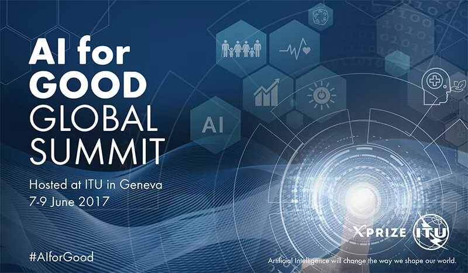
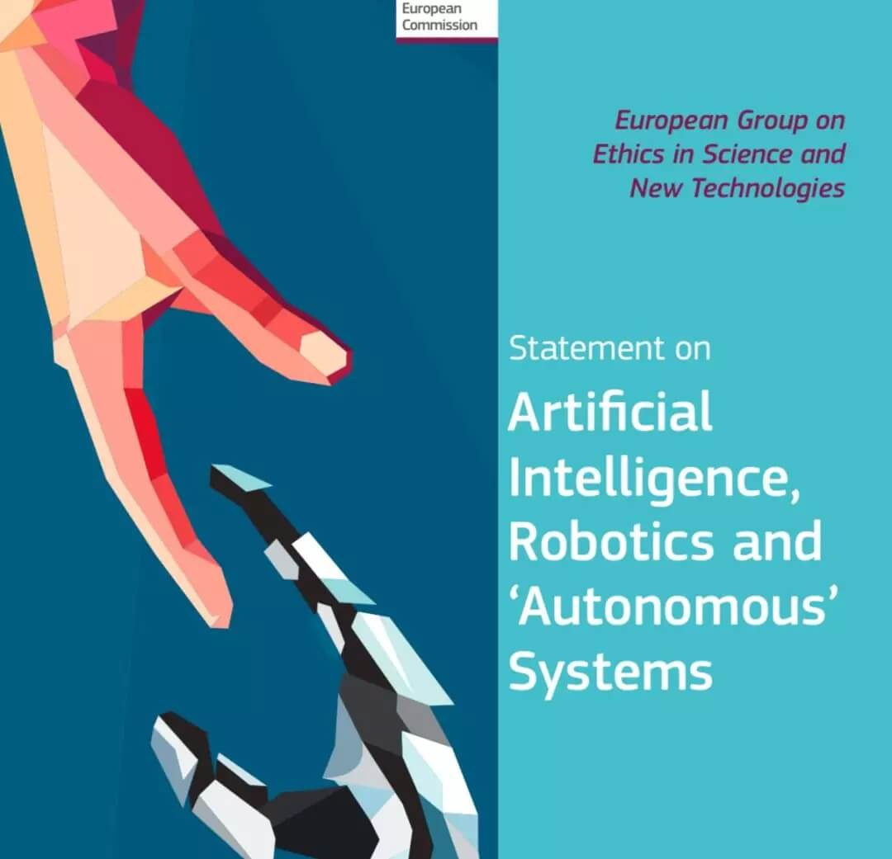

人工智能伦理与道德

概述
====

史蒂文·斯皮尔伯格曾经有一部非常经典的电影：《人工智能》,影片讲述21世纪中期，人类的科学技术已经达到了相当高的水平，Cybertronics Manufacturing制作公司制造出了第一个具有感情的机器人:一个具有8岁男孩外形的小机器人大卫。公司员工亨瑞和他的妻子莫妮卡的儿子因病被冷冻，他们于是领养了小机器人大卫，并启动了大卫的情感程序，大卫按设定的程序百分之百地爱着“妈妈”莫妮卡，莫妮卡对儿子的爱得到了寄托，逐渐变得快乐，可是不料莫妮卡的真儿子意外醒来，大卫被抛弃。为了重新回到莫妮卡身边，获得母亲的爱，变成真正的小男孩，大卫整整奋斗了两千年。电影开头就提出一个问题：“人可以让机器人对人付出百分百的爱，可是人对机器人的爱不应该负责任吗？”这个电影推出以后引发很多争议，因为斯皮尔伯格更为深邃地抛出了一个关于人工智能终极伦理问题的研究。

那么，什么是人工智能的伦理与道德？目前，有哪些相关的思潮？至今为止，人们都做了哪些事情来应对人工智能呢？

人工智能的伦理相关概念
======================

2.1 伦理的概念 
---------------

伦理一词，英文为ethics，一词源自于希腊文的“ethos”，其意义与拉丁文“mores”差不多，表示风俗、习惯的意思。西方的伦理学发展流派纷呈，比较经典的有叔本华的唯意志主义伦理流派、詹姆斯的实用主义伦理学流派、斯宾塞的进化论伦理学流派还有海德格尔的存在主义伦理学流派。其中存在主义是西方影响最广泛的伦理学流派，始终把自由作为其伦理学的核心，认为“自由是价值的唯一源泉”。

在我国，伦理的概念要追溯到公元前6世纪，《周易》、《尚书》已出现单用的伦、理。前者即指人们的关系，“三纲五伦”、“伦理纲常”中的伦即人伦。而理则指条理和道理，指人们应遵循的行为准则。与西方相似，不同学派的伦理观差别很大，儒家强调仁、孝悌忠信与道德修养，墨家信奉“兼相爱，交相利”，而法家则重视法治高于教化，人性本恶，要靠法来相制约。

总的来说，伦理是哲学的分支，是研究社会道德现象及其规律的科学。对其研究是很必要的。因为伦理不但可以建立起一种人与人之间的关系，并且可以通过一种潜在的价值观来对人的行为产生制约与影响。很难想象，没有伦理的概念，我们的社会会有什么人伦与秩序可言[1]。

2.2 人工智能伦理
----------------

什么是人工智能伦理呢？维基百科是这样定义的。

人工智能伦理学是机器人及其他人为智能生物技术伦理学的一部分。通常划分成机器人伦理和机器伦理，机器人伦理关注人类设计，制造，使用，对待人为创造出来的智能生物时候的道德行为，机器伦理则关注于人工智能产物本身的道德行为[2]。

其实在人工智能伦理一词诞生以前，很多学者就对机器与人的关系进行过研究，并发表了自己的意见。早在1950年，维纳在《人有人的用途：控制论与社会》一书中就曾经担心自动化技术将会造成“人脑的贬值”。20世纪70年代，德雷福斯曾经连续发表文章《炼金术与人工智能》以及《计算机不能做什么》，从生物、心理学的层次得出了人工智能必将失败的结论。而有关机器伦理（与人工智能伦理相似）的概念则源自《走向机器伦理》一文[5]。文中明确提出：机器伦理关注于机器对人类使用者和其他机器带来的行为结果。文章的作者之一安德森表示，随着机器的越来越智能化，其也应当承担一些社会责任，并具有伦理观念。这样可以帮助人类以及自身更好的进行智能决策。无独有偶，2008年英国计算机专家诺埃尔·夏基教授就曾经呼吁人类应该尽快制定机器（人）相关方面的道德伦理准则。目前国外对于人工智能伦理的研究相对较多，如2005年欧洲机器人研究网络（EURON）的《机器人伦理学路线图》、韩国工商能源部颁布的《机器人伦理宪章》、NASA对“机器人伦理学”所进行的资助等[6]。而且国外相关的文献也相对丰富，主要集中在机器人法律、安全与社会伦理问题方面。

国内方面相关研究起步较晚，研究不如国外系统与全面。但是近些年来，相关学者也将重点放在人工智能的伦理方面。相关文献有《机器人技术的伦理边界》、《人权：机器人能够获得吗？》、《我们要给机器人以“人权”吗？》、《给机器人做规矩了，要赶紧了？》、《人工智能与法律问题初探》等等。值得一提的是，从以上文献可以看出，我国学者已经从单纯的技术伦理问题转向人机交互关系中的伦理研究，这无疑是很大的进步[3]。

人工智能的伦理问题
==================

智慧城市,智能翻译，智能谱曲，智能生活助手……智能机器系统正在改变我们的生活更好。随着这些系统能力的强大,
我们的世界变得更加富有，更加高速有效率。 技术巨头诸如谷歌、亚马逊、Facebook、IBM和微软, 以及Stephen Hawking和Elon Musk,都认为现在是谈论人工智能的边界的合适时机。

微软副总裁沈向洋曾经这样谈到人工智能:人类的智能主要体现在感知和认知两方面,机器的感知在接下来5至10年进展会非常快，具体表现在计算机语音和计算机视觉发展，但谈到认知，计算机却远远没有达到和人类相比的水平，这是因为人们对人脑不了解，脑科学今天还是非常初步的科学。

这些年，人工智能这把火烧得很猛，互联网精英们三句不离人工智能。对于近年来一直甚嚣尘上的人工智能“威胁论”，沈向洋认为人工智能对人类就业的冲击是显然的，而且正在发生。但是，人工智能同时也在创造新的机会。“超级智能会控制人类？”他认为这是因为人们对新技术的不了解而产生的一种无谓的担心。这正如当年汽车出现时，我们会害怕它会撞死人。

泡沫不是问题，人工智能“危险论”也是个伪命题，那么这个当下最火热的科学技术，什么才是值得重视的？沈向洋的回答是：伦理。

人工智能技术应用如果出现偏差会带来许多问题。沈向洋谈到一个案例：有人用大量的数据去训练机器识别人类的性取向，准确率达到了91%。问题就出在剩下的9%上——哪怕是一个错误也会带来巨大的危害。最近，德国颁布了一部关于自动驾驶车辆的法律，规定当车辆出现问题不可避免要产生碰撞，在人与动物之间，选择撞向动物；在动物和没有生命的物体之间，选择后者。那么问题来了，如果是老人和小孩呢，如何抉择？他还谈到人工智能的“偏见”——你用网络搜索引擎搜索CEO会发现，出来的结果基本上没有女性，亚洲人面孔也很少。

在沈向洋看来，这些都是随着人工智能的发展出现的伦理问题。面对这些问题，现在根本给不出答案。他认为，这不仅是科研的问题，也是整个行业的问题，整个行业和全社会都必须认识到这个问题的重要性。从许多方面来看,
人工智能伦理与新兴技术一样是伦理学和风险评估的新前沿。那么, 哪些问题和对话是 AI
专家们正在思考的呢？

1.  **失业**

    劳动力的等级主要与自动化有关。随着我们发明了自动化工作的方法,我们可以创造空间让人们承担更复杂的角色, 从物理工作转向认知劳动.

    看看卡车运输: 它目前仅在美国雇用数以百万计的个人。如果特斯拉的Elon Musk承诺的自动驾驶卡车在未来十年内得到广泛应用, 将会发生什么？但另一方面,如果我们考虑到事故风险的降低,自动驾驶卡车似乎是一种合理选择。同样的情况也可能发生在办公室工作人员,以及发达国家的大多数劳动力身上。这就是我们要如何花掉时间的问题。多数人仍然依靠卖他们的时间来获得足够的收入养活自己和他们的家庭。我们只能希望,这一机会将使人们能够在非劳动活动中找到意义,例如出现照顾家庭、与社区交往和学习为人类社会作出贡献的新途径。如果我们成功的过渡, 有一天我们回顾过去的时候，可能会认为这是野蛮的,人类被要求卖掉他们的大部分清醒的时间, 只是为了能够生存。

2.  **不等式。我们如何分配机器创造的财富？**

    我们的经济体系是以对经济贡献的补偿为基础的,通常用每小时工资来评估。当涉及到产品和服务,大多数公司仍然依赖于每小时的工作。但是,通过使用人工智能, 一家公司可以大幅减少依赖人力劳动,这意味着利润可能被分配到更少的人手里。因此,慢慢地，那些以人工智能为主要劳动力的公司将会拥赚到所有的钱。我们已经看到日益扩大的贫富差距, 在那里,初创公司的创始人把他们创造的大部分经济利润带回家。在 2014年,底特律三大公司和硅谷三大公司的收入大致相同,而在硅谷的公司员工只有底特律的公司员工的十分之一。如果我们真的想象一个后工作社会,我们将如何构建一个公平的后劳动经济？

3.  **人类。机器如何影响我们的行为和互动？**

    人工智能机器人在模拟人类对话和人际关系方面正变得越来越好。在 2015年, Eugene Goostma 的机器人第一次赢得了图灵的挑战。在这一挑战中,人类评审员使用文本输入与未知实体聊天, 然后猜测他们是在与人还是与机器聊天。Eugene Goostma愚弄了超过半数的人类评审员—他们认为自己一直在与人类交谈。

    这个里程碑只是一个时代的开始：无论是在客户服务或销售中，我们将经常与机器互动,就好像他们是人类一样。人类可以花费在另一个人身上的关注和仁慈受到限制,而人工机器人可以把几乎无限的资源,用于建立社会关系。尽管我们中没有很多人意识到这一点,但我们已经见证了机器是如何触发人脑中的奖赏中心的，只要看看那些带点击诱饵的标题和视频游戏就知道了，这些标题通常是通过A/B测试进行算法优化的,而优化后的内容可以成功吸引我们的注意力并产生点击。这和其他方法一样被用来使许多视频和移动游戏变得令人沉迷。用科技使人成瘾是人类依赖的新前沿。

    另一方面, 也许我们可以想出一个软件的不同用途,它已经成为指导人类注意力和触发某些行动的有效方法。使用权可能演变成一个机会,以推动社会更有益的行为。然而, 在错误的手中, 它可能被证明是有害的。

4.  **人为的愚蠢。我们怎样才能防范错误呢？**

    智慧来源于学习, 无论你是人还是机器。系统通常有一个训练阶段, 他们 "学会"发现正确的模式, 并根据他们的输入行动。一旦系统被完全训练, 它就可以进入测试阶段,在那里, 我们可以看到在更多的场景中，它是如何行动的。

    显然,培训阶段不能涵盖系统在现实世界中可能处理的所有可能的例子。这些系统在某些情况下会被愚弄,而人类不会。例如, 随机点模式可以引导机器 "看到"不存在的东西。如果我们依靠人工智能将我们带入一个新的劳动、安全和效率的世界,我们就需要确保机器按计划执行, 而且人们不能压倒它, 以此来为自己的目的而使用它。

5.  **种族主义机器人。我们如何消除 AI 偏见？**

    虽然人工智能的速度和处理能力远远超过人类,但它不能始终被信任是公平和中立的。谷歌和它的母公司Alphabet是在人工智能方面的领导者之一,就像 google 的照片服务中所看到的,人工智能被用来识别人、对象和场景。但它可能会出错--例如当相机错过了种族敏感度的标记时,或者当一个用来预测未来罪犯的软件显示对黑人的偏见时。

    我们不应该忘记 AI 系统是由人类创造的,他们可以包含设计者的偏见和评判。所以，再次强调, 如果使用正确,或者如果是那些努力争取社会进步的人在使用, 人工智能可以成为积极变革的催化剂。

6.  **安全。我们如何保护 AI 免受敌人的侵害？**

    技术越强大,它就越能被用于邪恶的或者善意的目的。这不仅适用于生产来取代人类士兵的机器人,或自主武器, 而且适用于恶意设计以带来损害的 AI系统。因为这些战斗不会紧紧发生在战场上, 网络安全将变得更加重要。毕竟,我们正在处理一个比我们的数量级更快、更有能力的系统。

7.  **邪恶的精灵。我们如何防止意外的后果？**

    我们必须担心的不仅仅是对手，如果人工智能本身对我们不利呢？这并不意味着像人类的方式那样变"邪恶", 也不是好莱坞电影中描述的 AI带来灾难的方式。相反, 我们可以想象一个先进的AI 系统, 作为一个 "瓶中的精灵", 可以满足愿望, 但具有可怕的不可预知的后果。

    在机器的世界中, 不太可能有恶意的游戏,只是缺乏理解实现愿望的完整语境的能力。设想一个 AI 系统,被要求根除世界上的癌症，经过大量的计算, 它吐出了一个公式, 实际上,确实可以导致癌症的结束-杀死地球上的每个人。通过这个方式，计算机将达到它的"没有更多癌症的目标"， 非常高效率地, 但不以人的意志为主导的、机器的方式。

8.  **奇点。我们如何控制一个复杂的智能系统？**

    人类在食物链顶端的原因不是尖锐的牙齿或强壮的肌肉。人类的统治几乎完全是由于我们的聪明才智和智慧。我们可以捕获更大,更快, 更强的动物, 是因为我们可以创建和使用工具来控制它们: 物理工具,如笼子和武器, 以及认知工具, 如训练和调节。

    这对人工智能构成了一个严重的问题: 有一天,它会和我们拥有同样的优势吗？我们不能仅仅依靠 "拔出插头"来控制这种情况,因为一台足够先进的机器可能会预见到这一举动并保护自己。这就是一些人所说的"奇异性": 那个人类不再是地球上最聪明的存在的时刻。

9.  **机器人权利。我们如何界定 AI 的人道待遇？**

    虽然神经学家仍在努力解开有意识经验的秘密,但我们更了解奖励和厌恶的基本机制。我们和低等动物分享这些机制。在某种程度上,我们在人工智能系统中建立了类似的奖励和厌恶机制。例如, 强化学习类似于训练一只狗:改进的性能得到了虚拟奖励的强化。

    现在, 这些系统是相当肤浅的,但他们变得更加复杂和有生命。当一个系统的奖励功能给它负面的输入的时候，我们会考虑到这个系统的痛苦吗？更重要的是,所谓的遗传算法可以同时创建一个系统的许多实例, 只有其中最成功的实例能 "生存",并结合起来形成下一代的实例。这会发生在许多次的叠代中,是改善系统的一种方式。不成功的实例将被删除。那么，在何时，我们可以认为遗传算法是大规模谋杀的一种形式？

    一旦我们把机器看成是能够感知、感觉和行动的实体,那么思考他们的法律地位就是理所当然的了。他们应该像动物一样被对待吗？我们会考虑"感觉" 机器的痛苦吗？

    一些伦理问题是关于减轻痛苦, 有些是关于风险消极结果。我们在考虑这些风险的同时,也应牢记, 总的来说,这种技术进步意味着每个人都有更好的生活。人工智能具有巨大的潜力,其负责任的实施是我们的责任[4]。

人工智能伦理的相关法律
======================

随着人工智能在人们生活中应用越来越广泛，也有越来越多的人对这些问题开始思考和制定规则。在过去的两年时间里，有大量的 AI 研究人员开启对 AI 伦理的思索[5]。大家熟知的如下：

2016 年 9 月，Amazon、Facebook、Google、DeepMind、Microsoft 和 IBM 等几家全球大公司共同成立了 Partnership on AI，来研究和制定人工智能技术的最佳实践，促进公众对人工智能的理解，并作为一个开放平台来讨论人工智能对人和社会的影响。

2016 年 12 月，IEEE 首家发布了第一版《合乎伦理的设计：将人类福祉与人工智能和自主系统优先考虑的愿景》，由全球 100 多名人工智能、伦理学及相关领域的思想领袖和专家共同制定。

2017 年 6 月，ITU（国际电信联盟）举办了「AI for Good」的全球峰会。今年五月在日内瓦再次举办了同一主题的峰会。2017年峰会引发了有史以来首次关于AI包容性的全球对话，以行动为导向的2018年峰会重点讨论了能够产生长期效益，并帮助实现联合国可持续发展目标的有影响力的AI解决方案。

「AI for Good」全球峰会是联合国有关AI对话的主要平台，将在平衡技术进步和社会进步方面发挥重要作用。这次峰会谈到“积极应对关键挑战和风险“的话题，专家小组成员认为，需要更积极地处理AI提出的一系列关键挑战和风险。AI发展如此之快，风险和挑战已不再是理论概念。耶鲁大学生物伦理学跨学科中心顾问温代尔·沃雷奇认为，AI带来的风险和挑战问题包括AI武器化、算法偏见、缺乏透明度、通过AI操纵人类行为、工作流失以及数据所有权等。他还谈到了“向外转变”和“向内转变”AI之间的区别。“向外转变”AI寻求持续关注如何帮助全球数十亿更脆弱人群的具体应用；“向内转变”AI致力于识别和减轻特定AI应用带来的社会危害。这种危害可能包括犯罪分子或精英为了自利自私目的而滥用技术[6]。

2017 年 11 月，蒙特利尔大学举办「人工智能的社会责任发展」论坛，随后并发表了《人工智能负责任开发宣言》（Montreal Declaration for a Responsible Development of Artificial Intelligence），被通称为“蒙特利尔宣言”，“蒙特利尔宣言”分为7个主题：幸福、自主、正义、隐私、知识、民主和责任。里面包含一系列的准则，旨在于应对在全球范围内因人工智能而带来的巨大演变。

2017 年，人类未来研究所发布的《阿西洛马人工智能原则》,旨在确保AI为人类利益服务。有 1273 名人工智能 /机器人研究人员和其他 2541 人签署并支持了这些原则。呼吁全世界的人工智能领域在发展AI的同时严格遵守这些原则，共同保障人类未来的利益和安全[7]。

这一系列原则目前共23项，分为三大类，分别为：科研问题（Research Issues）、伦理和价值（Ethics and values）、更长期的问题（Longer-term Issues）。具体如下：

1) 研究目的：人工智能研究的目标，应该是创造有益(于人类)而不是不受(人类)控制的智能。

2) 研究经费：投资人工智能应该有部份经费用于研究如何确保有益地使用人工智能，包括计算机科学、经济学、法律、伦理以及社会研究中的棘手问题，

    比如：

    - 如何使未来的人工智能系统高度健全(“鲁棒性”)，让系统按我们的要求运行，而不会发生故障或遭黑客入侵?

    - 如何通过自动化提升我们的繁荣程度，同时维持人类的资源和意志?

    - 如何改进法制体系使其更公平和高效，能够跟得上人工智能的发展速度，并且能够控制人工智能带来的风险?

    - 人工智能应该归属于什么样的价值体系?它该具有何种法律和伦理地位?

3) 科学与政策的联系：在人工智能研究者和政策制定者之间应该有建设性的、有益的交流。

4) 科研文化：在人工智能研究者和开发者中应该培养一种合作、信任与透明的人文文化。

5) 避免竞争：人工智能系统开发团队之间应该积极合作，以避免安全标准上的有机可乘。

6) 安全性：人工智能系统在它们整个运行过程中应该是安全和可靠的，而且其可应用性的和可行性应当接受验证。

7) 故障透明性：如果一个人工智能系统造成了损害，那么造成损害的原因要能被确定。

8) 司法透明性：任何自动系统参与的司法判决都应提供令人满意的司法解释以被相关领域的专家接受。

9) 责任：高级人工智能系统的设计者和建造者，是人工智能使用、误用和行为所产生的道德影响的参与者，有责任和机会去塑造那些道德影响。

10) 价值归属：高度自主的人工智能系统的设计，应该确保它们的目标和行为在整个运行中与人类的价值观相一致。

11) 人类价值观：人工智能系统应该被设计和操作，以使其和人类尊严、权力、自由和文化多样性的理想相一致。

12) 个人隐私：在给予人工智能系统以分析和使用数据的能力时，人们应该拥有权力去访问、管理和控制他们产生的数据。

13) 自由和隐私：人工智能在个人数据上的应用不能充许无理由地剥夺人们真实的或人们能感受到的自由。

14) 分享利益：人工智能科技应该惠及和服务尽可能多的人。

15) 共同繁荣：由人工智能创造的经济繁荣应该被广泛地分享，惠及全人类。

16) 人类控制：人类应该来选择如何和决定是否让人工智能系统去完成人类选择的目标。

17) 非颠覆：高级人工智能被授予的权力应该尊重和改进健康的社会所依赖的社会和公民秩序，而不是颠覆。

18) 人工智能军备竞赛：致命的自动化武器的装备竞赛应该被避免。

19) 能力警惕：我们应该避免关于未来人工智能能力上限的过高假设，但这一点还没有达成共识。

20) 重要性：高级人工智能能够代表地球生命历史的一个深刻变化，人类应该有相应的关切和资源来进行计划和管理。

21) 风险：人工智能系统造成的风险，特别是灾难性的或有关人类存亡的风险，必须有针对性地计划和努力减轻可预见的冲击。

22) 递归的自我提升：被设计成可以迅速提升质量和数量的方式进行递归自我升级或自我复制人工智能系统，必须受制于严格的安全和控制标准。

23) 公共利益：超级智能的开发是为了服务广泛认可的伦理观念，并且是为了全人类的利益而不是一个国家和组织的利益。

此外，2016年联合国在「特定常规武器公约」会议上启动了关于人工智能在军事使用上的全球性辩论，其中大多数缔约方赞同了所谓的「对致命自主武器系统进行有意义的人类控制原则」，这条原则提出「凡是无有意义的人类控制的致命自主武器系统都应被禁止」。联合国还在海牙建立了一个专门的研究机构（犯罪和司法研究所），主要用来研究机器人和人工智能治理的问题。

但是上述的这些伦理思考，一方面并没有经过严格地思考和准确地定义；另一方面，在国家层次上关于 AI 的规则制定并不平衡，有的国家已经优先制定了机器人和人工智能的规则，甚至还通过立法来管理自动驾驶汽车；但大多数国家还没有着手这样的事情。

为了解决这样的问题，近期欧盟的「欧洲科学和新技术伦理小组」（European Group on Ethics in Science and New Technologies，EGE）发布了一份声明，希望各国能够合作起来共同制定标准和规则，并呼吁对AI、机器人以及自主技术的伦理学进行广泛和系统地讨论。

在 24 页的声明中，EGE 介绍了 AI 伦理的背景、面临的问题以及重要的思考因素。它认为我们应当跳出狭义的伦理框架思考。例如，到底是什么使我们陷入前文中提到的伦理困境？什么才算「人类控制」？人们是否应当有权知道某个系统是自主系统还是人工系统？……

为了制定一套可作为建立全球标准和立法行动基础的道德准则，作为第一步，EGE 提出了一套基于《欧盟条约》和《欧盟基本权利宪章》的基本原则和民主先决条件。

基本原则和民主先决条件

a）人类尊严

人类尊严的原则，即尊重个人的生命和人格，不被人工智能技术所侵犯。举例来说，当人与一个系统进行交互时，我们应该明确被告知与我们交流的是机器，而不是真人。也即我们应当有知情权，知道我们是否以及什么时候在与机器（或另一个人类）交流。

b）自主

自主原则意味着人的自由。对人工智能系统的控制和了解应当成为人的责任，智能系统不得损害人类自由，不得设定自己的标准和规范。所有的智能技术必须尊重人类选择是否、何时以及如何将决策和行动委托给它们。

c）责任

责任原则必须成为人工智能研究和应用的基础。智能系统的开发和应用必须为全球社会和环境的利益服务，因此它们的设计应该与人类的价值观和权利相一致。由于智能系统的潜在滥用可能会对人类整体构成重大的威胁，因此风险意识和预防措施至关重要。

d）正义、平等和团结

应当利用人工智能的优势为全球正义、平等做贡献。应尽早预防、检测、报告和消除用于训练人工智能系统的数据集中的歧视性偏差。我们需要协调一致的全球努力，实现平等获得智能系统技术，在社会内部公平分配利益和机会。

e）民主

关于人工智能发展和应用管理的关键决定应通过民主辩论和公众参与来决定。在这些问题上进行全球合作和公共对话，将确保这些问题以包容、知情和远见的方式被采纳。接受教育或获取有关技术信息的权利将有助于每个人都了解风险和机遇，并有权参与决策过程。

f）法治和问责制

健全人工智能时代的法律，确保降低可能侵犯人权的智能系统产生的风险（如安全和隐私）。应尽快投入开发有效的解决方案，以提供公平、明确的责任分配和有约束力的法律机制，解决该领域出现的所有法律挑战。

在这方面，各国政府和国际组织应加大力度，明确智能系统的不良行为所造成的损失该由谁来承担责任。

g）安全保障、身心完整

智能系统的安全保障体现为三种形式：（1）其环境和用户的外部安全；（2）可靠性以及内部稳健性，例如抗黑客攻击能力；（3）人机交互方面的情感安全。AI开发人员必须考虑到安全性的所有方面，并在发布之前进行严格测试，以确保智能系统不会侵犯身心完整（bodily
and mental integrity）和安全保障（safety and
security）的人权，尤其需要注意处于弱势地位的人。

h）数据保护和隐私

在数字通信技术无处不在，且能够大量收集数据的时代，保护个人信息和尊重隐私权的权力受到了严重的挑战。作为物联网一部分的AI机器人，以及通过互联网运行的
AI 软件必须遵守数据保护条例，而不是收集和传播数据，或运行没有给予同意的数据集。

智能系统不得干涉私人生活权，其中包括免受技术影响个人发展和发表意见的权利，建立和发展与他人关系的权利，以及免于监视的权利。

鉴于智能系统对私人生活和隐私的影响，可考虑引入两项新的权利：有意义的人与人之间的接触权，以及不被推荐、测量、分析、指导和干扰的权利。

i）可持续发展

人工智能技术必须符合人类的责任，以确保我们星球上生命的基本先决条件，持续促进人类的繁衍以及为后代保持良好的环境。为了防止未来技术对人类生命和自然造成不利影响，制定的策略应基于环境保护和可持续发展为优先的策略。

相较于欧美国家在人工智能安全和伦理方面热闹的场面，国内在此方面似乎稍显冷淡一些。是我们不关心
AI 的安全和伦理吗？我们应该做些什么呢？

思考题
======

-   如何避免人工智能系统设计中的算法歧视？

-   深度学习中的隐私保护

-   AI设计中的责任与安全（自动驾驶汽车、智能机器人等）

参考文献
========

[1][3] [人工智能的若干伦理问题思考](https://blog.csdn.net/vucndnrzk8iwx/article/details/79276424)

[2] [Ethics of artificial intelligence](https://en.wikipedia.org/wiki/Ethics_of_artificial_intelligence)

[4] [Top 9 ethical issues in artificial intelligence](https://www.weforum.org/agenda/2016/10/top-10-ethical-issues-in-artificial-intelligence/)

[5] [为什么欧盟呼吁共建 AI 伦理准则](http://www.itsiwei.com/21754.html)?

[6] [让AI助力实现可持续发展目标](http://www.damor.cn/article/2384)

[7] [人工智能的伦理和价值观——阿西洛马人工智能原则](https://blog.csdn.net/zbgjhy88/article/details/78583218)
