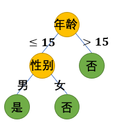
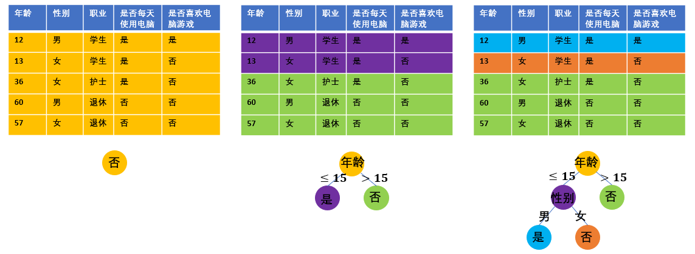

# 决策树与梯度提升树

## 决策树

### 使用场景

以下是表格数据的一个样例。其中列出了5个人物的信息，包括年龄、性别、职业、是否每天使用电脑这4个维度，我们希望利用这些信息构建机器学习模型，来预测一个人是否喜欢电脑游戏。因此，这4个维度的信息即是数据的特征，而是否喜欢电脑游戏则是数据的标签。每一行的数据是一个样本。

表1
| 年龄 | 性别 | 职业 | 是否每天使用电脑 | 是否喜欢电脑游戏 |
| ---  | --- | --- | --- | --- |
| 12 | 男 | 学生 | 是 | 是 |
| 13 | 女 | 学生 | 是 | 否 | 
| 36 | 女 | 护士 | 是 | 否 | 
| 60 | 男 | 退休 | 否 | 否 | 
| 57 | 女 | 退休 | 否 | 否 | 

表格数据涵盖了很大的范围。现实生活中的许多事物都可以用一组特征来刻画。例如，鸢尾花有不同的品种，我们可以根据每朵花的花瓣、花萼的长宽对鸢尾花的品种做出预测。
互联网的在线广告系统通常需要预测用户点击一个广告的概率，来实现广告的精准投放，这个过程被称为点击率预测（Click Through Rate Prediction）。将用户与广告的特征合并到一起，并以该用户是否点击了该广告作为标签，就可以构建出一个二分类任务的表格数据，用来训练点击率预测的模型。此外，网页排序、空气质量预测、航班延误预测等等任务都可以抽象成表格数据学习的形式。

表格数据的特征类型可大致归为数值特征与类别特征这两大类。其中，数值特征的数值大小具有意义，不同特征值之间可以进行大小的比较，表1中的年龄就属于数值特征。而类别特征的不能比较大小，而是表示样本的一种属性，例如表1中的职业、性别等等。

### 决策树基本结构
决策树是一种基于决策规则的树结构模型。下图是基于表1中数据的决策树的一个例子。该决策树使用表1中的特征预测了每个人是否喜爱电脑游戏。

图1

决策树的每个中间节点都包含一个决策条件，决策条件是对数据一维特征做出的一个判断。对于数值特征，决策条件会比较它是否超过某一阈值。例如，根节点的决策条件是“年龄是否超过15岁”。对于类别特征，会判断它是否属于该特征值域的某一个子集。例如，根节点的左子节点的决策条件是性别是否为男性。

样本从决策树的根节点出发，经过一系列的决策条件之后到达叶子节点。例如，对于表1中的第一个样本，由于其年龄不超过15岁，并且性别为男性，故会到达决策树最左边的叶子节点。决策树的每个叶子节点都包含一个常数预测值，作为所有落在该叶子上的样本的预测结果。

### 决策树的分类
决策树的分类方法有许多。最常见的是根据其叶子上输出的类型进行分类。叶子上预测值为类别的，称为分类树，用于分类任务。叶子上预测值为实数值的，称为回归树，用于回归任务。图1中的决策树就是一个分类树。

### 决策树的训练
同其他有监督学习方法一样，决策树的训练本身也是以优化某个目标函数为目的的。例如，对于回归问题，目标函数可以是最小化均方误差；对于分类问题，目标函数可以是最小化分类错误率。
但是，要找到一个最优的决策树结构非常困难，故决策树的训练通常使用自顶向下的贪心方法，流程如下：
1. 在训练的开始，决策树仅有一个根节点，所有的训练数据都被分配在根节点上（这时候的根节点也是叶子节点）。
2. 在当前每片叶子上，遍历所有可能的决策条件，并记录下对优化目标函数贡献（我们称这一贡献为分割增益，即split gain）最大的决策条件，作为该叶子的最优决策条件。
3. 选取一些叶子，将选中的每片叶子分割为两片新的叶子，同时将这些叶子上的训练数据按照最优决策条件划分到两片新的叶子上。
4. 对新的叶子赋予预测值，使落在该叶子上的这部分训练数据的目标函数值最优。

循环以上过程，直到决策树达到预定的规模，或者没有合适的决策条件（例如，所有叶子上的决策条件都有损于目标函数的优化）为止。
需要特别说明的是，在步骤3中选取哪些叶子进行分割有两种常见的方式。第一种是按层分割，即每次分割现存的所有叶子节点。按层分割训练出来的决策树是一个完全二叉树。第二种是按叶子分割，每次只选取当前对优化目标函数最有效的那片叶子。按叶子分割产生的决策树不一定是完全二叉树，因此结构更加灵活。下图展示了两种分割的区别。

图2

图3展示了以表1为训练数据，以最小化分类错误率为目标、按叶子分割的分类树训练过程。首先让我们关注一下每片叶子上的预测值。正如上面步骤4中所提到的，每片叶子上的预测值，是以最小化该片叶子上数据的分类错误率为目的的。例如，一开始所有数据点都在根节点上，这5条数据中，只有1条的标签为“是”，其余的标签均为“否”，因此一开始根节点上的预测值为否。分割了根节点之后，得到的紫色叶子上有一条数据标签为“是”，其他为“否”，对该叶子赋予“是”或“否”都没有区别，我们随机赋予它“是”作为预测值。
总结而言，对于最小化分类错误率的分类任务，一片叶子上的最优预测值是该片叶子上所有训练数据标签最多归属的类别。
对于最小化均方误差的回归任务，容易得到一片叶子上的最优预测值，就是该片叶子上所有训练数据的标签均值。

接着我们来完整地查看这个决策树的训练过程。
在训练的一开始，分类错误率为1/5，且容易发现，不管在根节点上选择哪个决策条件，都不能降低分类错误率。因此，我们随机选取年龄是否超过15岁作为根节点的最优分割条件。分割好根节点之后，我们发现右边的子节点上的数据标签已经属于同一类别（都是“否”），它所对应的那部分训练数据的分类错误率已经是0，因此不需要对右边的子节点继续进行分割。考虑左边的子节点，显然，只有用性别作为决策条件才能够分开左边子节点上的两条数据，让训练误差达到0。

图3

### 决策树的正则
可以想象，只要我们不停地分割叶子节点，且训练集中不存在两条完全相同但标签不同的数据，最后一定可以让决策树完全拟合训练数据的标签，只是这样训练出来的决策树的通常只是在过拟合训练数据，泛化能力较差。因此，除了直接限制决策树的规模之外，在决策树的训练过程中通常会引入一些正则化的限制。常见的有：
1. 叶子上的训练数据不能少于一个阈值。
2. 分割叶子带来的目标函数的改进量不能低于某个阈值。

以上只是对基本的决策树模型及其训练方法进行简单的介绍。决策树在长久的发展过程中已经产生了许多变种，有兴趣的读者可以阅读推荐阅读部分的材料1。关于决策树训练过程中的更多细节，可以参考推荐阅读材料2的《The Elements of Statistical Learning》这本书的9.2节。

## 梯度提升树
由于单个决策树的拟合能力有限，常通过集成学习的方式将许多决策树综合起来。其中梯度提升树（Gradient Boosted Decision Trees，GBDT）就是一种强有力的决策树集成学习算法，它通过训练一系列的回归树，使得预测值不断逼近目标。GBDT是一个迭代算法，每个迭代都会训练一棵新的回归树，这棵回归树的训练算法与普通的回归树并没有区别。不同的是它所使用的标签，具体如下。

用$t_i$表示第i轮迭代得到的回归树。那么，在进行完前轮迭代之后，GBDT对训练数据点（其中x为特征，y为标签）的预测值为。则第轮迭代训练使用的数据标签为
。
其中表示单个样本点对损失函数的贡献。例如，当损失函数为均方误差时，。因此，在第轮迭代训练的决策树，实际上是拟合当前GBDT预测值对损失函数的负梯度。如果损失函数为均方误差，则负梯度为，这实际上就是当前预测值与标签的残差。

前面提到决策树有分类树和回归树。而GBDT只使用回归树，那么GBDT如何处理分类任务呢？虽然，GBDT直接的预测输出是实数值，而不是类别，但是与逻辑回归类似，可以通过sigmoid函数或者softmax转化成分类概率。并以最小化cross-entropy作为训练目标。

除了决策树本身的正则化手段之外，梯度提升树也有一些正则化方式，主要包括：
1. 在训练好一棵决策树之后，将它的输出乘上一个小的系数（通常小于1）。这一过程称为shrinkage，这个系数可以看作是GBDT的学习率。注意到沿着一个点的负梯度方向，通常只有在该点的领域附近才能带来损失函数的下降，如果走得太远，损失函数可能不降反升。shrinkage在这一点上，与神经网络梯度优化方法的训练中的学习率的作用是一致的。此外，大量的实验表明GBDT使用适当的学习率有助于提高泛化性能。
2. 每个决策树只采样一部分训练数据和特征进行训练。这样做一方面可以提高每个决策树的训练速度；另一方面，使用样本采样时，每个子模型看到了不同的数据集。虽然这些数据集都是整个训练集的子集，但是一定程度上避免了所有子模型过分集中精力去优化整个训练集上的表现，从而缓解了过拟合，也使得在不同测试集上的表现更加稳定。
3. 对回归树叶子的预测值进行L2正则。具体来说，在训练第棵决策树时，在损失函数当中加入一项，其中表示决策树中的所有叶子，表示叶子上的预测值。

更多关于GBDT算法的细节可以参考《The Elements of Statistical Learning》的第10章，以及XGBoost的论文。

XGBoost 、LightGBM 、CatBoost等高效GBDT实现的出现，带动了近几年GBDT的广泛应用。这些工具各有特色，其中XGBoost开源最早，功能最为齐全。随后开源的是，而LightGBM着重于效率的优化，训练速度最快，内存耗费最低。CatBoost开源最晚，着重在类别特征处理和GBDT算法的改进的改进。关于这三种工具的更多信息可以参考原文中[推荐阅读](./Readme.md#推荐阅读)中列出的它们的文档。

[返回原文](./README.md)